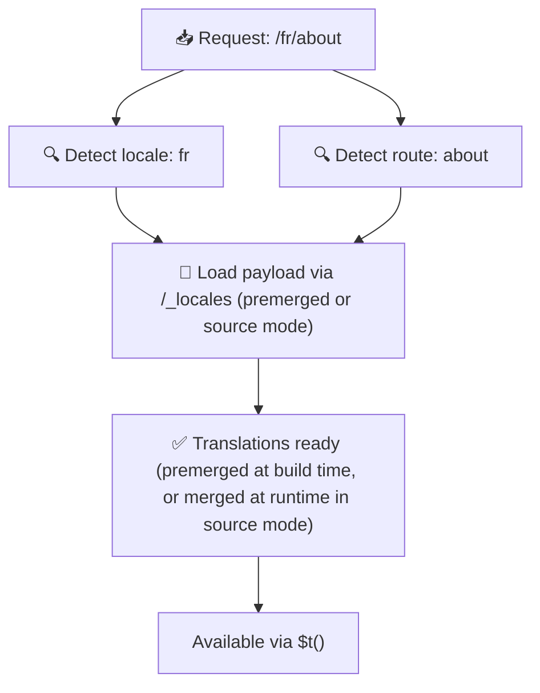

# 📂 Guide för mappstruktur

## 📖 Introduktion

Att organisera dina översättningsfiler effektivt är avgörande för att bibehålla ett skalbart och effektivt internationaliseringssystem (i18n). `Nuxt I18n Micro` förenklar denna process genom att erbjuda ett tydligt tillvägagångssätt för att hantera översättningar på rotnivå och sidspecifika översättningar. Denna guide leder dig genom den rekommenderade mappstrukturen och förklarar hur `Nuxt I18n Micro` hanterar dessa översättningar.

## 🗂️ Rekommenderad mappstruktur

`Nuxt I18n Micro` organiserar översättningar i filer på rotnivå och sidspecifika filer i katalogen `pages`. Med `translationPayloads.mode: 'premerged'` (standard) slås översättningar på rotnivå automatiskt samman i varje sidfil vid byggtid, så varje sida har en komplett uppsättning översättningar utan runtime-sammanslagningsoverhead.

Med `mode: 'source'` förblir källfilerna separata i Nitro-tillgångar och slås samman vid runtime via rutten `/_locales`. Se [Serverless Payload Output](/guides/performance#serverless-payload-output).

### 🔧 Grundläggande struktur

Här är ett grundläggande exempel på mappstrukturen du bör följa:

```text
locales/
├── pages/
│   ├── index/
│   │   ├── en.json
│   │   ├── fr.json
│   │   └── ar.json
│   ├── about/
│   │   ├── en.json
│   │   ├── fr.json
│   │   └── ar.json
├── en.json
├── fr.json
└── ar.json

```

### 📄 Förklaring av strukturen

#### 1. 🌍 Översättningsfiler på rotnivå

- **Sökväg:** `/locales/\{locale\}.json` (t.ex. `/locales/en.json`)
- **Syfte:** Dessa filer innehåller översättningar som delas i hela applikationen (navigeringsmenyer, sidhuvuden, sidfötter osv.). Med `mode: 'premerged'` (standard) slås de automatiskt samman i varje sidspecifik fil vid byggtid, så servern returnerar en enda förbyggd fil per sida.

  **Exempelinnehåll (`/locales/en.json`):**

  ```json
  {
    "menu": {
      "home": "Home",
      "about": "About Us",
      "contact": "Contact"
    },
    "footer": {
      "copyright": "© 2024 Your Company"
    }
  }
  ```

#### 2. 📄 Sidspecifika översättningsfiler

- **Sökväg:** `/locales/pages/\{routeName\}/\{locale\}.json` (t.ex. `/locales/pages/index/en.json`)
- **Syfte:** Dessa filer innehåller översättningar specifika för enskilda sidor. Med `mode: 'premerged'` (standard) slås översättningar på rotnivå in som en bas vid byggtid, så varje sidfil blir självständig.

  **Exempelinnehåll (`/locales/pages/index/en.json`):**

  ```json
  {
    "title": "Welcome to Our Website",
    "description": "We offer a wide range of products and services to meet your needs."
  }
  ```

  **Exempelinnehåll (`/locales/pages/about/en.json`):**

  ```json
  {
    "title": "About Us",
    "description": "Learn more about our mission, vision, and values."
  }
  ```

### 📂 Hantera dynamiska rutter och kapslade sökvägar

`Nuxt I18n Micro` transformerar automatiskt dynamiska segment och kapslade sökvägar i rutter till en platt mappstruktur med hjälp av en specifik namngivningskonvention. Detta säkerställer att alla översättningar lagras på ett konsekvent och lättåtkomligt sätt.

#### Mappstruktur för översättningar av dynamiska rutter

Vid dynamiska rutter, som `/products/[id]`, konverterar modulen det dynamiska segmentet `[id]` till ett statiskt format i filstrukturen.

**Exempel på mappstruktur för dynamiska rutter:**

För en rutt som `/products/[id]` skulle översättningsfilerna lagras i en mapp med namnet `products-id`:

```text
locales/pages/
├── products-id/
│   ├── en.json
│   ├── fr.json
│   └── ar.json

```

**Exempel på mappstruktur för kapslade dynamiska rutter:**

För en kapslad rutt som `/products/key/[id]` skulle översättningsfilerna lagras i en mapp med namnet `products-key-id`:

```text
locales/pages/
├── products-key-id/
│   ├── en.json
│   ├── fr.json
│   └── ar.json

```

**Exempel på mappstruktur för kapslade rutter i flera nivåer:**

För en mer komplex kapslad rutt som `/products/category/[id]/details` skulle översättningsfilerna lagras i en mapp med namnet `products-category-id-details`:

```text
locales/pages/
├── products-category-id-details/
│   ├── en.json
│   ├── fr.json
│   └── ar.json

```

### 🛠 Anpassa katalogstrukturen

Om du föredrar att lagra översättningar i en annan katalog låter `Nuxt I18n Micro` dig anpassa katalogen där översättningsfiler lagras. Du kan konfigurera detta i din `nuxt.config.ts`-fil.

**Exempel: Anpassa översättningskatalogen**

```typescript
export default defineNuxtConfig({
  i18n: {
    translationDir: 'i18n', // Custom directory path
  },
})
```

Detta instruerar `Nuxt I18n Micro` att leta efter översättningsfiler i katalogen `/i18n` istället för standardkatalogen `/locales`.

## ⚙️ Hur översättningar laddas

### 🌍 Dynamiska locale-rutter

`Nuxt I18n Micro` använder dynamiska locale-rutter för att ladda översättningar effektivt. När en användare besöker en sida bestämmer modulen lämplig locale och laddar motsvarande översättningsfiler baserat på aktuell rutt och locale.



Till exempel:

- Att besöka `/en/index` laddar översättningar från `/locales/pages/index/en.json`.
- Att besöka `/fr/about` laddar översättningar från `/locales/pages/about/fr.json`.

Denna metod säkerställer att endast de nödvändiga översättningarna laddas, vilket optimerar både serverbelastning och klientsidans prestanda.

### 💾 Caching och för-rendering

För att ytterligare förbättra prestanda stöder `Nuxt I18n Micro` caching och för-rendering av översättningsfiler:

- **Caching**: När en översättningsfil väl har laddats cachas den för efterföljande förfrågningar, vilket minskar behovet av att upprepade gånger hämta samma data.
- **För-rendering**: Under byggprocessen kan du för-rendera översättningsfiler för alla konfigurerade locales och rutter, vilket gör att de kan levereras direkt från servern utan runtime-fördröjningar.

## 📝 Bästa praxis

### 📂 Använd sidspecifika filer klokt

Utnyttja sidspecifika filer för att hålla översättningar organiserade. Detta håller varje sidas översättningar smala och snabba att ladda, vilket är särskilt viktigt för sidor med komplext eller stort innehåll.

### 🔑 Håll översättningsnycklar konsekventa

Använd konsekventa namngivningskonventioner för dina översättningsnycklar över filer. Detta hjälper till att bibehålla tydligheten och förhindrar problem vid hantering av översättningar, särskilt när din applikation växer.

### 🗂️ Organisera översättningar efter kontext

Gruppera relaterade översättningar tillsammans i dina filer. Gruppera till exempel alla knapptexter under en `buttons`-nyckel och alla formulärrelaterade texter under en `forms`-nyckel. Detta förbättrar inte bara läsbarheten utan gör det också lättare att hantera översättningar över olika locales.

### ⚠️ Gräns för kapslingsdjup (2 nivåer rekommenderas)

Under klientsidesnavigering använder `Nuxt I18n Micro` en optimerad 2-nivåers djup sammanslagning för att kombinera översättningar från den lämnande och inkommande sidan. Detta säkerställer att överlappande kapslade nycklar (t.ex. båda sidorna har nycklar under `common.*`) bevaras under övergångsanimationer.

**Detta fungerar korrekt för standardstrukturen `Section → Key → Value` (2 nivåer):**

```json
// Page A translations
{ "common": { "fromA": "Text A" } }

// Page B translations
{ "common": { "fromB": "Text B" } }

// During transition, both are available:
// { "common": { "fromA": "Text A", "fromB": "Text B" } }
```

**Om du dock använder 3+ nivåer av kapsling kan djupare nycklar skrivas över under övergångar:**

```json
// Page A translations
{ "auth": { "form": { "login": "Login" } } }

// Page B translations
{ "auth": { "form": { "register": "Register" } } }

// During transition: "login" key is lost
// { "auth": { "form": { "register": "Register" } } }
```

<Tip>

</Tip>

### 🧹 Städa regelbundet upp oanvända översättningar

Med tiden kan din applikation samla på sig oanvända översättningsnycklar, särskilt om funktioner tas bort eller omstruktureras. Granska och städa dina översättningsfiler periodiskt för att hålla dem smala och underhållbara.
