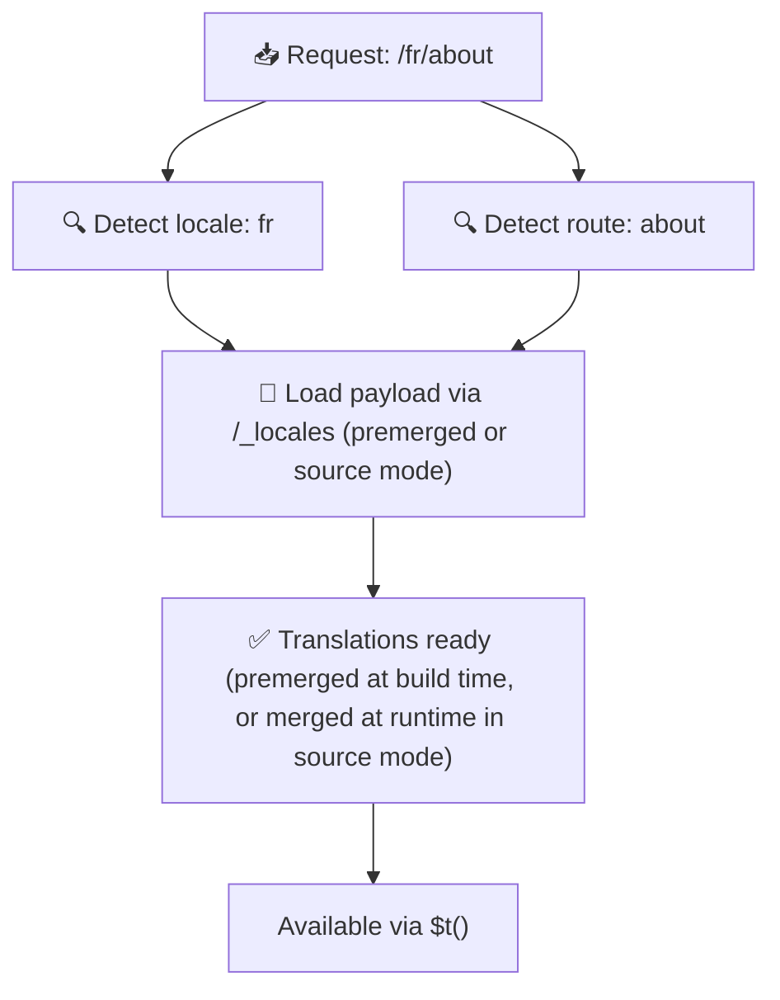

# 📂 Guide för mappstruktur

## 📖 Introduktion

Att organisera dina översättningsfiler effektivt är avgörande för att bibehålla ett skalbart och effektivt internationaliseringssystem (i18n). `Nuxt I18n Micro` förenklar denna process genom att erbjuda ett tydligt sätt att hantera rotnivåöversättningar och sidspecifika översättningar. Denna guide går igenom den rekommenderade mappstrukturen och förklarar hur `Nuxt I18n Micro` hanterar dessa översättningar.

## 🗂️ Rekommenderad mappstruktur

`Nuxt I18n Micro` organiserar översättningar i rotnivåfiler och sidspecifika filer inom katalogen `pages`. Med `translationPayloads.mode: 'premerged'` (standard) slås rotnivåöversättningar automatiskt samman i varje sidfil vid byggtid, så att varje sida har en komplett uppsättning översättningar utan overhead vid runtime-sammanslagning.

Med `mode: 'source'` förblir källfiler separata i Nitro-tillgångar och slås samman vid runtime via rutten `/_locales`. Se [Serverlös payload-utdata](/guides/performance#serverless-payload-output).

### 🔧 Grundläggande struktur

Här är ett grundläggande exempel på mappstrukturen du bör följa:

```text
locales/
├── pages/
│   ├── index/
│   │   ├── en.json
│   │   ├── fr.json
│   │   └── ar.json
│   ├── about/
│   │   ├── en.json
│   │   ├── fr.json
│   │   └── ar.json
├── en.json
├── fr.json
└── ar.json

```

### 📄 Förklaring av strukturen

#### 1. 🌍 Översättningsfiler på rotnivå

- **Sökväg:** `/locales/\{locale\}.json` (till exempel `/locales/en.json`)
- **Syfte:** Dessa filer innehåller översättningar som delas mellan hela applikationen (navigeringsmenyer, headers, footers, med mera). Med `mode: 'premerged'` (standard) slås de automatiskt samman i varje sidspecifik fil vid byggtid, så att servern returnerar en enda förbyggd fil per sida.

  **Exempelinnehåll (`/locales/en.json`):**

  ```json
  {
    "menu": {
      "home": "Home",
      "about": "About Us",
      "contact": "Contact"
    },
    "footer": {
      "copyright": "© 2024 Your Company"
    }
  }
  ```

#### 2. 📄 Sidspecifika översättningsfiler

- **Sökväg:** `/locales/pages/\{routeName\}/\{locale\}.json` (till exempel `/locales/pages/index/en.json`)
- **Syfte:** Dessa filer innehåller översättningar specifika för enskilda sidor. Med `mode: 'premerged'` (standard) slås rotnivåöversättningar in som en bas vid byggtid, så att varje sidfil blir självständig.

  **Exempelinnehåll (`/locales/pages/index/en.json`):**

  ```json
  {
    "title": "Welcome to Our Website",
    "description": "We offer a wide range of products and services to meet your needs."
  }
  ```

  **Exempelinnehåll (`/locales/pages/about/en.json`):**

  ```json
  {
    "title": "About Us",
    "description": "Learn more about our mission, vision, and values."
  }
  ```

### 📂 Hantera dynamiska rutter och nästlade sökvägar

`Nuxt I18n Micro` transformerar automatiskt dynamiska segment och nästlade sökvägar i rutter till en platt mappstruktur enligt en specifik namngivningskonvention. Detta säkerställer att alla översättningar lagras på ett konsekvent och lättåtkomligt sätt.

#### Mappstruktur för översättningar för dynamiska rutter

Vid dynamiska rutter, som `/products/[id]`, konverterar modulen det dynamiska segmentet `[id]` till ett statiskt format i filstrukturen.

**Exempel på mappstruktur för dynamiska rutter:**

För en rutt som `/products/[id]` lagras översättningsfilerna i en mapp med namnet `products-id`:

```text
locales/pages/
├── products-id/
│   ├── en.json
│   ├── fr.json
│   └── ar.json

```

**Exempel på mappstruktur för nästlade dynamiska rutter:**

För en nästlad rutt som `/products/key/[id]` lagras översättningsfilerna i en mapp med namnet `products-key-id`:

```text
locales/pages/
├── products-key-id/
│   ├── en.json
│   ├── fr.json
│   └── ar.json

```

**Exempel på mappstruktur för flernivå-nästlade rutter:**

För en mer komplex nästlad rutt som `/products/category/[id]/details` lagras översättningsfilerna i en mapp med namnet `products-category-id-details`:

```text
locales/pages/
├── products-category-id-details/
│   ├── en.json
│   ├── fr.json
│   └── ar.json

```

### 🛠 Anpassa katalogstrukturen

Om du föredrar att lagra översättningar i en annan katalog låter `Nuxt I18n Micro` dig anpassa katalogen där översättningsfilerna lagras. Du kan konfigurera detta i din `nuxt.config.ts`-fil.

**Exempel: Anpassa översättningskatalogen**

```typescript
export default defineNuxtConfig({
  i18n: {
    translationDir: 'i18n', // Custom directory path
  },
})
```

Detta instruerar `Nuxt I18n Micro` att leta efter översättningsfiler i katalogen `/i18n` i stället för standardkatalogen `/locales`.

## ⚙️ Så laddas översättningar

### 🌍 Dynamiska lokalrutter

`Nuxt I18n Micro` använder dynamiska lokalrutter för att ladda översättningar effektivt. När en användare besöker en sida bestämmer modulen lämplig lokal och laddar motsvarande översättningsfiler baserat på aktuell rutt och lokal.



Till exempel:

- Att besöka `/en/index` laddar översättningar från `/locales/pages/index/en.json`.
- Att besöka `/fr/about` laddar översättningar från `/locales/pages/about/fr.json`.

Denna metod säkerställer att endast de nödvändiga översättningarna laddas, vilket optimerar både serverbelastning och klientprestanda.

### 💾 Caching och pre-rendering

För att ytterligare förbättra prestandan stöder `Nuxt I18n Micro` caching och pre-rendering av översättningsfiler:

- **Caching**: När en översättningsfil har laddats cachas den för efterföljande förfrågningar, vilket minskar behovet av att upprepade gånger hämta samma data.
- **Pre-rendering**: Under byggprocessen kan du pre-rendra översättningsfiler för alla konfigurerade lokaler och rutter, så att de kan levereras direkt från servern utan runtime-fördröjningar.

## 📝 Bästa praxis

### 📂 Använd sidspecifika filer klokt

Utnyttja sidspecifika filer för att hålla översättningar organiserade. Detta håller varje sidas översättningar små och snabba att ladda, vilket är särskilt viktigt för sidor med komplext eller stort innehåll.

### 🔑 Håll översättningsnycklar konsekventa

Använd konsekventa namngivningskonventioner för dina översättningsnycklar över filer. Detta hjälper till att bibehålla tydlighet och förhindrar problem när översättningar hanteras, särskilt när din applikation växer.

### 🗂️ Organisera översättningar efter kontext

Gruppera relaterade översättningar tillsammans i dina filer. Gruppera till exempel alla knappetiketter under en `buttons`-nyckel och alla formulärrelaterade texter under en `forms`-nyckel. Detta förbättrar inte bara läsbarheten utan gör det också enklare att hantera översättningar över olika lokaler.

### ⚠️ Gräns för nästlingsdjup (2 nivåer rekommenderas)

Under navigering på klientsidan använder `Nuxt I18n Micro` en optimerad djup sammanslagning i 2 nivåer för att kombinera översättningar från den lämnande och den ankommande sidan. Detta säkerställer att överlappande nästlade nycklar (till exempel att båda sidor har nycklar under `common.*`) bevaras under övergångsanimeringar.

**Detta fungerar korrekt för den vanliga strukturen `Sektion → Nyckel → Värde` (2 nivåer):**

```json
// Page A translations
{ "common": { "fromA": "Text A" } }

// Page B translations
{ "common": { "fromB": "Text B" } }

// During transition, both are available:
// { "common": { "fromA": "Text A", "fromB": "Text B" } }
```

**Men om du använder 3+ nivåer av nästling kan djupare nycklar skrivas över under övergångar:**

```json
// Page A translations
{ "auth": { "form": { "login": "Login" } } }

// Page B translations
{ "auth": { "form": { "register": "Register" } } }

// During transition: "login" key is lost
// { "auth": { "form": { "register": "Register" } } }
```


### 🧹 Rensa oanvända översättningar regelbundet

Med tiden kan din applikation samla på sig oanvända översättningsnycklar, särskilt om funktioner tas bort eller omstruktureras. Granska och rensa dina översättningsfiler regelbundet för att hålla dem små och underhållbara.
