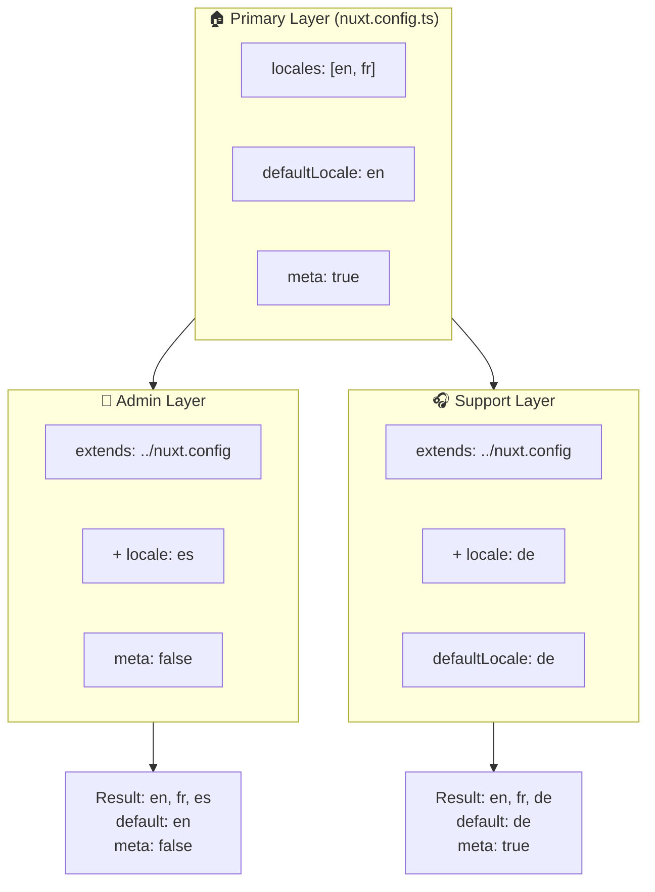

# 🗂️ Layers i `Nuxt I18n Micro`

## 📖 Introduktion till layers

Layers i `Nuxt I18n Micro` låter dig hantera och anpassa lokaliseringsinställningar flexibelt över olika delar av din applikation. Genom att definiera olika lager kan du justera konfigurationen för olika kontexter, som att åsidosätta inställningar för specifika delar av din webbplats eller skapa återanvändbara baskonfigurationer som kan utökas av andra delar av din applikation.

### Layer-arvsflöde



## 🛠️ Primärt konfigurationslager

Det **primära konfigurationslagret** är där du ställer in standardlokaliseringsinställningarna för hela din applikation. Detta lager är väsentligt eftersom det definierar den globala konfigurationen, inklusive vilka locales som stöds, standardspråket och andra kritiska i18n-inställningar.

### 📄 Exempel: Definiera det primära konfigurationslagret

Här är ett exempel på hur du kan definiera det primära konfigurationslagret i din `nuxt.config.ts`-fil:

```typescript
export default defineNuxtConfig({
  i18n: {
    locales: [
      { code: 'en', iso: 'en-EN', dir: 'ltr' },
      { code: 'fr', iso: 'fr-FR', dir: 'ltr' },
      { code: 'ar', iso: 'ar-SA', dir: 'rtl' },
    ],
    defaultLocale: 'en', // The default locale for the entire app
    translationDir: 'locales', // Directory where translations are stored
    meta: true, // Automatically generate SEO-related meta tags like `alternate`
    autoDetectLanguage: true, // Automatically detect and use the user's preferred language
  },
})
```

## 🌱 Child-layers

Child-layers används för att utöka eller åsidosätta den primära konfigurationen för specifika delar av din applikation. Du kanske till exempel vill lägga till ytterligare locales eller ändra standard-locale för en viss del av din webbplats. Child-layers är särskilt användbara i modulära applikationer där olika delar av applikationen kan ha olika lokaliseringskrav.

### 📄 Exempel: Utöka det primära lagret i ett child-layer

Anta att du har en del av din webbplats som behöver stödja ytterligare locales, eller att du vill inaktivera en viss locale i en viss kontext. Så här kan du åstadkomma det genom att utöka det primära konfigurationslagret:

```typescript
// basic/nuxt.config.ts (Primary Layer)
export default defineNuxtConfig({
  i18n: {
    locales: [
      { code: 'en', iso: 'en-EN', dir: 'ltr' },
      { code: 'fr', iso: 'fr-FR', dir: 'ltr' },
    ],
    defaultLocale: 'en',
    meta: true,
    translationDir: 'locales',
  },
})
```

```typescript
// extended/nuxt.config.ts (Child Layer)
export default defineNuxtConfig({
  extends: '../basic', // Inherit the base configuration from the 'basic' layer
  i18n: {
    locales: [
      { code: 'en', iso: 'en-EN', dir: 'ltr' }, // Inherited from the base layer
      { code: 'fr', iso: 'fr-FR', dir: 'ltr' }, // Inherited from the base layer
      { code: 'de', iso: 'de-DE', dir: 'ltr' }, // Added in the child layer
    ],
    defaultLocale: 'fr', // Override the default locale to French for this section
    autoDetectLanguage: false, // Disable automatic language detection in this section
  },
})
```

### 🌐 Använda lager i en modulär applikation

I en större, modulär Nuxt-applikation kan du ha flera sektioner, som var och en kräver sina egna i18n-inställningar. Genom att utnyttja lager kan du bibehålla en ren och skalbar konfigurationsstruktur.

### 📄 Exempel: Skiktad konfiguration i en modulär applikation

Föreställ dig att du har en e-handelssida med distinkta sektioner som huvudwebbplatsen, adminpanelen och kundsupportportalen. Varje sektion kan behöva en annan uppsättning locales eller andra i18n-inställningar.

#### **Primärt lager (global konfiguration):**

```typescript
// nuxt.config.ts
export default defineNuxtConfig({
  i18n: {
    locales: [
      { code: 'en', iso: 'en-EN', dir: 'ltr' },
      { code: 'fr', iso: 'fr-FR', dir: 'ltr' },
    ],
    defaultLocale: 'en',
    meta: true,
    translationDir: 'locales',
    autoDetectLanguage: true,
  },
})
```

#### **Child-lager för adminpanel:**

```typescript
// admin/nuxt.config.ts
export default defineNuxtConfig({
  extends: '../nuxt.config', // Inherit the global settings
  i18n: {
    locales: [
      { code: 'en', iso: 'en-EN', dir: 'ltr' }, // Inherited
      { code: 'fr', iso: 'fr-FR', dir: 'ltr' }, // Inherited
      { code: 'es', iso: 'es-ES', dir: 'ltr' }, // Specific to the admin panel
    ],
    defaultLocale: 'en',
    meta: false, // Disable automatic meta generation in the admin panel
  },
})
```

#### **Child-lager för kundsupportportal:**

```typescript
// support/nuxt.config.ts
export default defineNuxtConfig({
  extends: '../nuxt.config', // Inherit the global settings
  i18n: {
    locales: [
      { code: 'en', iso: 'en-EN', dir: 'ltr' }, // Inherited
      { code: 'fr', iso: 'fr-FR', dir: 'ltr' }, // Inherited
      { code: 'de', iso: 'de-DE', dir: 'ltr' }, // Specific to the support portal
    ],
    defaultLocale: 'de', // Default to German in the support portal
    autoDetectLanguage: false, // Disable automatic language detection
  },
})
```

I detta modulära exempel:

- Varje sektion (admin, support) har sina egna i18n-inställningar, men de ärver alla baskonfigurationen.
- Adminpanelen lägger till spanska (`es`) som en locale och inaktiverar generering av metataggar.
- Supportportalen lägger till tyska (`de`) som en locale och använder tyska som standard för användargränssnittet.

## 📝 Bästa praxis för att använda lager

- **🔧 Håll det primära lagret enkelt:** Det primära lagret bör innehålla de vanligast använda inställningarna som gäller globalt över din applikation. Håll det okomplicerat för att säkerställa konsekvens.
- **⚙️ Använd child-lager för specifika anpassningar:** Åsidosätt eller utöka endast inställningar i child-lager när det är nödvändigt. Detta tillvägagångssätt undviker onödig komplexitet i din konfiguration.
- **📚 Dokumentera dina lager:** Dokumentera tydligt syftet med och specifika detaljer om varje lager i ditt projekt. Detta hjälper till att bibehålla tydligheten och gör det lättare för andra (eller framtida du) att förstå konfigurationen.
