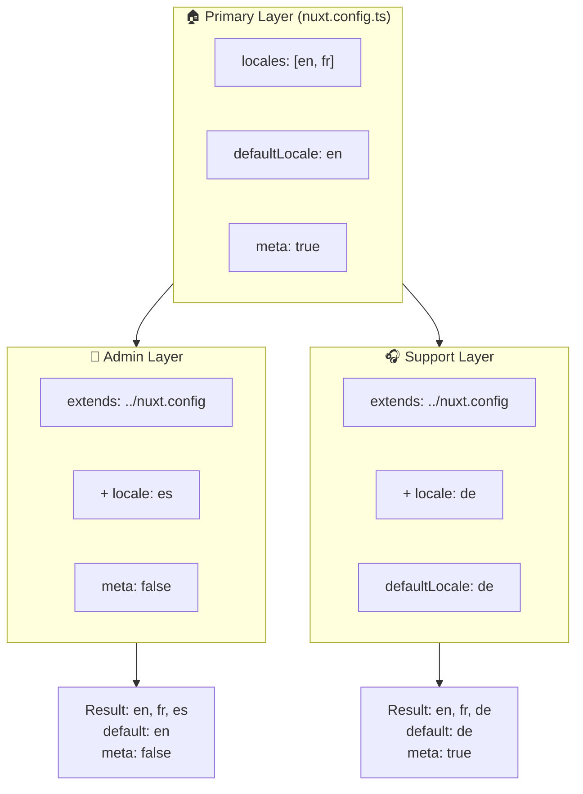

# 🗂️ Lager i `Nuxt I18n Micro`

## 📖 Introduktion till lager

Lager i `Nuxt I18n Micro` låter dig hantera och anpassa lokaliseringsinställningar flexibelt över olika delar av din applikation. Genom att definiera olika lager kan du justera konfigurationen för olika kontexter, till exempel för att åsidosätta inställningar för specifika sektioner av din webbplats eller skapa återanvändbara baskonfigurationer som kan utökas av andra delar av din applikation.

### Flödesdiagram för lagerärvning



## 🛠️ Primärt konfigurationslager

Det **primära konfigurationslagret** är där du sätter upp standardlokaliseringsinställningarna för hela din applikation. Detta lager är viktigt eftersom det definierar den globala konfigurationen, inklusive de lokaler som stöds, standardspråket och andra kritiska i18n-inställningar.

### 📄 Exempel: Definiera det primära konfigurationslagret

Här är ett exempel på hur du kan definiera det primära konfigurationslagret i din `nuxt.config.ts`-fil:

```typescript
export default defineNuxtConfig({
  i18n: {
    locales: [
      { code: 'en', iso: 'en-EN', dir: 'ltr' },
      { code: 'fr', iso: 'fr-FR', dir: 'ltr' },
      { code: 'ar', iso: 'ar-SA', dir: 'rtl' },
    ],
    defaultLocale: 'en', // The default locale for the entire app
    translationDir: 'locales', // Directory where translations are stored
    meta: true, // Automatically generate SEO-related meta tags like `alternate`
    autoDetectLanguage: true, // Automatically detect and use the user's preferred language
  },
})
```

## 🌱 Underliggande lager

Underliggande lager används för att utöka eller åsidosätta den primära konfigurationen för specifika delar av din applikation. Du kanske till exempel vill lägga till ytterligare lokaler eller ändra standardlokalen för en viss sektion av din webbplats. Underliggande lager är särskilt användbara i modulära applikationer där olika delar av applikationen kan ha olika lokaliseringskrav.

### 📄 Exempel: Utöka det primära lagret i ett underliggande lager

Anta att du har en sektion av din webbplats som behöver stödja ytterligare lokaler, eller att du vill inaktivera en viss lokal i en viss kontext. Så här kan du åstadkomma det genom att utöka det primära konfigurationslagret:

```typescript
// basic/nuxt.config.ts (Primary Layer)
export default defineNuxtConfig({
  i18n: {
    locales: [
      { code: 'en', iso: 'en-EN', dir: 'ltr' },
      { code: 'fr', iso: 'fr-FR', dir: 'ltr' },
    ],
    defaultLocale: 'en',
    meta: true,
    translationDir: 'locales',
  },
})
```

```typescript
// extended/nuxt.config.ts (Child Layer)
export default defineNuxtConfig({
  extends: '../basic', // Inherit the base configuration from the 'basic' layer
  i18n: {
    locales: [
      { code: 'en', iso: 'en-EN', dir: 'ltr' }, // Inherited from the base layer
      { code: 'fr', iso: 'fr-FR', dir: 'ltr' }, // Inherited from the base layer
      { code: 'de', iso: 'de-DE', dir: 'ltr' }, // Added in the child layer
    ],
    defaultLocale: 'fr', // Override the default locale to French for this section
    autoDetectLanguage: false, // Disable automatic language detection in this section
  },
})
```

### 🌐 Använda lager i en modulär applikation

I en större, modulär Nuxt-applikation kan du ha flera sektioner som var och en kräver sina egna i18n-inställningar. Genom att utnyttja lager kan du bibehålla en ren och skalbar konfigurationsstruktur.

### 📄 Exempel: Lagerbaserad konfiguration i en modulär applikation

Föreställ dig att du har en e-handelssida med distinkta sektioner som huvudwebbplatsen, adminpanelen och kundsupportportalen. Varje sektion kan behöva olika uppsättningar av lokaler eller andra i18n-inställningar.

#### **Primärt lager (global konfiguration):**

```typescript
// nuxt.config.ts
export default defineNuxtConfig({
  i18n: {
    locales: [
      { code: 'en', iso: 'en-EN', dir: 'ltr' },
      { code: 'fr', iso: 'fr-FR', dir: 'ltr' },
    ],
    defaultLocale: 'en',
    meta: true,
    translationDir: 'locales',
    autoDetectLanguage: true,
  },
})
```

#### **Underliggande lager för adminpanelen:**

```typescript
// admin/nuxt.config.ts
export default defineNuxtConfig({
  extends: '../nuxt.config', // Inherit the global settings
  i18n: {
    locales: [
      { code: 'en', iso: 'en-EN', dir: 'ltr' }, // Inherited
      { code: 'fr', iso: 'fr-FR', dir: 'ltr' }, // Inherited
      { code: 'es', iso: 'es-ES', dir: 'ltr' }, // Specific to the admin panel
    ],
    defaultLocale: 'en',
    meta: false, // Disable automatic meta generation in the admin panel
  },
})
```

#### **Underliggande lager för kundsupportportalen:**

```typescript
// support/nuxt.config.ts
export default defineNuxtConfig({
  extends: '../nuxt.config', // Inherit the global settings
  i18n: {
    locales: [
      { code: 'en', iso: 'en-EN', dir: 'ltr' }, // Inherited
      { code: 'fr', iso: 'fr-FR', dir: 'ltr' }, // Inherited
      { code: 'de', iso: 'de-DE', dir: 'ltr' }, // Specific to the support portal
    ],
    defaultLocale: 'de', // Default to German in the support portal
    autoDetectLanguage: false, // Disable automatic language detection
  },
})
```

I detta modulära exempel:

- Varje sektion (admin, support) har sina egna i18n-inställningar, men de ärver alla baskonfigurationen.
- Adminpanelen lägger till spanska (`es`) som lokal och inaktiverar metatagg-generering.
- Supportportalen lägger till tyska (`de`) som lokal och använder tyska som standard i användargränssnittet.

## 📝 Bästa praxis för att använda lager

- **🔧 Håll det primära lagret enkelt:** Det primära lagret bör innehålla de mest använda inställningarna som gäller globalt i din applikation. Håll det enkelt för att säkerställa konsistens.
- **⚙️ Använd underliggande lager för specifika anpassningar:** Åsidosätt eller utöka endast inställningar i underliggande lager när det är nödvändigt. Detta undviker onödig komplexitet i din konfiguration.
- **📚 Dokumentera dina lager:** Dokumentera tydligt syftet och specifikationerna för varje lager i ditt projekt. Detta hjälper till att bibehålla tydlighet och gör det enklare för andra (eller ditt framtida jag) att förstå konfigurationen.
