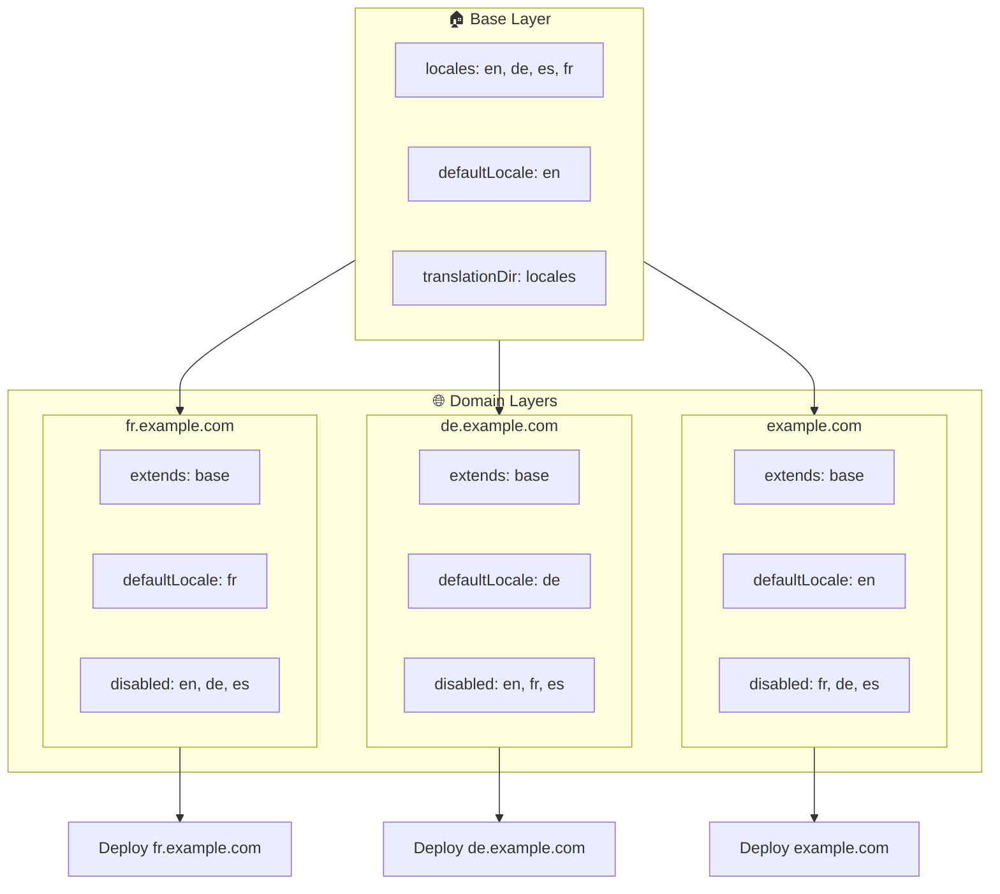

# 🌍 Konfigurera locales för flera domäner med `Nuxt I18n Micro` med hjälp av layers

## 📝 Introduktion

Genom att utnyttja layers i `Nuxt I18n Micro` kan du skapa en flexibel och underhållbar lokaliseringsinställning för flera domäner. Detta tillvägagångssätt förenklar inte bara domänhantering genom att eliminera behovet av komplex funktionalitet, utan möjliggör också effektiv lastfördelning och minskad projektkomplexitet. Genom att köra separata projekt för olika locales kan din applikation enkelt skala och anpassa sig till varierande locale-krav över flera domäner, vilket erbjuder en robust och skalbar lösning för globala applikationer.

## 🎯 Mål

Att skapa en konfiguration där olika domäner serverar specifika locales genom att anpassa konfigurationer i child-layers. Denna metod utnyttjar Nuxts layer-system, vilket låter dig behålla en baskonfiguration samtidigt som du utökar eller ändrar den för varje domän.

### Flerdomänsarkitektur



## 🛠 Steg för att implementera locales för flera domäner

### 1. **Skapa baslagret**

Börja med att skapa ett konfigurationslager som bas som inkluderar alla gemensamma locale-inställningar för din applikation. Denna konfiguration fungerar som grunden för andra domänspecifika konfigurationer.

#### **Baslagerkonfiguration**

Skapa baskonfigurationsfilen `base/nuxt.config.ts`:

```typescript
// base/nuxt.config.ts

export default defineNuxtConfig({
  i18n: {
    locales: [
      { code: 'en', iso: 'en-US', dir: 'ltr' },
      { code: 'de', iso: 'de-DE', dir: 'ltr' },
      { code: 'es', iso: 'es-ES', dir: 'ltr' },
    ],
    defaultLocale: 'en',
    translationDir: 'locales',
    meta: true,
    autoDetectLanguage: true,
  },
})
```

### 2. **Skapa domänspecifika child-layers**

För varje domän, skapa ett child-layer som modifierar baskonfigurationen för att uppfylla de specifika kraven för den domänen. Du kan inaktivera locales som inte behövs för en specifik domän.

#### **Exempel: Konfiguration för den franska domänen**

Skapa en child-layer-konfiguration för den franska domänen i `fr/nuxt.config.ts`:

```typescript
// fr/nuxt.config.ts

export default defineNuxtConfig({
  extends: '../base', // Inherit from the base configuration

  i18n: {
    locales: [
      { code: 'en', iso: 'en-US', dir: 'ltr', disabled: true }, // Disable English
      { code: 'fr', iso: 'fr-FR', dir: 'ltr' }, // Add and enable the French locale
      { code: 'de', iso: 'de-DE', dir: 'ltr', disabled: true }, // Disable German
      { code: 'es', iso: 'es-ES', dir: 'ltr', disabled: true }, // Disable Spanish
    ],
    defaultLocale: 'fr', // Set French as the default locale
    autoDetectLanguage: false, // Disable automatic language detection
  },
})
```

#### **Exempel: Konfiguration för den tyska domänen**

Skapa på liknande sätt en child-layer-konfiguration för den tyska domänen i `de/nuxt.config.ts`:

```typescript
// de/nuxt.config.ts

export default defineNuxtConfig({
  extends: '../base', // Inherit from the base configuration

  i18n: {
    locales: [
      { code: 'en', iso: 'en-US', dir: 'ltr', disabled: true }, // Disable English
      { code: 'fr', iso: 'fr-FR', dir: 'ltr', disabled: true }, // Disable French
      { code: 'de', iso: 'de-DE', dir: 'ltr' }, // Use the German locale
      { code: 'es', iso: 'es-ES', dir: 'ltr', disabled: true }, // Disable Spanish
    ],
    defaultLocale: 'de', // Set German as the default locale
    autoDetectLanguage: false, // Disable automatic language detection
  },
})
```

### 3. **Distribuera applikationen för varje domän**

Distribuera applikationen med lämplig konfiguration för varje domän. Till exempel:

- Distribuera konfigurationen för `fr`-layern till `fr.example.com`.
- Distribuera konfigurationen för `de`-layern till `de.example.com`.

### 4. **Konfigurera flera projekt för olika locales**

För varje locale och domän behöver du köra en separat instans av applikationen. Detta säkerställer att varje domän serverar rätt locale-konfiguration, optimerar lastfördelningen och förenklar projektets struktur. Genom att köra flera projekt anpassade till varje locale kan du bibehålla en ren separation mellan konfigurationer och minska komplexiteten i den övergripande installationen.

### 5. **Konfigurera routing baserat på domän**

Se till att din routing är konfigurerad för att dirigera användare till rätt projekt baserat på den domän de kommer åt. Detta säkerställer att varje domän serverar lämplig locale, förbättrar användarupplevelsen och bibehåller konsistens mellan olika regioner.

### 6. **Distribuera och verifiera**

Efter att ha konfigurerat lagren och distribuerat dem till respektive domän, säkerställ att varje domän serverar rätt locale. Testa applikationen grundligt för att bekräfta att rätt locale laddas beroende på domänen.

## 📝 Bästa praxis

- **Håll baskonfigurationen generisk**: Baskonfigurationen bör täcka allmänna inställningar som gäller för alla domäner.
- **Isolera domänspecifik logik**: Håll domänspecifika konfigurationer i sina respektive lager för att bibehålla tydlighet och separation av ansvar.

## 🎉 Slutsats

Genom att utnyttja layers i `Nuxt I18n Micro` kan du skapa en flexibel och underhållbar lokaliseringsinställning för flera domäner. Detta tillvägagångssätt eliminerar inte bara behovet av komplex funktionalitet för domänhantering, utan låter dig också fördela lasten effektivt och minska projektkomplexiteten. Att köra separata projekt för olika locales säkerställer att din applikation enkelt kan skala och anpassa sig till olika locale-krav över olika domäner, vilket ger en robust och skalbar lösning för globala applikationer.
