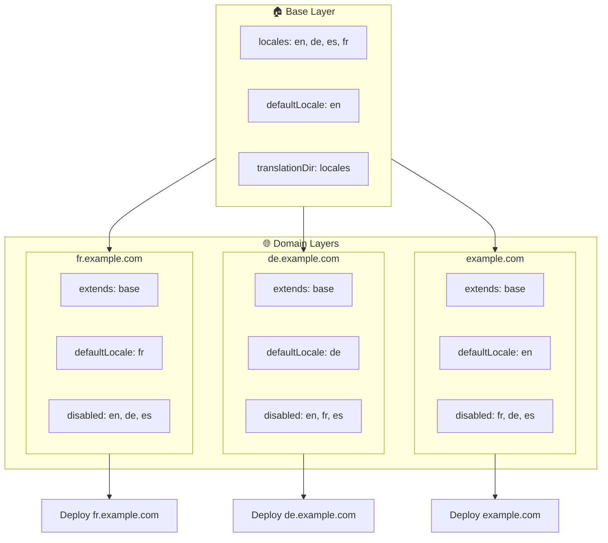

# 🌍 Sätta upp lokaler över flera domäner med `Nuxt I18n Micro` med hjälp av lager

## 📝 Introduktion

Genom att utnyttja lager i `Nuxt I18n Micro` kan du skapa en flexibel och underhållbar uppsättning för lokalisering över flera domäner. Detta tillvägagångssätt förenklar inte bara domänhanteringen genom att eliminera behovet av komplexa funktioner, utan möjliggör även effektiv lastfördelning och minskad projektkomplexitet. Genom att köra separata projekt för olika lokaler kan din applikation enkelt skalas och anpassas till varierande lokalkrav över flera domäner, vilket ger en robust och skalbar lösning för globala applikationer.

## 🎯 Mål

Att skapa en uppsättning där olika domäner levererar specifika lokaler genom att anpassa konfigurationer i underliggande lager. Denna metod utnyttjar Nuxts lagringssystem, vilket låter dig behålla en baskonfiguration samtidigt som du utökar eller modifierar den för varje domän.

### Flerdomänsarkitektur



## 🛠 Steg för att implementera lokaler över flera domäner

### 1. **Skapa baslagret**

Börja med att skapa ett baskonfigurationslager som innehåller alla gemensamma lokalinställningar för din applikation. Denna konfiguration fungerar som grund för andra domänspecifika konfigurationer.

#### **Konfiguration för baslagret**

Skapa baskonfigurationsfilen `base/nuxt.config.ts`:

```typescript
// base/nuxt.config.ts

export default defineNuxtConfig({
  i18n: {
    locales: [
      { code: 'en', iso: 'en-US', dir: 'ltr' },
      { code: 'de', iso: 'de-DE', dir: 'ltr' },
      { code: 'es', iso: 'es-ES', dir: 'ltr' },
    ],
    defaultLocale: 'en',
    translationDir: 'locales',
    meta: true,
    autoDetectLanguage: true,
  },
})
```

### 2. **Skapa domänspecifika underliggande lager**

För varje domän, skapa ett underliggande lager som modifierar baskonfigurationen för att möta de specifika kraven för den domänen. Du kan inaktivera lokaler som inte behövs för en specifik domän.

#### **Exempel: Konfiguration för den franska domänen**

Skapa en konfiguration för ett underliggande lager för den franska domänen i `fr/nuxt.config.ts`:

```typescript
// fr/nuxt.config.ts

export default defineNuxtConfig({
  extends: '../base', // Inherit from the base configuration

  i18n: {
    locales: [
      { code: 'en', iso: 'en-US', dir: 'ltr', disabled: true }, // Disable English
      { code: 'fr', iso: 'fr-FR', dir: 'ltr' }, // Add and enable the French locale
      { code: 'de', iso: 'de-DE', dir: 'ltr', disabled: true }, // Disable German
      { code: 'es', iso: 'es-ES', dir: 'ltr', disabled: true }, // Disable Spanish
    ],
    defaultLocale: 'fr', // Set French as the default locale
    autoDetectLanguage: false, // Disable automatic language detection
  },
})
```

#### **Exempel: Konfiguration för den tyska domänen**

Skapa på liknande sätt en konfiguration för ett underliggande lager för den tyska domänen i `de/nuxt.config.ts`:

```typescript
// de/nuxt.config.ts

export default defineNuxtConfig({
  extends: '../base', // Inherit from the base configuration

  i18n: {
    locales: [
      { code: 'en', iso: 'en-US', dir: 'ltr', disabled: true }, // Disable English
      { code: 'fr', iso: 'fr-FR', dir: 'ltr', disabled: true }, // Disable French
      { code: 'de', iso: 'de-DE', dir: 'ltr' }, // Use the German locale
      { code: 'es', iso: 'es-ES', dir: 'ltr', disabled: true }, // Disable Spanish
    ],
    defaultLocale: 'de', // Set German as the default locale
    autoDetectLanguage: false, // Disable automatic language detection
  },
})
```

### 3. **Distribuera applikationen för varje domän**

Distribuera applikationen med rätt konfiguration för varje domän. Till exempel:

- Distribuera `fr`-lagerkonfigurationen till `fr.example.com`.
- Distribuera `de`-lagerkonfigurationen till `de.example.com`.

### 4. **Sätt upp flera projekt för olika lokaler**

För varje lokal och domän behöver du köra en separat instans av applikationen. Detta säkerställer att varje domän levererar rätt lokalkonfiguration, optimerar lastfördelningen och förenklar projektets struktur. Genom att köra flera projekt anpassade för varje lokal kan du bibehålla en tydlig separation mellan konfigurationer och minska komplexiteten i den övergripande uppsättningen.

### 5. **Konfigurera routing baserat på domän**

Se till att din routing är konfigurerad för att dirigera användare till rätt projekt baserat på den domän de besöker. Detta säkerställer att varje domän levererar rätt lokal, förbättrar användarupplevelsen och bibehåller konsistens över olika regioner.

### 6. **Distribuera och verifiera**

Efter att ha konfigurerat lagren och distribuerat dem till sina respektive domäner, se till att varje domän levererar rätt lokal. Testa applikationen grundligt för att bekräfta att rätt lokal laddas beroende på domänen.

## 📝 Bästa praxis

- **Håll baskonfigurationen generisk**: Baskonfigurationen bör täcka allmänna inställningar som gäller för alla domäner.
- **Isolera domänspecifik logik**: Behåll domänspecifika konfigurationer i sina respektive lager för att bibehålla tydlighet och separation av ansvar.

## 🎉 Sammanfattning

Genom att utnyttja lager i `Nuxt I18n Micro` kan du skapa en flexibel och underhållbar uppsättning för lokalisering över flera domäner. Detta tillvägagångssätt eliminerar inte bara behovet av komplexa funktioner för domänhantering, utan låter dig även fördela belastningen effektivt och minska projektkomplexiteten. Att köra separata projekt för olika lokaler säkerställer att din applikation kan skalas enkelt och anpassas till olika lokalkrav över olika domäner, vilket ger en robust och skalbar lösning för globala applikationer.
