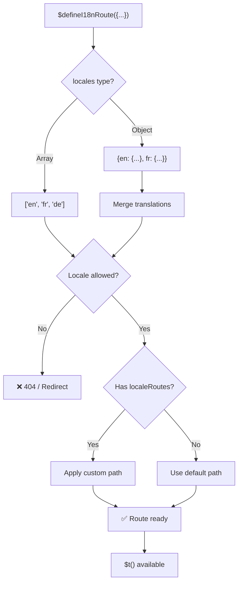
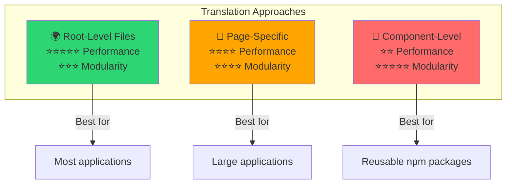

# 📖 Översättningar per komponent

Lär dig att definiera översättningar direkt inuti Vue-komponenter med `$defineI18nRoute` för modulär och underhållbar lokalisering.

## 📖 Översikt

Översättningar per komponent i `Nuxt I18n Micro` låter dig definiera översättningar direkt inuti specifika komponenter eller sidor med funktionen `$defineI18nRoute`. Detta tillvägagångssätt är idealiskt för att hantera lokaliserat innehåll som är unikt för enskilda komponenter, vilket ger en mer modulär och underhållbar metod för att hantera översättningar.

## 🚀 Snabbstart

### Grundläggande användning

```vue
<template>
  <div>
    <h1>{{ $t('greeting') }}</h1>
    <p>{{ $t('farewell') }}</p>
  </div>
</template>

<script setup lang="ts">
import { useNuxtApp } from '#imports'

const { $defineI18nRoute, $t } = useNuxtApp()

$defineI18nRoute({
  locales: {
    en: { greeting: 'Hello', farewell: 'Goodbye' },
    fr: { greeting: 'Bonjour', farewell: 'Au revoir' },
    de: { greeting: 'Hallo', farewell: 'Auf Wiedersehen' },
  },
})
</script>
```

### Nödvändig uppsättning (`script setup`)

`$defineI18nRoute` är en Nuxt-app-injektion, inte ett globalt makro.  
Hämta den alltid från `useNuxtApp()` innan du anropar den.

```ts
import { useNuxtApp } from '#imports'

const { $defineI18nRoute } = useNuxtApp()
```

## 🏗️ Rutt-meta vid byggtid

Vid byggtid skannar en Vite unplugin-transformer sid-`.vue`-filer efter `defineI18nRoute(...)` / `$defineI18nRoute(...)`-anrop och extraherar lokalbegränsningar, `localeRoutes` och `disableMeta` till ruttmetadata som används av `@i18n-micro/route-strategy`.

- **Bygge**: unplugin (`src/unplugin-define-i18n-route.ts`) körs under Vite-transform och skriver `i18n-route-meta.json` under Nuxts byggkatalog
- **Runtime**: define-pluginen (`03.define.ts`) exponerar fortfarande `$defineI18nRoute` i `script setup` för utveckling och inline-konfiguration

Du anropar normalt bara `$defineI18nRoute` på sidor — modulen hanterar byggtidsextrahering automatiskt.

## 🔧 Funktionen `$defineI18nRoute`

Funktionen `$defineI18nRoute` konfigurerar ruttbeteende baserat på aktuell lokal och erbjuder en mångsidig lösning för att:

- Kontrollera åtkomst till specifika rutter baserat på tillgängliga lokaler
- Tillhandahålla översättningar för specifika lokaler
- Sätta anpassade rutter för olika lokaler
- Kontrollera generering av metataggar

### Så fungerar det



### Metodsignatur

```typescript
const { $defineI18nRoute } = useNuxtApp();
$defineI18nRoute(routeDefinition: DefineI18nRouteConfig);
```

### Parametrar

| Parameter      | Typ                                        | Beskrivning                          |
| -------------- | ------------------------------------------ | ------------------------------------ |
| `locales`      | `string[] \| Record<string, Translations>` | Tillgängliga lokaler för rutten      |
| `localeRoutes` | `Record<string, string>`                   | Anpassade rutter för specifika lokaler |
| `disableMeta`  | `boolean \| string[]`                      | Kontrollerar generering av i18n-metataggar |

### Detaljerade parameterbeskrivningar

#### `locales`

Definierar vilka lokaler som är tillgängliga för rutten:

<CodeGroup>
```typescript Array Format
$defineI18nRoute({
  locales: ['en', 'fr', 'de'], // Simple array of locale codes
})
```

```typescript Object Format
$defineI18nRoute({
  locales: {
    en: { greeting: 'Hello', farewell: 'Goodbye' },
    fr: { greeting: 'Bonjour', farewell: 'Au revoir' },
    de: { greeting: 'Hallo', farewell: 'Auf Wiedersehen' },
    ru: {}, // Russian locale allowed but no translations provided
  },
})
```
</CodeGroup>

#### `localeRoutes`

Tillåter anpassade rutter för specifika lokaler:

```typescript
$defineI18nRoute({
  localeRoutes: {
    en: '/welcome',
    fr: '/bienvenue',
    de: '/willkommen',
    ru: '/privet', // Custom route path for Russian locale
  },
})
```

#### `disableMeta`

Kontrollerar generering av i18n-metataggar:

<CodeGroup>
```typescript Disable All Meta
$defineI18nRoute({
  locales: ['en', 'fr', 'de'],
  disableMeta: true, // Disables all i18n meta tags
})
```

```typescript Disable Specific Locales
$defineI18nRoute({
  locales: ['en', 'fr', 'de'],
  disableMeta: ['en', 'fr'], // Only English and French won't have meta tags
})
```
</CodeGroup>

## 💡 Användningsfall

### 1. Kontrollera åtkomst baserat på lokaler

Definiera vilka lokaler som är tillåtna för specifika rutter:

```typescript
$defineI18nRoute({
  locales: ['en', 'fr', 'de'], // Only these locales are allowed for this route
})
```

### 2. Tillhandahålla komponentspecifika översättningar

Använd objektet `locales` för att tillhandahålla specifika översättningar för varje rutt:

```typescript
$defineI18nRoute({
  locales: {
    en: {
      greeting: 'Hello',
      farewell: 'Goodbye',
      description: 'Welcome to our application',
    },
    fr: {
      greeting: 'Bonjour',
      farewell: 'Au revoir',
      description: 'Bienvenue dans notre application',
    },
    de: {
      greeting: 'Hallo',
      farewell: 'Auf Wiedersehen',
      description: 'Willkommen in unserer Anwendung',
    },
  },
})
```

### 3. Anpassad routing för lokaler

Definiera anpassade sökvägar för specifika lokaler:

```typescript
$defineI18nRoute({
  locales: ['en', 'fr', 'de'],
  localeRoutes: {
    en: '/welcome',
    fr: '/bienvenue',
    de: '/willkommen',
  },
})
```

### 4. Inaktivera metataggar

Kontrollera generering av SEO-metataggar för specifika rutter eller lokaler:

```typescript
// Disable meta tags for all locales
$defineI18nRoute({
  locales: ['en', 'fr', 'de'],
  disableMeta: true,
})

// Disable meta tags only for specific locales
$defineI18nRoute({
  locales: ['en', 'fr', 'de'],
  disableMeta: ['en', 'fr'],
})
```

## ✅ Konfigurationsformat som stöds

`$defineI18nRoute`-parsern stöder olika JavaScript-konfigurationer:

### Statiska konfigurationer

<CodeGroup>
```typescript Static Arrays
$defineI18nRoute({
  locales: ['en', 'de', 'fr'],
})
```

```typescript Static Objects
$defineI18nRoute({
  locales: {
    en: { greeting: 'Hello' },
    de: { greeting: 'Hallo' },
  },
  localeRoutes: {
    en: '/welcome',
    de: '/willkommen',
  },
})
```
</CodeGroup>

### Dynamiska konfigurationer

<CodeGroup>
```typescript Variables and Functions
const locales = ['en', 'de', 'fr']
const routes = { en: '/welcome', de: '/willkommen' }

$defineI18nRoute({
  locales: locales,
  localeRoutes: routes,
})
```

```typescript Template Literals
const prefix = 'api'

$defineI18nRoute({
  locales: [`${prefix}-en`, `${prefix}-de`],
  localeRoutes: {
    [`${prefix}-en`]: `/api/welcome`,
    [`${prefix}-de`]: `/api/willkommen`,
  },
})
```
</CodeGroup>

### Avancerade konfigurationer

<CodeGroup>
```typescript Spread Operator
const baseLocales = ['en', 'de']
const additionalLocales = ['fr', 'es']

$defineI18nRoute({
  locales: [...baseLocales, ...additionalLocales],
})
```

```typescript Array of Objects
$defineI18nRoute({
  locales: [
    { code: 'en', name: 'English' },
    { code: 'de', name: 'German' },
  ],
})
```
</CodeGroup>

### Villkorlig logik

```typescript
$defineI18nRoute({
  locales: process.env.NODE_ENV === 'production' ? ['en', 'de'] : ['en', 'de', 'fr', 'es'],
})
```

### Komplexa nästlade objekt

```typescript
$defineI18nRoute({
  locales: {
    'en-us': {
      region: 'US',
      currency: 'USD',
      format: {
        date: 'MM/DD/YYYY',
        time: '12h',
      },
    },
    'de-de': {
      region: 'DE',
      currency: 'EUR',
      format: {
        date: 'DD.MM.YYYY',
        time: '24h',
      },
    },
  },
})
```

### Kommentarer och formatering

```typescript
$defineI18nRoute({
  // Supported locales for this component
  locales: [
    'en', // English
    'de', // German
    'fr', // French
  ],
  // Custom routes for each locale
  localeRoutes: {
    en: '/welcome',
    de: '/willkommen',
    fr: '/bienvenue',
  },
})
```

## ❌ Stöds inte

Parsern har begränsningar och kan inte hantera:

- **Externa importer** (`import`-satser)
- **Async/await-funktioner**
- **Klassmetoder**
- **Komplex kontrollflöde** (loopar, try-catch, switch)
- **Arrow-funktioner** i konfigurationen
- **Generator-funktioner**

## 📝 Fullständigt exempel

Här är ett omfattande exempel som visar alla funktioner:

```vue
<template>
  <div class="welcome-page">
    <header>
      <h1>{{ $t('title') }}</h1>
      <p>{{ $t('subtitle') }}</p>
    </header>

    <main>
      <section>
        <h2>{{ $t('features.title') }}</h2>
        <ul>
          <li v-for="feature in $t('features.list')" :key="feature">
            {{ feature }}
          </li>
        </ul>
      </section>

      <section>
        <h2>{{ $t('contact.title') }}</h2>
        <p>{{ $t('contact.description') }}</p>
        <a :href="$t('contact.email')">{{ $t('contact.email') }}</a>
      </section>
    </main>

    <footer>
      <p>{{ $t('footer.copyright') }}</p>
    </footer>
  </div>
</template>

<script setup lang="ts">
import { useNuxtApp } from '#imports'

const { $defineI18nRoute, $t } = useNuxtApp()

// Define comprehensive i18n route configuration
$defineI18nRoute({
  locales: {
    en: {
      title: 'Welcome to Our Platform',
      subtitle: 'The best solution for your needs',
      features: {
        title: 'Key Features',
        list: ['High Performance', 'Easy to Use', 'Scalable Architecture'],
      },
      contact: {
        title: 'Get in Touch',
        description: "We'd love to hear from you",
        email: 'mailto:contact@example.com',
      },
      footer: {
        copyright: '© 2024 Example Company. All rights reserved.',
      },
    },
    fr: {
      title: 'Bienvenue sur Notre Plateforme',
      subtitle: 'La meilleure solution pour vos besoins',
      features: {
        title: 'Fonctionnalités Clés',
        list: ['Haute Performance', 'Facile à Utiliser', 'Architecture Évolutive'],
      },
      contact: {
        title: 'Contactez-Nous',
        description: 'Nous aimerions avoir de vos nouvelles',
        email: 'mailto:contact@example.com',
      },
      footer: {
        copyright: '© 2024 Example Company. Tous droits réservés.',
      },
    },
    de: {
      title: 'Willkommen auf Unserer Plattform',
      subtitle: 'Die beste Lösung für Ihre Bedürfnisse',
      features: {
        title: 'Hauptfunktionen',
        list: ['Hohe Leistung', 'Einfach zu Verwenden', 'Skalierbare Architektur'],
      },
      contact: {
        title: 'Kontaktieren Sie Uns',
        description: 'Wir würden gerne von Ihnen hören',
        email: 'mailto:contact@example.com',
      },
      footer: {
        copyright: '© 2024 Example Company. Alle Rechte vorbehalten.',
      },
    },
  },
  localeRoutes: {
    en: '/welcome',
    fr: '/bienvenue',
    de: '/willkommen',
  },
  disableMeta: false, // Enable SEO meta tags
})
</script>

<style scoped>
.welcome-page {
  max-width: 800px;
  margin: 0 auto;
  padding: 2rem;
}

header {
  text-align: center;
  margin-bottom: 3rem;
}

section {
  margin-bottom: 2rem;
}

footer {
  text-align: center;
  margin-top: 3rem;
  padding-top: 2rem;
  border-top: 1px solid #eee;
}
</style>
```

## ⚡ Prestandaöverväganden

Att bädda in översättningar i Single File Components (SFC:er) kan påverka prestandan:

### Potentiella problem

- **Ökad filstorlek**: Alla lokaler ligger i SFC:n, till skillnad från separata översättningsfiler som möjliggör lokalmedveten laddning
- **Långsammare rendering**: Översättningar i fil bearbetas vid runtime
- **Minnesanvändning**: Alla översättningar laddas oavsett aktuell lokal

### Bästa praxis

- **Använd översättningar per sida** för optimal prestanda
- **Reservera översättningar på komponentnivå** för specifika fall som:
  - Återanvändbara komponenter publicerade på npm
  - Översättningar som inte lämpar sig för rotnivåfiler
  - Komponenter som behöver vara självständiga

### Prestanda kontra modularitet

Balansera projektets behov när du väljer ett tillvägagångssätt:



| Tillvägagångssätt    | Prestanda   | Modularitet | Användningsfall     |
| -------------------- | ----------- | ----------- | ------------------- |
| **Rotnivåfiler**     | ⭐⭐⭐⭐⭐  | ⭐⭐⭐      | De flesta applikationer |
| **Sidspecifika**     | ⭐⭐⭐⭐    | ⭐⭐⭐⭐    | Stora applikationer |
| **Komponentnivå**    | ⭐⭐        | ⭐⭐⭐⭐⭐  | Återanvändbara komponenter |

## 🎯 Bästa praxis

### 1. Håll översättningar nära komponenter

Definiera översättningar direkt inuti den relevanta komponenten för att hålla lokaliserat innehåll organiserat och underhållbart.

### 2. Använd lokalobjekt för flexibilitet

Utnyttja objektformatet för egenskapen `locales` när specifika översättningar eller åtkomstkontroll baserat på lokaler krävs.

### 3. Dokumentera anpassade rutter

Dokumentera tydligt eventuella anpassade rutter som sätts för olika lokaler för att bibehålla tydlighet och förenkla utveckling och underhåll.

### 4. Överväg prestandapåverkan

Utvärdera om översättningar på komponentnivå är nödvändiga för ditt användningsfall, med hänsyn till prestandaeffekterna.

### 5. Använd TypeScript

Utnyttja TypeScript för bättre typsäkerhet och IntelliSense-stöd:

```typescript
interface ComponentTranslations {
  title: string
  subtitle: string
  features: {
    title: string
    list: string[]
  }
}

$defineI18nRoute({
  locales: {
    en: {
      title: 'Welcome',
      subtitle: 'Subtitle',
      features: {
        title: 'Features',
        list: ['Feature 1', 'Feature 2'],
      },
    } as ComponentTranslations,
  },
})
```

## 📚 Relaterade ämnen

- **[Komma igång](/quickstart)** - Grundläggande installation och konfiguration
- **[API-referens](/api/methods)** - Komplett metoddokumentation
- **[Exempel](/examples)** - Verkliga användningsexempel

## Sammanfattning

Funktionen översättningar per komponent, driven av funktionen `$defineI18nRoute`, erbjuder ett kraftfullt och flexibelt sätt att hantera lokalisering i din Nuxt-applikation. Genom att låta lokaliserat innehåll och routing definieras på komponentnivå hjälper det till att skapa en mycket anpassad och användarvänlig upplevelse skräddarsydd för publikens språk- och regionala preferenser.

Välj det tillvägagångssätt som bäst passar projektets behov, med hänsyn till både prestandakrav och underhållbarhet.
