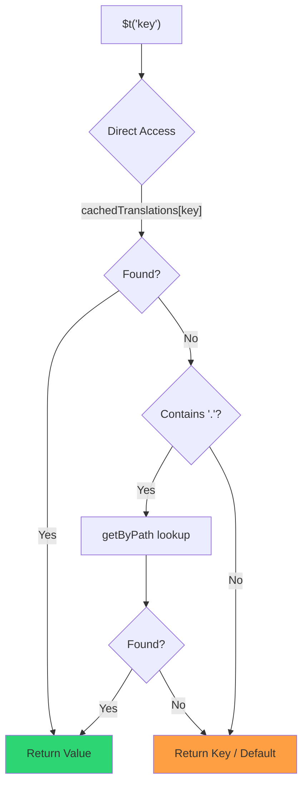

# 🚀 Prestandaguide

## 📖 Introduktion

`Nuxt I18n Micro` är designad med prestanda i åtanke och erbjuder en betydande förbättring jämfört med traditionella i18n-moduler som `nuxt-i18n`. Denna guide ger en djupgående titt på prestandafördelarna med att använda `Nuxt I18n Micro` och hur den jämför sig med andra lösningar.

## 🤔 Varför fokusera på prestanda?

I storskaliga projekt och miljöer med hög trafik kan flaskhalsar i prestandan leda till långsamma byggtider, ökad minnesanvändning och dåliga serversvarstider. Dessa problem blir mer uttalade med komplexa i18n-uppsättningar som involverar stora översättningsfiler. `Nuxt I18n Micro` byggdes för att möta dessa utmaningar direkt genom att optimera för hastighet, minneseffektivitet och minimal påverkan på din applikations bundle-storlek.

## 📊 Prestandajämförelse

Vi genomförde en serie tester på identiska fixtures via `pnpm test:performance` (`pnpm -C scripts cli performance`) mot **`@nuxtjs/i18n@10.6.0`**. Fullständig metodik och diagram: [Resultat från prestandatester](/guides/performance-results).

Standard-CLI-profil: **4 lokaler** × **2 sidor** (`index`, `page`) × ~10k index-leaf-nycklar. Höj `--locales` / `--keys` för en tyngre regressionsradar-belastning. Rapporten delar upp **kod**, **översättningar** (inklusive `@nuxtjs/i18n` `chunks/raw/*`) och **totalt** distribuerbart utdata.

```bash
pnpm test:performance
pnpm -C scripts cli performance --only micro --skip-stress
pnpm -C scripts cli performance --locales 12 --keys 100000 --runs 3
```

### ⏱️ Byggtid och resursanvändning

<Accordion title="**@nuxtjs/i18n v10.6**">
- **Kodbundel**: 2,16 MB
- **Översättningar**: 7,21 MB (meddelande-chunks + lokal-payloads)
- **Totalt distribuerbart**: 9,37 MB
- **Max minnesanvändning**: 1 821 MB
- **Förfluten tid**: 8,34 s (medelvärde av 3)
</Accordion>

<Tip>
- **Kodbundel**: 1,74 MB — **~19 % mindre kod än `@nuxtjs/i18n` v10.6**
- **Översättningar**: 6,8 MB (lazy-laddad JSON)
- **Totalt distribuerbart**: 8,54 MB
- **Max minnesanvändning**: 1 065 MB — **~41 % mindre minne än `@nuxtjs/i18n` v10.6**
- **Förfluten tid**: 5,34 s — **~36 % snabbare än `@nuxtjs/i18n` v10.6** (≈ plain-nuxt-baslinje)
</Tip>

> Äldre dokumentation som visade `@nuxtjs/i18n` "code ≈ 15 MB / translations 0 B" räknade `chunks/raw`-meddelandefiler som app-kod. Den nuvarande klassificeraren separerar dem; gapet på **kod** är mindre, och micro leder fortfarande på byggtid, topp-RSS och lasttester.

Se den [fullständiga benchmark-rapporten](/guides/performance-results) för diagram, Autocannon-resultat och fixture-detaljer.

### 🌐 Serverprestanda under belastning

Artillery (6s@6 + 60s@60) och Autocannon (10c / 10s), medelvärde av 3 på varandra följande körningar per fixture.

<Accordion title="**@nuxtjs/i18n v10.6**">
- **Förfrågningar per sekund (Artillery)**: 143 [#/sek]
- **Genomsnittlig svarstid**: 956 ms
- **Autocannon RPS/genomsnittlig latens**: 72 / 139 ms
</Accordion>

<Tip>
- **Förfrågningar per sekund (Artillery)**: 275 [#/sek] — **~93 % mer än `@nuxtjs/i18n` v10.6**
- **Genomsnittlig svarstid**: 483 ms — **~49 % snabbare än `@nuxtjs/i18n` v10.6**
- **Autocannon RPS/genomsnittlig latens**: 162 / 62 ms
</Tip>

### 📈 Visuell jämförelse

<Note>
Interaktivt diagram utelämnat i Mintlify-dokumentationen. Se benchmark-tabellerna på denna sida eller [VitePress-dokumentationen](https://s00d.github.io/nuxt-i18n-micro/guide/performance-results) för diagram: `chart`.
</Note>

<Note>
Interaktivt diagram utelämnat i Mintlify-dokumentationen. Se benchmark-tabellerna på denna sida eller [VitePress-dokumentationen](https://s00d.github.io/nuxt-i18n-micro/guide/performance-results) för diagram: `chart`.
</Note>

| Metrik          | @nuxtjs/i18n v10.6 | i18n-micro | Förbättring        |
| --------------- | ------------------ | ---------- | ------------------ |
| Byggtid         | 8,34 s             | 5,34 s     | **~36 % snabbare** |
| Minne (bygge)   | 1 821 MB           | 1 065 MB   | **~41 % mindre**   |
| Kodbundel       | 2,16 MB            | 1,74 MB    | **~19 % mindre**   |
| Svarstid        | 956 ms             | 483 ms     | **~49 % snabbare** |
| RPS (Artillery) | 143                | 275        | **~93 % mer**      |

### 🔍 Tolkning av resultaten

Mot aktuell `@nuxtjs/i18n` **v10.6** (standard-CLI-profil, medelvärde av 3):

- 🗜️ **Mindre kodgraf**: ~1,74 MB kontra ~2,16 MB när meddelande-chunks inte felaktigt märks som "kod".
- 🧠 **Lägre bygg-RSS**: ~1,1 GB topp kontra ~1,8 GB.
- 🕒 **Snabbare byggen**: ~5,3 s kontra ~8,3 s (micro matchar plain-Nuxt-baslinjen på denna profil).
- ⚡ **Mycket bättre under belastning**: ~275 kontra ~143 Artillery-RPS, ~162 kontra ~72 Autocannon-RPS, lägre genomsnittlig latens.

Absoluta tal skiljer sig från äldre publicerade tabeller (mindre ordböcker, äldre Nuxt och en orättvis "0 B översättningar"-uppdelning för `@nuxtjs/i18n`). Riktningsmässigt är det detsamma: micro ligger före på byggkostnad och förfrågningsgenomströmning.

## ⚙️ Nyckeloptimeringar

### 🛠️ Minimalistisk design

`Nuxt I18n Micro` är byggd kring en minimalistisk arkitektur med en liten kärna och dedikerade strategipaket. Detta minskar overhead och förenklar den interna logiken, vilket leder till förbättrad prestanda.

### 🚦 Effektiv routing

I v3 är ruttgenerering och runtime-sökvägslogik uppdelade i dedikerade paket för optimal tree-shaking:

- **`@i18n-micro/route-strategy`** — Ruttgenerering vid byggtid: utökar Nuxt-sidor med lokaliserade rutter. Endast den valda strategin (`no_prefix`, `prefix`, `prefix_except_default`, `prefix_and_default`) inkluderas.
- **`@i18n-micro/path-strategy`** — Sökvägsupplösning vid runtime, omdirigeringar och länkgenerering. Använder rena funktioner och förberäknade kontextflaggor för att minimera allokeringar på heta sökvägar. Undersökvägsexporter (`/prefix`, `/no-prefix` med flera) säkerställer att endast den valda implementationen bundlas.

Denna approach håller routingkonfigurationen lätt och säkerställer snabb ruttupplösning oavsett antalet lokaler.

### 📂 Effektiviserad översättningsladdning

Modulen stöder endast JSON-filer för översättningar, med en tydlig separation mellan globala och sidspecifika filer. Detta säkerställer att endast nödvändig översättningsdata laddas vid varje tillfälle, vilket ytterligare förbättrar prestandan.

### 🔒 GlobalThis-singleton-cache

Från och med v3.0.0 använder modulen ett `globalThis`-singleton-mönster med `Symbol.for` för att garantera en enda cache-instans över hela Node.js-processen. Detta förhindrar:

- Cache-duplicering när samma modul bundlas flera gånger
- Objektåterskapande per förfrågan som orsakar tryck på garbage collection
- Minnesläckor från övergivna cache-instanser

```mermaid
flowchart LR
    subgraph Process["Node.js Process"]
        G["globalThis[Symbol.for('CACHE')]"]

        subgraph R1["SSR Request 1"]
            P1[Plugin Instance] --> G
        end

        subgraph R2["SSR Request 2"]
            P2[Plugin Instance] --> G
        end

        subgraph R3["SSR Request 3"]
            P3[Plugin Instance] --> G
        end
    end

    G --> Cache["Single Map Instance"]
    Cache --> D1["en:index → translations"]
    Cache --> D2["en:about → translations"
```

```typescript
// Internal implementation pattern
const CACHE_KEY = Symbol.for('__NUXT_I18N_STORAGE_CACHE__')
if (!globalThis[CACHE_KEY]) {
  globalThis[CACHE_KEY] = new Map()
}
```

### ⚡ Optimerad översättningsfunktion (tFast)

Funktionen `$t()` använder en direkt uppslagsstrategi optimerad för hastighet:

1. **Förberäknad kontext**: Lokal och ruttnamn beräknas en gång under navigering, inte vid varje `$t()`-anrop
2. **Uppslag från en enda källa**: Alla översättningar (rot + sidspecifika + fallback) slås samman på förhand vid byggtid till en enda fil per sida — ingen lagerbaserad sökning behövs
3. **Kumulativ djup sammanslagning vid navigering**: När du navigerar inom samma lokal djup-sammanslås nya sidöversättningar (djup 2 nivåer) in i den aktiva ordboken, så att nycklar från den föregående sidan förblir synliga under övergångsanimationer — även när sidor delar överlappande nästlade prefix (till exempel att båda sidor har nycklar under `common.*`)
4. **Garbage collection via `page:transition:finish`**: Efter att övergångsanimationen är fullständigt klar ersätts den sammanslagna ordboken med de rena översättningarna för endast den nya sidan, vilket frigör minne från gamla sidnycklar
5. **Direkt egenskapsåtkomst**: Använder `obj[key]` i stället för Map-uppslag för heta sökvägar



```typescript
// Simplified lookup logic — single active dictionary
let val = cachedTranslations[key]
if (val === undefined && key.includes('.')) {
  val = getByPath(cachedTranslations, key)
}
```

### 💉 Serverbaserad laddning (ingen HTML-inbäddning)

Översättningar som laddas under SSR förblir i **serverminnet** för `$t` under rendering. De kopieras **inte** in i `nuxtApp.payload` / HTML-dokumentet (samma idé som `@nuxtjs/i18n` med `experimental.preload: false`).

På klienten `await`ar `01.plugin.ts` `switchContext`, som laddar `/\{apiBaseUrl\}/:page/:locale/data.json` innan appen fortsätter — en förfrågan, inte en 8 MB inline-blob.

`NuxtI18n` behåller fortfarande den aktiva sammanslagna ordboken (`cachedTranslations`) för `$t()` / `$has()`. Samma-lokal-navigeringar djup-sammanslår sid-chunks tills `page:transition:finish` rensar bort inaktuella nycklar.

#### Var det står idag

Talen nedan läses från budgetfilen som `pnpm run budget:payload` mäter och tvingar.

{/* generated:payload-budget — do not edit; run `pnpm run docs:generate` */}

Mätt på `playground` över `/`, `/de`:

| Mätning | Storlek |
| --- | --- |
| Översättningskällor på disk | 15,2 MB |
| Levererat som separata payload-filer | 76,3 MB |
| Största inline-`__NUXT_DATA__` | 6,9 MB |
| Klient-tillgångar | 449,5 KB |

Playgroundet bär en avsiktligt överdimensionerad ordbok, så dessa är inte siffror att förvänta sig från en riktig applikation — de är en fast punkt att mäta mot. Budgeten misslyckas när de växer oväntat, vilket är hur en oavsiktlig ändring av vad payloaden bär uppmärksammas.

{/* /generated:payload-budget */}

### 💾 Caching och pre-rendering

Översättningar passerar genom flera cachar, och att veta vilken som svarade på en förfrågan är skillnaden mellan en fem minuters och en fem timmars felsökningssession. Det finns fyra, i den ordning en förfrågan möter dem:

| Lager | Var | Livslängd | Rensas av |
| --- | --- | --- | --- |
| Webbläsare/CDN | `Cache-Control` på `/\{apiBaseUrl\}/**` | `httpCacheDuration`, `immutable` | en ny `?v=` — det vill säga en distribution som ändrat översättningar |
| Nitro-ruttcache | `routeRules['/\{apiBaseUrl\}/**'].cache` | 60 s, stale-while-revalidate | serveromstart |
| Server-loader | in-process-`CacheControl`, nyckel `locale:routeName` | processens livslängd, eller `cacheTtl` | serveromstart, HMR i utveckling |
| Klientlager | `translationStorage` + den aktiva chunk i `NuxtI18n` | sidans livslängd | omladdning |

Två regler håller dem från att motsäga varandra:

- **Nitro-ruttcachen existerar endast när `?v=` gör det.** Med en cache-buster är varje URL unik för sitt innehåll, så att cacha den på serversidan är fritt från inaktualitet. Sätt `dateBuild: 0` och det lagret stängs av, eftersom URL:en då är stabil och svaret säger `must-revalidate` — en serverbaserad cache skulle svara från en inaktuell post i upp till en minut och tyst besegra det.
- **`immutable` kräver också `?v=`.** Utan en buster är headern `public, max-age=0, must-revalidate`, oavsett vad `httpCacheDuration` säger: en lång `max-age` på en URL som aldrig ändras låser fast det första svaret en webbläsare någonsin såg.

<Warning>
Med `translationPayloads.publicAssets` (standard i premerged-läge) kopieras payloads till `public/<apiBaseUrl>/\{page\}/\{locale\}/data.json`. En plattform som själv levererar den katalogen (Cloudflare Pages, Firebase Hosting, `npx serve`) tillämpar sina egna headers — Nitro-`routeRules`-headern når endast svar som går genom servern. Ställ in cachepolicy för de statiska filerna i plattformens egen konfiguration.
</Warning>

🏁 **Pre-rendering**: i premerged-läge skriver `publicAssets` redan klientens URL-träd till `public/`. Välj in `prerenderRoutes` endast om du behöver att Nitro materialiserar hanterarrutter när den kopian är inaktiverad.

### 🗜️ Komprimerade publika payloads

När `nitro.compressPublicAssets` är aktiverat får översättnings-payloads som kopieras till den publika katalogen `.gz`- och `.br`-syskonfiler också:

```ts
export default defineNuxtConfig({
  nitro: { compressPublicAssets: true },
})
```

Nitro komprimerar publika tillgångar innan hooken som kopierar payloads, så utan detta skulle de vara den enda okomprimerade delen av ett statiskt bygge. Modulen aktiverar inte komprimering själv — den tillämpar bara inställningen du valde. Per-encoding-val (`\{ gzip: true, brotli: false \}`) respekteras.

Playground-index-payload: 6 651 984 B rå, 1 012 831 B gzip, 821 617 B brotli.

### ☁️ Serverlös payload-utdata

På **Node** läser SSR översättnings-JSON från `public/<apiBaseUrl>` (`readFile`, ingen Nitro `serverAssets` / Rollup `raw:`). På **Edge** bäddar Nitro `serverAssets` in samma träd (föredra `mode: 'source'` för stora kataloger).

```typescript
export default defineNuxtConfig({
  i18n: {
    translationPayloads: {
      serverAssets: true, // default — Node → public copy; Edge → serverAssets embed
      publicAssets: true, // default in premerged mode
    },
  },
})
```

Använd `translationPayloads.mode: 'source'` för kompakta Edge-inbäddningar (och valfria kompakta publika kopior):

```typescript
export default defineNuxtConfig({
  i18n: {
    translationPayloads: {
      mode: 'source',
    },
  },
})
```

`mode: 'source'` håller lager-sammanslagna källfiler kompakta och slår samman rot/sida/fallback vid runtime via den inbyggda `/_locales`-rutten (eller Edge `assets:i18n`). Som standard inaktiverar den publika tillgångskopior och prerenderade payload-rutter.

<Warning>
`prerenderRoutes` är som standard `false`. Med `mode: 'source'` är även `publicAssets` som standard `false`. Ren statisk hosting utan en Nitro/edge-runtime kan därför inte ladda översättningar på klienten om du inte aktiverar en av dessa utdata, behåller `serverHandler` tillgänglig vid runtime eller hostar payloads externt.

Standard premerged + `publicAssets` placerar redan `/\{apiBaseUrl\}/\{page\}/\{locale\}/data.json` under `public/`, så statiska värdar kan leverera klientförfrågningar utan Nitro.
</Warning>

<Warning>
Att sätta `apiBaseServerHost` eller `apiBaseClientHost` flyttar payload-leverans till den origin, vilket kommer med sina egna krav — se [Konfiguration → Externa CDN-värdar](/guides/configuration#external-cdn-hosts).
</Warning>

Eller inaktivera individuella HTTP/publika utdata och hosta payloads externt:

```typescript
export default defineNuxtConfig({
  i18n: {
    apiBaseClientHost: 'https://cdn.example.com',
    apiBaseServerHost: 'https://cdn.example.com',
    translationPayloads: {
      serverHandler: false,
      publicAssets: false,
      prerenderRoutes: false,
    },
  },
})
```

Behåll `serverHandler` aktiverad när du förlitar dig på den inbyggda lokala `/\{apiBaseUrl\}/:page/:locale/data.json`-rutten. Inaktivera den när payloads hostas externt och `apiBaseServerHost` pekar på den externa origin. Aktivera `prerenderRoutes` endast när du behöver att Nitro materialiserar statiska payload-rutter och `publicAssets` inte redan skrev dem.

Under bygget varnar modulen när genererat payload-utdata överskrider `translationPayloads.warnFileCount` (standard 500) eller `translationPayloads.warnSizeBytes` (standard 10 MB). Den varnar också när alla lokala utdata är inaktiverade utan externa payload-värdar konfigurerade.

## 📝 Tips för att maximera prestandan

Här är några tips för att säkerställa att du får bästa prestanda ur `Nuxt I18n Micro`:

- 📉 **Begränsa lokaldata**: Inkludera endast de lokaler du behöver i ditt projekt för att hålla bundle-storleken liten.
- 🗂️ **Använd sidspecifika översättningar**: Organisera dina översättningsfiler per sida för att undvika att ladda onödig data.
- 💾 **Aktivera caching**: Utnyttja cache-funktionerna för att minska serverbelastningen och förbättra svarstiderna.
- 🏁 **Utnyttja pre-rendering**: Pre-rendra dina översättningar för att snabba upp sidladdningar och minska runtime-overhead.

För detaljerade resultat av prestandatesterna, se [Resultat från prestandatester](/guides/performance-results).
