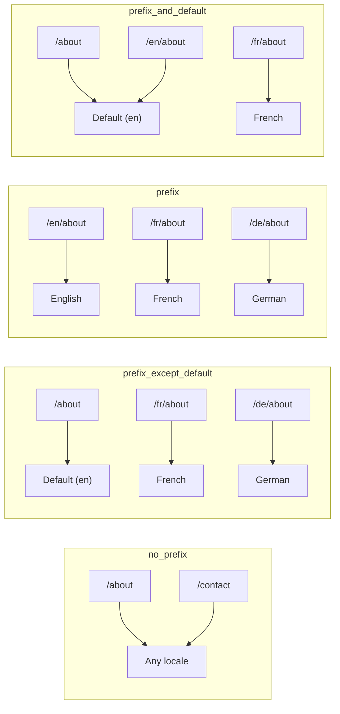
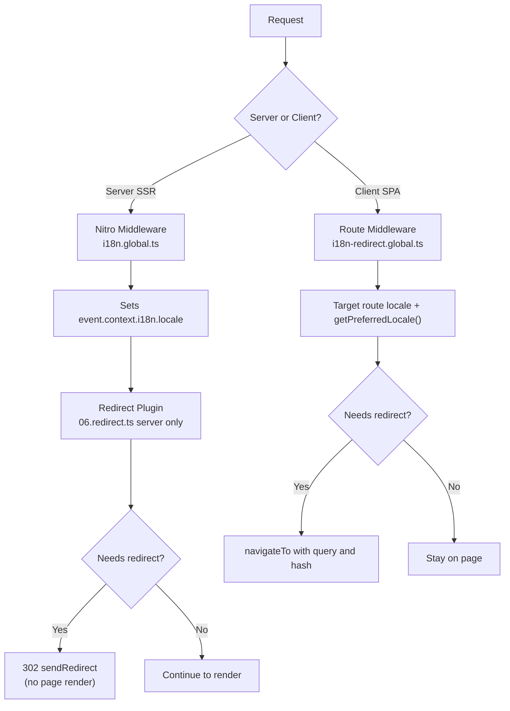

# 🗂️ Routingstrategier i Nuxt I18n Micro

## 📖 Översikt

Nuxt I18n Micro styr hur lokalprefix visas i URL:er via alternativet `strategy`. Under huven implementerar två paket detta:

- **`@i18n-micro/route-strategy`** — ruttgenerering vid byggtid (utökar Nuxt-sidor med lokaliserade rutter)
- **`@i18n-micro/path-strategy`** — sökvägsupplösning vid runtime, omdirigeringar, SEO-attribut och länkgenerering

Nuxt-modulen väljer rätt strategiklass vid byggtid och aliaserar den via `#i18n-strategy`, så att endast den valda implementationen bundlas.

## 🚦 Tillgängliga strategier

{/* generated:option:strategy — do not edit; run `pnpm run docs:generate` */}

**Typ** `Strategies` · **Standard** `'prefix_except_default'`

URL-routingstrategi för lokalprefix.

- `'no_prefix'` — ingen lokal i URL; lokalen lagras i cookie.
- `'prefix_except_default'` — prefixera alla lokaler utom standardlokalen.
- `'prefix'` — prefixera alltid, inklusive standardlokalen.
- `'prefix_and_default'` — som `prefix`, men standardlokalen är också tillgänglig utan prefix.

{/* /generated:option:strategy */}

### Jämförelse av strategier



### 🛑 `no_prefix`

URL:er har inget lokalsegment. Lokalen bestäms av cookies, `useI18nLocale()`-state eller webbläsardetektering.

- **Rutter**: `/about`, `/contact` — samma URL-mönster för alla lokaler (inget `/en/`-, `/fr/`-prefix)
- **Lokal-persistens**: Via `localeCookie` (sätts automatiskt till `'user-locale'` om inget anges)
- **Anpassade sökvägar**: Stöds via [`globalLocaleRoutes`](/guides/configuration#globallocaleroutes) och [`defineI18nRoute`](/guides/custom-locale-routes) — lokaliserade slugs genereras utan att lägga till ett lokalprefix till URL:er (till exempel `/about` kontra `/ueber-uns`). Nästlade rutter, alias och per-lokala begränsningar är enklare än i `prefix_except_default`.

<Tip>
När `no_prefix` används sätts `localeCookie` automatiskt till `'user-locale'` om inget anges. Detta krävs eftersom URL:en inte innehåller någon lokalinformation.
</Tip>

```typescript
i18n: {
  strategy: 'no_prefix'
  // localeCookie is automatically set to 'user-locale'
}
```

### 🚧 `prefix_except_default`

Alla rutter har ett lokalprefix **utom** standardlokalen.

- **Standardlokal**: `/about`, `/contact`
- **Andra lokaler**: `/fr/about`, `/de/contact`
- **Standardlokal med prefix returnerar 404**: `/en/about` → 404 (när `en` är standard)

```typescript
i18n: {
  strategy: 'prefix_except_default' // This is the default
}
```

### 🌍 `prefix`

Varje rutt har ett lokalprefix, inklusive standardlokalen.

- **Alla lokaler**: `/en/about`, `/fr/about`, `/de/about`
- **Rot `/`**: Omdirigerar till `/\{locale\}/` baserat på användarpreferens

```typescript
i18n: {
  strategy: 'prefix'
}
```

### 🔄 `prefix_and_default`

Standardlokalen är tillgänglig både med och utan prefix. Icke-standardlokaler har alltid ett prefix.

- **Standardlokal**: både `/about` och `/en/about` är giltiga
- **Andra lokaler**: `/fr/about`, `/de/about`
- **Ingen omdirigering från `/`**: Både `/` och `/en/` levererar standardlokalen

```typescript
i18n: {
  strategy: 'prefix_and_default'
}
```

## 🔀 Omdirigeringsarkitektur (v3)

I v3 är omdirigeringslogiken uppdelad i två lager för optimal prestanda:

### Så fungerar det



### Serverbaserad (ingen flash)

1. **Nitro-middleware** (`i18n.global.ts`) körs först — detekterar lokalen från URL, cookie eller `Accept-Language`-header och sätter `event.context.i18n.locale`
2. **Omdirigeringsplugin** (`06.redirect.ts`, endast server) kontrollerar om den aktuella sökvägen behöver en omdirigering med `i18nStrategy.getClientRedirect()` och utfärdar en 302 **innan** någon sidrendering sker
3. Detta förhindrar "felflash" där användare kortvarigt ser en felaktig sida innan omdirigering

### Klientbaserad (SPA-navigering)

1. Global route-middleware (`i18n-redirect.global.ts`) körs vid varje klientnavigering när `redirects` är aktiverat
2. Härleder föredragen lokal från **målrutten** först och faller sedan tillbaka till `useI18nLocale().getPreferredLocale()`
3. Använder `i18nStrategy.getClientRedirect()` för att avgöra om en omdirigering behövs
4. Bevarar `query` och `hash` vid omdirigering

### Lokalens prioritetsordning

På servern bestämmer omdirigeringspluginen den föredragna lokalen i denna ordning:

1. **`useState('i18n-locale')`** — högsta prioritet (satt programmatiskt via `useI18nLocale().setLocale()`)
2. **Cookie** — om `localeCookie` är konfigurerad
3. **`Accept-Language`-header** — om `autoDetectLanguage: true`
4. **`defaultLocale`** — sista fallback

På klienten föredrar route-middlewaren lokalen från målrutten, och använder sedan samma state/cookie-fallback-kedja.

### Omdirigeringsbeteende per strategi

| Strategi                | Beteende för `GET /`                              | Cookie krävs?    |
| ----------------------- | ------------------------------------------------- | ---------------- |
| `no_prefix`             | Ingen omdirigering (lokal från cookie/state)      | Sätts automatiskt |
| `prefix`                | 302 → `/\{locale\}/`                               | Rekommenderas    |
| `prefix_except_default` | 302 → `/\{locale\}/` om lokal ≠ standard           | Rekommenderas    |
| `prefix_and_default`    | Ingen omdirigering (både `/` och `/\{locale\}/` giltiga) | Valfritt |

### Inaktivera omdirigeringar

```typescript
i18n: {
  redirects: false // Disables automatic locale redirects
}
```

När `redirects: false` är automatiska lokalomdirigeringar inaktiverade:

- **Server**: omdirigeringspluginen (`06.redirect.ts`, endast server) förblir registrerad men hoppar över omdirigeringslogiken. Den utför fortfarande **404-kontroller** för ogiltiga lokalprefix (till exempel `/xx/about` där `xx` inte är en giltig lokal) och **cookiesynkronisering** från URL-prefix (till exempel att besöka `/fr/about` synkar cookien till `fr`)
- **Klient**: den globala route-middlewaren `i18n-redirect` **registreras inte** — inga automatiska SPA-omdirigeringar

## 🍪 Cookiebaserad lokal-persistens

<Warning>
När du använder `prefix` eller `prefix_except_default` med `redirects: true` (standard), **måste** du sätta `localeCookie` för att omdirigeringar ska fungera korrekt. Utan en cookie kan omdirigeringspluginen inte komma ihåg användarens lokalpreferens mellan sidomladdningar.

```typescript
i18n: {
  strategy: 'prefix_except_default',
  localeCookie: 'user-locale' // Required for redirects to work properly
}
```
</Warning>

**Så fungerar `localeCookie` i v3:**

- Hanteras internt av `useI18nLocale()` — **sätt den inte manuellt** via `useCookie()`
- När en användare besöker en prefixerad URL (till exempel `/fr/about`) synkas cookien automatiskt till `fr`
- Vid nästa besök till `/` används cookievärdet för att omdirigera till `/\{locale\}/`
- Om cookien innehåller en ogiltig lokal (som inte finns i listan `locales`) faller den tillbaka till `defaultLocale`

| Strategi                | Standard för `localeCookie` | Anmärkningar                            |
| ----------------------- | --------------------------- | --------------------------------------- |
| `no_prefix`             | Auto: `'user-locale'`       | Krävs; sätts automatiskt                |
| `prefix`                | `null` (inaktiverad)        | Sätt till `'user-locale'` för omdirigeringar |
| `prefix_except_default` | `null` (inaktiverad)        | Sätt till `'user-locale'` för omdirigeringar |
| `prefix_and_default`    | `null` (inaktiverad)        | Valfritt                                |

## 🔍 `autoDetectLanguage` och `autoDetectPath`

### `autoDetectLanguage`

{/* generated:option:autoDetectLanguage — do not edit; run `pnpm run docs:generate` */}

**Typ** `boolean` · **Standard** `true`

Upptäck automatiskt användarens föredragna språk från HTTP-headern `Accept-Language`. Används tillsammans med `autoDetectPath` för att avgöra när detektering sker.

{/* /generated:option:autoDetectLanguage */}

Kontrollen körs i server-middlewaren och är en fallback: en cookie eller befintligt state vinner.

```typescript
i18n: {
  autoDetectLanguage: true
}
```

### `autoDetectPath`

{/* generated:option:autoDetectPath — do not edit; run `pnpm run docs:generate` */}

**Typ** `string` · **Standard** `'/'`

Var cookie/Accept-Language-preferensomdirigeringar kan köras (när `redirects` är aktiverat).

- `'/'` — endast `/` (djuplänkar i standardlokalen förblir nåbara; standard)
- `'no_prefix'` — endast sökvägar utan lokalprefix
- `'*'` — varje sökväg, inklusive omskrivning av ett explicit lokalprefix
  (till exempel `/fr/about` → `/de/about` när cookien föredrar `de`)

- vilken annan sträng som helst — exakt sökvägsmatch (till exempel `'/welcome'`)

Rensning av prefixerad strategi (till exempel `/en` → `/` under `prefix_except_default`) är inte spärrad.

{/* /generated:option:autoDetectPath */}

```typescript
i18n: {
  autoDetectPath: '/' // Default: only root
  // autoDetectPath: '*' // All paths — redirects even /fr/about to /de/about
}
```

<Warning>
Med `autoDetectPath: '*'` omdirigeras även URL:er med ett explicit lokalprefix (till exempel `/fr/about`) om användarens föredragna lokal skiljer sig. Detta kan vara användbart för domänbaserade uppsättningar men kan förvirra användare som delar URL:er.
</Warning>

Med standardvärdet `autoDetectPath: '/'` och en lokal-cookie:

| förfrågan | cookie | resultat |
| --- | --- | --- |
| `/` | `de` | 302 → `/de` |
| `/about` | `de` | 200, standardlokal (ingen omskrivning) |

```typescript
i18n: {
  localeCookie: 'user-locale',
  strategy: 'prefix_except_default',
  // Default — remember language on entry, keep deep links stable
  autoDetectPath: '/',
  // Or redirect on every unprefixed path (but not /de/… → /fr/…):
  // autoDetectPath: 'no_prefix',
}
```

## ⚠️ Kända problem och bästa praxis

### 1. Hydration-mismatch i `no_prefix`-strategin

När du använder `no_prefix` bestäms lokalen dynamiskt. Om server och klient inte är överens om lokalen får du en hydration-mismatch.

**Lösning**: Använd `useI18nLocale().setLocale()` i ett server-plugin (med `order: -10`) för att sätta lokalen före i18n-initieringen:

```ts
// plugins/i18n-loader.server.ts
export default defineNuxtPlugin({
  name: 'i18n-custom-loader',
  enforce: 'pre',
  order: -10,
  setup() {
    const { setLocale } = useI18nLocale()
    setLocale('ja') // Your detection logic here
  },
})
```

Se [Anpassad språkdetektering](/guides/custom-language-detection) för detaljerade exempel.

### 2. Använd namngivna rutter med `localeRoute`

Sökvägsbaserad routing kan orsaka problem med ruttupplösning:

```typescript
// May cause issues
$localeRoute('/page')

// Preferred approach
$localeRoute({ name: 'page' })
```

### 3. Använda `pages: false` med i18n

När du använder Nuxt med `pages: false`:

```typescript
export default defineNuxtConfig({
  pages: false,
  i18n: {
    strategy: 'no_prefix', // Recommended
    disablePageLocales: true, // Required
    localeCookie: 'user-locale', // Required for persistence
  },
})
```

**Begränsningar med `pages: false`:**

- Inga automatiska omdirigeringar
- Ingen URL-baserad lokaldetektering
- Klientbaserad lokalväxling kräver sidomladdning eller manuell översättningsladdning

### 4. Hantering av ogiltig cookie

Om en cookie innehåller en ogiltig lokal (som inte finns i listan `locales`) faller modulen på ett elegant sätt tillbaka till `defaultLocale`. Inga fel kastas.

## 📝 Sammanfattning av bästa praxis

| Rekommendation           | Detaljer                                                                                |
| ------------------------ | --------------------------------------------------------------------------------------- |
| **Sätt `localeCookie`**  | Sätt alltid för prefixstrategier med `redirects: true`                                  |
| **Använd `useI18nLocale()`** | Det centraliserade sättet att hantera lokal-state (ersätter manuell `useState`/`useCookie`) |
| **Använd namngivna rutter** | `$localeRoute(\{ name: 'page' \})` framför `$localeRoute('/page')`                       |
| **Programmatisk lokal**  | Använd `useI18nLocale().setLocale()` i ett server-plugin med `order: -10`               |
| **Undvik manuella cookies** | Använd inte `useCookie('user-locale')` direkt — `useI18nLocale()` hanterar detta      |
