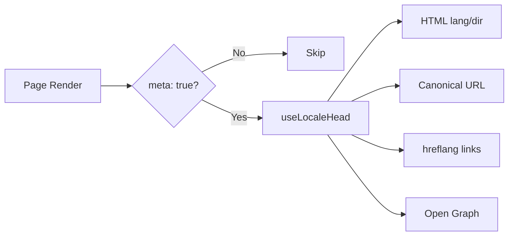

# 🌐 SEO-guide för Nuxt I18n Micro

## 📖 Introduktion

Effektiv SEO (sökmotoroptimering) är avgörande för att säkerställa att din flerspråkiga webbplats är tillgänglig och synlig för användare världen över via sökmotorer. `Nuxt I18n Micro` förenklar processen att hantera SEO för flerspråkiga webbplatser genom att automatiskt generera väsentliga metataggar och attribut som informerar sökmotorer om strukturen och innehållet på din webbplats.

Denna guide förklarar hur `Nuxt I18n Micro` hanterar SEO för att förbättra din webbplats synlighet och användarupplevelse utan att kräva ytterligare konfiguration.

## ⚙️ Automatisk SEO-hantering

### Flöde för SEO-metagenerering



**Genererade taggar:**

| Tagg            | Exempel                                                  |
| --------------- | -------------------------------------------------------- |
| HTML-attribut   | `<html lang="en" dir="ltr">`                             |
| Canonical       | `<link rel="canonical" href="...">`                      |
| hreflang        | `<link rel="alternate" hreflang="en" href="...">`        |
| x-default       | `<link rel="alternate" hreflang="x-default" href="...">` |
| Open Graph      | `<meta property="og:locale" content="en_US">`            |

#### `og` per lokal (`og:locale` kontra BCP 47)

`<html lang>` och `hreflang` använder **BCP 47** via `locale.iso` (till exempel `ar-AE`).  
Open Graph kräver **`language_TERRITORY`** med ett **understreck** (`ar_AE`), enligt [OG-protokollet](https://ogp.me/).

Som standard härleds `og:locale` från `iso` när mappningen är otvetydig (`en-US` → `en_US`).  
Ange en explicit **`og`**-sträng när du behöver ett anpassat värde (till exempel `zh-Hans` → `zh_CN`).  
Om varken `og` eller ett konverterbart `iso` finns tillgängligt genereras inga `og:locale`-taggar — i utveckling får du en konsollvarning (respekterar `missingWarn`).

```typescript
i18n: {
  meta: true,
  locales: [
    { code: 'ar', iso: 'ar-AE', og: 'ar_AE', dir: 'rtl' },
    { code: 'en', iso: 'en-US' }, // og:locale → en_US
    { code: 'zh', iso: 'zh-Hans', og: 'zh_CN' }, // script tags need explicit og
  ],
}
```

### 🔑 Nyckelfunktioner för SEO

När alternativet `meta` är aktiverat i `Nuxt I18n Micro` hanterar modulen automatiskt följande SEO-aspekter:

1. **🌍 Språk- och riktningsattribut**:
   - Modulen sätter `lang`- och `dir`-attributen på `<html>`-taggen enligt aktuell lokal och textriktning (till exempel `ltr` för engelska eller `rtl` för arabiska).

2. **🔗 Kanoniska URL:er**:
   - Modulen genererar en canonical-länk (`<link rel="canonical">`) för varje sida, vilket säkerställer att sökmotorer känner igen den primära versionen av innehållet.

3. **🌐 Alternativa språklänkar (`hreflang`)**:
   - Modulen genererar automatiskt `<link rel="alternate" hreflang="">`-taggar för alla tillgängliga lokaler. Detta hjälper sökmotorer att förstå vilka språkversioner av ditt innehåll som är tillgängliga och förbättrar användarupplevelsen för globala målgrupper.
   - Varje lokal emitterar **en** tagg: `hreflang = iso || code`. När `iso` är satt används routing-`code` aldrig som `hreflang` (så marknadsnycklar som `mx` blir inte ogiltiga språktaggar).
   - Valfri `hreflangBaseLanguage: true` emitterar även en nakenspråkstagg härledd från `iso` (till exempel `es-ES` → `es`), som tas i anspråk av den första regionala lokalen i `locales`.

4. **🌏 `x-default` hreflang**:
   - Modulen genererar automatiskt en `<link rel="alternate" hreflang="x-default">`-tagg som pekar på standardlokalens URL. Detta talar om för sökmotorer vilken URL som ska visas för användare vars språk inte matchar någon av de definierade lokalerna. Ingen ytterligare konfiguration krävs — det fungerar automatiskt när `meta: true` är satt.

5. **🔖 Open Graph-metadata**:
   - Modulen genererar Open Graph-metataggar (`og:locale`, `og:url` med flera) för varje lokal, vilket är särskilt användbart för delning på sociala medier och sökmotorindexering.

### 🛠️ Konfiguration

För att aktivera dessa SEO-funktioner, se till att alternativet `meta` är satt till `true` i din `nuxt.config.ts`-fil:

```typescript
export default defineNuxtConfig({
  modules: ['nuxt-i18n-micro'],
  i18n: {
    locales: [
      { code: 'en', iso: 'en-US', dir: 'ltr' },
      { code: 'fr', iso: 'fr-FR', dir: 'ltr' },
      { code: 'ar', iso: 'ar-SA', dir: 'rtl' },
    ],
    defaultLocale: 'en',
    translationDir: 'locales',
    meta: true, // Enables automatic SEO management
  },
})
```

### 🌍 Dynamisk `metaBaseUrl` för flerdomänsdistributioner

När `metaBaseUrl` är osatt resolvas absoluta SEO-URL:er i denna ordning (#240):

1. `site.url` från [`nuxt-site-config`](https://nuxtseo.com/docs/site-config) (om den modulen är närvarande — till exempel via `@nuxtjs/seo`)
2. Annars värdnamnet från aktuell begäran (`useRequestURL()` / `window.location.origin`)

Fallback via förfrågans origin respekterar headers från omvänd proxy (`X-Forwarded-Host`, `X-Forwarded-Proto`), så det fungerar korrekt bakom nginx, Cloudflare, AWS ALB och liknande proxies.

Det innebär att appar som redan sätter `site.url` för sitemap, robots och schema.org **inte** behöver en andra `metaBaseUrl`-deklaration:

```typescript
export default defineNuxtConfig({
  site: {
    url: process.env.NUXT_SITE_URL, // also used by micro for canonical / og:url / hreflang
  },
  i18n: {
    meta: true,
    // metaBaseUrl omitted — picks up site.url, then request origin
  },
})
```

Utan `site.url` kan en enda applikationsinstans fortfarande betjäna **flera domäner** med korrekta SEO-taggar för varje via förfrågans origin:

```typescript
export default defineNuxtConfig({
  i18n: {
    meta: true,
    // metaBaseUrl is undefined by default — resolved dynamically from the request
  },
})
```

Till exempel producerar en förfrågan till `https://site-a.com/en/about`:

```html
<link rel="canonical" href="https://site-a.com/en/about" /> <meta property="og:url" content="https://site-a.com/en/about" />
```

Medan samma app som betjänar `https://site-b.com/en/about` producerar:

```html
<link rel="canonical" href="https://site-b.com/en/about" /> <meta property="og:url" content="https://site-b.com/en/about" />
```

Om du behöver en fast bas-URL som alltid vinner över `site.url`, skicka en statisk sträng:

```typescript
metaBaseUrl: 'https://example.com'
```

### 🔍 Whitelist för canonical-query

Som standard tas query-parametrar bort från canonical och `og:url` för att undvika duplicerat innehåll. Du kan whitelist:a specifika query-parametrar som ska bevaras:

```typescript
i18n: {
  canonicalQueryWhitelist: ['page', 'sort', 'filter', 'search', 'q', 'query', 'tag']
}
```

Endast parametrar som listas i `canonicalQueryWhitelist` visas i canonical-URL:er. Alla andra query-parametrar (till exempel spårning, sessions-ID) tas bort.

### 🚫 Inaktivera metataggar per sida

Du kan inaktivera SEO-metatagg-generering för specifika sidor med `defineI18nRoute()`:

```vue
<script setup>
// Disable all SEO meta tags for this page
defineI18nRoute({
  disableMeta: true,
})
</script>
```

Du kan även inaktivera meta endast för specifika lokaler:

```vue
<script setup>
// Disable meta tags only for English locale on this page
defineI18nRoute({
  disableMeta: ['en'],
})
</script>
```

När `disableMeta` är aktivt genereras inga `hreflang`-, `canonical`-, `og:locale`-, `og:url`- eller `x-default`-taggar för den påverkade sidan/lokalen.

### 🔇 Inaktiverade lokaler

Lokaler med `disabled: true` exkluderas automatiskt från all SEO-tagg-generering — inga `hreflang`, `og:locale:alternate` eller alternativa länkar skapas för dem:

```typescript
i18n: {
  locales: [
    { code: 'en', iso: 'en-US' },
    { code: 'fr', iso: 'fr-FR', disabled: true }, // excluded from SEO tags
  ]
}
```

### 🙈 Opt-out-lokaler (`seo: false`)

För lokaler som ska förbli ruttbara och översatta men inte visas i cross-lokal-discovery-taggar, sätt `seo: false`. Dessa lokaler utelämnas från `hreflang`-alternativ och `og:locale:alternate`. Om din konfigurerade **standardlokal** har `seo: false` emitteras inte heller `x-default`-länken.

```typescript
i18n: {
  locales: [
    { code: 'en', iso: 'en-US' },
    { code: 'ru', iso: 'ru-RU', seo: false }, // internal / non-indexed locale
  ]
}
```

### 📌 Strategispecifikt beteende

| Strategi                | hreflang-länkar   | x-default             | canonical      | og:url |
| ----------------------- | ----------------- | --------------------- | -------------- | ------ |
| `prefix`                | ✅ Alla lokaler   | ✅ Standardlokal-URL  | ✅ Aktuell URL | ✅     |
| `prefix_except_default` | ✅ Alla lokaler   | ✅ Oprefixerad URL    | ✅ Aktuell URL | ✅     |
| `prefix_and_default`    | ✅ Alla lokaler   | ✅ Standardlokal-URL  | ✅ Aktuell URL | ✅     |
| `no_prefix`             | ❌ Genereras inte | ❌ Genereras inte     | ✅ Aktuell URL | ✅     |

För strategin `no_prefix` genereras endast `canonical`, `og:url`, `og:locale` och `html`-attribut (`lang`, `dir`). Alternativa språklänkar (`hreflang`) och `x-default` genereras inte eftersom det inte finns distinkta URL:er per lokal.

## Överskrivningar på sidnivå (`useI18nHead`)

För **artiklar, guider eller något CMS-innehåll** där inte varje lokal finns eller URL:er kommer från ett API, använd [`useI18nHead`](/api/composables/use-i18n-head) på sidan i stället för en anpassad i18n-head-plugin.

### Artikel med delvisa översättningar

```vue
<script setup lang="ts">
const article = await loadArticle()
// article.locales = { en: '...', de: '...' } — only translated locales

useI18nHead({
  meta: [{ property: 'og:title', content: article.title }],
  replace: {
    hreflang: Object.entries(article.locales).map(([locale, href]) => ({
      rel: 'alternate',
      hreflang: locale,
      href,
    })),
    ogAlternates: Object.keys(article.locales),
  },
})
</script>
```

### Per-lokala slugs med `$setI18nRouteParams`

När slugs skiljer sig åt per språk, sätt ruttparametrarna först och åsidosätt sedan alternativen med riktiga URL:er:

```vue
<script setup lang="ts">
const { $defineI18nRoute, $setI18nRouteParams } = useNuxtApp()
const { data: article } = await useFetch(`/api/articles/${slug}`)

$defineI18nRoute({
  localeRoutes: { en: '/blog/[slug]', de: '/de/blog/[slug]' },
})

$setI18nRouteParams({
  en: { slug: article.value.slugEn },
  de: { slug: article.value.slugDe },
})

useI18nHead({
  replace: {
    hreflang: ['en', 'de'].map((locale) => ({
      rel: 'alternate',
      hreflang: locale,
      href: article.value.urls[locale],
    })),
    ogAlternates: ['en', 'de'],
  },
})
</script>
```

### HTTPS-origin bakom en proxy

För korrekta absoluta URL:er på SSR utan en anpassad origin-composable:

```ts
i18n: {
  meta: true,
  metaBaseUrl: undefined,
  metaTrustForwardedHost: true,
  metaTrustForwardedProto: true,
}
```

Fler exempel (canonical-överskrivning, `x-default`, reaktiv hämtning, delade hjälpare): [Composablen useI18nHead](/api/composables/use-i18n-head).

### ⚠️ Snedstreck i slutet

Modulen genererar canonical- och `hreflang`-URL:er baserat på den faktiska sökvägen från `useRoute().fullPath`. Om din applikation använder snedstreck i slutet (till exempel via Nuxts `router.options`), reflekterar de genererade URL:erna detta. `$switchLocalePath` kan dock normalisera sökvägar och ta bort snedstreck i slutet. Om konsekvens med snedstreck i slutet är avgörande för din SEO, verifiera att de genererade URL:erna matchar din applikations URL-struktur.

### 🎯 Fördelar

Genom att aktivera alternativet `meta` får du:

- **📈 Förbättrade sökmotorrankningar**: Sökmotorer kan indexera din webbplats bättre och förstå relationerna mellan olika språkversioner.
- **👥 Bättre användarupplevelse**: Användare får rätt språkversion baserat på sina preferenser, vilket ger en mer personlig upplevelse.
- **🔧 Minskad manuell konfiguration**: Modulen hanterar SEO-uppgifter automatiskt och befriar dig från behovet av att manuellt lägga till SEO-relaterade metataggar och attribut.

## 🔗 Nuxt SEO (`@nuxtjs/seo`)

[`@nuxtjs/seo`](https://nuxtseo.com/) paketerar sitemap, robots, schema.org, OG-bilder och relaterade moduler. Den integreras med **nuxt-i18n-micro** genom [`nuxt-site-config`](https://nuxtseo.com/docs/site-config/guides/i18n) (v4+).

### Krav

- **`@nuxtjs/seo` 3+** (aktuella releaser använder `nuxt-site-config` 4+, som registrerar `nuxt-site-config:i18n`-pluginen för micro)
- **`i18n.meta: true`** (rekommenderas — micro tillhandahåller lokalmedvetna head-taggar; Nuxt SEO lägger till sitemap, schema.org med mera)

### Modulordning

Lista **nuxt-i18n-micro före `@nuxtjs/seo`** så att site-config kan läsa din lokal-uppsättning:

```typescript
export default defineNuxtConfig({
  modules: ['nuxt-i18n-micro', '@nuxtjs/seo'],
  site: {
    url: 'https://example.com',
    name: 'My Site',
  },
  i18n: {
    meta: true,
    defaultLocale: 'en',
    locales: [
      { code: 'en', iso: 'en-US' },
      { code: 'de', iso: 'de-DE' },
    ],
  },
})
```

### Översatt webbplatsnamn och beskrivning

Nuxt Site Config läser valfria översättningsnycklar från dina lokalfiler:

```json
{
  "nuxtSiteConfig": {
    "name": "My Site",
    "description": "My site description"
  }
}
```

Per-lokala värden i `locales/en.json`, `locales/de.json` och så vidare hämtas automatiskt.

### Felsökning

Om du ser `Plugin nuxt-seo:defaults depends on nuxt-site-config:i18n but they are not registered`, uppgradera **`@nuxtjs/seo` till 3+** (se [issue #133](https://github.com/s00d/nuxt-i18n-micro/issues/133)). Äldre `nuxt-site-config` 3.x kopplade endast i18n för `@nuxtjs/i18n`, inte micro.

Mer: [Sitemap i18n-guide](https://nuxtseo.com/docs/sitemap/guides/i18n), [Site Config i18n-guide](https://nuxtseo.com/docs/site-config/guides/i18n).
