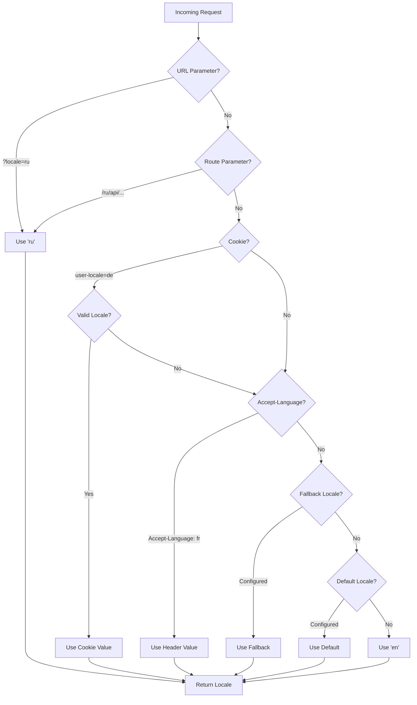

# 🌍 Serverbaserade översättningar och lokalinformation i Nuxt I18n Micro

## 📖 Översikt

Nuxt I18n Micro stöder serverbaserade översättningar och lokalinformation, vilket låter dig översätta innehåll och komma åt lokaldetaljer på servern. Detta är särskilt användbart för API:er eller server-renderade applikationer där lokalisering behövs innan innehållet når klienten.

Översättningarna använder lokalmeddelanden som definieras i Nuxt I18n-konfigurationen och resolvas dynamiskt baserat på den upptäckta lokalen.

Som standard (`translationPayloads.mode: 'premerged'`) bakas rotnivåfiler in i varje sids payload vid byggtid som `\{page\}/\{locale\}/data.json`. Servern laddar samma förbyggda filer som klienten hämtar under `/\{apiBaseUrl\}/...`, så alla nycklar (både delade och sidspecifika) är tillgängliga i serverhanterare.

Med `translationPayloads.mode: 'source'` slås kompakta källfiler samman vid runtime när `loadTranslationsFromServer()` (eller rutten `/_locales`) anropas — på **Edge** via Nitro `serverAssets`, på **Node** från den valfria publika kopian. Se [Prestandaguide — Serverlös payload-utdata](/guides/performance#serverless-payload-output) och [Arkitektur för cache och lagring](/api/cache) för detaljer.

För en konsoliderad lista över runtime- och server-API:er, se [API-referens](/api/overview).

## 🛠️ Sätta upp server-middleware

För att aktivera serverbaserade översättningar och lokalinformation, använd de tillhandahållna middleware-funktionerna:

- `useTranslationServerMiddleware` - för att översätta innehåll
- `useLocaleServerMiddleware` - för att komma åt lokalinformation

Båda middleware-funktionerna är automatiskt tillgängliga i alla serverrutter.

Logiken för lokaldetektering delas mellan båda middleware-funktionerna via verktygsfunktionen `detectCurrentLocale` för att säkerställa konsistens över modulen.

## ✨ Använda översättningar i serverhanterare

Du kan sömlöst översätta innehåll i valfri `eventHandler` med hjälp av översättnings-middlewaren.

### Exempel: Grundläggande användning av översättning

```typescript
import { defineEventHandler } from 'h3'

export default defineEventHandler(async (event) => {
  const t = await useTranslationServerMiddleware(event)
  return {
    message: t('greeting'), // Returns the translated value for the key "greeting"
  }
})
```

I detta exempel:

- Användarens lokal upptäcks automatiskt från query-parametrar, cookies eller headers.
- Funktionen `t` hämtar rätt översättning för den upptäckta lokalen.

## 🌍 Använda lokalinformation i serverhanterare

### Grundläggande användning av lokalinformation

```typescript
import { defineEventHandler } from 'h3'

export default defineEventHandler((event) => {
  const localeInfo = useLocaleServerMiddleware(event)

  return {
    success: true,
    data: localeInfo,
    timestamp: new Date().toISOString(),
  }
})
```

### Tillhandahålla anpassade lokalparametrar

```typescript
import { defineEventHandler } from 'h3'

export default defineEventHandler((event) => {
  // Force specific locale with custom default
  const localeInfo = useLocaleServerMiddleware(event, 'en', 'ru')

  return {
    success: true,
    data: localeInfo,
    timestamp: new Date().toISOString(),
  }
})
```

### Svarsstruktur

Lokal-middlewaren returnerar ett `LocaleInfo`-objekt med följande egenskaper:

```typescript
interface LocaleInfo {
  current: string // Current detected locale code
  default: string // Default locale code
  fallback: string // Fallback locale code
  available: string[] // Array of all available locale codes
  locale: Locale | null // Full locale configuration object
  isDefault: boolean // Whether current locale is the default
  isFallback: boolean // Whether current locale is the fallback
}
```

### Exempel på svar

```json
{
  "success": true,
  "data": {
    "current": "ru",
    "default": "en",
    "fallback": "en",
    "available": ["en", "ru", "de"],
    "locale": {
      "code": "ru",
      "iso": "ru-RU",
      "dir": "ltr",
      "displayName": "Русский"
    },
    "isDefault": false,
    "isFallback": false
  },
  "timestamp": "2024-01-15T10:30:00.000Z"
}
```

## 🌐 Tillhandahålla en anpassad lokal

Om du behöver ange en lokal manuellt (till exempel för testning eller vissa förfrågningar) kan du skicka den till översättnings-middlewaren:

### Exempel: Anpassad lokal

```typescript
import { defineEventHandler } from 'h3'

function detectLocale(event): string | null {
  const urlSearchParams = new URLSearchParams(event.node.req.url?.split('?')[1])
  const localeFromQuery = urlSearchParams.get('locale')
  if (localeFromQuery) return localeFromQuery

  return 'en'
}

export default defineEventHandler(async (event) => {
  const t = await useTranslationServerMiddleware(event, 'en', detectLocale(event)) // Force French local, en - default locale
  return {
    message: t('welcome'), // Returns the French translation for "welcome"
  }
})
```

## 📋 Logik för lokaldetektering

Båda middleware-funktionerna bestämmer automatiskt användarens lokal med hjälp av följande prioritetsordning:



1. **URL-parametrar**: `?locale=ru`
2. **Ruttparametrar**: `/ru/api/endpoint`
3. **Cookies**: cookien `user-locale`
4. **HTTP-headers**: headern `Accept-Language`
5. **Fallback-lokal**: enligt konfiguration i modulalternativen
6. **Standardlokal**: enligt konfiguration i modulalternativen
7. **Hårdkodad fallback**: `'en'`

> **Anmärkning**: Logiken för lokaldetektering delas mellan `useLocaleServerMiddleware` och `useTranslationServerMiddleware` för att säkerställa konsistens över modulen.

## 📋 Avancerade användningsexempel

### Villkorligt svar baserat på lokal

```typescript
import { defineEventHandler } from 'h3'

export default defineEventHandler((event) => {
  const { current, isDefault, locale } = useLocaleServerMiddleware(event)

  // Return different content based on locale
  if (current === 'ru') {
    return {
      message: 'Привет, мир!',
      locale: current,
      isDefault,
    }
  }

  if (current === 'de') {
    return {
      message: 'Hallo, Welt!',
      locale: current,
      isDefault,
    }
  }

  // Default English response
  return {
    message: 'Hello, World!',
    locale: current,
    isDefault,
  }
})
```

### Anpassad lokaldetektering

```typescript
import { defineEventHandler } from 'h3'

export default defineEventHandler((event) => {
  // Force German locale with English as fallback
  const { current, isDefault, locale } = useLocaleServerMiddleware(event, 'en', 'de')

  return {
    message: 'Hallo, Welt!',
    locale: current,
    isDefault: false, // Will be false since we forced German
  }
})
```

### Lokalmedvetet API med validering

```typescript
import { defineEventHandler, createError } from 'h3'

export default defineEventHandler((event) => {
  const { current, available, locale } = useLocaleServerMiddleware(event)

  // Validate if the detected locale is supported
  if (!available.includes(current)) {
    throw createError({
      statusCode: 400,
      statusMessage: `Unsupported locale: ${current}. Available locales: ${available.join(', ')}`,
    })
  }

  // Return locale-specific configuration
  return {
    locale: current,
    direction: locale?.dir || 'ltr',
    displayName: locale?.displayName || current,
    availableLocales: available,
  }
})
```

### Integration med översättnings-middleware

Du kan kombinera lokalinformation med översättnings-middleware för omfattande internationalisering:

```typescript
import { defineEventHandler } from 'h3'

export default defineEventHandler(async (event) => {
  const localeInfo = useLocaleServerMiddleware(event)
  const t = await useTranslationServerMiddleware(event)

  return {
    locale: localeInfo.current,
    message: t('welcome_message'),
    availableLocales: localeInfo.available,
    isDefault: localeInfo.isDefault,
  }
})
```

## 📝 Bästa praxis

1. **Validera alltid lokaler**: Kontrollera om den upptäckta lokalen finns i din lista över tillgängliga lokaler
2. **Använd fallback-logik**: Tillhandahåll rimliga standardvärden när lokaldetektering misslyckas
3. **Cacha lokalinformation**: För prestandakritiska applikationer, överväg att cacha resultat från lokaldetektering
4. **Hantera kantfall**: Ta hänsyn till lokaler som inte stöds och tillhandahåll lämpliga felsvar
5. **Kombinera med översättningar**: Använd lokalinformation tillsammans med översättnings-middleware för fullständigt i18n-stöd

## 🚀 Prestandaöverväganden

- Båda middleware-funktionerna är lättviktiga och utformade för snabb exekvering
- Lokaldetektering använder effektiva fallback-kedjor
- Inga externa API-anrop görs under lokaldetektering
- Resultat beräknas synkront för optimal prestanda
