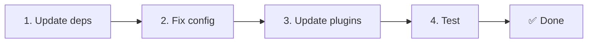

# 📦 Uppgradera från v2.x till v3.x

<Tip>
Se [Migrering från nuxt-i18n](/migration/from-nuxtjs-i18n) — den guiden täcker byte från vue-i18n-ekosystemet, inte från nuxt-i18n-micro v2.
</Tip>

v3.0.0 introducerar fundamentala arkitektoniska ändringar: strategipaket, ett nytt cache-system, centraliserad lokalhantering via `useI18nLocale()` och en omdesignad omdirigeringspipeline. Detta avsnitt täcker alla brytande ändringar och hur du uppdaterar din kod.

## Migreringssteg



## Sammanfattning av brytande ändringar

- **Lokal-state** — `useState` / `useCookie` manuellt → composablen `useI18nLocale()`
- **Konfigurationsåtkomst** — `useRuntimeConfig().public.i18nConfig` → `getI18nConfig()` från `#build/i18n.strategy.mjs`
- **Omdirigeringskomponent** — alternativet `fallbackRedirectComponentPath` → server-omdirigeringsplugin + klient-route-middleware (automatiskt)
- **`includeDefaultLocaleRoute`** — stödd (utfasad) → borttagen, använd alternativet `strategy`
- **`experimental.hmr`** — under `experimental` → alternativ på översta nivån
- **`previousPageFallback`** — helt borttagen (kumulativ sammanslagningsstrategi hanterar detta automatiskt)
- **Caching** — `useStorage('cache')` → `TranslationStorage`-singleton (`Symbol.for` på `globalThis`)
- **SSR-överföring** — Runtime-konfig → Nuxt payload (v3 använde `useState`; chunks ligger nu i `payload.data`, se [Prestanda](/guides/performance#server-side-payload-transfer))
- **Strategiklasser** — Interna → Separata paket (`@i18n-micro/route-strategy`, `@i18n-micro/path-strategy`)

## Borttaget: `fallbackRedirectComponentPath`

Alternativet `fallbackRedirectComponentPath` och fallback-komponenten `locale-redirect.vue` har tagits bort. Omdirigeringslogik hanteras nu av:

1. **Server-middleware** (`i18n.global.ts`) — sätter `event.context.i18n.locale`
2. **Server-omdirigeringsplugin** (`06.redirect.ts`, endast server) — 302-omdirigeringar före rendering
3. **Klient-route-middleware** (`i18n-redirect.global.ts`) — SPA-omdirigeringar efter hydration

```diff
 i18n: {
   strategy: 'prefix_except_default',
-  fallbackRedirectComponentPath: '~/components/MyRedirect.vue',
 }
```

Om du hade anpassad omdirigeringslogik i fallback-komponenten, implementera den i ett server-plugin i stället:

```ts
// plugins/i18n-loader.server.ts
export default defineNuxtPlugin({
  name: 'i18n-custom-redirect',
  enforce: 'pre',
  order: -10,
  setup() {
    const { setLocale } = useI18nLocale()
    // Your custom detection logic
    setLocale(detectedLocale)
  },
})
```

## Borttaget: `includeDefaultLocaleRoute`

Använd alternativet `strategy` i stället:

- `includeDefaultLocaleRoute: true` → `strategy: 'prefix'`
- `includeDefaultLocaleRoute: false` → `strategy: 'prefix_except_default'` (standard)

```diff
 i18n: {
-  includeDefaultLocaleRoute: true,
+  strategy: 'prefix',
 }
```

## Konfigurationsåtkomst: `getI18nConfig()` ersätter `useRuntimeConfig`

```diff
- const config = useRuntimeConfig()
- const cookieName = config.public.i18nConfig?.localeCookie || 'user-locale'
+ import { getI18nConfig } from '#build/i18n.strategy.mjs'
+ const { localeCookie: configCookie } = getI18nConfig()
+ const cookieName = configCookie ?? 'user-locale'
```

## Lokalhantering: `useI18nLocale()` ersätter manuellt state

I v2 kan du ha använt `useState('i18n-locale')` eller `useCookie('user-locale')` direkt. I v3, använd den centraliserade composablen `useI18nLocale()`:

```diff
- const locale = useState('i18n-locale')
- const cookie = useCookie('user-locale')
- locale.value = 'fr'
- cookie.value = 'fr'
+ const { setLocale } = useI18nLocale()
+ setLocale('fr') // Updates both state and cookie atomically
```

Se [Anpassad språkdetektering](/guides/custom-language-detection) för detaljerade exempel.

## Experimentella alternativ flyttade/borttagna

`hmr` har flyttats från `experimental` till översta nivån. `previousPageFallback` har tagits bort helt — modulen använder nu en kumulativ djup sammanslagningsstrategi (2 nivåers djup) som automatiskt bevarar översättningar från den föregående sidan under övergångsanimeringar, även när sidor delar överlappande nästlade nycklar. Efter att övergångsanimationen slutförts rensar hooken `page:transition:finish` bort gamla sidnycklar från minnet.

```diff
 i18n: {
-  experimental: {
-    hmr: true,
-    previousPageFallback: true
-  }
+  hmr: true,
+  // previousPageFallback removed — handled automatically
 }
```

## Omdirigeringsarkitektur (v3)

Omdirigeringar hanteras nu automatiskt av två komponenter:

1. **Serverbaserad** (`06.redirect.ts`, endast server): Körs under SSR, utfärdar 302-omdirigeringar innan någon sidrendering — ingen "felflash"
2. **Klientbaserad** (`i18n-redirect.global.ts`): Global route-middleware vid SPA-navigering; bevarar query-sträng och hash

Lokalprioritet för omdirigeringar:

1. `useState('i18n-locale')` — satt via `useI18nLocale().setLocale()`
2. Cookie — om `localeCookie` är konfigurerad
3. `Accept-Language`-header — om `autoDetectLanguage: true`
4. `defaultLocale` — fallback

Inga kodändringar krävs för standarduppsättningar.

<Warning>
För strategierna `prefix` och `prefix_except_default` med `redirects: true`, sätt `localeCookie: 'user-locale'` för att aktivera lokal-persistens mellan sidomladdningar. Utan den använder omdirigeringar endast `Accept-Language` eller `defaultLocale`.
</Warning>

## TypeScript: Interna modul-typer (valfritt)

Om du stöter på typfel relaterade till interna importer som `#i18n-internal/plural`, `#i18n-internal/strategy` eller `#i18n-internal/config`, lägg till sektionen `imports` i projektets `package.json`:

```json
{
  "imports": {
    "#i18n-internal/plural": "nuxt-i18n-micro/internals",
    "#i18n-internal/strategy": "nuxt-i18n-micro/internals",
    "#i18n-internal/config": "nuxt-i18n-micro/internals"
  }
}
```
