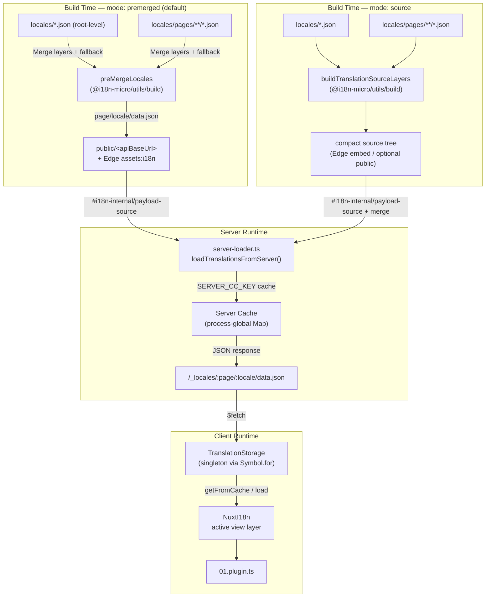

# 🗄️ Çeviri önbelleği ve depolama mimarisi

## 📖 Genel bakış

Nuxt I18n Micro v3, çeviriler için çok katmanlı bir önbellek mimarisi kullanır. Yük yükleme `translationPayloads.mode` değerine bağlıdır:

- **`premerged`** (varsayılan): kök, sayfa, geri dönüş ve katman dosyaları derleme zamanında `@i18n-micro/utils/build` aracılığıyla `\{page\}/\{locale\}/data.json` biçiminde birleştirilir.
- **`source`**: kompakt kaynak dosyaları çalışma zamanında birleştirilmek üzere `@i18n-micro/utils/source-loader` ve `@i18n-micro/utils/merge-source` ile korunur (Edge, bunları Nitro `serverAssets` içine gömer; Node kopyalandığında `public/` üzerinden okur).

Bu sayfa, yerleşik önbelleğin nasıl çalıştığını ve özel kullanım senaryoları (yönetim araçları, harici API'ler, önbellek geçersizleştirme) için nasıl genişletileceğini anlatır.

## 📊 Mimariye genel bakış

### Veri akışı



## 🧱 Temel bileşenler

### 1. `TranslationStorage` (istemci + sunucu)

**Dosya**: `src/runtime/utils/storage.ts`

Hem istemci hem de sunucu için birleşik çeviri depolaması sağlayan tekil (singleton) sınıf. Birden çok paket yüklense bile yalnızca tek bir örneğin bulunmasını sağlamak için `globalThis` üzerinde `Symbol.for('__NUXT_I18N_STORAGE_CACHE__')` kullanır.

**Ana metotlar:**

| Metot                               | Açıklama                                                              |
| ----------------------------------- | ---------------------------------------------------------------------- |
| `getFromCache(locale, routeName?)`  | Eşzamanlı kontrol: önbellekteki bellek içi veriyi veya `null` döner    |
| `load(locale, routeName?, options)` | Önbellekli asenkron yükleme: önce önbelleği kontrol eder, sonra `$fetch` ile getirir |
| `clear()`                           | Tüm önbelleği temizler                                                 |

**Önbellek anahtarı biçimi**: `\{locale\}:\{routeName\}` (örn. `en:index`, `fr:about`)

```typescript
import { translationStorage } from '../utils/storage'

// Synchronous cache check
const cached = translationStorage.getFromCache('en', 'index')

// Async load (with automatic caching)
const result = await translationStorage.load('en', 'index', {
  apiBaseUrl: '_locales',
  baseURL: '/',
  dateBuild: '2024-01-01',
})
// result.data — merged translations
// result.cacheKey — cache key used
```

### ⚙️ Deterministik önbellek geçersizleştirme (`i18n.dateBuild`)

Modül varsayılan olarak derleme sırasında `Date.now()` kullanarak `dateBuild` üretir. Bu değer, oluşturulan `#build/i18n.strategy.mjs` içine gömülür ve yeniden derlemeden sonra çeviri getirme önbelleklerini geçersizleştirmek için sorgu parametresi (`?v=...`) olarak kullanılır.

Yeniden üretilebilir derlemelere ihtiyacın varsa (örneğin, sürekli dağıtımlarda parça önbelleği isabet oranını artırmak için) `nuxt.config` içinde sabit bir değer ayarla:

```ts
export default defineNuxtConfig({
  i18n: {
    // Any stable string/number (git SHA, CI build number, release tag, etc.)
    dateBuild: process.env.GIT_SHA ?? 'local-dev',
  },
})
```

### 2. `loadTranslationsFromServer()` (yalnızca sunucu)

**Dosya**: `src/runtime/server/utils/server-loader.ts`

Bir yerel ayar/sayfa için çevirileri yükler ve birleştirilmiş sonucu, `@i18n-micro/hmr/cache-keys` ile anahtarlanmış (`SERVER_CC_KEY`) süreç genelinde bir `CacheControl` haritasında önbelleğe alır.

Davranış: SSR, `#i18n-internal/payload-source` üzerinden yükler. **Node**, `public/<apiBaseUrl>` altındaki `readFile` (premerged modunda `\{page\}/\{locale\}/data.json`) ile; **Edge**, `assets:i18n` ile çalışır. `premerged` tek bir dosya okur; `source`, `@i18n-micro/utils/source-loader` aracılığıyla kök/sayfa/geri dönüş dosyalarını birleştirir.

```typescript
import { loadTranslationsFromServer } from '../server/utils/server-loader'

// Returns { data: Translations, json: string }
const { data, json } = await loadTranslationsFromServer('en', 'index')
```

### 3. İstemci yüklemesi (HTML gömme yok)

Sözlükler `nuxtApp.payload` içine **yazılmaz**. Sunucu, SSR oluşturması için bunları bellekte tutar; istemci eklentisi, `/\{apiBaseUrl\}/:page/:locale/data.json` yüklemesini yapan `switchContext` çağrısını `await` eder (bu, `@nuxtjs/i18n`'nin `experimental.preload: false` ile aynı varsayılan yaklaşımıdır).

`NuxtI18n`, `$t()` ve `$has()` tarafından kullanılan aktif görünüm katmanı sözlüğünü tutar. `NuxtTranslationLoader`, yerel ayar/rota bağlamını değiştirir ve parçaları bu katmana birleştirir.

### 4. Sunucu API rotası

**Rota**: `/_locales/\{page\}/\{locale\}/data.json`

**Dosya**: `src/runtime/server/routes/i18n.ts`

Bu Nitro rotası, aktif yük modu için birleştirilmiş çevirileri sunar. `loadTranslationsFromServer()` çağırır ve sonucu JSON olarak döner.

Üretim ortamında ayrıca şunu ayarlar:

```http
Cache-Control: public, max-age={httpCacheDuration}, immutable
```

Varsayılan `httpCacheDuration`, `31536000` (1 yıl) değeridir. İstemciler yükleri `?v=\{dateBuild\}` önbellek geçersizleştirmesiyle istediği için bu güvenlidir. Başlığı atlamak için `httpCacheDuration: 0` olarak ayarla. Başlık, geliştirme ortamında uygulanmaz.

## 📥 Genişletme: Özel çeviri yükleme

### Önbellekten okuma (sunucu rotası)

```ts
// server/api/i18n/load-cache.[post].ts
import { defineEventHandler, readBody } from 'h3'
import { loadTranslationsFromServer } from '#imports'

export default defineEventHandler(async (event) => {
  const { page, locale } = await readBody<{ page: string; locale: string }>(event)
  const { data } = await loadTranslationsFromServer(locale, page)
  return { locale, page, data }
})
```

### Çevirileri güncelleme (dosya + önbellek geçersizleştirme)

```ts
// server/api/i18n/update.[post].ts
import { defineEventHandler, readBody, createError } from 'h3'
import { join } from 'node:path'
import { readFile, writeFile } from 'node:fs/promises'
import { deepMergeTranslations } from '@i18n-micro/utils/deep-merge'

export default defineEventHandler(async (event) => {
  const { path, updates } = await readBody<{ path: string; updates: Record<string, unknown> }>(event)

  if (!path || !updates) {
    throw createError({ statusCode: 400, statusMessage: 'Missing path or updates' })
  }

  const fullPath = join('locales', path)
  let existing: Record<string, unknown> = {}

  try {
    const content = await readFile(fullPath, 'utf-8')
    existing = JSON.parse(content) as Record<string, unknown>
  } catch {
    // File does not exist — create new
  }

  const merged = deepMergeTranslations(existing, updates)
  await writeFile(fullPath, JSON.stringify(merged, null, 2), 'utf-8')

  return { success: true, path, updated: merged }
})
```


## 🧹 Önbelleği temizleme

### Programatik önbellek temizleme (istemci)

Yerleşik `$clearCache` metodunu kullan:

```vue
<script setup>
const { $clearCache } = useNuxtApp()

// Clears both TranslationStorage and plugin-level cache
$clearCache()
</script>
```

### Sunucu önbellek davranışı

Sunucu tarafı önbellek (`loadTranslationsFromServer`) süreç geneldir ve şu durumlara kadar korunur:

- Sunucu süreci yeniden başlatılana
- Yeni bir dağıtım algılanana (farklı `dateBuild` değeri)

Sunucusuz ortamlarda her soğuk başlangıç yeni bir önbellekle başlar.

## ⚙️ Sunucusuz yapılandırma

Sunucusuz ortamlar için (Cloudflare Workers, AWS Lambda), yerleşik önbellek bellek içi `Map` nesnelerini kullanır. Çeviri önbelleğinin kendisi için harici depolama yapılandırması gerekmez.

Ancak, kaynak çeviri dosyaları için Nitro depolama yapılandırılmayı gerektirebilir:

```ts
export default defineNuxtConfig({
  nitro: {
    storage: {
      // Only needed if default file-system storage is unavailable
      'assets:server': {
        driver: 'cloudflare-kv-binding',
        binding: 'MY_KV_NAMESPACE',
      },
    },
  },
})
```

## 💡 v2'den temel farklar

| Konu             | v2                            | v3                                                                       |
| ---------------- | ----------------------------- | ------------------------------------------------------------------------ |
| İstemci önbelleği | `useStorage('cache')`         | `TranslationStorage` tekil (globalThis üzerinde Symbol.for)              |
| SSR aktarımı     | Çalışma zamanı yapılandırması | `payload.data` üzerinden tam parçalar (v3.0 `useState` kullanıyordu)     |
| Sunucu önbelleği | Nitro cache depolama          | `Symbol.for` üzerinden süreç geneli `Map`                                |
| Birleştirme mantığı | İstemci tarafı              | Derleme zamanı (`premerged`) veya çalışma zamanı (`source`), `@i18n-micro/utils/*` ile |
| Önbellek anahtarı biçimi | `i18n:merged:\{page\}:\{locale\}` | `\{locale\}:\{routeName\}`                                       |

## 📚 İlgili konular

- [Performans kılavuzu](/guides/performance): Önbelleklemenin performansa etkisi
- [Sunucu tarafı çeviriler](/guides/server-side-translations): Sunucu rotalarında çeviri kullanımı
- [Firebase dağıtımı](/guides/firebase): Dağıtıma özel önbellek konuları
