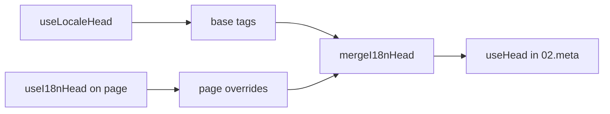

# `useI18nHead` composable'ı

`useI18nHead`, i18n SEO etiketlerini özel bir meta eklentisi olmadan **sayfa başına** özelleştirmene olanak tanır. `meta: true` olduğunda, modül girdini [`useLocaleHead`](/api/composables/use-locale-head) çıktısının üzerine birleştirir.

Tipik durumlar:

- **CMS / blog makaleleri**: yalnızca bazı yerel ayarlar çevrilmiştir; alternatif URL'ler dile göre farklıdır (farklı slug veya yollar).
- **Dinamik canonical**: canonical URL, `$switchLocalePath` yerine API'deki makale URL'siyle eşleşmelidir.
- **Ek Open Graph**: otomatik oluşturulan `og:locale` / `og:url` yanında `og:title`, `og:description`, `og:image`.
- **Kısmi kontrol**: modül tarafından oluşturulan canonical ve `og:url`'yi koru; yalnızca `hreflang` ve `og:locale:alternate`'i değiştir.

---

## İmza

{/* generated:symbol:useI18nHead — do not edit; run `pnpm run docs:generate` */}

```ts
useI18nHead(input?: MaybeRefOrGetter<I18nHeadInput | null>): { pageHead: any; resetPageHead: () => void }
```

i18n SEO head etiketleri için sayfa düzeyi geçersiz kılmaları kaydet. `useLocaleHead` çıktısının üzerine `02.meta` eklentisi tarafından birleştirilir.

| Parametre | Tür | Açıklama |
| --- | --- | --- |
| `input` *(opsiyonel)* | `MaybeRefOrGetter<I18nHeadInput \| null>` |  |

{/* /generated:symbol:useI18nHead */}

## Boru hattına nasıl uyar



`useI18nHead`'i bir sayfa bileşeninde çağırırsın. `02.meta` eklentisi, geçersiz kılmaları her `updateMeta()` sonrasında (rota değişimi, `$setI18nRouteParams`, istemcide `page:finish`) uygular.

---

## Örnek 1: Yalnızca bazı yerel ayarlarda çeviri olan makale

Yaygın bir desen: API, hangi yerel ayarların var olduğunu ve mutlak veya göreli URL'lerini döner.

```ts
interface Article {
  title: string
  slug: string
  /** Locale code → page URL (absolute or site-relative) */
  locales: Record<string, string>
}
```

```vue
<script setup lang="ts">
const route = useRoute()
const { data: article } = await useFetch<Article>(`/api/articles/${route.params.slug}`)

const localeCodes = computed(() => Object.keys(article.value?.locales ?? {}))

useI18nHead(() => {
  if (!article.value) return null

  return {
    meta: [
      { property: 'og:title', content: article.value.title },
      { property: 'og:type', content: 'article' },
    ],
    replace: {
      hreflang: localeCodes.value.map((locale) => ({
        rel: 'alternate',
        hreflang: locale,
        href: article.value!.locales[locale]!,
      })),
      ogAlternates: localeCodes.value,
    },
  }
})
</script>
```

`ogAlternates`, `i18n.locales` yapılandırmandan **yerel ayar kodlarını** alır. `og:locale:alternate` değerleri `locale.og` veya `iso` üzerinden çözümlenir (Open Graph `en_US` biçimi).

---

## Örnek 2: Yerel ayar başına slug'lar (`$defineI18nRoute` + `$setI18nRouteParams`)

URL'ler yerelleştirilmiş rota şablonlarından ve dinamik parametrelerden oluşturulduğunda:

```vue
<script setup lang="ts">
const { $defineI18nRoute, $setI18nRouteParams } = useNuxtApp()
const route = useRoute()

const { data: article } = await useFetch(`/api/articles/${route.params.slug}`)

$defineI18nRoute({
  localeRoutes: {
    en: '/blog/[slug]',
    de: '/de/blog/[slug]',
    fr: '/fr/blog/[slug]',
  },
})

if (article.value) {
  $setI18nRouteParams({
    en: { slug: article.value.slugEn },
    de: { slug: article.value.slugDe },
    fr: { slug: article.value.slugFr },
  })

  const availableLocales = article.value.availableLocales as string[]

  useI18nHead({
    meta: [{ property: 'og:title', content: article.value.title }],
    replace: {
      hreflang: availableLocales.map((locale) => ({
        rel: 'alternate',
        hreflang: locale,
        href: article.value!.urls[locale],
      })),
      ogAlternates: availableLocales,
    },
  })
}
</script>
```

Modül tarafından oluşturulan alternatifler **tüm** yapılandırılmış yerel ayarları listeler. `replace.hreflang` etiketleri gerçekten çevirisi olan yerel ayarlarla sınırlar.

---

## Örnek 3: Varsayılan yerel ayar makale URL'si için özel `x-default`

Varsayılan olarak `x-default`, `$switchLocalePath`'ten varsayılan yerel ayar URL'sini işaret eder. Makaleler için varsayılan çeviri URL'sine yönlendir:

```vue
<script setup lang="ts">
const { $defaultLocale } = useNuxtApp()
const article = await loadArticle()

const defaultLocale = $defaultLocale() ?? 'en'
const defaultHref = article.locales[defaultLocale]

useI18nHead({
  replace: {
    hreflang: Object.entries(article.locales).map(([locale, href]) => ({
      rel: 'alternate',
      hreflang: locale,
      href,
    })),
    xDefault: defaultHref ? { rel: 'alternate', hreflang: 'x-default', href: defaultHref } : false,
    ogAlternates: Object.keys(article.locales),
  },
})
</script>
```

---

## Örnek 4: API verilerinden canonical ve `og:url` değiştirme

Canonical'ın CMS tarafından sağlanan bir URL ile eşleşmesi gerektiğinde (çoklu alan adı, özel yol veya önceden oluşturulmuş mutlak URL):

```vue
<script setup lang="ts">
const article = await loadArticle()
const canonical = article.canonicalUrl // e.g. https://www.example.com/en/blog/my-post

useI18nHead({
  replace: {
    canonical,
    ogUrl: canonical,
    hreflang: buildAlternateLinks(article),
    ogAlternates: Object.keys(article.locales),
  },
  meta: [
    { property: 'og:title', content: article.title },
    { name: 'description', content: article.excerpt },
  ],
})
</script>
```

---

## Örnek 5: Otomatik canonical / `og:url`'yi koru, yalnızca alternatifleri değiştir

`$switchLocalePath` + `$setI18nRouteParams` zaten doğru canonical ve `og:url` üretiyorsa, yalnızca keşif etiketlerini değiştir:

```vue
<script setup lang="ts">
const article = await loadArticle()

useI18nHead({
  replace: {
    hreflang: buildAlternateLinks(article),
    ogAlternates: Object.keys(article.locales),
  },
})
</script>
```

---

## Örnek 6: Bir içerik detay sayfası için eksiksiz head (meta + bağlantılar)

"Sayfa meta" ve "alternatif bağlantıları" ayrı yardımcılara ayırma desenine benzer, tek çağrıda birleştirilmiş:

```vue
<script setup lang="ts">
const article = await loadArticle()
const alternates = Object.entries(article.locales).map(([locale, href]) => ({
  rel: 'alternate' as const,
  hreflang: locale,
  href: normalizeSeoUrl(href), // strip ?query and #hash if needed
}))

useI18nHead({
  meta: [
    { property: 'og:title', content: article.title },
    { property: 'og:description', content: article.description },
    { property: 'og:image', content: article.imageUrl },
    { name: 'twitter:card', content: 'summary_large_image' },
    { name: 'twitter:title', content: article.title },
  ],
  replace: {
    canonical: article.canonicalUrl,
    ogUrl: article.canonicalUrl,
    hreflang: alternates,
    ogAlternates: Object.keys(article.locales),
  },
})
</script>
```

```ts
/** Remove query and hash — useful when CMS URLs must be clean for SEO */
function normalizeSeoUrl(href: string): string {
  try {
    const url = new URL(href, 'https://placeholder.local')
    url.search = ''
    url.hash = ''
    return href.startsWith('http') ? url.href : `${url.pathname}`
  } catch {
    return href.split(/[?#]/)[0] ?? href
  }
}
```

---

## Örnek 7: İki içerik türü, aynı desen (haberler vs kılavuzlar)

Aynı API şekli, farklı rota adları. Küçük bir yardımcıyı yeniden kullan:

```ts
// composables/useArticleHead.ts
import type { I18nHeadInput } from '@i18n-micro/types'

interface LocalizedContent {
  title: string
  locales: Record<string, string>
  canonicalUrl?: string
}

export function buildArticleHead(content: LocalizedContent): I18nHeadInput {
  const localeCodes = Object.keys(content.locales)
  const canonical = content.canonicalUrl ?? content.locales.en

  return {
    meta: [{ property: 'og:title', content: content.title }],
    replace: {
      canonical,
      ogUrl: canonical,
      hreflang: localeCodes.map((locale) => ({
        rel: 'alternate',
        hreflang: locale,
        href: content.locales[locale]!,
      })),
      ogAlternates: localeCodes,
    },
  }
}
```

```vue
<!-- pages/blog/[slug].vue -->
<script setup lang="ts">
const article = await loadArticle()
useI18nHead(buildArticleHead(article))
</script>
```

```vue
<!-- pages/guides/[slug].vue -->
<script setup lang="ts">
const guide = await loadGuide()
useI18nHead(buildArticleHead(guide))
</script>
```

---

## Örnek 8: Yerleşik alternatifleri devre dışı bırak, kendi listeni sağla

Modülün hreflang üreticisini devre dışı bırakıp özel bir liste geçirmenin eşdeğeri (çoğaltılmış alternatif kümesi yok):

```vue
<script setup lang="ts">
const article = await loadArticle()

useI18nHead({
  disable: ['hreflang', 'x-default', 'og-alternates'],
  link: Object.entries(article.locales).map(([locale, href]) => ({
    rel: 'alternate',
    hreflang: locale,
    href,
  })),
  replace: {
    ogAlternates: Object.keys(article.locales),
  },
})
</script>
```

Veya `disable` olmadan `replace.hreflang`'i tercih et. Tek adımda tüm `rel="alternate"` bağlantılarını değiştirir.

---

## Örnek 9: Açılış sayfası — yalnızca ek OG, tüm i18n etiketlerini koru

```vue
<script setup lang="ts">
const { t } = useI18n()

useI18nHead({
  meta: [
    { property: 'og:title', content: t('landing.ogTitle') },
    { property: 'og:description', content: t('landing.ogDescription') },
  ],
})
</script>
```

---

## Örnek 10: Ürün sayfası — tek yerel ayar deneyi için hreflang'ı devre dışı bırak

```vue
<script setup lang="ts">
useI18nHead({
  disable: ['hreflang', 'x-default'],
  // canonical, og:locale, og:url still generated
})
</script>
```

---

## Örnek 11: İstemci tarafı fetch sonrası reaktif güncellemeler

```vue
<script setup lang="ts">
const article = ref<Article | null>(null)

onMounted(async () => {
  article.value = await $fetch('/api/articles/latest')
})

useI18nHead(() => {
  if (!article.value) return null
  return {
    meta: [{ property: 'og:title', content: article.value.title }],
    replace: {
      hreflang: Object.entries(article.value.locales).map(([locale, href]) => ({
        rel: 'alternate',
        hreflang: locale,
        href,
      })),
    },
  }
})
</script>
```

Head, `page:finish`'te ve `pageHead` state'i değiştiğinde yenilenir.

---

## Örnek 12: Ters proxy arkasındaki HTTPS kaynağı

Daha önce canonical / alternatif mutlak URL'ler için "public origin" composable'ı çözdüysen, bunun yerine modül yapılandırmasını kullan:

```ts
// nuxt.config.ts
export default defineNuxtConfig({
  i18n: {
    meta: true,
    // undefined = origin from current request (multi-domain friendly)
    metaBaseUrl: undefined,
    metaTrustForwardedHost: true,
    metaTrustForwardedProto: true,
  },
})
```

Ardından `replace.hreflang` / `replace.canonical` içinde **yolları veya tam URL'leri** geç. Modül SSR'de `useRequestURL`'yi `X-Forwarded-Host` / `X-Forwarded-Proto` ile kullanır.

---

## API referansı

### `meta`

Ek `<meta>` etiketleri. `id`, `property` veya `name`'e göre yinelemeler kaldırılır.

### `link`

Ek `<link>` etiketleri. `id` veya `rel` + `hreflang`'a göre yinelemeler kaldırılır.

### `htmlAttrs`

`useLocaleHead`'in `<html>` niteliklerine (`lang`, `dir`) birleştirilir.

### `replace`

| Anahtar        | Tür                       | Etki                                             |
| -------------- | ------------------------- | ------------------------------------------------ |
| `canonical`    | `string \| false`         | Canonical bağlantıyı değiştir veya kaldır        |
| `hreflang`     | `I18nHeadLink[] \| false` | Tüm `rel="alternate"` bağlantılarını değiştir veya kaldır |
| `xDefault`     | `I18nHeadLink \| false`   | `hreflang="x-default"`'u değiştir veya kaldır    |
| `ogLocale`     | `string \| false`         | `og:locale`'yi değiştir veya kaldır              |
| `ogUrl`        | `string \| false`         | `og:url`'yi değiştir veya kaldır                 |
| `ogAlternates` | `string[] \| false`       | Yerel ayar kodları için `og:locale:alternate`'i yeniden oluştur |

### `disable`

| Değer           | Kaldırır                                 |
| --------------- | ---------------------------------------- |
| `hreflang`      | Yerel ayar alternatif bağlantıları (`x-default` hariç) |
| `x-default`     | `hreflang="x-default"` bağlantısı        |
| `canonical`     | Canonical bağlantı                       |
| `og`            | `og:locale` ve `og:url`                  |
| `og-alternates` | `og:locale:alternate` etiketleri         |
| `html`          | `<html>` üzerindeki `lang` / `dir`       |

---

## `useLocaleHead` ile `useI18nHead` karşılaştırması

| Composable      | Kapsam               | Ne zaman kullanılır                              |
| --------------- | -------------------- | ------------------------------------------------ |
| `useLocaleHead` | Global / manuel head | `meta: false`, tam özel `useHead` kurulumu       |
| `useI18nHead`   | Sayfa başına geçersiz kılmalar | `meta: true`, belirli sayfaları özelleştirme |

`meta: true` olduğunda yalnızca `useI18nHead` kullanan sayfalarda `useLocaleHead`'e **ihtiyacın yoktur**.

---

## Özel bir i18n head eklentisinden geçiş

Birçok proje şunları yapan özel bir eklenti kullanır:

- paylaşılan durumdan sayfaya özel alternatif bağlantıları birleştirir;
- yinelenen bölgesel `hreflang` girişlerini filtreler;
- `og:locale` değerlerini normalleştirir;
- SEO URL'lerinden sorgu dizelerini çıkarır.

Bunu her içerik sayfasında `useI18nHead` ile ve modül varsayılanlarıyla değiştirebilirsin.

| Önceki yaklaşım                                       | `useI18nHead` ile                                    |
| ----------------------------------------------------- | ---------------------------------------------------- |
| Paylaşılan durum + "bu makale için hangi yerel ayarlar var" | `replace: \{ ogAlternates: localeCodes \}`             |
| `rel="alternate"` bağlantıları oluşturan ayrı yardımcı | `replace: \{ hreflang: links \}`                       |
| Sayfa durumunu head'e birleştiren özel eklenti        | `02.meta`'da yerleşik birleştirme                   |
| Mutlak URL'ler için özel "public origin"              | `metaBaseUrl` + iletilen başlıklar (Örnek 12'ye bak)  |
| Kısa `og:locale` (`en_US` yerine `en`)                | `locale.og` ayarla veya `iso` → `en_US` kullan (OG protokolü) |

**`iso`'dan `hreflang`:** her yerel ayar `hreflang = iso || code` ile bir alternatif yayar. `iso` ayarlandığında yönlendirme `code`'u asla kullanılmaz (`hreflang="mx"` gibi geçersiz etiketlerden kaçınır). Çıplak dil yedeklerine (`es-ES` → aynı zamanda `es`) `hreflangBaseLanguage: true` ile katıl. `code`'dan değil, `iso`'dan türetilir. Tamamen özel listeler için `replace.hreflang` kullan.

**JSON-LD:** `useI18nHead`, yapılandırılmış veri üretmez. Onun yanında `useHead(\{ script: [...] \})` veya özel bir JSON-LD yardımcısı tut.

---

## Ayrıca bak

- [SEO kılavuzu](/guides/seo): otomatik meta üretimi ve sayfa düzeyi geçersiz kılmalar
- [`useLocaleHead`](/api/composables/use-locale-head): düşük seviye head API'si
