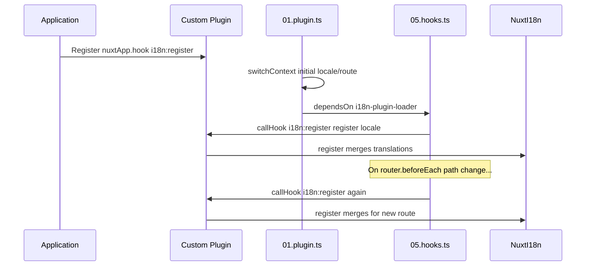

# 📢 Olaylar

## 🔄 `i18n:register`

`Nuxt I18n Micro`'daki `i18n:register` olayı, uygulamanın i18n bağlamına çevirilerin dinamik olarak eklenmesini sağlar; uluslararasılaştırma sürecini sorunsuz ve esnek kılar. Bu olay, gerektiğinde yeni çevirileri entegre etmeni sağlayarak uygulamanın yerelleştirme yeteneklerini geliştirir.

### 📝 Olay ayrıntıları

- **Amaç**:
  - Belirli bir yerel ayara ait mevcut çeviri kümesine ek çevirilerin dinamik olarak dahil edilmesine olanak tanır.

- **Yük**:
  - **`register`**:
    - Olayın sağladığı ve iki argüman alan bir fonksiyon:
      - **`translations`** (`Translations`):
        - `Translations` arayüzüne göre düzenlenmiş, çevirileri temsil eden anahtar-değer çiftlerini içeren bir nesne.
      - **`locale`** (`string`, opsiyonel):
        - Çevirilerin kaydedildiği yerel ayar kodu (örn. `'en'`, `'ru'`). Belirtilmezse olayla sağlanan yerel ayara varsayılır.

- **Davranış**:
  - Tetiklendiğinde `register` fonksiyonu, yeni çevirileri belirtilen yerel ayar için geçerli bağlamla birleştirir ve uygulamada kullanılabilir çevirileri günceller.

### ⏱️ Ne zaman tetiklenir

Modülün kanca (hooks) eklentisi (`05.hooks.ts`, `dependsOn: ['i18n-plugin-loader']`) `nuxtApp.callHook('i18n:register', …)` çağrısını yapar:

1. **Başlangıçta bir kez**: ana i18n eklentisi (`01.plugin.ts`) ilk rota için çevirileri yükledikten sonra
2. **Gezinme sırasında**: yol değiştiğinde `router.beforeEach` içinde veya `strategy: 'no_prefix'` olduğunda her gezinmede

Dinleyicini normal bir Nuxt eklentisinde `nuxtApp.hook('i18n:register', …)` ile kaydet. Kanca eklentisi yükleyici hazır olduktan sonra çalışır, böylece geri çağırma çevirilerin genişletilmesi gerektiğinde çağrılır.

Otomatik `i18n:register` çağrılarını devre dışı bırakmak için `nuxt.config` içinde `hooks: false` olarak ayarla (bkz. [Yapılandırma — `hooks`](/guides/configuration#hooks)).

### 💡 Örnek kullanım

Aşağıdaki örnek, çevirileri dinamik olarak eklemek için `i18n:register` olayının nasıl kullanılacağını gösterir:

```typescript
nuxt.hook('i18n:register', async (register: (translations: unknown, locale?: string) => void, locale: string) => {
  register(
    {
      greeting: 'Hello',
      farewell: 'Goodbye',
    },
    locale,
  )
})
```

### 🛠️ Açıklama



- **Olayın tetiklenmesi**:
  - Kanca eklentisi (`05.hooks.ts`), ana yükleyici hazır olduğunda ve ilgili gezinmelerde `i18n:register`'ı tetikler.

- **Çeviri eklemek**:
  - Örnek, `"greeting"` ve `"farewell"` için İngilizce çevirileri kaydeder.
  - `register` fonksiyonu, bu çevirileri sağlanan yerel ayar için mevcut kümeyle birleştirir.

### 🔗 Temel avantajlar

- **Dinamik güncellemeler**:
  - Uygulamanın tamamını yeniden dağıtmadan çevirileri kolayca güncelle veya ekle.

- **Yerelleştirme esnekliği**:
  - Kullanıcı veya uygulama ihtiyaçlarına göre gerçek zamanlı yerelleştirme ayarlarını destekler.

`i18n:register` olayını kullanarak uygulamanın yerelleştirme stratejisinin esnek ve uyarlanabilir kalmasını sağlayabilir, genel kullanıcı deneyimini iyileştirebilirsin.

---

## 🛠️ Eklentilerle çevirileri değiştirme

Nuxt uygulamanda çevirileri dinamik olarak değiştirmek için eklentileri kullanman önerilir. Eklentiler, özellikle modüller veya harici çeviri dosyalarıyla çalışırken yerelleştirme güncellemelerini yönetmek için yapılandırılmış bir yol sağlar.

### **Eklentiyi kaydetme**

Bir modül kullanıyorsan, çeviri değişikliklerinin gerçekleşeceği eklentiyi modülünün yapılandırmasına ekleyerek kaydet:

```javascript
addPlugin({
  src: resolve('./plugins/extend_locales'),
})
```

Bu, çevirilerin dinamik yüklenmesini ve kaydını yönetecek olan `./plugins/extend_locales` konumundaki eklentiyi kaydeder.

### **Eklentiyi uygulama**

Eklentide yerel ayar değişikliklerini yönetebilirsin. İşte bir Nuxt eklentisinde örnek uygulama:

```typescript
import { defineNuxtPlugin } from '#app'

export default defineNuxtPlugin(async (nuxtApp) => {
  // Function to load translations from JSON files and register them
  const loadTranslations = async (lang: string) => {
    try {
      const translations = await import(`../locales/${lang}.json`)
      return translations.default
    } catch (error) {
      console.error(`Error loading translations for language: ${lang}`, error)
      return null
    }
  }

  // Hook into the 'i18n:register' event to dynamically add translations
  // eslint-disable-next-line @typescript-eslint/ban-ts-comment
  // @ts-expect-error
  nuxtApp.hook('i18n:register', async (register: (translations: unknown, locale?: string) => void, locale: string) => {
    const translations = await loadTranslations(locale)
    if (translations) {
      register(translations, locale)
    }
  })
})
```

### 📝 Ayrıntılı açıklama

1. **Çevirileri yükleme**:

- `loadTranslations` fonksiyonu, yerel ayara göre çeviri dosyalarını dinamik olarak içeri aktarır. Dosyaların `locales` dizininde olması ve yerel ayar kodlarına göre adlandırılmış olması beklenir (örn. `en.json`, `de.json`).
- Yükleme başarılı olursa çeviriler döner; aksi halde bir hata kaydedilir.

2. **Çevirileri kaydetme**:

- Eklenti, `nuxtApp.hook` kullanarak `i18n:register` olayına bağlanır.
- Olay tetiklendiğinde `register` fonksiyonu yüklenmiş çeviriler ve ilgili yerel ayar ile çağrılır.
- Bu, yeni çevirileri belirtilen yerel ayar için i18n bağlamına birleştirir ve uygulama genelindeki mevcut çevirileri günceller.

### 🔗 Çeviri değişiklikleri için eklenti kullanmanın avantajları

- **Sorumlulukların ayrılması**:
  - Yerelleştirme mantığını ana uygulama kodundan ayrı tutar; yönetim ve bakım kolaylaşır.

- **Dinamik ve ölçeklenebilir**:
  - Çevirileri dinamik olarak yükleyip kaydederek, uygulamayı tamamen yeniden dağıtmaya gerek kalmadan içeriği güncelleyebilirsin. Bu, sık güncellenen veya çok dilli içeriğe sahip uygulamalar için özellikle kullanışlıdır.

- **Gelişmiş yerelleştirme esnekliği**:
  - Eklentiler, gerektiğinde çevirileri değiştirip genişletmene olanak tanır. Bu; kullanıcı tercihlerine veya iş gereksinimlerine uyum sağlayan, daha uyarlanabilir ve duyarlı bir yerelleştirme stratejisi sunar.

Bu yaklaşımı benimseyerek, uygulamanın yerelleştirmesini eklentiler aracılığıyla yapılandırılmış ve bakımı kolay bir süreçle verimli şekilde genişletebilir ve değiştirebilirsin. Böylece uluslararasılaştırma değişen ihtiyaçlara uyum sağlar ve genel kullanıcı deneyimi iyileşir.
