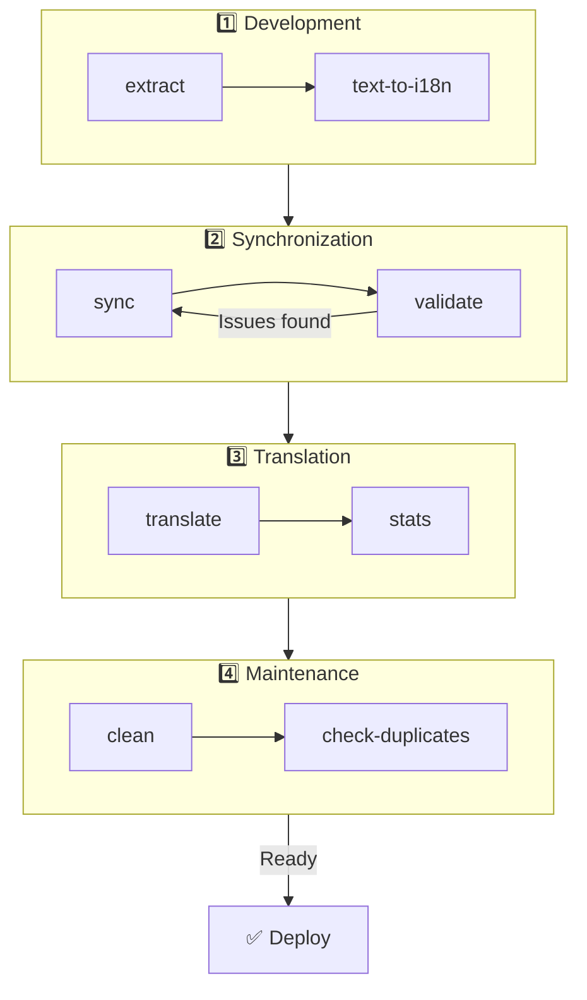

# 🌐 nuxt-i18n-micro-cli Kılavuzu

## 📖 Giriş

`nuxt-i18n-micro-cli`, `nuxt-i18n-micro` modülünü (Nuxt I18n Micro) kullanan Nuxt.js projelerinde yerelleştirme ve uluslararasılaştırma sürecini kolaylaştırmak için tasarlanmış bir komut satırı aracıdır. Kod tabanınızdan çeviri anahtarları çıkarmak, çeviri dosyalarını yönetmek, çevirileri yerel ayarlar arasında senkronize etmek ve harici çeviri hizmetlerini kullanarak çeviri sürecini otomatikleştirmek için yardımcı programlar sağlar.

Bu kılavuz, projenizin çevirilerini etkin bir şekilde yönetmek için `nuxt-i18n-micro-cli`'yi kurmanız, yapılandırmanız ve kullanmanız için size yol gösterecektir. [npmjs.com](https://www.npmjs.com/package/nuxt-i18n-micro-cli) adresindeki paket.

## 🔧 Kurulum ve Yapılandırma

### 📦 nuxt-i18n-micro-cli'yi Kurma

Nuxt projenizde global olarak veya bir dev bağımlılığı olarak kurun (CI için önerilir):

```bash
# global
npm install -g nuxt-i18n-micro-cli

# or per project
pnpm add -D nuxt-i18n-micro-cli
pnpm exec i18n-micro text-to-i18n --dryRun
```

Projeniz Nuxt 4 `app/` dizinini (`app/pages`, `app/components`, …) kullanıyorsa **`nuxt-i18n-micro-cli` ≥ 2.1.1** kullanın. Eski CLI sürümleri yalnızca proje kökündeki `pages/` klasörünü tarıyordu.

### 🛠 Projenizde Başlatma

Kurulumdan sonra, Nuxt.js proje dizininizde `i18n-micro` komutlarını çalıştırabilirsiniz.

Projenizin `nuxt-i18n-micro` ile kurulu olduğundan ve `nuxt.config.ts` (veya `nuxt.config.js`) içinde gerekli yapılandırmaya sahip olduğundan emin olun.

### 📄 Ortak Argümanlar

- `--cwd`: Geçerli çalışma dizinini belirtin (varsayılan: `.`).
- `--logLevel`: Günlük seviyesini ayarlayın (`silent`, `info`, `verbose`).
- `--translationDir`: JSON çeviri dosyalarını içeren dizin (varsayılan: `locales`).

## 📊 CLI İş Akışına Genel Bakış



### İş Akışı Adımları

| Aşama            | Komutlar                    | Amaç                                            |
| ---------------- | --------------------------- | ----------------------------------------------- |
| **Geliştirme**   | `extract`, `text-to-i18n`   | Çeviri anahtarlarını bulun ve çıkarın           |
| **Senkronizasyon** | `sync`, `validate`        | Tüm yerel ayarların aynı anahtarlara sahip olmasını sağlayın |
| **Çeviri**       | `translate`, `stats`        | Eksik anahtarları otomatik olarak çevirin       |
| **Bakım**        | `clean`, `check-duplicates` | Çevirileri düzenli tutun                        |

## 📋 Komutlar

### 🔄 `text-to-i18n` Komutu

CLI paketi: [`nuxt-i18n-micro-cli`](https://www.npmjs.com/package/nuxt-i18n-micro-cli)

**Açıklama**: Vue/TS/JS dosyalarını kullanıcıya yönelik sabit kodlanmış dizeler için tarar, bunları `$t('...')` ile değiştirir ve yeni anahtarları JSON çeviri dosyanıza birleştirir. **Nuxt proje kökünden** (`nuxt.config`'in bulunduğu yerden) çalıştırın.

**Kullanım**:

```bash
i18n-micro text-to-i18n [options]
```

**Seçenekler**:

| Seçenek                 | Varsayılan        | Açıklama                                                              |
| ----------------------- | ----------------- | --------------------------------------------------------------------- |
| `--translationFile`     | `locales/en.json` | Yeni anahtarlar için JSON dosyası (proje köküne göre).                |
| `--path`                | —                 | Yalnızca bir dosyayı veya dizini işleyin (örn. `app/pages/about.vue`). |
| `--context`             | —                 | Anahtar öneki (örn. `auth` → `auth.*`).                               |
| `--dryRun`              | `false`           | Dosya yazmadan önizleme.                                              |
| `--verbose`             | `false`           | Ekstra günlükleme.                                                    |
| `--interactive`         | `false`           | Uygulamadan önce her anahtarı onaylayın veya düzenleyin.              |
| `--extractOnlyDirs`     | `plugins`         | Anahtarların çıkarıldığı ancak kaynak dosyaların **yeniden yazılmadığı** dizinler. |
| `--extractOnlyPatterns` | —                 | Glob benzeri yalnızca çıkarma kalıpları (örn. `**/*.plugin.ts`).      |

**Örnek**:

```bash
i18n-micro text-to-i18n --translationFile locales/en.json --context auth --dryRun
```

#### Hangi klasörler taranır?

<Info>
CLI **v2.1.1**'den itibaren, `text-to-i18n` hem klasik kök klasörleri hem de `app/*` eşdeğerlerini tarar. Komutu **proje kökünden** çalıştırın — `cd app` yapmayın.
</Info>

Şu konumlar altındaki `*.vue`, `*.js` ve `*.ts` dosyalarını toplar:

| Nuxt 3 (proje kökü)   | Nuxt 4 (`app/` dizini)    |
| --------------------- | ------------------------- |
| `pages/`              | `app/pages/`              |
| `components/`         | `app/components/`         |
| `plugins/`            | `app/plugins/`            |
| `layouts/`            | `app/layouts/`            |

`--path` kullanmadıkça diğer klasörler (`server/`, `composables/`, `middleware/`, …) atlanır. Nuxt 4 için, proje kökünden çalıştırın (`cd app` yapmanıza gerek yok). `locales/` değilse, `--translationFile` içinde `i18n.translationDir` ile eşleştirin.

```bash
i18n-micro text-to-i18n --path app/pages
```

#### Nasıl çalışır

1. Yukarıdaki dizinlerden (veya `--path`'ten) dosyaları toplar.
2. Değişmez değerleri / şablon metnini `$t('generated.key')` ile değiştirir (`plugins/` varsayılan olarak yalnızca çıkarmadır).
3. Yeni anahtarları mevcut girişleri kaldırmadan `--translationFile` içine birleştirir.

**Örnek Dönüşümler**:

Önce:

```vue
<template>
  <div>
    <h1>Welcome to our site</h1>
    <p>Please sign in to continue</p>
  </div>
</template>
```

Sonra:

```vue
<template>
  <div>
    <h1>{{ $t('pages.home.welcome_to_our_site') }}</h1>
    <p>{{ $t('pages.home.please_sign_in') }}</p>
  </div>
</template>
```

**En iyi uygulamalar**: önce kuru çalıştırma; tam çalıştırmadan önce commit yapın; `--translationFile`'ı `nuxt.config` içindeki `i18n.translationDir` ile hizalayın; bootstrap kodu için `--extractOnlyDirs plugins`'i koruyun.

**Sınırlamalar**: ayrı npm paketi (modülle birlikte paketlenmemiş); `nuxt.config`'i otomatik olarak okumaz; `$t(...)` çıktısı verir; karmaşık dinamik dizeler bunun yerine `extract` / `search` gerektirebilir.

### 📊 `stats` Komutu

**Açıklama**: `stats` komutu, Nuxt.js projenizdeki her yerel ayar için çeviri istatistiklerini görüntülemek üzere kullanılır. Kullanılabilir toplam anahtar sayısına kıyasla kaç anahtarın çevrildiğini göstererek çevirilerinizin ilerlemesini anlamanıza yardımcı olur.

**Kullanım**:

```bash
i18n-micro stats [options]
```

**Seçenekler**:

- `--full`: Yalnızca birleştirilmiş çeviri istatistiklerini göster (varsayılan: `false`).

**Örnek**:

```bash
i18n-micro stats --full
```

### 🌍 `translate` Komutu

**Açıklama**: `translate` komutu, harici çeviri hizmetlerini kullanarak eksik anahtarları otomatik olarak çevirir. Bu komut, eksik çevirileri doldurmak için Google Translate, DeepL ve diğerleri gibi hizmetlerin API'lerinden yararlanarak çeviri sürecini basitleştirir.

**Kullanım**:

```bash
i18n-micro translate [options]
```

**Seçenekler**:

- `--service`: Kullanılacak çeviri hizmeti (örn. `google`, `deepl`, `yandex`). Belirtilmezse, komut sizi birini seçmeye yönlendirir.
- `--token`: Seçilen çeviri hizmetine karşılık gelen API anahtarı. Sağlanmazsa girmeniz istenir.
- `--options`: Çeviri hizmeti için ek seçenekler, anahtar:değer çiftleri olarak sağlanır, virgülle ayrılır (örn. `model:gpt-3.5-turbo,max_tokens:1000`).
- `--replace`: Mevcut çevirileri değiştirerek tüm anahtarları çevir (varsayılan: `false`).

**Örnek**:

```bash
i18n-micro translate --service deepl --token YOUR_DEEPL_API_KEY
```

#### 🌐 Desteklenen Çeviri Hizmetleri

`translate` komutu birden fazla çeviri hizmetini destekler. Desteklenen hizmetlerden bazıları:

- **Google Translate** (`google`)
- **DeepL** (`deepl`)
- **Yandex Translate** (`yandex`)
- **OpenAI** (`openai`)
- **Azure Translator** (`azure`)
- **IBM Watson** (`ibm`)
- **Baidu Translate** (`baidu`)
- **LibreTranslate** (`libretranslate`)
- **MyMemory** (`mymemory`)
- **Lingva Translate** (`lingvatranslate`)
- **Papago** (`papago`)
- **Tencent Translate** (`tencent`)
- **Systran Translate** (`systran`)
- **Yandex Cloud Translate** (`yandexcloud`)
- **ModernMT** (`modernmt`)
- **Lilt** (`lilt`)
- **Unbabel** (`unbabel`)
- **Reverso Translate** (`reverso`)

#### ⚙️ Hizmet Yapılandırması

Bazı hizmetler belirli yapılandırmalar veya API anahtarları gerektirir. `translate` komutunu kullanırken, hizmeti belirtebilir ve gerekliyse gereken `--token` (API anahtarı) ve ek `--options` sağlayabilirsiniz.

Örneğin:

```bash
i18n-micro translate --service openai --token YOUR_OPENAI_API_KEY --options openaiModel:gpt-3.5-turbo,max_tokens:1000
```

### 🛠️ `extract` Komutu

**Açıklama**: Kod tabanınızdan çeviri anahtarlarını çıkarır ve kapsama göre düzenler.

**Kullanım**:

```bash
i18n-micro extract [options]
```

**Seçenekler**:

- `--prod, -p`: Üretim modunda çalıştır.

**Örnek**:

```bash
i18n-micro extract
```

### 🔄 `sync` Komutu

**Açıklama**: Çeviri dosyalarını yerel ayarlar arasında senkronize eder ve tüm yerel ayarların aynı anahtarlara sahip olmasını sağlar.

**Kullanım**:

```bash
i18n-micro sync [options]
```

**Örnek**:

```bash
i18n-micro sync
```

### ✅ `validate` Komutu

**Açıklama**: Çeviri dosyalarını referans yerel ayara kıyasla eksik veya fazla anahtarlar açısından doğrular.

**Kullanım**:

```bash
i18n-micro validate [options]
```

**Örnek**:

```bash
i18n-micro validate
```

### 🧹 `clean` Komutu

**Açıklama**: Çeviri dosyalarından kullanılmayan çeviri anahtarlarını kaldırır.

**Kullanım**:

```bash
i18n-micro clean [options]
```

**Örnek**:

```bash
i18n-micro clean
```

### 📤 `import` Komutu

**Açıklama**: PO dosyalarını JSON formatına geri dönüştürür ve çeviri dizinine kaydeder.

**Kullanım**:

```bash
i18n-micro import [options]
```

**Seçenekler**:

- `--potsDir`: PO dosyalarını içeren dizin (varsayılan: `pots`).

**Örnek**:

```bash
i18n-micro import --potsDir pots
```

### 📥 `export` Komutu

**Açıklama**: Harici çeviri yönetimi için çevirileri PO dosyalarına dışa aktarır.

**Kullanım**:

```bash
i18n-micro export [options]
```

**Seçenekler**:

- `--potsDir`: PO dosyalarını kaydetmek için dizin (varsayılan: `pots`).

**Örnek**:

```bash
i18n-micro export --potsDir pots
```

### 🗂️ `export-csv` Komutu

**Açıklama**: `export-csv` komutu, JSON dosyalarından çeviri anahtarlarını ve değerlerini, dosya yolları dahil olmak üzere CSV formatına dışa aktarır. Bu komut, elektronik tablo yazılımında çeviri verileriyle çalışmayı tercih eden ekipler için kullanışlıdır.

**Kullanım**:

```bash
i18n-micro export-csv [options]
```

**Seçenekler**:

- `--csvDir`: Dışa aktarılan CSV dosyalarının kaydedileceği dizin.
- `--delimiter`: CSV dosyası için bir ayırıcı belirtin (varsayılan: `,`).

**Örnek**:

```bash
i18n-micro export-csv --csvDir csv_files
```

### 📑 `import-csv` Komutu

**Açıklama**: `import-csv` komutu, CSV dosyalarından çeviri verilerini içe aktarır ve karşılık gelen JSON dosyalarını günceller. Bu, elektronik tablolardan toplu çeviri güncellemelerini uygulamak için kullanışlıdır.

**Kullanım**:

```bash
i18n-micro import-csv [options]
```

**Seçenekler**:

- `--csvDir`: İçe aktarılacak CSV dosyalarını içeren dizin.
- `--delimiter`: CSV dosyasında kullanılan bir ayırıcı belirtin (varsayılan: `,`).

**Örnek**:

```bash
i18n-micro import-csv --csvDir csv_files
```

### 🧾 `diff` Komutu

**Açıklama**: Varsayılan yerel ayar ve aynı dizindeki (alt dizinler dahil) diğer yerel ayarlar arasındaki çeviri dosyalarını karşılaştırır. Komut, varsayılan yerel ayara kıyasla diğer yerel ayarlarda eksik olan anahtarları ve değerlerini belirleyerek çeviri ilerlemesini veya tutarsızlıkları takip etmeyi kolaylaştırır.

**Kullanım**:

```bash
i18n-micro diff [options]
```

**Örnek**:

```bash
i18n-micro diff
```

### 🔍 `check-duplicates` Komutu

**Açıklama**: `check-duplicates` komutu, hem kök seviyesi hem de sayfaya özel çeviriler dahil olmak üzere tüm çeviri dosyalarında her yerel ayar içindeki yinelenen çeviri değerlerini kontrol eder. Aynı dil içindeki farklı anahtarların aynı çeviri değerlerini paylaşmamasını sağlar ve çevirilerinizde netlik ve tutarlılık korumaya yardımcı olur.

**Kullanım**:

```bash
i18n-micro check-duplicates [options]
```

**Örnek**:

```bash
i18n-micro check-duplicates
```

**Nasıl çalışır**:

- Komut, her yerel ayar için hem kök seviyesi hem de sayfaya özel çeviri dosyalarını kontrol eder.
- Bir çeviri değeri birden fazla konumda görünürse (kök seviyesi çeviriler içinde veya farklı sayfalar arasında), yinelenen değerleri bulundukları dosya ve anahtar ile birlikte bildirir.
- Yinelenen bulunmazsa, komut yerel ayarın yinelenen çeviri değerlerinden bağımsız olduğunu doğrular.

Bu komut, çeviri anahtarlarının benzersiz değerler korumasını sağlayarak aynı yerel ayar içinde yanlışlıkla tekrarları önlemeye yardımcı olur.

### 🔄 `replace-values` Komutu

**Açıklama**: `replace-values` komutu, tüm yerel ayarlarda çeviri değerlerinin toplu değişimini gerçekleştirmenize olanak tanır. Hem basit metin değişikliklerini hem de düzenli ifadeler (regex) kullanarak gelişmiş değişimleri destekler. Ayrıca regex kalıplarında yakalama gruplarını kullanabilir ve bunlara değiştirme dizesinde başvurabilirsiniz, bu da onu daha karmaşık değiştirme senaryoları için ideal hale getirir.

**Kullanım**:

```bash
i18n-micro replace-values [options]
```

**Seçenekler**:

- `--search`: Çevirilerde aranacak metin veya regex kalıbı. Bu gerekli bir seçenektir.
- `--replace`: Bulunan çeviriler için kullanılacak değiştirme metni. Bu gerekli bir seçenektir.
- `--useRegex`: Düzenli ifade kalıbı kullanarak aramayı etkinleştir (varsayılan: `false`).

**Örnek 1**: Basit değiştirme

Tüm yerel ayarlarda "Hello" dizesini "Hi" ile değiştirin:

```bash
i18n-micro replace-values --search "Hello" --replace "Hi"
```

**Örnek 2**: Regex değiştirme

Regex aramasını etkinleştirin ve "Hello" ile başlayan ve ardından sayılar gelen herhangi bir dizeyi (örneğin, "Hello123") tüm yerel ayarlarda "Hi" ile değiştirin:

```bash
i18n-micro replace-values --search "Hello\\d+" --replace "Hi" --useRegex
```

**Örnek 3**: Regex yakalama gruplarını kullanma

Eşleşen dizenin bir bölümünü dinamik olarak değiştirme metnine eklemek için yakalama gruplarını kullanın. Örneğin, adı olduğu gibi koruyarak "Hello [name]"i "Hi [name]" ile değiştirin:

```bash
i18n-micro replace-values --search "Hello (\\w+)" --replace "Hi $1" --useRegex
```

Bu durumda, `$1`, "Hello"dan sonraki `[name]` bölümüyle eşleşen ilk yakalama grubuna atıfta bulunur. Değiştirme, orijinal dizeden gelen adı koruyacaktır.

**Nasıl çalışır**:

- Komut tüm çeviri dosyalarını (hem global hem de sayfaya özel) tarar.
- Arama dizesi veya regex kalıbı temelinde bir eşleşme bulunduğunda, eşleşen metni sağlanan değiştirmeyle değiştirir.
- Regex kullanılırken, yakalama grupları değiştirme dizesinde `$1`, `$2` vb. ile başvurulabilir.
- Tüm değişiklikler kaydedilir, dosya yolu, çeviri anahtarı ve çeviri değerinin öncesi/sonrası durumu gösterilir.

**Günlükleme**:
Her değiştirme için, komut şu ayrıntıları kaydeder:

- Yerel ayar ve dosya yolu
- Değiştirilen çeviri anahtarı
- Değiştirmeden sonraki eski değer ve yeni değer
- Yakalama gruplarıyla regex kullanılıyorsa, günlükler grup eşleşmelerini ve nasıl değiştirildiklerini gösterir.

Bu, değiştirme işlemi sırasında nerede ve hangi değişikliklerin yapıldığını tam olarak izlemenizi sağlar ve çeviri dosyalarınızda net bir değişiklik geçmişi sunar.

## 🛠 Örnekler

- **Çevirileri çıkarma**:

  ```bash
  i18n-micro extract
  ```

- **Google Translate kullanarak eksik anahtarları çevirme**:

  ```bash
  i18n-micro translate --service google --token YOUR_GOOGLE_API_KEY
  ```

- **Mevcut çevirileri değiştirerek tüm anahtarları çevirme**:

  ```bash
  i18n-micro translate --service deepl --token YOUR_DEEPL_API_KEY --replace
  ```

- **Çeviri dosyalarını doğrulama**:

  ```bash
  i18n-micro validate
  ```

- **Kullanılmayan çeviri anahtarlarını temizleme**:

  ```bash
  i18n-micro clean
  ```

- **Çeviri dosyalarını senkronize etme**:

  ```bash
  i18n-micro sync
  ```

## ⚙️ Yapılandırma Kılavuzu

`nuxt-i18n-micro-cli`, `nuxt.config.ts` (veya `nuxt.config.js`) içindeki Nuxt.js i18n yapılandırmanıza dayanır. `nuxt-i18n-micro` modülünün kurulu ve yapılandırılmış olduğundan emin olun.

### 🔑 nuxt.config.js Örneği

```ts
export default defineNuxtConfig({
  modules: ['nuxt-i18n-micro'],
  i18n: {
    locales: [
      { code: 'en', iso: 'en-US' },
      { code: 'fr', iso: 'fr-FR' },
    ],
    defaultLocale: 'en',
    fallbackLocale: 'en',
    translationDir: 'locales', // or 'app/locales' for Nuxt 4 colocation
  },
})
```

`translationDir`'in `nuxt-i18n-micro-cli` tarafından kullanılan dizinle eşleştiğinden emin olun (varsayılan `locales`).

## 📝 En İyi Uygulamalar

### 🔑 Tutarlı Anahtar Adlandırma

Karışıklık ve yinelenmeyi önlemek için çeviri anahtarlarının tutarlı ve açıklayıcı olduğundan emin olun.

### 🧹 Düzenli Bakım

Kullanılmayan çeviri anahtarlarını kaldırmak ve çeviri dosyalarınızı temiz tutmak için düzenli olarak `clean` komutunu kullanın.

### 🛠 Çeviri İş Akışını Otomatikleştirme

Çeviri dosyalarının çıkarılması, çevrilmesi, doğrulanması ve senkronizasyonunu otomatikleştirmek için `nuxt-i18n-micro-cli` komutlarını geliştirme iş akışınıza veya CI/CD boru hattınıza entegre edin.

### 🛡️ API Anahtarlarını Güvenli Tutma

API anahtarları gerektiren çeviri hizmetlerini kullanırken, anahtarlarınızın güvenli tutulduğundan ve sürüm kontrol sistemlerine commit edilmediğinden emin olun. Ortam değişkenleri veya güvenli anahtar yönetimi çözümleri kullanmayı düşünün.

## 📞 Destek ve Katkılar

Sorunlarla karşılaşırsanız veya iyileştirme önerileriniz varsa, projeye katkıda bulunmaktan veya projenin deposunda bir sorun açmaktan çekinmeyin.

---

Bu kılavuzu izleyerek, `nuxt-i18n-micro-cli` kullanarak Nuxt.js projenizdeki çevirileri etkin bir şekilde yönetebilecek, uluslararasılaştırma çabalarınızı kolaylaştıracak ve farklı yerel ayarlardaki kullanıcılar için sorunsuz bir deneyim sağlayabileceksiniz.
