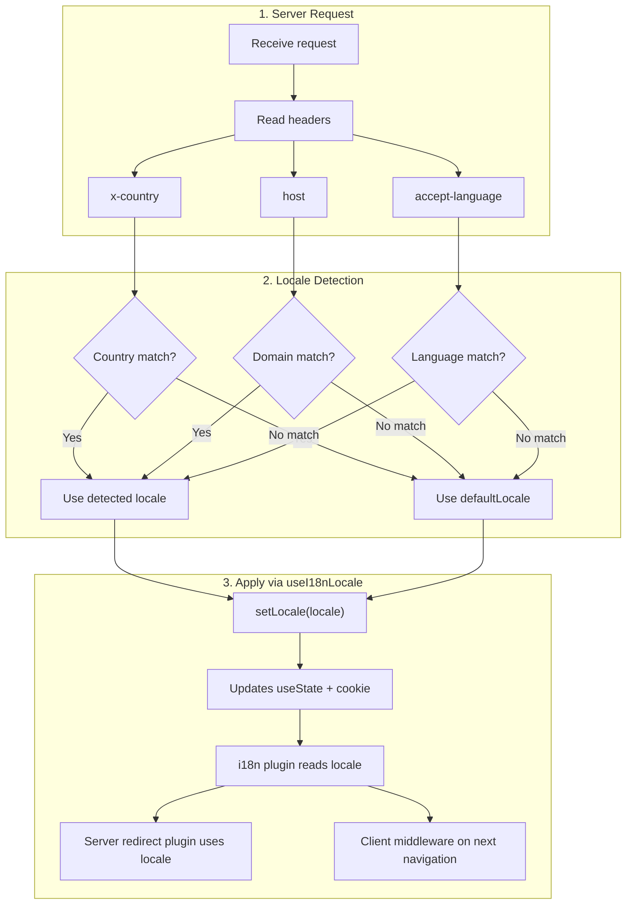

# 🔧 Nuxt I18n Micro'da Özel Dil Algılama

## 📖 Genel Bakış

Nuxt I18n Micro v3, tüm yerel ayar yönetimi için merkezi bir composable — `useI18nLocale()` — sağlar. Bu, v2'deki manuel `useState`/`useCookie` kalıplarını değiştirir. Bir sunucu eklentisinde `useI18nLocale().setLocale()` kullanarak, modülün yönlendirme ve çerez sistemleriyle tam uyumluluğu korurken herhangi bir özel algılama mantığı uygulayabilirsiniz.

## 🏗️ Mimari

```mermaid
flowchart TB
    subgraph Plugins["Plugin Execution Order"]
        A["Your plugin<br/>order: -10"] -->|setLocale()| B["01.plugin.ts<br/>order: -5"]
        B --> C["06.redirect.ts server<br/>order: 10"]
    end

    subgraph Client["Client SPA Navigation"]
        D["i18n-redirect.global.ts<br/>route middleware"]
    end

    subgraph State["Locale State"]
        E["useState('i18n-locale')"]
        F["localeCookie"]
    end

    A -->|"setLocale() updates both"| E
    A -->|"setLocale() updates both"| F
    B -->|reads| E
    C -->|reads| E
    C -->|reads| F
    D -->|reads target route +| E
```

**Ana ilke**: `useI18nLocale().setLocale()`'i `order: -10` ile bir sunucu eklentisinde çağırın. Bu, hem `useState('i18n-locale')` hem de yerel ayar çerezini atomik olarak günceller, böylece i18n eklentisi (`order: -5`) ve sunucu yönlendirme eklentisi (`order: 10`) ilk SSR isteğinde doğru yerel ayarı görür. İstemci tarafı otomatik yönlendirmeler, sonraki gezintilerde global rota ara yazılımında çalışır.

## 🛠️ Yerleşik Otomatik Algılamayı Devre Dışı Bırakma

Yerel ayar algılaması üzerinde tam kontrol istiyorsanız, yerleşik mekanizmayı devre dışı bırakın:

```ts
export default defineNuxtConfig({
  i18n: {
    autoDetectLanguage: false,
  },
})
```

## ✨ Örnek: `useI18nLocale` ile Sunucu Tarafı Algılama

Bu, tüm stratejiler için **önerilen yaklaşımdır**.

### Adım 1: `nuxt.config.ts`'i Yapılandırın

```ts
export default defineNuxtConfig({
  modules: ['nuxt-i18n-micro'],
  i18n: {
    strategy: 'no_prefix', // Works with ANY strategy
    defaultLocale: 'en',
    localeCookie: 'user-locale',
    autoDetectLanguage: false,
    locales: [
      { code: 'en', iso: 'en-US' },
      { code: 'de', iso: 'de-DE' },
      { code: 'ja', iso: 'ja-JP' },
    ],
  },
})
```

### Adım 2: `plugins/i18n-loader.server.ts` Oluşturun

```ts
import { defineNuxtPlugin, useRequestHeaders } from '#imports'

export default defineNuxtPlugin({
  name: 'i18n-custom-loader',
  enforce: 'pre',
  order: -10, // Execute BEFORE the i18n plugin (which has order -5)

  setup() {
    const { setLocale } = useI18nLocale()
    const headers = useRequestHeaders(['host', 'x-country', 'accept-language'])
    let detectedLocale = 'en'

    // --- YOUR DETECTION LOGIC ---

    // Example 1: By domain
    const host = headers['host']
    if (host?.includes('example.de')) {
      detectedLocale = 'de'
    }
    // Example 2: By custom header
    else if (headers['x-country'] === 'JP') {
      detectedLocale = 'ja'
    }
    // Example 3: By Accept-Language header
    else if (headers['accept-language']?.includes('de')) {
      detectedLocale = 'de'
    }

    // --- APPLY THE LOCALE ---
    setLocale(detectedLocale)
  },
})
```

### Nasıl Çalışır



1. **Eklenti önce çalışır** (`order: -10`) — başlıklardan, etki alanından veya diğer kaynaklardan yerel ayarı algılar
2. **`setLocale()` ikisini de günceller** `useState('i18n-locale')` ve çerezi — sonraki tüm eklentilere anında görünürlük sağlar
3. **i18n eklentisi** (`order: -5`) yerel ayarı okur ve doğru çevirileri yükler
4. **Sunucu yönlendirme eklentisi** (`order: 10`) SSR'de yönlendirme kararları için yerel ayarı kullanır
5. **İstemci rota ara yazılımı** (`i18n-redirect`), URL yerel ayarı tercihle eşleşmediğinde SPA gezintisinde yönlendirmeleri uygular

## 🌐 Stratejiye Özgü Davranış

`useI18nLocale().setLocale()` **tüm stratejilerle** çalışır. Yönlendirme davranışı stratejiye bağlıdır:

<Tip>
| Strateji | `setLocale('de')` Etkisi |
|----------|---------------------------|
| `no_prefix` | Almanca olarak render eder, URL değişikliği yok |
| `prefix` | 302 → `/de/` (sunucu tarafı yönlendirme) |
| `prefix_except_default` | `de` ≠ varsayılan ise 302 → `/de/`; `de` = varsayılan ise yönlendirme yok |
| `prefix_and_default` | Yönlendirme yok (hem `/` hem de `/de/` geçerlidir) |
</Tip>

**Önemli notlar:**

- Çerez tabanlı yerel ayar algılaması varsayılan olarak devre dışıdır (`localeCookie: null`)
- Çerez sürekliliğini etkinleştirmek için `localeCookie: 'user-locale'` ayarlayın
- Çerez/durum değeri `locales` listesinde değilse, `defaultLocale`'e geri döner

## 🏢 Gelişmiş: Etki Alanı Tabanlı Algılama

Her etki alanının farklı bir yerel ayar sunduğu çok etki alanlı kurulumlar için:

```ts
import { defineNuxtPlugin, useRequestHeaders } from '#imports'

export default defineNuxtPlugin({
  name: 'i18n-domain-loader',
  enforce: 'pre',
  order: -10,

  setup() {
    const { setLocale } = useI18nLocale()
    const headers = useRequestHeaders(['host'])
    const host = headers['host'] || ''

    let detectedLocale = 'en'

    if (host.endsWith('.de') || host.includes('german.')) {
      detectedLocale = 'de'
    } else if (host.endsWith('.fr') || host.includes('french.')) {
      detectedLocale = 'fr'
    } else if (host.endsWith('.jp') || host.includes('japanese.')) {
      detectedLocale = 'ja'
    }

    setLocale(detectedLocale)
  },
})
```

## 🔄 Gelişmiş: Kullanıcı Tercihine Saygı Duyma

Kullanıcılar dili manuel olarak değiştirebiliyorsa, otomatik algılama yerine seçimlerine saygı gösterin:

```ts
import { defineNuxtPlugin, useRequestHeaders } from '#imports'

export default defineNuxtPlugin({
  name: 'i18n-smart-loader',
  enforce: 'pre',
  order: -10,

  setup() {
    const { getLocale, setLocale } = useI18nLocale()

    // If user already has a preference (from cookie), respect it
    if (getLocale()) {
      return
    }

    // Otherwise, detect locale from headers
    const headers = useRequestHeaders(['accept-language'])
    let detectedLocale = 'en'

    const acceptLanguage = headers['accept-language'] || ''
    if (acceptLanguage.includes('de')) {
      detectedLocale = 'de'
    } else if (acceptLanguage.includes('ja')) {
      detectedLocale = 'ja'
    }

    setLocale(detectedLocale)
  },
})
```

## ⚙️ Yalnızca Sunucu veya Yalnızca İstemci Eklentileri

Eklentinizin nerede çalışacağını kontrol etmek için [Nuxt dosya adı kurallarını](https://nuxt.com/docs/getting-started/directory-structure#plugins) kullanın:

- **Yalnızca Sunucu**: `i18n-loader.server.ts` — yalnızca SSR sırasında çalışır (başlık tabanlı algılama için önerilir)
- **Yalnızca İstemci**: `i18n-loader.client.ts` — yalnızca tarayıcıda çalışır (`localStorage` veya DOM tabanlı algılama için)

<Tip>

</Tip>

## ✅ Özet

| Özellik                                | Açıklama                                                          |
| -------------------------------------- | ----------------------------------------------------------------- |
| `useI18nLocale().setLocale()`          | `useState` + çerezi atomik olarak günceller; tüm stratejilerle çalışır |
| `useI18nLocale().getLocale()`          | Durumdan veya çerezden geçerli yerel ayarı döndürür               |
| `useI18nLocale().getPreferredLocale()` | Tercih edilen yerel ayarı döndürür (`locales` listesine karşı doğrulanır) |
| Eklenti `order: -10`                   | Eklentinizin i18n başlatmadan önce çalışmasını sağlar             |
| `enforce: 'pre'`                       | "pre" eklenti grubunda çalışır                                    |

**YAPMAYIN:**

- Doğrudan `useCookie('user-locale')` kullanmayın — `useI18nLocale()` çerezleri dahili olarak yönetir
- Doğrudan `useState('i18n-locale')` kullanmayın — bunun yerine `useI18nLocale().setLocale()` kullanın
- `order` >= -5 ayarlamayın — eklentinizin i18n eklentisinden önce çalışması gerekir
