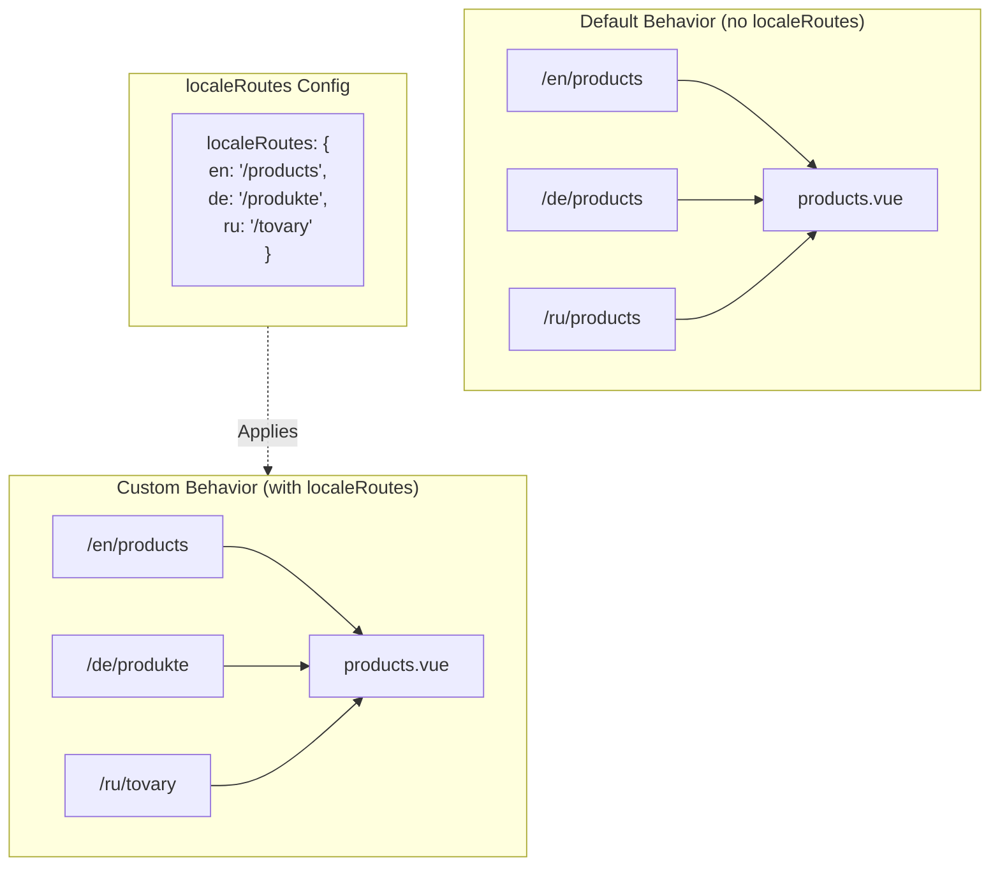

# 🔗 `Nuxt I18n Micro`'da `localeRoutes` ile Özel Yerelleştirilmiş Rotalar

## 📖 `localeRoutes`'a Giriş

`Nuxt I18n Micro` içindeki `localeRoutes` özelliği, belirli yerel ayarlar için özel rotalar tanımlamanıza olanak tanır ve uygulamanızın yönlendirme yapısı üzerinde esneklik ve kontrol sağlar. Bu özellik, özellikle belirli yerel ayarlar farklı URL yapıları, özel yollar gerektirdiğinde veya belirli bölgesel veya dilbilimsel kurallara uyması gerektiğinde kullanışlıdır.

## 🚀 `localeRoutes`'un Birincil Kullanım Durumu

`localeRoutes`'un birincil kullanım durumu, URL'lerin sezgisel ve hedef kitleye uygun olmasını sağlayarak kullanıcı deneyimini geliştirmek için farklı yerel ayarlar için ayrı rotalar sağlamaktır. Örneğin, bir sayfanın İngilizce ve Rusça sürümleri için farklı yollarınız olabilir; burada Rusça yerel ayarı yerelleştirilmiş bir URL formatını izler.

### 📄 Örnek: `$defineI18nRoute` içinde `localeRoutes` Tanımlama

`$defineI18nRoute` işlevinizde `localeRoutes` kullanarak belirli yerel ayarlar için nasıl özel rotalar tanımlayabileceğinize dair bir örnek:

```typescript
import { useNuxtApp } from '#imports'

const { $defineI18nRoute } = useNuxtApp()

$defineI18nRoute({
  localeRoutes: {
    ru: '/localesubpage', // Custom route path for the Russian locale
    de: '/lokaleseite', // Custom route path for the German locale
  },
})
```

> [!IMPORTANT]
> `$defineI18nRoute` global bir işlev değildir. `script setup` içinde, önce `useNuxtApp()`'ten alın, sonra çağırın.

### 🔄 `localeRoutes` Nasıl Çalışır



- **Varsayılan Davranış**: `localeRoutes` olmadan, tüm yerel ayarlar birincil yol tarafından tanımlanan ortak bir rota yapısı kullanır.
- **Özel Davranış**: `localeRoutes` ile, belirli yerel ayarların kendi rotaları olabilir, yapılandırmada tanımlanan yerel ayara özgü rotalarla varsayılan yolu geçersiz kılar.

## 🌱 `localeRoutes` için Kullanım Durumları

### 📄 Örnek: Bir Sayfada `localeRoutes` Kullanma

`$defineI18nRoute`'un `localeRoutes` ile kullanımını gösteren basit bir Vue bileşeni:

```vue
<template>
  <div>
    <!-- Display greeting message based on the current locale -->
    <p>{{ $t('greeting') }}</p>

    <!-- Navigation links -->
    <div>
      <NuxtLink :to="$localeRoute({ name: 'index' })"> Go to Index </NuxtLink>
      |
      <NuxtLink :to="$localeRoute({ name: 'about' })"> Go to About Page </NuxtLink>
    </div>
  </div>
</template>

<script setup>
import { useNuxtApp } from '#imports'

const { $getLocale, $switchLocale, $getLocales, $localeRoute, $t, $defineI18nRoute } = useNuxtApp()

// Define translations and custom routes for specific locales
$defineI18nRoute({
  localeRoutes: {
    ru: '/localesubpage', // Custom route path for Russian locale
  },
})
</script>
```

### 🛠️ Farklı Bağlamlarda `localeRoutes` Kullanımı

- **Açılış Sayfaları**: Pazarlama kampanyalarıyla hizalanmalarını sağlamak için açılış sayfaları için URL'leri yerelleştirmek üzere özel rotalar kullanın.
- **Belgelendirme Siteleri**: Yerelleştirilmiş içerik yapısıyla daha iyi eşleşmek için her yerel ayar için ayrı rotalar sağlayın.
- **E-ticaret Siteleri**: SEO ve kullanıcı deneyimini iyileştirmek için ürün veya kategori URL'lerini yerel ayara göre uyarlayın.

## `localeRoutes` ile Gezinmeyi Kullanma

Yerelleştirilmiş rotalar, page dizinindeki dosya adlarıyla doğrudan eşleşmediğinden, gezinmenize adla değil, nesneyle başvurmanız gerekir.

```vue
<template>
  /**
   * Exemple page: /pages/about-us.vue
   * EN /about-us
   * ES /sobre-nosotros
   * FR /a-propos
   */

  // Using NuxtLink
  <NuxtLink :to="$localeRoute({ name: 'about-us' })">
    Go to About Page
  </NuxtLink>

  // Using I18nLink
  <I18nLink :to="{ name: 'about-us' }">
    Go to About Page
  </NuxtLink>

  // The string literal navigation wouldn't work for any locale but english
  <I18nLink to="/about-us">
    Go to About Page
  </NuxtLink>
</template>
```

### İç İçe Sayfa Adlandırması

Varsayılan olarak, sayfalarınız dosya ve yol adlarına göre adlandırılır. Bu şu anlama gelir:

- `/pages/about-us.vue`'ya `$localeRoute(\{ name: 'about-us' \})` ile erişilebilir
- `/pages/about-us/physical-stores.vue`'ya `$localeRoute(\{ name: 'about-us-physical-stores' \})` ile erişilebilir

Bu davranışı geçersiz kılmak için, sayfanızı `definePageMeta` ile açıkça adlandırın.

```vue
// /pages/about-us/physical-stores.vue
<script setup>
definePageMeta({
  name: 'our-stores'
})
```

Bu sayfaya artık adıyla `:to='\{ name: "our-stores" \}'` şeklinde `$localeRoute` veya `I18nLink` ile referans verilebilir.

## 🎯 Slug'lar ve `$setI18nRouteParams` ile Dinamik Rotalar

Slug'lar veya parametreler içeren dinamik rotalarla çalışırken, her yerel ayar için yerel ayara özgü slug'lar sağlamak için `localeRoutes`'u dinamik segmentler ve `$setI18nRouteParams` ile kullanabilirsiniz.

### `localeRoutes` içinde Dinamik Rota Parametreleri

Nuxt'un rota parametresi sözdizimini kullanarak dinamik rotalar tanımlayabilirsiniz (yakala-tümü rotaları için `[...slug]`, tek parametreler için `[param]` veya adlandırılmış parametreler için `:param()`):

```vue
<script setup lang="ts">
import { useNuxtApp, useRoute, useFetch, createError } from '#imports'

const { $defineI18nRoute, $setI18nRouteParams } = useNuxtApp()

// Define custom routes with dynamic segments
$defineI18nRoute({
  localeRoutes: {
    en: '/our-products/[...slug]',
    es: '/nuestros-productos/[...slug]',
  },
})
</script>
```

### Yerel Ayara Özgü Rota Parametrelerini Ayarlama

`$setI18nRouteParams` işlevi, her yerel ayar için farklı parametre değerleri (slug'lar gibi) ayarlamanıza olanak tanır. Bu, özellikle içeriğinizin yerel ayara özgü URL'leri olduğunda kullanışlıdır.

**Önemli**: `$setI18nRouteParams`, yerel ayara özgü slug'lar içeren verileri getirdikten sonra çağrılmalıdır, tipik olarak `useFetch` veya `useAsyncData` içinde.

```vue
<script setup lang="ts">
import { useNuxtApp, useRoute, useFetch, createError } from '#imports'

interface Product {
  title: string
  price: string
  urlEn: string // English slug
  urlEs: string // Spanish slug
}

const { $defineI18nRoute, $setI18nRouteParams } = useNuxtApp()

const route = useRoute()
const slug = Array.isArray(route.params.slug) ? route.params.slug[0] : route.params.slug

// Fetch product data that includes locale-specific slugs
const { data: product, error } = await useFetch<Product>(`/api/product/${slug}`)
if (error.value)
  throw createError({
    statusCode: error.value?.statusCode,
    statusMessage: error.value?.statusMessage,
    fatal: true,
  })

// Define custom routes with dynamic segments
$defineI18nRoute({
  localeRoutes: {
    en: '/our-products/[...slug]',
    es: '/nuestros-productos/[...slug]',
  },
})

// Set different slugs for different locales
if (product.value) {
  $setI18nRouteParams({
    en: { slug: product.value.urlEn },
    es: { slug: product.value.urlEs },
  })
}
</script>
```

### Eksiksiz Örnek: Yerel Ayara Özgü Slug'lı Ürün Sayfaları

Bir ürün detay sayfası için `localeRoutes` ve `$setI18nRouteParams`'ın birlikte nasıl kullanılacağını gösteren eksiksiz bir örnek:

```vue
<template>
  <div v-if="product">
    <h1>{{ product.title }}</h1>
    <p>{{ $t('price') }}: {{ product.price }}</p>
    <div class="locale-switcher">
      <a :href="$switchLocalePath('en')">English</a>
      <a :href="$switchLocalePath('es')">Español</a>
    </div>
  </div>
</template>

<script setup lang="ts">
import { useNuxtApp, useRoute, useFetch, createError } from '#imports'

interface Product {
  title: string
  price: string
  urlEn: string
  urlEs: string
}

const { $t, $defineI18nRoute, $setI18nRouteParams, $switchLocalePath } = useNuxtApp()

// Set page name for easier navigation
definePageMeta({ name: 'product-slug' })

const route = useRoute()
const slug = Array.isArray(route.params.slug) ? route.params.slug[0] : route.params.slug

// Fetch product data
const { data: product, error } = await useFetch<Product>(`/api/product/${slug}`)
if (error.value)
  throw createError({
    statusCode: error.value?.statusCode,
    statusMessage: error.value?.statusMessage,
    fatal: true,
  })

// Define locale-specific routes with dynamic segments
$defineI18nRoute({
  localeRoutes: {
    en: '/our-products/[...slug]',
    es: '/nuestros-productos/[...slug]',
  },
})

// Set locale-specific slugs so $switchLocalePath works correctly
if (product.value) {
  $setI18nRouteParams({
    en: { slug: product.value.urlEn },
    es: { slug: product.value.urlEs },
  })
}
</script>
```

### Örnek: Ürün Liste Sayfası

Bir liste sayfasından dinamik rotalara bağlantı verirken, rota adını parametrelerle birlikte kullanın:

```vue
<template>
  <div>
    <h1>{{ $t('title') }}</h1>
    <ul>
      <li v-for="product in products?.[$getLocale()] || []" :key="product.id">
        <I18nLink :to="{ name: 'product-slug', params: { slug: product.url } }"> {{ product.title }} – {{ product.price }} </I18nLink>
      </li>
    </ul>
  </div>
</template>

<script setup lang="ts">
import { useNuxtApp, useFetch, createError } from '#imports'

interface Product {
  id: string
  title: string
  price: string
  url: string
}

type ProductsByLocale = Record<string, Product[]>

const { $t, $defineI18nRoute, $getLocale } = useNuxtApp()

const { data: products, error } = await useFetch<ProductsByLocale>('/api/product')
if (error.value)
  throw createError({
    statusCode: error.value?.statusCode,
    statusMessage: error.value?.statusMessage,
    fatal: true,
  })

$defineI18nRoute({
  locales: {
    en: {
      title: 'Our Product Range',
      description: 'Discover our collection of high-quality products.',
    },
    es: {
      title: 'Nuestra Gama de Productos',
      description: 'Descubra nuestra colección de productos de alta calidad.',
    },
  },
  localeRoutes: {
    en: '/our-products',
    es: '/nuestros-productos',
  },
})
</script>
```

### Nasıl Çalışır

1. **Rota Tanımı**: `localeRoutes`, her yerel ayar için `[...slug]` veya `[id]` gibi dinamik segmentler dahil olmak üzere temel yol yapısını tanımlar.

2. **Parametre Ayarı**: `$setI18nRouteParams`, her yerel ayar için gerçek parametre değerlerini ayarlar. Bir kullanıcı `$switchLocalePath` kullanarak yerel ayarları değiştirdiğinde, modül doğru URL'yi oluşturmak için bu parametreleri kullanır.

3. **Parametre Formatı**: Parametre nesnesi yapıyla eşleşmelidir:

   ```typescript
   {
     [localeCode]: {
       [paramName]: paramValue
     }
   }
   ```

4. **Gezinme**: Dinamik rotaların yerelleştirilmiş sürümleri arasında gezinmek için rota adı ve parametrelerle `I18nLink` veya `$localeRoute` kullanın.

### Önemli Notlar

- **Zamanlama**: `$setI18nRouteParams`, yerel ayara özgü slug'lar içeren verileri getirdikten sonra çağrılmalıdır, tipik olarak `useFetch` veya `useAsyncData` içinde.

- **Parametre Adları**: `$setI18nRouteParams` içindeki parametre adları, rota parametre adlarıyla eşleşmelidir (örn. `[...slug]` için `slug` veya `[id]` için `id`).

- **Rota Adları**: `definePageMeta(\{ name: 'route-name' \})` kullanırken, `I18nLink` veya `$localeRoute` ile rotaya bağlantı verirken bu adı kullanın.

- **Yakala-Tümü Rotaları**: Yakala-tümü rotaları için (`[...slug]`), slug parametresi bir diziye dönüştürülecek bir dizi veya dize olmalıdır.

## 🧩 Programatik rotalar (`pages:extend`) — #244

`pages:extend` içinde oluşturulan rotalarda `defineI18nRoute()` için yer yoktur ve birçok rota genellikle tek bir sarmalayıcı SFC'yi paylaşır. Dosya anahtarlı tarama daha sonra bunları tek bir girişe daraltır.

Yerelleştirilmiş yolları `route.meta` içine **koymayın** (bunlar istemci rota tablosunda gönderilir). Tek bir kayıt tutun ve onu iki kez projelendirin:

1. `pages:extend` içine (Nuxt rotalarını oluşturur)
2. rota **adına** (dosya yoluna değil) göre anahtarlanmış `i18n.globalLocaleRoutes` içine

`@i18n-micro/utils/split-locale-routes`'tan `splitLocaleRoutes`'u kullanın:

```typescript
import { splitLocaleRoutes } from '@i18n-micro/utils/split-locale-routes'

const dynamic = splitLocaleRoutes([
  {
    name: 'products_tag',
    path: '/products/:tag',
    file: '~/pages/_dynamic.vue',
    paths: { fr: '/produits/:tag', de: '/produkte/:tag' },
  },
  {
    name: 'products_category',
    path: '/products/category/:category',
    file: '~/pages/_dynamic.vue',
    paths: { fr: '/produits/categorie/:category' },
  },
  // Disable localization for a programmatic route:
  // { name: 'internal', path: '/internal', file: '~/pages/_dynamic.vue', paths: false },
])

export default defineNuxtConfig({
  hooks: {
    'pages:extend'(pages) {
      pages.push(...dynamic.pages)
    },
  },
  i18n: {
    globalLocaleRoutes: dynamic.globalLocaleRoutes,
  },
})
```

Her iki yarı da senkronize kalır; paylaşılan sarmalayıcılar artık birbirinin üzerine yazmaz. `globalLocaleRoutes` tek başına yeterli değildir — yalnızca Nuxt sayfa tablosunda zaten var olan rotalar için yolları özelleştirir.

## 📝 `localeRoutes` Kullanmak için En İyi Uygulamalar

- **🚀 İlgili Yerel Ayarlar İçin Kullanın**: `localeRoutes`'u öncelikle URL yapısının kullanıcı deneyimini veya SEO'yu önemli ölçüde etkilediği yerlerde uygulayın. Küçük farklılıklar için aşırı kullanmaktan kaçının.
- **🔧 Tutarlılığı Koruyun**: Sapma için güçlü bir neden olmadıkça yerel ayarlar arasında tutarlı bir yönlendirme deseni koruyun. Bu yaklaşım netliği korumaya ve karmaşıklığı azaltmaya yardımcı olur.
- **📚 Özel Rotaları Belgeleyin**: Ekip üyelerinin yönlendirme mantığını anlamalarını sağlamak için, özellikle modüler uygulamalarda `localeRoutes` ile tanımladığınız özel rotaları açıkça belgeleyin.
