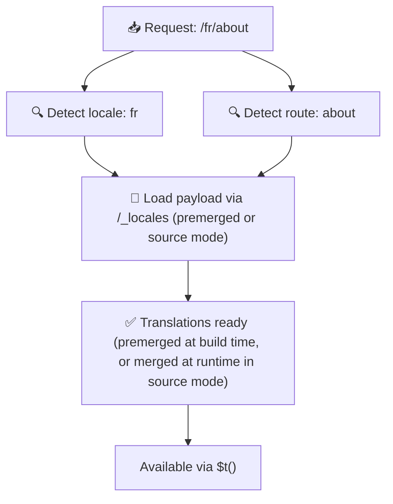

# 📂 Klasör yapısı kılavuzu

## 📖 Giriş

Çeviri dosyalarını etkili bir şekilde düzenlemek, ölçeklenebilir ve verimli bir uluslararasılaştırma (i18n) sistemi sürdürmek için esastır. `Nuxt I18n Micro`, kök seviyesi ve sayfaya özel çevirileri yönetmek için net bir yaklaşım sunarak bu süreci basitleştirir. Bu kılavuz, önerilen klasör yapısında sana rehberlik eder ve `Nuxt I18n Micro`'nun bu çevirileri nasıl işlediğini açıklar.

## 🗂️ Önerilen klasör yapısı

`Nuxt I18n Micro`, çevirileri kök seviyesi dosyalar ve `pages` dizini içindeki sayfaya özel dosyalar olarak düzenler. `translationPayloads.mode: 'premerged'` (varsayılan) ile kök seviyesi çeviriler derleme zamanında her sayfa dosyasıyla otomatik olarak birleştirilir. Böylece her sayfa, çalışma zamanı birleştirme yükü olmadan eksiksiz bir çeviri setine sahip olur.

`mode: 'source'` ile kaynak dosyalar Nitro varlıklarında ayrı kalır ve `/_locales` rotası aracılığıyla çalışma zamanında birleştirilir. [Sunucusuz yük çıktısı](/guides/performance#serverless-payload-output) sayfasına bak.

### 🔧 Temel yapı

Uyman gereken temel klasör yapısı örneği:

```text
locales/
├── pages/
│   ├── index/
│   │   ├── en.json
│   │   ├── fr.json
│   │   └── ar.json
│   ├── about/
│   │   ├── en.json
│   │   ├── fr.json
│   │   └── ar.json
├── en.json
├── fr.json
└── ar.json

```

### 📄 Yapı açıklaması

#### 1. 🌍 Kök seviyesi çeviri dosyaları

- **Yol:** `/locales/\{locale\}.json` (örn. `/locales/en.json`)
- **Amaç:** Bu dosyalar tüm uygulamada paylaşılan çevirileri içerir (gezinme menüleri, başlıklar, altbilgiler vb.). `mode: 'premerged'` (varsayılan) ile derleme zamanında her sayfaya özel dosyayla otomatik olarak birleştirilir; böylece sunucu, sayfa başına önceden oluşturulmuş tek bir dosya döner.

  **Örnek içerik (`/locales/en.json`):**

  ```json
  {
    "menu": {
      "home": "Home",
      "about": "About Us",
      "contact": "Contact"
    },
    "footer": {
      "copyright": "© 2024 Your Company"
    }
  }
  ```

#### 2. 📄 Sayfaya özel çeviri dosyaları

- **Yol:** `/locales/pages/\{routeName\}/\{locale\}.json` (örn. `/locales/pages/index/en.json`)
- **Amaç:** Bu dosyalar tek tek sayfalara özgü çevirileri içerir. `mode: 'premerged'` (varsayılan) ile kök seviyesi çeviriler derleme zamanında temel olarak birleştirilir; böylece her sayfa dosyası kendi kendine yeter hale gelir.

  **Örnek içerik (`/locales/pages/index/en.json`):**

  ```json
  {
    "title": "Welcome to Our Website",
    "description": "We offer a wide range of products and services to meet your needs."
  }
  ```

  **Örnek içerik (`/locales/pages/about/en.json`):**

  ```json
  {
    "title": "About Us",
    "description": "Learn more about our mission, vision, and values."
  }
  ```

### 📂 Dinamik rotalar ve iç içe yolları işleme

`Nuxt I18n Micro`, rotalardaki dinamik segmentleri ve iç içe yolları belirli bir yeniden adlandırma kuralı kullanarak düz bir klasör yapısına otomatik olarak dönüştürür. Bu, tüm çevirilerin tutarlı ve kolayca erişilebilir bir şekilde saklanmasını sağlar.

#### Dinamik rota çeviri klasörü yapısı

`/products/[id]` gibi dinamik rotalarla uğraşırken modül, dinamik segment `[id]`'yi dosya yapısı içinde statik bir biçime dönüştürür.

**Dinamik rotalar için örnek klasör yapısı:**

`/products/[id]` gibi bir rota için çeviri dosyaları `products-id` adlı bir klasörde saklanır:

```text
locales/pages/
├── products-id/
│   ├── en.json
│   ├── fr.json
│   └── ar.json

```

**İç içe dinamik rotalar için örnek klasör yapısı:**

`/products/key/[id]` gibi iç içe bir rota için çeviri dosyaları `products-key-id` adlı bir klasörde saklanır:

```text
locales/pages/
├── products-key-id/
│   ├── en.json
│   ├── fr.json
│   └── ar.json

```

**Çok seviyeli iç içe rotalar için örnek klasör yapısı:**

`/products/category/[id]/details` gibi daha karmaşık iç içe bir rota için çeviri dosyaları `products-category-id-details` adlı bir klasörde saklanır:

```text
locales/pages/
├── products-category-id-details/
│   ├── en.json
│   ├── fr.json
│   └── ar.json

```

### 🛠 Dizin yapısını özelleştirme

Çevirileri farklı bir dizinde saklamak istersen, `Nuxt I18n Micro` çeviri dosyalarının saklandığı dizini özelleştirmene olanak tanır. Bunu `nuxt.config.ts` dosyanda yapılandırabilirsin.

**Örnek: Çeviri dizinini özelleştirme**

```typescript
export default defineNuxtConfig({
  i18n: {
    translationDir: 'i18n', // Custom directory path
  },
})
```

Bu, `Nuxt I18n Micro`'ya çeviri dosyalarını varsayılan `/locales` dizini yerine `/i18n` dizininde aramasını söyler.

## ⚙️ Çeviriler nasıl yüklenir

### 🌍 Dinamik yerel ayar rotaları

`Nuxt I18n Micro`, çevirileri verimli şekilde yüklemek için dinamik yerel ayar rotalarını kullanır. Bir kullanıcı bir sayfayı ziyaret ettiğinde modül, uygun yerel ayarı belirler ve geçerli rota ile yerel ayara göre ilgili çeviri dosyalarını yükler.



Örneğin:

- `/en/index` sayfasını ziyaret etmek `/locales/pages/index/en.json`'dan çevirileri yükler.
- `/fr/about` sayfasını ziyaret etmek `/locales/pages/about/fr.json`'dan çevirileri yükler.

Bu yöntem, yalnızca gerekli çevirilerin yüklenmesini sağlar; hem sunucu yükünü hem de istemci tarafı performansı optimize eder.

### 💾 Önbellek ve önceden render

Performansı daha da artırmak için `Nuxt I18n Micro`, çeviri dosyalarının önbelleklenmesini ve önceden render edilmesini destekler:

- **Önbellek**: Bir çeviri dosyası yüklendikten sonra sonraki istekler için önbelleklenir; aynı veriyi tekrar tekrar getirme ihtiyacı azalır.
- **Önceden render**: Derleme sürecinde, yapılandırılmış tüm yerel ayarlar ve rotalar için çeviri dosyalarını önceden render edebilirsin. Böylece bunlar çalışma zamanı gecikmesi olmadan doğrudan sunucudan sunulur.

## 📝 En iyi uygulamalar

### 📂 Sayfaya özel dosyaları akıllıca kullan

Çevirileri düzenli tutmak için sayfaya özel dosyalardan yararlan. Bu, her sayfanın çevirilerini yalın ve hızlı yüklenir tutar; özellikle karmaşık veya büyük içeriğe sahip sayfalar için önemlidir.

### 🔑 Çeviri anahtarlarını tutarlı tut

Dosyalar arasında çeviri anahtarların için tutarlı adlandırma kuralları kullan. Bu, uygulaman büyüdükçe çevirileri yönetirken netliği korur ve sorunları önler.

### 🗂️ Çevirileri bağlama göre düzenle

Dosyaların içinde ilgili çevirileri bir arada grupla. Örneğin, tüm düğme etiketlerini `buttons` anahtarı altında, tüm form ilgili metinleri `forms` anahtarı altında gruplandır. Bu yalnızca okunabilirliği iyileştirmekle kalmaz, aynı zamanda farklı yerel ayarlarda çevirileri yönetmeyi de kolaylaştırır.

### ⚠️ İç içe geçme derinliği sınırı (2 seviye önerilir)

İstemci tarafı gezinme sırasında `Nuxt I18n Micro`, ayrılan ve giren sayfalardan çevirileri birleştirmek için optimize edilmiş 2 seviye derinlikte bir birleştirme kullanır. Bu, örtüşen iç içe anahtarların (örn. her iki sayfa da `common.*` altında anahtarlara sahipse) geçiş animasyonları sırasında korunmasını sağlar.

**Bu, standart `Bölüm → Anahtar → Değer` yapısı (2 seviye) için doğru çalışır:**

```json
// Page A translations
{ "common": { "fromA": "Text A" } }

// Page B translations
{ "common": { "fromB": "Text B" } }

// During transition, both are available:
// { "common": { "fromA": "Text A", "fromB": "Text B" } }
```

**Bununla birlikte, 3+ seviye iç içe geçme kullanırsan, geçişler sırasında daha derin anahtarların üzerine yazılabilir:**

```json
// Page A translations
{ "auth": { "form": { "login": "Login" } } }

// Page B translations
{ "auth": { "form": { "register": "Register" } } }

// During transition: "login" key is lost
// { "auth": { "form": { "register": "Register" } } }
```


### 🧹 Kullanılmayan çevirileri düzenli olarak temizle

Zamanla, özellikle özellikler kaldırıldığında veya yeniden yapılandırıldığında uygulamanda kullanılmayan çeviri anahtarları birikebilir. Çeviri dosyalarını yalın ve bakımı kolay tutmak için periyodik olarak gözden geçir ve temizle.
