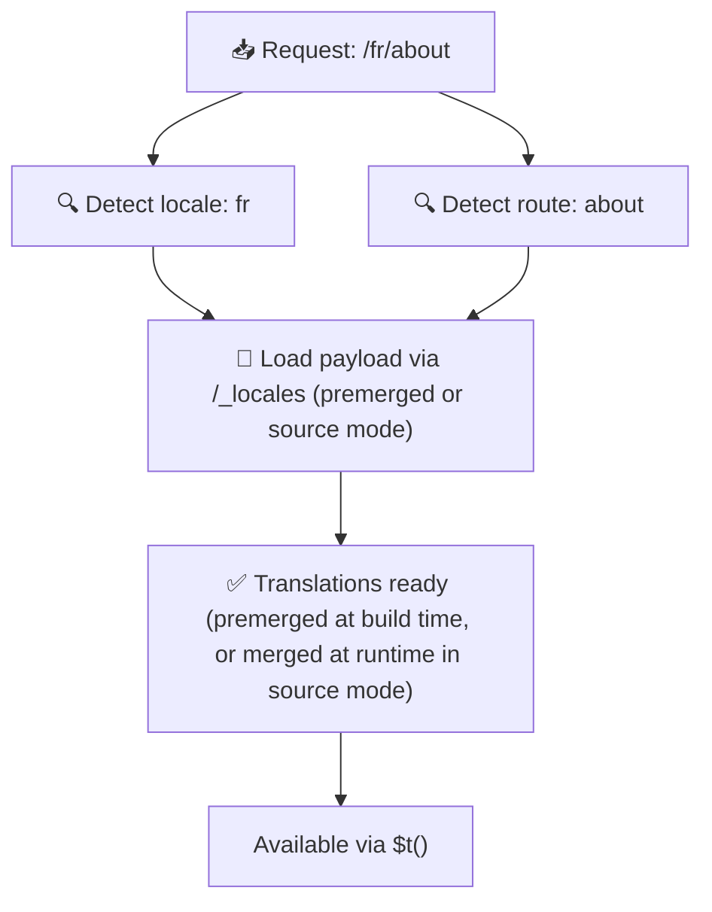

# 📂 Klasör Yapısı Kılavuzu

## 📖 Giriş

Çeviri dosyalarınızı etkin bir şekilde düzenlemek, ölçeklenebilir ve verimli bir uluslararasılaştırma (i18n) sistemi sürdürmek için önemlidir. `Nuxt I18n Micro`, kök seviyesi ve sayfaya özel çevirileri yönetmek için net bir yaklaşım sunarak bu süreci basitleştirir. Bu kılavuz, önerilen klasör yapısında size yol gösterecek ve `Nuxt I18n Micro`'nun bu çevirileri nasıl işlediğini açıklayacaktır.

## 🗂️ Önerilen Klasör Yapısı

`Nuxt I18n Micro`, çevirileri `pages` dizini içindeki kök seviyesi dosyalar ve sayfaya özel dosyalar olarak düzenler. `translationPayloads.mode: 'premerged'` (varsayılan) ile, kök seviyesi çeviriler derleme sırasında otomatik olarak her sayfa dosyasına birleştirilir, böylece her sayfanın çalışma zamanı birleştirme yükü olmadan tam bir çeviri setine sahip olur.

`mode: 'source'` ile, kaynak dosyalar Nitro varlıklarında ayrı kalır ve `/_locales` rotası aracılığıyla çalışma zamanında birleştirilir. Bkz. [Sunucusuz Yük Çıktısı](/guides/performance#serverless-payload-output).

### 🔧 Temel Yapı

İzlemeniz gereken klasör yapısına ilişkin temel bir örnek:

```text
locales/
├── pages/
│   ├── index/
│   │   ├── en.json
│   │   ├── fr.json
│   │   └── ar.json
│   ├── about/
│   │   ├── en.json
│   │   ├── fr.json
│   │   └── ar.json
├── en.json
├── fr.json
└── ar.json

```

### 📄 Yapının Açıklaması

#### 1. 🌍 Kök Seviyesi Çeviri Dosyaları

- **Yol:** `/locales/\{locale\}.json` (örn. `/locales/en.json`)
- **Amaç:** Bu dosyalar, uygulamanın tamamı arasında paylaşılan çevirileri içerir (gezinme menüleri, başlıklar, altbilgiler vb.). `mode: 'premerged'` (varsayılan) ile, derleme sırasında her sayfaya özel dosyaya otomatik olarak birleştirilirler, böylece sunucu her sayfa için önceden oluşturulmuş tek bir dosya döndürür.

  **Örnek İçerik (`/locales/en.json`):**

  ```json
  {
    "menu": {
      "home": "Home",
      "about": "About Us",
      "contact": "Contact"
    },
    "footer": {
      "copyright": "© 2024 Your Company"
    }
  }
  ```

#### 2. 📄 Sayfaya Özel Çeviri Dosyaları

- **Yol:** `/locales/pages/\{routeName\}/\{locale\}.json` (örn. `/locales/pages/index/en.json`)
- **Amaç:** Bu dosyalar, tek tek sayfalara özgü çevirileri içerir. `mode: 'premerged'` (varsayılan) ile, kök seviyesi çeviriler derleme sırasında taban olarak birleştirilir, böylece her sayfa dosyası kendi kendine yeterli hale gelir.

  **Örnek İçerik (`/locales/pages/index/en.json`):**

  ```json
  {
    "title": "Welcome to Our Website",
    "description": "We offer a wide range of products and services to meet your needs."
  }
  ```

  **Örnek İçerik (`/locales/pages/about/en.json`):**

  ```json
  {
    "title": "About Us",
    "description": "Learn more about our mission, vision, and values."
  }
  ```

### 📂 Dinamik Rotaları ve İç İçe Yolları İşleme

`Nuxt I18n Micro`, rotalardaki dinamik segmentleri ve iç içe yolları belirli bir yeniden adlandırma kuralı kullanarak düz bir klasör yapısına otomatik olarak dönüştürür. Bu, tüm çevirilerin tutarlı ve kolay erişilebilir bir şekilde depolanmasını sağlar.

#### Dinamik Rota Çeviri Klasör Yapısı

`/products/[id]` gibi dinamik rotalarla uğraşırken, modül dinamik segment `[id]`'yi dosya yapısı içinde statik bir formata dönüştürür.

**Dinamik Rotalar için Örnek Klasör Yapısı:**

`/products/[id]` gibi bir rota için, çeviri dosyaları `products-id` adlı bir klasörde depolanır:

```text
locales/pages/
├── products-id/
│   ├── en.json
│   ├── fr.json
│   └── ar.json

```

**İç İçe Dinamik Rotalar için Örnek Klasör Yapısı:**

`/products/key/[id]` gibi iç içe bir rota için, çeviri dosyaları `products-key-id` adlı bir klasörde depolanır:

```text
locales/pages/
├── products-key-id/
│   ├── en.json
│   ├── fr.json
│   └── ar.json

```

**Çok Seviyeli İç İçe Rotalar için Örnek Klasör Yapısı:**

`/products/category/[id]/details` gibi daha karmaşık bir iç içe rota için, çeviri dosyaları `products-category-id-details` adlı bir klasörde depolanır:

```text
locales/pages/
├── products-category-id-details/
│   ├── en.json
│   ├── fr.json
│   └── ar.json

```

### 🛠 Dizin Yapısını Özelleştirme

Çevirileri farklı bir dizinde depolamayı tercih ediyorsanız, `Nuxt I18n Micro` çeviri dosyalarının depolandığı dizini özelleştirmenize olanak tanır. Bunu `nuxt.config.ts` dosyanızda yapılandırabilirsiniz.

**Örnek: Çeviri Dizinini Özelleştirme**

```typescript
export default defineNuxtConfig({
  i18n: {
    translationDir: 'i18n', // Custom directory path
  },
})
```

Bu, `Nuxt I18n Micro`'ya varsayılan `/locales` dizini yerine `/i18n` dizininde çeviri dosyalarını aramasını söyleyecektir.

## ⚙️ Çeviriler Nasıl Yüklenir

### 🌍 Dinamik Yerel Ayar Rotaları

`Nuxt I18n Micro`, çevirileri verimli bir şekilde yüklemek için dinamik yerel ayar rotalarını kullanır. Bir kullanıcı bir sayfayı ziyaret ettiğinde, modül uygun yerel ayarı belirler ve geçerli rota ve yerel ayara göre karşılık gelen çeviri dosyalarını yükler.



Örneğin:

- `/en/index`'i ziyaret etmek `/locales/pages/index/en.json`'dan çevirileri yükleyecektir.
- `/fr/about`'u ziyaret etmek `/locales/pages/about/fr.json`'dan çevirileri yükleyecektir.

Bu yöntem, yalnızca gerekli çevirilerin yüklenmesini sağlayarak hem sunucu yükünü hem de istemci tarafı performansını optimize eder.

### 💾 Önbellekleme ve Ön İşleme

Performansı daha da artırmak için `Nuxt I18n Micro`, çeviri dosyalarının önbelleklenmesini ve ön işlenmesini destekler:

- **Önbellekleme**: Bir çeviri dosyası yüklendikten sonra, sonraki istekler için önbelleğe alınır ve aynı verileri tekrar tekrar getirme ihtiyacı azalır.
- **Ön İşleme**: Derleme işlemi sırasında, yapılandırılmış tüm yerel ayarlar ve rotalar için çeviri dosyalarını önceden render edebilirsiniz, böylece çalışma zamanı gecikmesi olmadan doğrudan sunucudan sunulabilirler.

## 📝 En İyi Uygulamalar

### 📂 Sayfaya Özel Dosyaları Akıllıca Kullanın

Çevirileri düzenli tutmak için sayfaya özel dosyalardan yararlanın. Bu, her sayfanın çevirilerini yalın ve hızlı yüklenir tutar; özellikle karmaşık veya büyük içerikli sayfalar için önemlidir.

### 🔑 Çeviri Anahtarlarını Tutarlı Tutun

Dosyalar arasında çeviri anahtarlarınız için tutarlı adlandırma kuralları kullanın. Bu, netliği korumaya yardımcı olur ve özellikle uygulamanız büyüdükçe çevirileri yönetirken sorunları önler.

### 🗂️ Çevirileri Bağlama Göre Düzenleyin

Dosyalarınızda ilgili çevirileri birlikte gruplayın. Örneğin, tüm düğme etiketlerini bir `buttons` anahtarı altında ve tüm form ile ilgili metinleri bir `forms` anahtarı altında gruplayın. Bu, yalnızca okunabilirliği artırmakla kalmaz, aynı zamanda farklı yerel ayarlarda çevirileri yönetmeyi de kolaylaştırır.

### ⚠️ İç İçe Derinliği Sınırı (2 Seviye Önerilir)

İstemci tarafı gezinme sırasında, `Nuxt I18n Micro`, ayrılan ve giren sayfalardan çevirileri birleştirmek için optimize edilmiş 2 seviye derin bir birleştirme kullanır. Bu, çakışan iç içe anahtarların (örneğin, her iki sayfanın da `common.*` altında anahtarları olması) geçiş animasyonları sırasında korunmasını sağlar.

**Bu, standart `Section → Key → Value` yapısı (2 seviye) için doğru çalışır:**

```json
// Page A translations
{ "common": { "fromA": "Text A" } }

// Page B translations
{ "common": { "fromB": "Text B" } }

// During transition, both are available:
// { "common": { "fromA": "Text A", "fromB": "Text B" } }
```

**Ancak, 3+ seviyeli iç içe yerleştirme kullanırsanız, geçişler sırasında daha derin anahtarların üzerine yazılabilir:**

```json
// Page A translations
{ "auth": { "form": { "login": "Login" } } }

// Page B translations
{ "auth": { "form": { "register": "Register" } } }

// During transition: "login" key is lost
// { "auth": { "form": { "register": "Register" } } }
```

<Tip>

</Tip>

### 🧹 Kullanılmayan Çevirileri Düzenli Olarak Temizleyin

Zamanla, özellikle özellikler kaldırılırsa veya yeniden yapılandırılırsa uygulamanız kullanılmayan çeviri anahtarları biriktirebilir. Çeviri dosyalarınızı yalın ve bakımı kolay tutmak için periyodik olarak gözden geçirin ve temizleyin.
