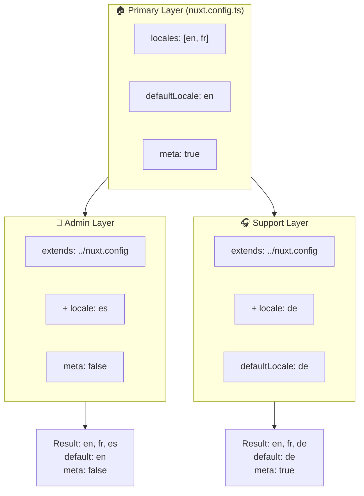

# 🗂️ `Nuxt I18n Micro`'da katmanlar

## 📖 Katmanlara giriş

`Nuxt I18n Micro`'daki katmanlar; yerelleştirme ayarlarını uygulamanın farklı bölümlerinde esnek bir şekilde yönetip özelleştirmeni sağlar. Farklı katmanlar tanımlayarak sitenin belirli bölümleri için ayarları geçersiz kılabilir veya uygulamanın diğer bölümleri tarafından genişletilebilecek yeniden kullanılabilir temel yapılandırmalar oluşturabilirsin.

### Katman kalıtım akışı



## 🛠️ Birincil yapılandırma katmanı

**Birincil yapılandırma katmanı**, tüm uygulaman için varsayılan yerelleştirme ayarlarını kurduğun yerdir. Bu katman, desteklenen yerel ayarlar, varsayılan dil ve diğer kritik i18n ayarları dahil olmak üzere global yapılandırmayı tanımladığı için esastır.

### 📄 Örnek: Birincil yapılandırma katmanını tanımlama

`nuxt.config.ts` dosyanda birincil yapılandırma katmanını nasıl tanımlayabileceğine bir örnek:

```typescript
export default defineNuxtConfig({
  i18n: {
    locales: [
      { code: 'en', iso: 'en-EN', dir: 'ltr' },
      { code: 'fr', iso: 'fr-FR', dir: 'ltr' },
      { code: 'ar', iso: 'ar-SA', dir: 'rtl' },
    ],
    defaultLocale: 'en', // The default locale for the entire app
    translationDir: 'locales', // Directory where translations are stored
    meta: true, // Automatically generate SEO-related meta tags like `alternate`
    autoDetectLanguage: true, // Automatically detect and use the user's preferred language
  },
})
```

## 🌱 Alt katmanlar

Alt katmanlar; birincil yapılandırmayı uygulamanın belirli bölümleri için genişletmek veya geçersiz kılmak için kullanılır. Örneğin, sitenin belirli bir bölümü için ek yerel ayarlar eklemek veya varsayılan yerel ayarı değiştirmek isteyebilirsin. Alt katmanlar, uygulamanın farklı bölümlerinin farklı yerelleştirme gereksinimleri olabilecek modüler uygulamalarda özellikle kullanışlıdır.

### 📄 Örnek: Bir alt katmanda birincil katmanı genişletme

Sitenin ek yerel ayarları desteklemesi gereken bir bölümü olduğunu veya belirli bir bağlamda belirli bir yerel ayarı devre dışı bırakmak istediğini varsayalım. Birincil yapılandırma katmanını genişleterek bunu şöyle yapabilirsin:

```typescript
// basic/nuxt.config.ts (Primary Layer)
export default defineNuxtConfig({
  i18n: {
    locales: [
      { code: 'en', iso: 'en-EN', dir: 'ltr' },
      { code: 'fr', iso: 'fr-FR', dir: 'ltr' },
    ],
    defaultLocale: 'en',
    meta: true,
    translationDir: 'locales',
  },
})
```

```typescript
// extended/nuxt.config.ts (Child Layer)
export default defineNuxtConfig({
  extends: '../basic', // Inherit the base configuration from the 'basic' layer
  i18n: {
    locales: [
      { code: 'en', iso: 'en-EN', dir: 'ltr' }, // Inherited from the base layer
      { code: 'fr', iso: 'fr-FR', dir: 'ltr' }, // Inherited from the base layer
      { code: 'de', iso: 'de-DE', dir: 'ltr' }, // Added in the child layer
    ],
    defaultLocale: 'fr', // Override the default locale to French for this section
    autoDetectLanguage: false, // Disable automatic language detection in this section
  },
})
```

### 🌐 Modüler bir uygulamada katmanları kullanma

Daha büyük, modüler bir Nuxt uygulamasında her biri kendi i18n ayarlarını gerektiren birden çok bölümün olabilir. Katmanlardan yararlanarak temiz ve ölçeklenebilir bir yapılandırma yapısı sürdürebilirsin.

### 📄 Örnek: Modüler bir uygulamada katmanlı yapılandırma

Ana web sitesi, yönetim paneli ve müşteri destek portalı gibi farklı bölümleri olan bir e-ticaret sitesi olduğunu hayal et. Her bölüm farklı bir yerel ayar seti veya diğer i18n ayarlarına ihtiyaç duyabilir.

#### **Birincil katman (global yapılandırma):**

```typescript
// nuxt.config.ts
export default defineNuxtConfig({
  i18n: {
    locales: [
      { code: 'en', iso: 'en-EN', dir: 'ltr' },
      { code: 'fr', iso: 'fr-FR', dir: 'ltr' },
    ],
    defaultLocale: 'en',
    meta: true,
    translationDir: 'locales',
    autoDetectLanguage: true,
  },
})
```

#### **Yönetim paneli için alt katman:**

```typescript
// admin/nuxt.config.ts
export default defineNuxtConfig({
  extends: '../nuxt.config', // Inherit the global settings
  i18n: {
    locales: [
      { code: 'en', iso: 'en-EN', dir: 'ltr' }, // Inherited
      { code: 'fr', iso: 'fr-FR', dir: 'ltr' }, // Inherited
      { code: 'es', iso: 'es-ES', dir: 'ltr' }, // Specific to the admin panel
    ],
    defaultLocale: 'en',
    meta: false, // Disable automatic meta generation in the admin panel
  },
})
```

#### **Müşteri destek portalı için alt katman:**

```typescript
// support/nuxt.config.ts
export default defineNuxtConfig({
  extends: '../nuxt.config', // Inherit the global settings
  i18n: {
    locales: [
      { code: 'en', iso: 'en-EN', dir: 'ltr' }, // Inherited
      { code: 'fr', iso: 'fr-FR', dir: 'ltr' }, // Inherited
      { code: 'de', iso: 'de-DE', dir: 'ltr' }, // Specific to the support portal
    ],
    defaultLocale: 'de', // Default to German in the support portal
    autoDetectLanguage: false, // Disable automatic language detection
  },
})
```

Bu modüler örnekte:

- Her bölüm (admin, support) kendi i18n ayarlarına sahiptir ama hepsi temel yapılandırmayı devralır.
- Yönetim paneli, İspanyolca'yı (`es`) yerel ayar olarak ekler ve meta etiketi üretimini devre dışı bırakır.
- Destek portalı, Almanca'yı (`de`) yerel ayar olarak ekler ve kullanıcı arayüzü için Almanca'yı varsayılan yapar.

## 📝 Katmanları kullanmak için en iyi uygulamalar

- **🔧 Birincil katmanı basit tut:** Birincil katman, uygulaman genelinde küresel olarak uygulanan en yaygın kullanılan ayarları içermelidir. Tutarlılığı sağlamak için basit tut.
- **⚙️ Belirli özelleştirmeler için alt katmanları kullan:** Yalnızca gerektiğinde alt katmanlarda ayarları geçersiz kıl veya genişlet. Bu yaklaşım, yapılandırmanda gereksiz karmaşıklığı önler.
- **📚 Katmanlarını belgele:** Projenin her katmanının amacını ve özelliklerini net bir şekilde belgele. Bu, netliği korur ve başkalarının (veya gelecekteki senin) yapılandırmayı anlamasını kolaylaştırır.
