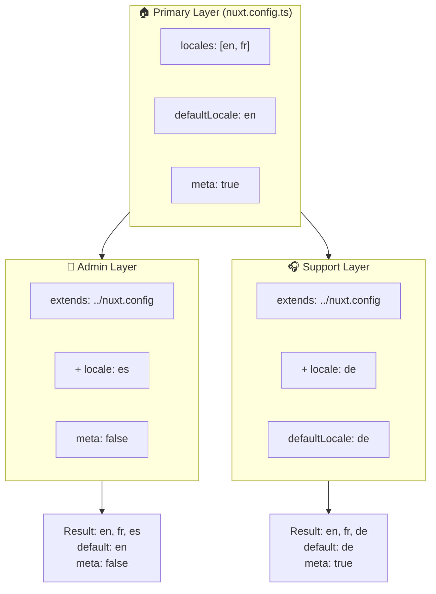

# 🗂️ `Nuxt I18n Micro`'da Katmanlar

## 📖 Katmanlara Giriş

`Nuxt I18n Micro`'daki katmanlar, uygulamanızın farklı bölümleri arasında yerelleştirme ayarlarını esnek bir şekilde yönetmenize ve özelleştirmenize olanak tanır. Farklı katmanlar tanımlayarak, sitenin belirli bölümleri için ayarları geçersiz kılmak veya uygulamanızın diğer bölümleri tarafından genişletilebilen yeniden kullanılabilir temel yapılandırmalar oluşturmak gibi çeşitli bağlamlar için yapılandırmayı ayarlayabilirsiniz.

### Katman Kalıtım Akışı



## 🛠️ Birincil Yapılandırma Katmanı

**Birincil Yapılandırma Katmanı**, tüm uygulamanız için varsayılan yerelleştirme ayarlarını kurduğunuz yerdir. Bu katman, desteklenen yerel ayarlar, varsayılan dil ve diğer kritik i18n ayarları dahil olmak üzere global yapılandırmayı tanımladığı için gereklidir.

### 📄 Örnek: Birincil Yapılandırma Katmanını Tanımlama

Birincil yapılandırma katmanını `nuxt.config.ts` dosyanızda nasıl tanımlayabileceğinize dair bir örnek:

```typescript
export default defineNuxtConfig({
  i18n: {
    locales: [
      { code: 'en', iso: 'en-EN', dir: 'ltr' },
      { code: 'fr', iso: 'fr-FR', dir: 'ltr' },
      { code: 'ar', iso: 'ar-SA', dir: 'rtl' },
    ],
    defaultLocale: 'en', // The default locale for the entire app
    translationDir: 'locales', // Directory where translations are stored
    meta: true, // Automatically generate SEO-related meta tags like `alternate`
    autoDetectLanguage: true, // Automatically detect and use the user's preferred language
  },
})
```

## 🌱 Alt Katmanlar

Alt katmanlar, uygulamanızın belirli bölümleri için birincil yapılandırmayı genişletmek veya geçersiz kılmak için kullanılır. Örneğin, ek yerel ayarlar eklemek veya sitenizin belirli bir bölümü için varsayılan yerel ayarı değiştirmek isteyebilirsiniz. Alt katmanlar, özellikle uygulamanın farklı bölümlerinin farklı yerelleştirme gereksinimleri olabilen modüler uygulamalarda kullanışlıdır.

### 📄 Örnek: Alt Katmanda Birincil Katmanı Genişletme

Sitenizin ek yerel ayarları desteklemesi gereken bir bölümünüz olduğunu veya belirli bir bağlamda belirli bir yerel ayarı devre dışı bırakmak istediğinizi varsayalım. Birincil yapılandırma katmanını genişleterek bunu nasıl başarabileceğiniz:

```typescript
// basic/nuxt.config.ts (Primary Layer)
export default defineNuxtConfig({
  i18n: {
    locales: [
      { code: 'en', iso: 'en-EN', dir: 'ltr' },
      { code: 'fr', iso: 'fr-FR', dir: 'ltr' },
    ],
    defaultLocale: 'en',
    meta: true,
    translationDir: 'locales',
  },
})
```

```typescript
// extended/nuxt.config.ts (Child Layer)
export default defineNuxtConfig({
  extends: '../basic', // Inherit the base configuration from the 'basic' layer
  i18n: {
    locales: [
      { code: 'en', iso: 'en-EN', dir: 'ltr' }, // Inherited from the base layer
      { code: 'fr', iso: 'fr-FR', dir: 'ltr' }, // Inherited from the base layer
      { code: 'de', iso: 'de-DE', dir: 'ltr' }, // Added in the child layer
    ],
    defaultLocale: 'fr', // Override the default locale to French for this section
    autoDetectLanguage: false, // Disable automatic language detection in this section
  },
})
```

### 🌐 Modüler Bir Uygulamada Katmanları Kullanma

Daha büyük, modüler bir Nuxt uygulamasında, her biri kendi i18n ayarlarını gerektiren birden fazla bölümünüz olabilir. Katmanlardan yararlanarak temiz ve ölçeklenebilir bir yapılandırma yapısını koruyabilirsiniz.

### 📄 Örnek: Modüler Bir Uygulamada Katmanlı Yapılandırma

Ana web sitesi, yönetici paneli ve müşteri destek portalı gibi ayrı bölümleri olan bir e-ticaret sitenizin olduğunu düşünün. Her bölüm farklı bir yerel ayar seti veya diğer i18n ayarlarına ihtiyaç duyabilir.

#### **Birincil Katman (Global Yapılandırma):**

```typescript
// nuxt.config.ts
export default defineNuxtConfig({
  i18n: {
    locales: [
      { code: 'en', iso: 'en-EN', dir: 'ltr' },
      { code: 'fr', iso: 'fr-FR', dir: 'ltr' },
    ],
    defaultLocale: 'en',
    meta: true,
    translationDir: 'locales',
    autoDetectLanguage: true,
  },
})
```

#### **Yönetici Paneli için Alt Katman:**

```typescript
// admin/nuxt.config.ts
export default defineNuxtConfig({
  extends: '../nuxt.config', // Inherit the global settings
  i18n: {
    locales: [
      { code: 'en', iso: 'en-EN', dir: 'ltr' }, // Inherited
      { code: 'fr', iso: 'fr-FR', dir: 'ltr' }, // Inherited
      { code: 'es', iso: 'es-ES', dir: 'ltr' }, // Specific to the admin panel
    ],
    defaultLocale: 'en',
    meta: false, // Disable automatic meta generation in the admin panel
  },
})
```

#### **Müşteri Destek Portalı için Alt Katman:**

```typescript
// support/nuxt.config.ts
export default defineNuxtConfig({
  extends: '../nuxt.config', // Inherit the global settings
  i18n: {
    locales: [
      { code: 'en', iso: 'en-EN', dir: 'ltr' }, // Inherited
      { code: 'fr', iso: 'fr-FR', dir: 'ltr' }, // Inherited
      { code: 'de', iso: 'de-DE', dir: 'ltr' }, // Specific to the support portal
    ],
    defaultLocale: 'de', // Default to German in the support portal
    autoDetectLanguage: false, // Disable automatic language detection
  },
})
```

Bu modüler örnekte:

- Her bölüm (admin, support) kendi i18n ayarlarına sahiptir, ancak hepsi temel yapılandırmayı devralır.
- Yönetici paneli, İspanyolca'yı (`es`) bir yerel ayar olarak ekler ve meta etiketi oluşturmayı devre dışı bırakır.
- Destek portalı, Almanca'yı (`de`) bir yerel ayar olarak ekler ve kullanıcı arayüzü için varsayılan olarak Almanca'yı kullanır.

## 📝 Katmanları Kullanmak için En İyi Uygulamalar

- **🔧 Birincil Katmanı Basit Tutun:** Birincil katman, uygulamanız genelinde global olarak geçerli olan en yaygın kullanılan ayarları içermelidir. Tutarlılığı sağlamak için basit tutun.
- **⚙️ Belirli Özelleştirmeler için Alt Katmanları Kullanın:** Yalnızca gerektiğinde alt katmanlardaki ayarları geçersiz kılın veya genişletin. Bu yaklaşım, yapılandırmanızda gereksiz karmaşıklığı önler.
- **📚 Katmanlarınızı Belgeleyin:** Her katmanın amacını ve ayrıntılarını projenizde açıkça belgeleyin. Bu, netliği korumaya yardımcı olacak ve başkalarının (veya gelecekteki sizin) yapılandırmayı anlamasını kolaylaştıracaktır.
