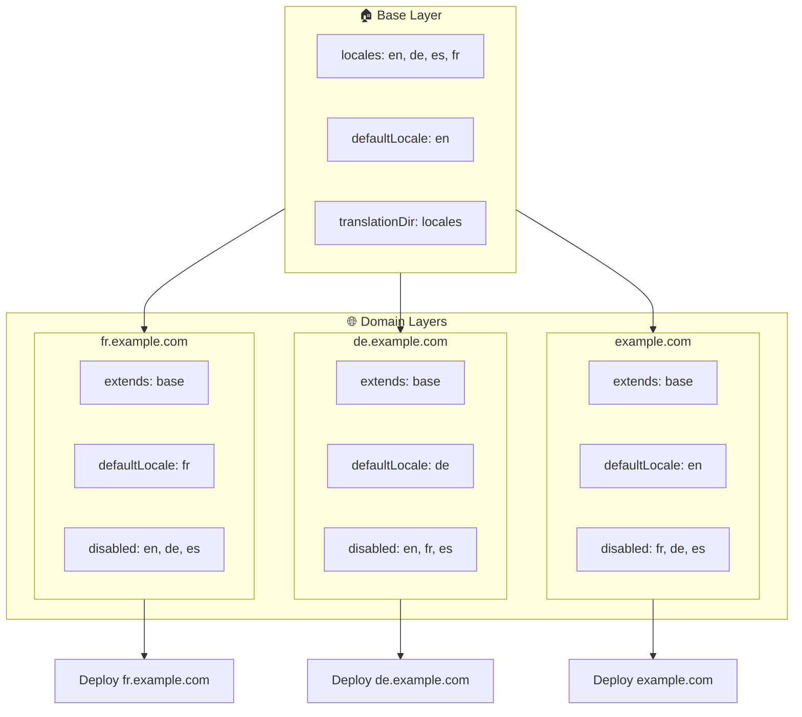

# 🌍 `Nuxt I18n Micro` ile katmanlar kullanarak çoklu alan adı yerel ayarları kurma

## 📝 Giriş

`Nuxt I18n Micro`'daki katmanlardan yararlanarak, esnek ve bakımı kolay çoklu alan adı yerelleştirme kurulumu oluşturabilirsin. Bu yaklaşım; karmaşık işlevlere ihtiyaç duymadan alan yönetimini basitleştirmenin yanı sıra verimli yük dağıtımına ve proje karmaşıklığının azalmasına olanak tanır. Farklı yerel ayarlar için ayrı projeler çalıştırarak uygulaman kolayca ölçeklenebilir ve birden çok alan adı üzerinde değişen yerel ayar gereksinimlerine uyum sağlar. Bu, küresel uygulamalar için sağlam ve ölçeklenebilir bir çözüm sunar.

## 🎯 Hedef

Alt katmanlardaki yapılandırmaları özelleştirerek farklı alan adlarının belirli yerel ayarlara hizmet ettiği bir kurulum oluşturmak. Bu yöntem, Nuxt'un katman sisteminden yararlanır ve her alan adı için temel bir yapılandırmayı korurken bunu genişletmeni veya değiştirmeni sağlar.

### Çoklu alan adı mimarisi



## 🛠 Çoklu alan adı yerel ayarlarını uygulama adımları

### 1. **Temel katmanı oluştur**

Uygulaman için tüm ortak yerel ayar ayarlarını içeren temel bir yapılandırma katmanı oluşturmakla başla. Bu yapılandırma, diğer alan adına özel yapılandırmalar için temel oluşturur.

#### **Temel katman yapılandırması**

`base/nuxt.config.ts` temel yapılandırma dosyasını oluştur:

```typescript
// base/nuxt.config.ts

export default defineNuxtConfig({
  i18n: {
    locales: [
      { code: 'en', iso: 'en-US', dir: 'ltr' },
      { code: 'de', iso: 'de-DE', dir: 'ltr' },
      { code: 'es', iso: 'es-ES', dir: 'ltr' },
    ],
    defaultLocale: 'en',
    translationDir: 'locales',
    meta: true,
    autoDetectLanguage: true,
  },
})
```

### 2. **Alan adına özel alt katmanlar oluştur**

Her alan adı için, o alan adının belirli gereksinimlerini karşılamak üzere temel yapılandırmayı değiştiren bir alt katman oluştur. Belirli bir alan adı için gerekmeyen yerel ayarları devre dışı bırakabilirsin.

#### **Örnek: Fransızca alan adı yapılandırması**

`fr/nuxt.config.ts` içinde Fransızca alan adı için bir alt katman yapılandırması oluştur:

```typescript
// fr/nuxt.config.ts

export default defineNuxtConfig({
  extends: '../base', // Inherit from the base configuration

  i18n: {
    locales: [
      { code: 'en', iso: 'en-US', dir: 'ltr', disabled: true }, // Disable English
      { code: 'fr', iso: 'fr-FR', dir: 'ltr' }, // Add and enable the French locale
      { code: 'de', iso: 'de-DE', dir: 'ltr', disabled: true }, // Disable German
      { code: 'es', iso: 'es-ES', dir: 'ltr', disabled: true }, // Disable Spanish
    ],
    defaultLocale: 'fr', // Set French as the default locale
    autoDetectLanguage: false, // Disable automatic language detection
  },
})
```

#### **Örnek: Almanca alan adı yapılandırması**

Benzer şekilde, `de/nuxt.config.ts` içinde Almanca alan adı için bir alt katman yapılandırması oluştur:

```typescript
// de/nuxt.config.ts

export default defineNuxtConfig({
  extends: '../base', // Inherit from the base configuration

  i18n: {
    locales: [
      { code: 'en', iso: 'en-US', dir: 'ltr', disabled: true }, // Disable English
      { code: 'fr', iso: 'fr-FR', dir: 'ltr', disabled: true }, // Disable French
      { code: 'de', iso: 'de-DE', dir: 'ltr' }, // Use the German locale
      { code: 'es', iso: 'es-ES', dir: 'ltr', disabled: true }, // Disable Spanish
    ],
    defaultLocale: 'de', // Set German as the default locale
    autoDetectLanguage: false, // Disable automatic language detection
  },
})
```

### 3. **Uygulamayı her alan adı için dağıt**

Uygulamayı her alan adı için uygun yapılandırmayla dağıt. Örneğin:

- `fr` katman yapılandırmasını `fr.example.com` adresine dağıt.
- `de` katman yapılandırmasını `de.example.com` adresine dağıt.

### 4. **Farklı yerel ayarlar için birden çok proje kur**

Her yerel ayar ve alan adı için uygulamanın ayrı bir örneğini çalıştırman gerekir. Bu, her alan adının doğru yerel ayar yapılandırmasını sunmasını sağlar; yük dağılımını optimize eder ve projenin yapısını basitleştirir. Her yerel ayara özel birden çok proje çalıştırarak yapılandırmalar arasında temiz bir ayrımı koruyabilir ve genel kurulumun karmaşıklığını azaltabilirsin.

### 5. **Yönlendirmeyi alan adına göre yapılandır**

Yönlendirmenin; kullanıcıları eriştikleri alan adına göre doğru projeye yönlendirmek için yapılandırıldığından emin ol. Bu, her alan adının uygun yerel ayarı sunmasını sağlar; kullanıcı deneyimini geliştirir ve farklı bölgelerde tutarlılığı korur.

### 6. **Dağıt ve doğrula**

Katmanları yapılandırıp ilgili alan adlarına dağıttıktan sonra, her alan adının doğru yerel ayarı sunduğundan emin ol. Alan adına bağlı olarak doğru yerel ayarın yüklendiğini onaylamak için uygulamayı kapsamlı bir şekilde test et.

## 📝 En iyi uygulamalar

- **Temel yapılandırmayı genel tut**: Temel yapılandırma, tüm alan adlarına uygulanabilir genel ayarları içermelidir.
- **Alan adına özel mantığı izole et**: Netliği ve sorumluluk ayrımını korumak için alan adına özel yapılandırmaları ilgili katmanlarında tut.

## 🎉 Sonuç

`Nuxt I18n Micro`'daki katmanlardan yararlanarak esnek ve bakımı kolay bir çoklu alan adı yerelleştirme kurulumu oluşturabilirsin. Bu yaklaşım yalnızca karmaşık alan yönetimi işlevlerine ihtiyacı ortadan kaldırmakla kalmaz, aynı zamanda yükü verimli bir şekilde dağıtmana ve proje karmaşıklığını azaltmana da olanak tanır. Farklı yerel ayarlar için ayrı projeler çalıştırmak; uygulamanın kolayca ölçeklenebilmesini ve çeşitli alan adları üzerinde farklı yerel ayar gereksinimlerine uyum sağlamasını temin eder. Bu, küresel uygulamalar için sağlam ve ölçeklenebilir bir çözüm sunar.
