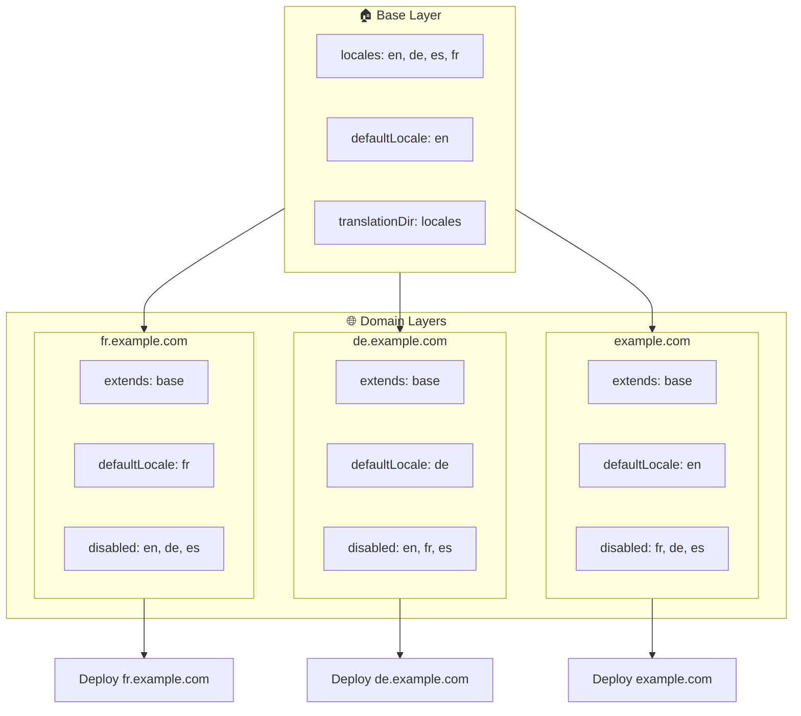

# 🌍 Katmanları Kullanarak `Nuxt I18n Micro` ile Çoklu Etki Alanı Yerel Ayarlarını Kurma

## 📝 Giriş

`Nuxt I18n Micro`'daki katmanlardan yararlanarak, esnek ve bakımı kolay bir çok etki alanlı yerelleştirme kurulumu oluşturabilirsiniz. Bu yaklaşım, karmaşık işlevsellik ihtiyacını ortadan kaldırarak etki alanı yönetimini basitleştirmekle kalmaz, aynı zamanda verimli yük dağıtımına ve proje karmaşıklığının azalmasına da olanak tanır. Farklı yerel ayarlar için ayrı projeler çalıştırarak, uygulamanız birden fazla etki alanı arasında değişen yerel ayar gereksinimlerine kolayca ölçeklenebilir ve uyum sağlayabilir, global uygulamalar için sağlam ve ölçeklenebilir bir çözüm sunar.

## 🎯 Amaç

Alt katmanlardaki yapılandırmaları özelleştirerek farklı etki alanlarının belirli yerel ayarları hizmet ettiği bir kurulum oluşturmak. Bu yöntem, Nuxt'un katmanlama sisteminden yararlanarak temel bir yapılandırmayı korurken her etki alanı için genişletmenize veya değiştirmenize olanak tanır.

### Çok Etki Alanlı Mimari



## 🛠 Çoklu Etki Alanı Yerel Ayarlarını Uygulama Adımları

### 1. **Temel Katmanı Oluşturun**

Uygulamanız için tüm ortak yerel ayar ayarlarını içeren bir temel yapılandırma katmanı oluşturarak başlayın. Bu yapılandırma, diğer etki alanına özel yapılandırmalar için temel olarak hizmet edecektir.

#### **Temel Katman Yapılandırması**

Temel yapılandırma dosyasını `base/nuxt.config.ts` oluşturun:

```typescript
// base/nuxt.config.ts

export default defineNuxtConfig({
  i18n: {
    locales: [
      { code: 'en', iso: 'en-US', dir: 'ltr' },
      { code: 'de', iso: 'de-DE', dir: 'ltr' },
      { code: 'es', iso: 'es-ES', dir: 'ltr' },
    ],
    defaultLocale: 'en',
    translationDir: 'locales',
    meta: true,
    autoDetectLanguage: true,
  },
})
```

### 2. **Etki Alanına Özel Alt Katmanlar Oluşturun**

Her etki alanı için, temel yapılandırmayı o etki alanının belirli gereksinimlerini karşılayacak şekilde değiştiren bir alt katman oluşturun. Belirli bir etki alanı için gerekli olmayan yerel ayarları devre dışı bırakabilirsiniz.

#### **Örnek: Fransız Etki Alanı için Yapılandırma**

`fr/nuxt.config.ts` içinde Fransız etki alanı için bir alt katman yapılandırması oluşturun:

```typescript
// fr/nuxt.config.ts

export default defineNuxtConfig({
  extends: '../base', // Inherit from the base configuration

  i18n: {
    locales: [
      { code: 'en', iso: 'en-US', dir: 'ltr', disabled: true }, // Disable English
      { code: 'fr', iso: 'fr-FR', dir: 'ltr' }, // Add and enable the French locale
      { code: 'de', iso: 'de-DE', dir: 'ltr', disabled: true }, // Disable German
      { code: 'es', iso: 'es-ES', dir: 'ltr', disabled: true }, // Disable Spanish
    ],
    defaultLocale: 'fr', // Set French as the default locale
    autoDetectLanguage: false, // Disable automatic language detection
  },
})
```

#### **Örnek: Alman Etki Alanı için Yapılandırma**

Benzer şekilde, Alman etki alanı için `de/nuxt.config.ts` içinde bir alt katman yapılandırması oluşturun:

```typescript
// de/nuxt.config.ts

export default defineNuxtConfig({
  extends: '../base', // Inherit from the base configuration

  i18n: {
    locales: [
      { code: 'en', iso: 'en-US', dir: 'ltr', disabled: true }, // Disable English
      { code: 'fr', iso: 'fr-FR', dir: 'ltr', disabled: true }, // Disable French
      { code: 'de', iso: 'de-DE', dir: 'ltr' }, // Use the German locale
      { code: 'es', iso: 'es-ES', dir: 'ltr', disabled: true }, // Disable Spanish
    ],
    defaultLocale: 'de', // Set German as the default locale
    autoDetectLanguage: false, // Disable automatic language detection
  },
})
```

### 3. **Uygulamayı Her Etki Alanı için Dağıtın**

Her etki alanı için uygun yapılandırmayla uygulamayı dağıtın. Örneğin:

- `fr` katman yapılandırmasını `fr.example.com`'a dağıtın.
- `de` katman yapılandırmasını `de.example.com`'a dağıtın.

### 4. **Farklı Yerel Ayarlar için Birden Fazla Proje Kurun**

Her yerel ayar ve etki alanı için, uygulamanın ayrı bir örneğini çalıştırmanız gerekir. Bu, her etki alanının doğru yerel ayar yapılandırmasını sunmasını sağlar, yük dağıtımını optimize eder ve projenin yapısını basitleştirir. Her yerel ayara özel birden fazla proje çalıştırarak, yapılandırmalar arasında temiz bir ayrım koruyabilir ve genel kurulumun karmaşıklığını azaltabilirsiniz.

### 5. **Etki Alanına Göre Yönlendirmeyi Yapılandırın**

Yönlendirmenizin, kullanıcıları eriştikleri etki alanına göre doğru projeye yönlendirecek şekilde yapılandırıldığından emin olun. Bu, her etki alanının uygun yerel ayarı sunmasını sağlar, kullanıcı deneyimini geliştirir ve farklı bölgeler arasında tutarlılığı korur.

### 6. **Dağıtın ve Doğrulayın**

Katmanları yapılandırıp ilgili etki alanlarına dağıttıktan sonra, her etki alanının doğru yerel ayarı sunduğundan emin olun. Etki alanına bağlı olarak doğru yerel ayarın yüklendiğini onaylamak için uygulamayı iyice test edin.

## 📝 En İyi Uygulamalar

- **Temel Yapılandırmayı Genel Tutun**: Temel yapılandırma, tüm etki alanları için geçerli genel ayarları kapsamalıdır.
- **Etki Alanına Özel Mantığı İzole Edin**: Netliği ve kaygıların ayrılmasını korumak için etki alanına özel yapılandırmaları ilgili katmanlarında tutun.

## 🎉 Sonuç

`Nuxt I18n Micro`'daki katmanlardan yararlanarak, esnek ve bakımı kolay bir çok etki alanlı yerelleştirme kurulumu oluşturabilirsiniz. Bu yaklaşım, karmaşık etki alanı yönetim işlevleri ihtiyacını ortadan kaldırmakla kalmaz, aynı zamanda yükü verimli bir şekilde dağıtmanıza ve proje karmaşıklığını azaltmanıza da olanak tanır. Farklı yerel ayarlar için ayrı projeler çalıştırmak, uygulamanızın çeşitli etki alanları arasında kolayca ölçeklenebilmesini ve farklı yerel ayar gereksinimlerine uyum sağlamasını sağlar, global uygulamalar için sağlam ve ölçeklenebilir bir çözüm sunar.
