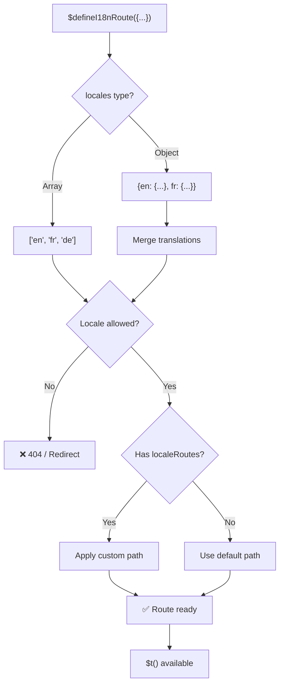
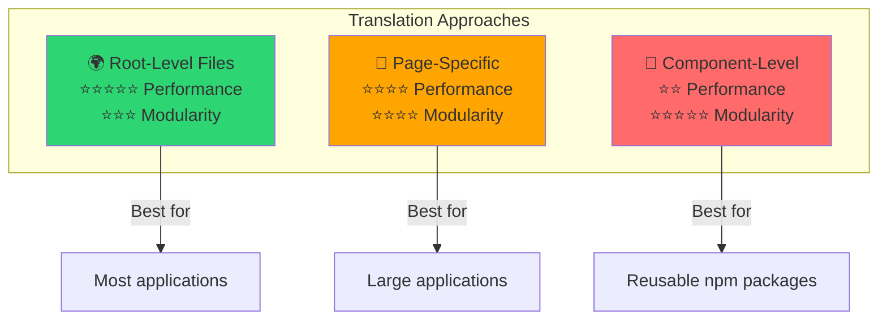

# 📖 Bileşen Başına Çeviriler

Modüler ve bakımı kolay yerelleştirme için `$defineI18nRoute` kullanarak Vue bileşenlerinde doğrudan çeviri tanımlamayı öğrenin.

## 📖 Genel Bakış

`Nuxt I18n Micro` içindeki Bileşen Başına Çeviriler, `$defineI18nRoute` işlevini kullanarak belirli bileşenler veya sayfalarda doğrudan çeviri tanımlamanıza olanak tanır. Bu yaklaşım, tek tek bileşenlere özgü yerelleştirilmiş içeriği yönetmek için idealdir ve çevirileri işlemek için daha modüler ve bakımı kolay bir yöntem sağlar.

## 🚀 Hızlı Başlangıç

### Temel Kullanım

```vue
<template>
  <div>
    <h1>{{ $t('greeting') }}</h1>
    <p>{{ $t('farewell') }}</p>
  </div>
</template>

<script setup lang="ts">
import { useNuxtApp } from '#imports'

const { $defineI18nRoute, $t } = useNuxtApp()

$defineI18nRoute({
  locales: {
    en: { greeting: 'Hello', farewell: 'Goodbye' },
    fr: { greeting: 'Bonjour', farewell: 'Au revoir' },
    de: { greeting: 'Hallo', farewell: 'Auf Wiedersehen' },
  },
})
</script>
```

### Gerekli Kurulum (`script setup`)

`$defineI18nRoute`, global bir makro değil, Nuxt uygulama enjeksiyonudur.  
Çağırmadan önce her zaman `useNuxtApp()`'ten alın.

```ts
import { useNuxtApp } from '#imports'

const { $defineI18nRoute } = useNuxtApp()
```

## 🏗️ Derleme Zamanı Rota Metası

Derleme zamanında, bir Vite unplugin sayfa `.vue` dosyalarını `defineI18nRoute(...)` / `$defineI18nRoute(...)` çağrıları için tarar ve yerel ayar kısıtlamalarını, `localeRoutes`'u ve `disableMeta`'yı `@i18n-micro/route-strategy` tarafından kullanılan rota meta verilerine çıkarır.

- **Derleme**: unplugin (`src/unplugin-define-i18n-route.ts`) Vite dönüşümü sırasında çalışır ve Nuxt derleme dizini altında `i18n-route-meta.json` yazar
- **Çalışma zamanı**: define eklentisi (`03.define.ts`) hâlâ `script setup`'ta geliştirme ve satır içi yapılandırma için `$defineI18nRoute`'u sağlar

Normalde `$defineI18nRoute`'u yalnızca sayfalarda çağırırsınız — modül derleme zamanı çıkarmayı otomatik olarak işler.

## 🔧 `$defineI18nRoute` İşlevi

`$defineI18nRoute` işlevi, geçerli yerel ayara göre rota davranışını yapılandırır ve şu amaçlarla çok yönlü bir çözüm sunar:

- Mevcut yerel ayarlara göre belirli rotalara erişimi kontrol edin
- Belirli yerel ayarlar için çeviriler sağlayın
- Farklı yerel ayarlar için özel rotalar ayarlayın
- Meta etiketi oluşturmayı kontrol edin

### Nasıl Çalışır



### Yöntem İmzası

```typescript
const { $defineI18nRoute } = useNuxtApp();
$defineI18nRoute(routeDefinition: DefineI18nRouteConfig);
```

### Parametreler

| Parametre      | Tür                                        | Açıklama                                |
| -------------- | ------------------------------------------ | --------------------------------------- |
| `locales`      | `string[] \| Record<string, Translations>` | Rota için kullanılabilir yerel ayarlar  |
| `localeRoutes` | `Record<string, string>`                   | Belirli yerel ayarlar için özel rotalar |
| `disableMeta`  | `boolean \| string[]`                      | i18n meta etiketi oluşturmayı kontrol edin |

### Ayrıntılı Parametre Açıklamaları

#### `locales`

Rota için hangi yerel ayarların mevcut olduğunu tanımlar:

<CodeGroup>
```typescript Array Format
$defineI18nRoute({
  locales: ['en', 'fr', 'de'], // Simple array of locale codes
})
```

```typescript Object Format
$defineI18nRoute({
  locales: {
    en: { greeting: 'Hello', farewell: 'Goodbye' },
    fr: { greeting: 'Bonjour', farewell: 'Au revoir' },
    de: { greeting: 'Hallo', farewell: 'Auf Wiedersehen' },
    ru: {}, // Russian locale allowed but no translations provided
  },
})
```
</CodeGroup>

#### `localeRoutes`

Belirli yerel ayarlar için özel rotalara izin verir:

```typescript
$defineI18nRoute({
  localeRoutes: {
    en: '/welcome',
    fr: '/bienvenue',
    de: '/willkommen',
    ru: '/privet', // Custom route path for Russian locale
  },
})
```

#### `disableMeta`

i18n meta etiketi oluşturmayı kontrol eder:

<CodeGroup>
```typescript Disable All Meta
$defineI18nRoute({
  locales: ['en', 'fr', 'de'],
  disableMeta: true, // Disables all i18n meta tags
})
```

```typescript Disable Specific Locales
$defineI18nRoute({
  locales: ['en', 'fr', 'de'],
  disableMeta: ['en', 'fr'], // Only English and French won't have meta tags
})
```
</CodeGroup>

## 💡 Kullanım Durumları

### 1. Yerel Ayarlara Dayalı Erişim Kontrolü

Belirli rotalar için hangi yerel ayarların izin verildiğini tanımlayın:

```typescript
$defineI18nRoute({
  locales: ['en', 'fr', 'de'], // Only these locales are allowed for this route
})
```

### 2. Bileşene Özel Çeviriler Sağlama

Her rota için belirli çeviriler sağlamak üzere `locales` nesnesini kullanın:

```typescript
$defineI18nRoute({
  locales: {
    en: {
      greeting: 'Hello',
      farewell: 'Goodbye',
      description: 'Welcome to our application',
    },
    fr: {
      greeting: 'Bonjour',
      farewell: 'Au revoir',
      description: 'Bienvenue dans notre application',
    },
    de: {
      greeting: 'Hallo',
      farewell: 'Auf Wiedersehen',
      description: 'Willkommen in unserer Anwendung',
    },
  },
})
```

### 3. Yerel Ayarlar için Özel Yönlendirme

Belirli yerel ayarlar için özel yollar tanımlayın:

```typescript
$defineI18nRoute({
  locales: ['en', 'fr', 'de'],
  localeRoutes: {
    en: '/welcome',
    fr: '/bienvenue',
    de: '/willkommen',
  },
})
```

### 4. Meta Etiketlerini Devre Dışı Bırakma

Belirli rotalar veya yerel ayarlar için SEO meta etiketi oluşturmayı kontrol edin:

```typescript
// Disable meta tags for all locales
$defineI18nRoute({
  locales: ['en', 'fr', 'de'],
  disableMeta: true,
})

// Disable meta tags only for specific locales
$defineI18nRoute({
  locales: ['en', 'fr', 'de'],
  disableMeta: ['en', 'fr'],
})
```

## ✅ Desteklenen Yapılandırma Formatları

`$defineI18nRoute` ayrıştırıcısı çeşitli JavaScript yapılandırmalarını destekler:

### Statik Yapılandırmalar

<CodeGroup>
```typescript Static Arrays
$defineI18nRoute({
  locales: ['en', 'de', 'fr'],
})
```

```typescript Static Objects
$defineI18nRoute({
  locales: {
    en: { greeting: 'Hello' },
    de: { greeting: 'Hallo' },
  },
  localeRoutes: {
    en: '/welcome',
    de: '/willkommen',
  },
})
```
</CodeGroup>

### Dinamik Yapılandırmalar

<CodeGroup>
```typescript Variables and Functions
const locales = ['en', 'de', 'fr']
const routes = { en: '/welcome', de: '/willkommen' }

$defineI18nRoute({
  locales: locales,
  localeRoutes: routes,
})
```

```typescript Template Literals
const prefix = 'api'

$defineI18nRoute({
  locales: [`${prefix}-en`, `${prefix}-de`],
  localeRoutes: {
    [`${prefix}-en`]: `/api/welcome`,
    [`${prefix}-de`]: `/api/willkommen`,
  },
})
```
</CodeGroup>

### Gelişmiş Yapılandırmalar

<CodeGroup>
```typescript Spread Operator
const baseLocales = ['en', 'de']
const additionalLocales = ['fr', 'es']

$defineI18nRoute({
  locales: [...baseLocales, ...additionalLocales],
})
```

```typescript Array of Objects
$defineI18nRoute({
  locales: [
    { code: 'en', name: 'English' },
    { code: 'de', name: 'German' },
  ],
})
```
</CodeGroup>

### Koşullu Mantık

```typescript
$defineI18nRoute({
  locales: process.env.NODE_ENV === 'production' ? ['en', 'de'] : ['en', 'de', 'fr', 'es'],
})
```

### Karmaşık İç İçe Nesneler

```typescript
$defineI18nRoute({
  locales: {
    'en-us': {
      region: 'US',
      currency: 'USD',
      format: {
        date: 'MM/DD/YYYY',
        time: '12h',
      },
    },
    'de-de': {
      region: 'DE',
      currency: 'EUR',
      format: {
        date: 'DD.MM.YYYY',
        time: '24h',
      },
    },
  },
})
```

### Yorumlar ve Biçimlendirme

```typescript
$defineI18nRoute({
  // Supported locales for this component
  locales: [
    'en', // English
    'de', // German
    'fr', // French
  ],
  // Custom routes for each locale
  localeRoutes: {
    en: '/welcome',
    de: '/willkommen',
    fr: '/bienvenue',
  },
})
```

## ❌ Desteklenmez

Ayrıştırıcının sınırlamaları vardır ve şunları işleyemez:

- **Harici içe aktarmalar** (`import` ifadeleri)
- **Async/await işlevleri**
- **Sınıf yöntemleri**
- **Karmaşık kontrol akışı** (döngüler, try-catch, switch)
- Yapılandırmada **ok işlevleri**
- **Jeneratör işlevleri**

## 📝 Eksiksiz Örnek

Tüm özellikleri gösteren kapsamlı bir örnek:

```vue
<template>
  <div class="welcome-page">
    <header>
      <h1>{{ $t('title') }}</h1>
      <p>{{ $t('subtitle') }}</p>
    </header>

    <main>
      <section>
        <h2>{{ $t('features.title') }}</h2>
        <ul>
          <li v-for="feature in $t('features.list')" :key="feature">
            {{ feature }}
          </li>
        </ul>
      </section>

      <section>
        <h2>{{ $t('contact.title') }}</h2>
        <p>{{ $t('contact.description') }}</p>
        <a :href="$t('contact.email')">{{ $t('contact.email') }}</a>
      </section>
    </main>

    <footer>
      <p>{{ $t('footer.copyright') }}</p>
    </footer>
  </div>
</template>

<script setup lang="ts">
import { useNuxtApp } from '#imports'

const { $defineI18nRoute, $t } = useNuxtApp()

// Define comprehensive i18n route configuration
$defineI18nRoute({
  locales: {
    en: {
      title: 'Welcome to Our Platform',
      subtitle: 'The best solution for your needs',
      features: {
        title: 'Key Features',
        list: ['High Performance', 'Easy to Use', 'Scalable Architecture'],
      },
      contact: {
        title: 'Get in Touch',
        description: "We'd love to hear from you",
        email: 'mailto:contact@example.com',
      },
      footer: {
        copyright: '© 2024 Example Company. All rights reserved.',
      },
    },
    fr: {
      title: 'Bienvenue sur Notre Plateforme',
      subtitle: 'La meilleure solution pour vos besoins',
      features: {
        title: 'Fonctionnalités Clés',
        list: ['Haute Performance', 'Facile à Utiliser', 'Architecture Évolutive'],
      },
      contact: {
        title: 'Contactez-Nous',
        description: 'Nous aimerions avoir de vos nouvelles',
        email: 'mailto:contact@example.com',
      },
      footer: {
        copyright: '© 2024 Example Company. Tous droits réservés.',
      },
    },
    de: {
      title: 'Willkommen auf Unserer Plattform',
      subtitle: 'Die beste Lösung für Ihre Bedürfnisse',
      features: {
        title: 'Hauptfunktionen',
        list: ['Hohe Leistung', 'Einfach zu Verwenden', 'Skalierbare Architektur'],
      },
      contact: {
        title: 'Kontaktieren Sie Uns',
        description: 'Wir würden gerne von Ihnen hören',
        email: 'mailto:contact@example.com',
      },
      footer: {
        copyright: '© 2024 Example Company. Alle Rechte vorbehalten.',
      },
    },
  },
  localeRoutes: {
    en: '/welcome',
    fr: '/bienvenue',
    de: '/willkommen',
  },
  disableMeta: false, // Enable SEO meta tags
})
</script>

<style scoped>
.welcome-page {
  max-width: 800px;
  margin: 0 auto;
  padding: 2rem;
}

header {
  text-align: center;
  margin-bottom: 3rem;
}

section {
  margin-bottom: 2rem;
}

footer {
  text-align: center;
  margin-top: 3rem;
  padding-top: 2rem;
  border-top: 1px solid #eee;
}
</style>
```

## ⚡ Performans Hususları

Tek Dosya Bileşenlerine (SFC'ler) çevirileri gömmek performansı etkileyebilir:

### Olası Sorunlar

- **Dosya boyutu artışı**: Yerel ayara duyarlı yüklemeyi etkinleştiren ayrı çeviri dosyalarının aksine, tüm yerel ayarlar SFC'de bulunur
- **Daha yavaş render etme**: Dosya içi çeviriler çalışma zamanında işlenir
- **Bellek kullanımı**: Geçerli yerel ayardan bağımsız olarak tüm çeviriler yüklenir

### En İyi Uygulamalar

- Optimal performans için **sayfa başına çevirileri kullanın**
- Aşağıdaki gibi belirli durumlar için **bileşen düzeyinde çevirileri saklayın**:
  - npm'de yayınlanan yeniden kullanılabilir bileşenler
  - Kök seviyesi dosyalar için uygun olmayan çeviriler
  - Kendi kendine yeterli olması gereken bileşenler

### Performans ve Modülerlik

Bir yaklaşım seçerken projenizin ihtiyaçlarını dengeleyin:



| Yaklaşım              | Performans  | Modülerlik | Kullanım Durumu              |
| --------------------- | ----------- | ---------- | ---------------------------- |
| **Kök Seviyesi Dosyalar** | ⭐⭐⭐⭐⭐ | ⭐⭐⭐     | Çoğu uygulama                |
| **Sayfaya Özel**      | ⭐⭐⭐⭐    | ⭐⭐⭐⭐   | Büyük uygulamalar            |
| **Bileşen Düzeyi**    | ⭐⭐        | ⭐⭐⭐⭐⭐ | Yeniden kullanılabilir bileşenler |

## 🎯 En İyi Uygulamalar

### 1. Çevirileri Bileşenlere Yakın Tutun

Yerelleştirilmiş içeriği düzenli ve bakımı kolay tutmak için çevirileri doğrudan ilgili bileşen içinde tanımlayın.

### 2. Esneklik için Yerel Ayar Nesnelerini Kullanın

Belirli çeviriler veya yerel ayarlara dayalı erişim kontrolü gerektiğinde `locales` özelliği için nesne formatını kullanın.

### 3. Özel Rotaları Belgeleyin

Netliği korumak ve geliştirme ve bakımı basitleştirmek için farklı yerel ayarlar için ayarlanan tüm özel rotaları açıkça belgeleyin.

### 4. Performans Etkisini Düşünün

Performans etkilerini göz önünde bulundurarak, kullanım durumunuz için bileşen düzeyinde çevirilerin gerekli olup olmadığını değerlendirin.

### 5. TypeScript Kullanın

Daha iyi tür güvenliği ve IntelliSense desteği için TypeScript'ten yararlanın:

```typescript
interface ComponentTranslations {
  title: string
  subtitle: string
  features: {
    title: string
    list: string[]
  }
}

$defineI18nRoute({
  locales: {
    en: {
      title: 'Welcome',
      subtitle: 'Subtitle',
      features: {
        title: 'Features',
        list: ['Feature 1', 'Feature 2'],
      },
    } as ComponentTranslations,
  },
})
```

## 📚 İlgili Konular

- **[Başlarken](/quickstart)** - Temel kurulum ve yapılandırma
- **[API Referansı](/api/methods)** - Eksiksiz yöntem belgeleri
- **[Örnekler](/examples)** - Gerçek dünya kullanım örnekleri

## Özet

`$defineI18nRoute` işlevi ile desteklenen Bileşen Başına Çeviriler özelliği, Nuxt uygulamanızda yerelleştirmeyi yönetmek için güçlü ve esnek bir yol sunar. Yerelleştirilmiş içerik ve yönlendirmenin bileşen düzeyinde tanımlanmasına izin vererek, hedef kitlenizin dil ve bölgesel tercihlerine göre uyarlanmış, son derece özelleştirilmiş ve kullanıcı dostu bir deneyim oluşturmaya yardımcı olur.

Hem performans gereksinimlerini hem de bakım kolaylığı endişelerini göz önünde bulundurarak projenizin ihtiyaçlarına en uygun yaklaşımı seçin.
