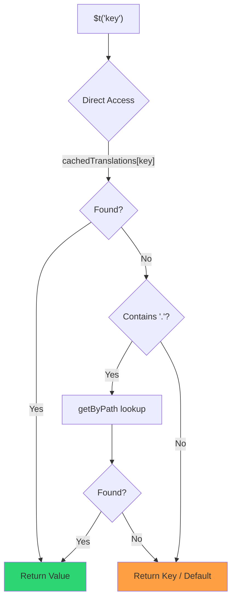

# 🚀 Performans Kılavuzu

## 📖 Giriş

`Nuxt I18n Micro`, performansı göz önünde bulundurularak tasarlanmıştır ve `nuxt-i18n` gibi geleneksel uluslararasılaştırma (i18n) modüllerine göre önemli bir gelişme sunar. Bu kılavuz, `Nuxt I18n Micro` kullanmanın performans avantajları ve diğer çözümlerle nasıl karşılaştırıldığı hakkında ayrıntılı bir bakış sağlar.

## 🤔 Neden Performansa Odaklanmalı?

Büyük ölçekli projelerde ve yoğun trafikli ortamlarda, performans darboğazları yavaş derleme sürelerine, artan bellek kullanımına ve zayıf sunucu yanıt sürelerine yol açabilir. Bu sorunlar, büyük çeviri dosyalarını içeren karmaşık i18n kurulumlarında daha belirgin hale gelir. `Nuxt I18n Micro`, hız, bellek verimliliği ve uygulamanızın paket boyutu üzerindeki minimum etki için optimize ederek bu zorlukları doğrudan ele almak üzere oluşturulmuştur.

## 📊 Performans Karşılaştırması

`pnpm test:performance` (`pnpm -C scripts cli performance`) aracılığıyla **`@nuxtjs/i18n@10.6.0`**'a karşı özdeş fixtürlerde bir dizi test gerçekleştirdik. Tam metodoloji ve grafikler: [Performans Test Sonuçları](/guides/performance-results).

Varsayılan CLI profili: **4 yerel ayar** × **2 sayfa** (`index`, `page`) × ~10k dizin yaprağı anahtarı. Daha ağır bir regresyon-radar yükü için `--locales` / `--keys` değerlerini artırın. Rapor **kodu**, **çevirileri** (`@nuxtjs/i18n` `chunks/raw/*` dahil) ve **toplam** dağıtılabilir çıktıyı ayırır.

```bash
pnpm test:performance
pnpm -C scripts cli performance --only micro --skip-stress
pnpm -C scripts cli performance --locales 12 --keys 100000 --runs 3
```

### ⏱️ Derleme Süresi ve Kaynak Tüketimi

<Accordion title="**@nuxtjs/i18n v10.6**">
- **Kod Paketi**: 2.16 MB
- **Çeviriler**: 7.21 MB (mesaj parçaları + yerel ayar yükleri)
- **Toplam dağıtılabilir**: 9.37 MB
- **Maksimum Bellek Kullanımı**: 1.821 MB
- **Geçen Süre**: 8.34s (3'ün ortalaması)
</Accordion>

<Tip>
- **Kod Paketi**: 1.74 MB — **`@nuxtjs/i18n` v10.6'dan ~19% daha küçük kod**
- **Çeviriler**: 6.8 MB (tembel yüklenen JSON)
- **Toplam dağıtılabilir**: 8.54 MB
- **Maksimum Bellek Kullanımı**: 1.065 MB — **`@nuxtjs/i18n` v10.6'dan ~41% daha az bellek**
- **Geçen Süre**: 5.34s — **`@nuxtjs/i18n` v10.6'dan ~36% daha hızlı** (≈ plain-nuxt taban çizgi)
</Tip>

> `@nuxtjs/i18n` "kod ≈ 15 MB / çeviriler 0 B" gösteren eski belgeler `chunks/raw` mesaj dosyalarını uygulama kodu olarak sayıyordu. Mevcut sınıflandırıcı bunları ayırır; **kod**'daki fark daha küçüktür ve micro derleme süresi, tepe RSS ve yük testlerinde hala önde.

Grafikler, Autocannon sonuçları ve fixtür ayrıntıları için [tam kıyaslama raporuna](/guides/performance-results) bakın.

### 🌐 Yük Altında Sunucu Performansı

Artillery (6s@6 + 60s@60) ve Autocannon (10c / 10s), fixtür başına ardışık 3 çalıştırmanın ortalaması.

<Accordion title="**@nuxtjs/i18n v10.6**">
- **Saniyedeki İstek Sayısı (Artillery)**: 143 [#/sn]
- **Ortalama Yanıt Süresi**: 956 ms
- **Autocannon RPS / ort gecikme**: 72 / 139 ms
</Accordion>

<Tip>
- **Saniyedeki İstek Sayısı (Artillery)**: 275 [#/sn] — **`@nuxtjs/i18n` v10.6'dan ~93% daha fazla**
- **Ortalama Yanıt Süresi**: 483 ms — **`@nuxtjs/i18n` v10.6'dan ~49% daha hızlı**
- **Autocannon RPS / ort gecikme**: 162 / 62 ms
</Tip>

### 📈 Görsel Karşılaştırma

<Note>
Mintlify belgelerinde etkileşimli grafik atlanmıştır. Bu sayfadaki kıyaslama tablolarına veya `chart` grafiği için [VitePress belgelerine](https://s00d.github.io/nuxt-i18n-micro/guide/performance-results) bakın.
</Note>

<Note>
Mintlify belgelerinde etkileşimli grafik atlanmıştır. Bu sayfadaki kıyaslama tablolarına veya `chart` grafiği için [VitePress belgelerine](https://s00d.github.io/nuxt-i18n-micro/guide/performance-results) bakın.
</Note>

| Metrik          | @nuxtjs/i18n v10.6 | i18n-micro | İyileştirme        |
| --------------- | ------------------ | ---------- | ------------------ |
| Derleme Süresi  | 8.34s              | 5.34s      | **~36% daha hızlı** |
| Bellek (derleme) | 1.821 MB          | 1.065 MB   | **~41% daha az**   |
| Kod Paketi      | 2.16 MB            | 1.74 MB    | **~19% daha küçük** |
| Yanıt Süresi    | 956 ms             | 483 ms     | **~49% daha hızlı** |
| RPS (Artillery) | 143                | 275        | **~93% daha fazla** |

### 🔍 Sonuçların Yorumu

Mevcut `@nuxtjs/i18n` **v10.6**'ya karşı (varsayılan CLI profili, 3'ün ortalaması):

- 🗜️ **Daha küçük kod grafiği**: mesaj parçaları "kod" olarak yanlış etiketlenmediğinde ~1.74 MB'a karşı ~2.16 MB.
- 🧠 **Daha düşük derleme RSS**: ~1.1 GB tepe noktası ile ~1.8 GB karşılaştırıldığında.
- 🕒 **Daha hızlı derlemeler**: ~5.3s vs ~8.3s (micro bu profilde plain-Nuxt taban çizgisiyle eşleşir).
- ⚡ **Yük altında çok daha iyi**: ~275 vs ~143 Artillery RPS, ~162 vs ~72 Autocannon RPS, daha düşük ortalama gecikme.

Mutlak sayılar eski yayınlanmış tablolardan farklıdır (daha küçük sözlükler, daha eski Nuxt ve `@nuxtjs/i18n` için haksız bir "0 B çeviriler" bölünmesi). Yön aynıdır: micro derleme maliyeti ve istek verimi açısından önde kalır.

## ⚙️ Ana Optimizasyonlar

### 🛠️ Minimalist Tasarım

`Nuxt I18n Micro`, küçük bir çekirdek ve özel strateji paketleri etrafında minimalist bir mimari üzerine kuruludur. Bu, ek yükü azaltır ve dahili mantığı basitleştirerek performansı artırır.

### 🚦 Verimli Yönlendirme

v3'te, rota oluşturma ve çalışma zamanı yol mantığı optimum ağaç sallama için özel paketlere ayrılmıştır:

- **`@i18n-micro/route-strategy`** — Derleme zamanı rota oluşturma: Nuxt sayfalarını yerelleştirilmiş rotalarla genişletir. Yalnızca seçilen strateji (`no_prefix`, `prefix`, `prefix_except_default`, `prefix_and_default`) dahil edilir.
- **`@i18n-micro/path-strategy`** — Çalışma zamanı yol çözümleme, yönlendirmeler ve bağlantı oluşturma. Sıcak yollarda ayırmaları en aza indirmek için saf fonksiyonlar ve önceden hesaplanmış bağlam bayrakları kullanır. Alt yol dışa aktarmaları (`/prefix`, `/no-prefix` vb.) yalnızca seçilen uygulamanın paketlenmesini sağlar.

Bu yaklaşım, yönlendirme yapılandırmasını hafif tutar ve yerel ayar sayısından bağımsız olarak hızlı rota çözünürlüğünü sağlar.

### 📂 Sadeleştirilmiş Çeviri Yükleme

Modül, çeviriler için yalnızca JSON dosyalarını destekler ve global ve sayfaya özel dosyalar arasında net bir ayrım sağlar. Bu, herhangi bir zamanda yalnızca gerekli çeviri verilerinin yüklenmesini sağlar ve performansı daha da artırır.

### 🔒 GlobalThis Singleton Önbelleği

v3.0.0'dan itibaren modül, tüm Node.js süreci boyunca tek bir önbellek örneğini garanti etmek için `Symbol.for` ile bir `globalThis` singleton kalıbı kullanır. Bu şunları önler:

- Aynı modül birden çok kez paketlendiğinde önbellek yinelenmesi
- Çöp toplama baskısına neden olan istek başına nesne yeniden oluşturma
- Yetim önbellek örneklerinden bellek sızıntıları

```mermaid
flowchart LR
    subgraph Process["Node.js Process"]
        G["globalThis[Symbol.for('CACHE')]"]

        subgraph R1["SSR Request 1"]
            P1[Plugin Instance] --> G
        end

        subgraph R2["SSR Request 2"]
            P2[Plugin Instance] --> G
        end

        subgraph R3["SSR Request 3"]
            P3[Plugin Instance] --> G
        end
    end

    G --> Cache["Single Map Instance"]
    Cache --> D1["en:index → translations"]
    Cache --> D2["en:about → translations"
```

```typescript
// Internal implementation pattern
const CACHE_KEY = Symbol.for('__NUXT_I18N_STORAGE_CACHE__')
if (!globalThis[CACHE_KEY]) {
  globalThis[CACHE_KEY] = new Map()
}
```

### ⚡ Optimize Edilmiş Çeviri İşlevi (tFast)

`$t()` işlevi, hız için optimize edilmiş doğrudan arama stratejisi kullanır:

1. **Önceden hesaplanmış bağlam**: Yerel ayar ve rota adı, her `$t()` çağrısında değil, gezinme sırasında bir kez hesaplanır
2. **Tek kaynaklı arama**: Tüm çeviriler (kök + sayfaya özel + yedek), derleme zamanında sayfa başına tek bir dosyaya önceden birleştirilir — katmanlı arama gerekmez
3. **Gezinmede kümülatif derin birleştirme**: Aynı yerel ayarda gezinirken, yeni sayfa çevirileri aktif sözlüğe derinlemesine birleştirilir (2 seviye derinlik), böylece önceki sayfadan gelen anahtarlar geçiş animasyonları sırasında görünür kalır — sayfalar çakışan iç içe önekleri paylaşsa bile (örn. her iki sayfanın da `common.*` altında anahtarları vardır)
4. **`page:transition:finish` aracılığıyla çöp toplama**: Geçiş animasyonu tamamen tamamlandıktan sonra, birleştirilmiş sözlük yalnızca yeni sayfa için temiz çevirilerle değiştirilir ve eski sayfa anahtarlarından bellek serbest bırakılır
5. **Doğrudan özellik erişimi**: Sıcak yollar için Map aramaları yerine `obj[key]` kullanır



```typescript
// Simplified lookup logic — single active dictionary
let val = cachedTranslations[key]
if (val === undefined && key.includes('.')) {
  val = getByPath(cachedTranslations, key)
}
```

### 💉 Sunucu tarafı yükleme (HTML gömme yok)

SSR sırasında yüklenen çeviriler, render sırasında `$t` için **sunucu belleğinde** kalır. `nuxtApp.payload` / HTML belgesine kopyalanmazlar (`@nuxtjs/i18n` ile `experimental.preload: false` ile aynı fikir).

İstemcide, `01.plugin.ts`, uygulama devam etmeden önce `/\{apiBaseUrl\}/:page/:locale/data.json`'u yükleyen `switchContext`'i `await` eder — 8 MB satır içi blok değil, tek istek.

`NuxtI18n`, `$t()` / `$has()` için aktif birleştirilmiş sözlüğü (`cachedTranslations`) hâlâ tutar. Aynı yerel ayardaki gezinmeler, `page:transition:finish` eski anahtarları temizleyene kadar sayfa parçalarını derinlemesine birleştirir.

#### Bugün nerede duruyor

Aşağıdaki sayılar, `pnpm run budget:payload` tarafından ölçülen ve uygulanan bütçe dosyasından okunmuştur.

{/* generated:payload-budget — do not edit; run `pnpm run docs:generate` */}

`playground`'da `/`, `/de` üzerinde ölçülmüştür:

| Ölçüm | Boyut |
| --- | --- |
| Diskteki çeviri kaynakları | 15.2 MB |
| Ayrı yük dosyaları olarak sunulur | 76.3 MB |
| En büyük satır içi `__NUXT_DATA__` | 6.9 MB |
| İstemci varlıkları | 449.5 KB |

Playground kasıtlı olarak aşırı büyük bir sözlük taşır, bu nedenle bunlar gerçek bir uygulamadan beklenen rakamlar değildir — karşılaştırma yapmak için sabit bir noktadır. Beklenmedik şekilde büyüdüklerinde bütçe başarısız olur, bu şekilde yükün taşıdığı şeydeki kazara bir değişiklik fark edilir.

{/* /generated:payload-budget */}

### 💾 Önbellekleme ve Ön İşleme

Çeviriler birkaç önbellekten geçer ve hangisinin bir isteğe yanıt verdiğini bilmek, beş dakikalık ve beş saatlik bir hata ayıklama oturumu arasındaki farktır. Bir isteğin karşılaştığı sırada dört tane vardır:

| Katman | Nerede | Ömür | Temizlendiği yer |
| --- | --- | --- | --- |
| Tarayıcı / CDN | `/\{apiBaseUrl\}/**` üzerinde `Cache-Control` | `httpCacheDuration`, `immutable` | yeni bir `?v=` — yani çevirileri değiştiren bir dağıtım |
| Nitro rota önbelleği | `routeRules['/\{apiBaseUrl\}/**'].cache` | 60 s, stale-while-revalidate | sunucu yeniden başlatma |
| Sunucu yükleyicisi | süreç içi `CacheControl`, `locale:routeName` ile anahtarlı | süreç ömrü veya `cacheTtl` | sunucu yeniden başlatma, geliştirmede HMR |
| İstemci deposu | `translationStorage` + `NuxtI18n` içindeki aktif parça | sayfa ömrü | yeniden yükleme |

İki kural, birbirleriyle çelişmelerini önler:

- **Nitro rota önbelleği yalnızca `?v=` var olduğunda mevcuttur.** Bir önbellek kırıcı ile her URL kendi içeriğine özgüdür, bu nedenle sunucu tarafında önbelleklemek eskimeden bağımsızdır. `dateBuild: 0` ayarlayın ve bu katman kapanır, çünkü URL o zaman kararlıdır ve yanıt `must-revalidate` der — sunucu tarafı önbelleği, bir dakikaya kadar eski bir girişten yanıt verir ve sessizce onu yener.
- **`immutable` ayrıca `?v=` gerektirir.** Bir kırıcı olmadan başlık, `httpCacheDuration` ne derse desin `public, max-age=0, must-revalidate`'dir: asla değişmeyen bir URL'de uzun bir `max-age`, bir tarayıcının gördüğü ilk yanıtı sabitler.

<Warning>
`translationPayloads.publicAssets` (premerged modda varsayılan) ile yükler `public/<apiBaseUrl>/\{page\}/\{locale\}/data.json` konumuna kopyalanır. Bu dizini kendisi sunan bir platform (Cloudflare Pages, Firebase Hosting, `npx serve`) kendi başlıklarını uygular — Nitro `routeRules` başlığı yalnızca sunucudan geçen yanıtlara ulaşır. Bu statik dosyalar için önbellek politikasını platformun kendi yapılandırmasında ayarlayın.
</Warning>

🏁 **Ön İşleme**: premerged modda, `publicAssets` zaten istemci URL ağacını `public/` içine yazar. Bu kopya devre dışı bırakıldığında Nitro'nun işleyici rotalarını gerçekleştirmesine ihtiyacınız varsa yalnızca `prerenderRoutes`'a katılın.

### 🗜️ Sıkıştırılmış Genel Yükler

`nitro.compressPublicAssets` etkinleştirildiğinde, genel dizine kopyalanan çeviri yükleri `.gz` ve `.br` kardeşleri de alır:

```ts
export default defineNuxtConfig({
  nitro: { compressPublicAssets: true },
})
```

Nitro, yükleri kopyalayan kancadan önce genel varlıkları sıkıştırır, bu nedenle bu olmadan statik bir derlemenin sıkıştırılmamış tek parçası olurlardı. Modül sıkıştırmayı kendi başına açmaz — yalnızca seçtiğiniz ayarı uygular. Kodlama başına seçim (`\{ gzip: true, brotli: false \}`) korunur.

Playground dizin yükü: 6 651 984 B ham, 1 012 831 B gzip, 821 617 B brotli.

### ☁️ Sunucusuz Yük Çıktısı

**Node**'da SSR, çeviri JSON'unu `public/<apiBaseUrl>`'den okur (`readFile`, Nitro `serverAssets` / Rollup `raw:` yok). **Edge**'de Nitro `serverAssets` aynı ağacı gömer (büyük kataloglar için `mode: 'source'`'u tercih edin).

```typescript
export default defineNuxtConfig({
  i18n: {
    translationPayloads: {
      serverAssets: true, // default — Node → public copy; Edge → serverAssets embed
      publicAssets: true, // default in premerged mode
    },
  },
})
```

Kompakt Edge gömme (ve isteğe bağlı kompakt genel kopyalar) için `translationPayloads.mode: 'source'` kullanın:

```typescript
export default defineNuxtConfig({
  i18n: {
    translationPayloads: {
      mode: 'source',
    },
  },
})
```

`mode: 'source'`, katman-birleştirilmiş kaynak dosyaları kompakt tutar ve yerleşik `/_locales` rotası (veya Edge `assets:i18n`) aracılığıyla kök/sayfa/yedek olarak çalışma zamanında birleştirir. Varsayılan olarak genel varlık kopyalarını ve önceden render edilmiş yük rotalarını devre dışı bırakır.

<Warning>
`prerenderRoutes` varsayılan olarak `false`'dur. `mode: 'source'` ile `publicAssets` de varsayılan olarak `false`'dur. Nitro/edge çalışma zamanı olmayan saf statik barındırma bu nedenle bu çıktılardan birini etkinleştirmediğiniz, çalışma zamanında `serverHandler`'ı kullanılabilir tutmadığınız veya yükleri harici olarak barındırmadığınız sürece istemcide çevirileri yükleyemez.

Varsayılan premerged + `publicAssets`, `/\{apiBaseUrl\}/\{page\}/\{locale\}/data.json`'u zaten `public/` altına yerleştirir, böylece statik ana bilgisayarlar Nitro olmadan istemci getirmelerini sunabilir.
</Warning>

<Warning>
`apiBaseServerHost` veya `apiBaseClientHost` ayarlamak, yük sunumunu bu kaynağa taşır ve kendi gereksinimleriyle birlikte gelir — bkz. [Yapılandırma → Harici CDN ana bilgisayarları](/guides/configuration#external-cdn-hosts).
</Warning>

Veya tek tek HTTP/genel çıktıları devre dışı bırakın ve yükleri harici olarak barındırın:

```typescript
export default defineNuxtConfig({
  i18n: {
    apiBaseClientHost: 'https://cdn.example.com',
    apiBaseServerHost: 'https://cdn.example.com',
    translationPayloads: {
      serverHandler: false,
      publicAssets: false,
      prerenderRoutes: false,
    },
  },
})
```

Yerleşik yerel `/\{apiBaseUrl\}/:page/:locale/data.json` rotasına güveniyorsanız `serverHandler`'ı etkin tutun. Yükler harici olarak barındırıldığında ve `apiBaseServerHost` o harici kaynağı gösterdiğinde devre dışı bırakın. Yalnızca Nitro'nun statik yük rotalarını gerçekleştirmesine ihtiyacınız olduğunda ve `publicAssets` bunları zaten yazmadığında `prerenderRoutes`'u etkinleştirin.

Derleme sırasında modül, oluşturulan yük çıktısı `translationPayloads.warnFileCount` (varsayılan 500) veya `translationPayloads.warnSizeBytes` (varsayılan 10 MB) değerini aştığında uyarır. Ayrıca tüm yerel çıktılar harici yük ana bilgisayarları yapılandırılmadan devre dışı bırakıldığında da uyarır.

## 📝 Performansı En Üst Düzeye Çıkarma İpuçları

`Nuxt I18n Micro`'dan en iyi performansı elde etmek için birkaç ipucu:

- 📉 **Yerel Ayar Verilerini Sınırlayın**: Paket boyutunu küçük tutmak için projenize yalnızca ihtiyacınız olan yerel ayarları ekleyin.
- 🗂️ **Sayfaya Özel Çevirileri Kullanın**: Gereksiz veri yüklemekten kaçınmak için çeviri dosyalarınızı sayfaya göre düzenleyin.
- 💾 **Önbelleklemeyi Etkinleştirin**: Sunucu yükünü azaltmak ve yanıt sürelerini iyileştirmek için önbellekleme özelliklerinden yararlanın.
- 🏁 **Ön İşlemeden Yararlanın**: Sayfa yüklerini hızlandırmak ve çalışma zamanı yükünü azaltmak için çevirilerinizi önceden render edin.

Performans testlerinin ayrıntılı sonuçları için [Performans Test Sonuçları](/guides/performance-results) bölümüne bakın.
