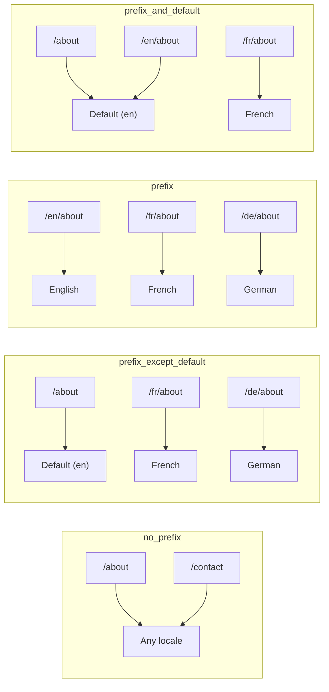
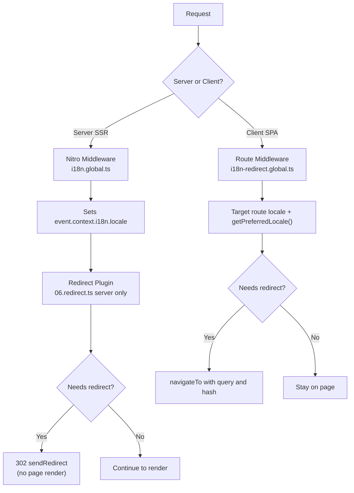

# 🗂️ Nuxt I18n Micro'da Yönlendirme Stratejileri

## 📖 Genel Bakış

Nuxt I18n Micro, `strategy` seçeneği aracılığıyla URL'lerde yerel ayar öneklerinin nasıl görüneceğini kontrol eder. Arka planda bunu iki paket uygular:

- **`@i18n-micro/route-strategy`** — derleme zamanı rota oluşturma (Nuxt sayfalarını yerelleştirilmiş rotalarla genişletir)
- **`@i18n-micro/path-strategy`** — çalışma zamanı yol çözümleme, yönlendirmeler, SEO nitelikleri ve bağlantı oluşturma

Nuxt modülü, derleme zamanında doğru strateji sınıfını seçer ve `#i18n-strategy` aracılığıyla takma ad verir, böylece yalnızca seçilen uygulama paketlenir.

## 🚦 Kullanılabilir Stratejiler

{/* generated:option:strategy — do not edit; run `pnpm run docs:generate` */}

**Tür** `Strategies` · **Varsayılan** `'prefix_except_default'`

Yerel ayar önekleri için URL yönlendirme stratejisi.

- `'no_prefix'` — URL'de yerel ayar yok; yerel ayar çerezde saklanır.
- `'prefix_except_default'` — varsayılan hariç tüm yerel ayarları öneklendirin.
- `'prefix'` — varsayılan yerel ayar dahil her zaman öneklendirin.
- `'prefix_and_default'` — `prefix` gibidir, ancak varsayılan yerel ayara öneksiz de erişilebilir.

{/* /generated:option:strategy */}

### Strateji Karşılaştırması



### 🛑 `no_prefix`

URL'lerin yerel ayar segmenti yoktur. Yerel ayar çerezler, `useI18nLocale()` durumu veya tarayıcı algılamasıyla belirlenir.

- **Rotalar**: `/about`, `/contact` — tüm yerel ayarlar için aynı URL kalıbı (`/en/`, `/fr/` öneki yok)
- **Yerel ayar sürekliliği**: `localeCookie` aracılığıyla (belirtilmezse otomatik olarak `'user-locale'` olarak ayarlanır)
- **Özel yollar**: [`globalLocaleRoutes`](/guides/configuration#globallocaleroutes) ve [`defineI18nRoute`](/guides/custom-locale-routes) aracılığıyla desteklenir — yerelleştirilmiş slug'lar URL'lere yerel ayar öneki eklenmeden oluşturulur (örn. `/about` ile `/ueber-uns`). İç içe rotalar, takma adlar ve yerel ayar başına kısıtlamalar `prefix_except_default`'a göre daha basittir.

<Tip>
`no_prefix` kullanılırken, belirtilmezse `localeCookie` otomatik olarak `'user-locale'` olarak ayarlanır. URL yerel ayar bilgisi içermediğinden bu gereklidir.
</Tip>

```typescript
i18n: {
  strategy: 'no_prefix'
  // localeCookie is automatically set to 'user-locale'
}
```

### 🚧 `prefix_except_default`

Varsayılan yerel ayar **hariç** tüm rotaların bir yerel ayar öneki vardır.

- **Varsayılan yerel ayar**: `/about`, `/contact`
- **Diğer yerel ayarlar**: `/fr/about`, `/de/contact`
- **Önekli varsayılan yerel ayar 404 döner**: `/en/about` → 404 (`en` varsayılan olduğunda)

```typescript
i18n: {
  strategy: 'prefix_except_default' // This is the default
}
```

### 🌍 `prefix`

Varsayılan yerel ayar dahil her rotanın bir yerel ayar öneki vardır.

- **Tüm yerel ayarlar**: `/en/about`, `/fr/about`, `/de/about`
- **Kök `/`**: Kullanıcı tercihine göre `/\{locale\}/` konumuna yönlendirir

```typescript
i18n: {
  strategy: 'prefix'
}
```

### 🔄 `prefix_and_default`

Varsayılan yerel ayar hem önekli hem de öneksiz olarak kullanılabilir. Varsayılan olmayan yerel ayarların her zaman bir öneki vardır.

- **Varsayılan yerel ayar**: hem `/about` hem de `/en/about` geçerlidir
- **Diğer yerel ayarlar**: `/fr/about`, `/de/about`
- **`/` konumundan yönlendirme yok**: Hem `/` hem de `/en/` varsayılan yerel ayarı sunar

```typescript
i18n: {
  strategy: 'prefix_and_default'
}
```

## 🔀 Yönlendirme Mimarisi (v3)

v3'te, yönlendirme mantığı optimum performans için iki katmana ayrılmıştır:

### Nasıl Çalışır



### Sunucu Tarafı (Flash Yok)

1. **Nitro ara yazılımı** (`i18n.global.ts`) önce çalışır — URL, çerez veya `Accept-Language` başlığından yerel ayarı algılar ve `event.context.i18n.locale`'yi ayarlar
2. **Yönlendirme eklentisi** (`06.redirect.ts`, yalnızca sunucu), `i18nStrategy.getClientRedirect()` kullanarak geçerli yolun yönlendirmeye ihtiyacı olup olmadığını kontrol eder ve herhangi bir sayfa render işlemi gerçekleşmeden **önce** 302 yayınlar
3. Bu, kullanıcıların yönlendirmeden önce yanlış bir sayfayı kısaca gördüğü "hata flaşını" önler

### İstemci Tarafı (SPA Gezinme)

1. Global rota ara yazılımı (`i18n-redirect.global.ts`), `redirects` etkinleştirildiğinde her istemci gezinmesinde çalışır
2. Tercih edilen yerel ayarı önce **hedef rotadan**, ardından `useI18nLocale().getPreferredLocale()`'e geri döner
3. Yönlendirmenin gerekli olup olmadığına karar vermek için `i18nStrategy.getClientRedirect()` kullanır
4. Yönlendirirken `query` ve `hash`'i korur

### Yerel Ayar Öncelik Sırası

Sunucuda, yönlendirme eklentisi tercih edilen yerel ayarı şu sırayla belirler:

1. **`useState('i18n-locale')`** — en yüksek öncelik (`useI18nLocale().setLocale()` aracılığıyla programatik olarak ayarlanır)
2. **Çerez** — `localeCookie` yapılandırılırsa
3. **`Accept-Language` başlığı** — `autoDetectLanguage: true` ise
4. **`defaultLocale`** — son yedek

İstemcide, rota ara yazılımı önce hedef rotadan yerel ayarı tercih eder, ardından aynı durum/çerez yedek zincirini kullanır.

### Strateji Başına Yönlendirme Davranışı

| Strateji                | `GET /` davranışı                             | Çerez gerekli mi? |
| ----------------------- | --------------------------------------------- | ----------------- |
| `no_prefix`             | Yönlendirme yok (çerezden/durumdan yerel ayar) | Otomatik ayarlı  |
| `prefix`                | 302 → `/\{locale\}/`                            | Önerilir          |
| `prefix_except_default` | Yerel ayar ≠ varsayılan ise 302 → `/\{locale\}/` | Önerilir          |
| `prefix_and_default`    | Yönlendirme yok (hem `/` hem de `/\{locale\}/` geçerli) | İsteğe bağlı  |

### Yönlendirmeleri Devre Dışı Bırakma

```typescript
i18n: {
  redirects: false // Disables automatic locale redirects
}
```

`redirects: false` olduğunda, otomatik yerel ayar yönlendirmeleri devre dışı bırakılır:

- **Sunucu**: yönlendirme eklentisi (`06.redirect.ts`, yalnızca sunucu) kayıtlı kalır ancak yönlendirme mantığını atlar. Hâlâ geçersiz yerel ayar önekleri için **404 kontrolleri** (örn. `xx` geçerli bir yerel ayar değilse `/xx/about`) ve URL önekinden **çerez senkronizasyonu** (örn. `/fr/about`'u ziyaret etmek çerezi `fr` ile senkronize eder) gerçekleştirir
- **İstemci**: `i18n-redirect` global rota ara yazılımı **kaydedilmez** — SPA otomatik yönlendirmeleri yok

## 🍪 Çerez Tabanlı Yerel Ayar Sürekliliği

<Warning>
`prefix` veya `prefix_except_default`'u `redirects: true` (varsayılan) ile kullanırken, yönlendirmelerin doğru çalışması için `localeCookie`'yi **ayarlamanız gerekir**. Bir çerez olmadan, yönlendirme eklentisi sayfa yeniden yüklemeleri arasında kullanıcının yerel ayar tercihini hatırlayamaz.

```typescript
i18n: {
  strategy: 'prefix_except_default',
  localeCookie: 'user-locale' // Required for redirects to work properly
}
```
</Warning>

**v3'te `localeCookie` nasıl çalışır:**

- `useI18nLocale()` tarafından dahili olarak yönetilir — `useCookie()` aracılığıyla manuel olarak **ayarlamayın**
- Bir kullanıcı önekli bir URL'yi ziyaret ettiğinde (örn. `/fr/about`), çerez otomatik olarak `fr` ile senkronize edilir
- `/`'a sonraki ziyarette, çerez değeri `/\{locale\}/`'ye yönlendirmek için kullanılır
- Çerez geçersiz bir yerel ayar içeriyorsa (`locales` listesinde olmayan), `defaultLocale`'e geri döner

| Strateji                | `localeCookie` varsayılan | Notlar                               |
| ----------------------- | ------------------------- | ------------------------------------ |
| `no_prefix`             | Otomatik: `'user-locale'` | Gerekli; otomatik olarak ayarlanır   |
| `prefix`                | `null` (devre dışı)       | Yönlendirmeler için `'user-locale'` olarak ayarlayın |
| `prefix_except_default` | `null` (devre dışı)       | Yönlendirmeler için `'user-locale'` olarak ayarlayın |
| `prefix_and_default`    | `null` (devre dışı)       | İsteğe bağlı                         |

## 🔍 `autoDetectLanguage` ve `autoDetectPath`

### `autoDetectLanguage`

{/* generated:option:autoDetectLanguage — do not edit; run `pnpm run docs:generate` */}

**Tür** `boolean` · **Varsayılan** `true`

`Accept-Language` HTTP başlığından kullanıcının tercih ettiği dili otomatik olarak algılayın.
Algılamanın ne zaman gerçekleşeceğine karar vermek için `autoDetectPath` ile birlikte kullanılır.

{/* /generated:option:autoDetectLanguage */}

Kontrol sunucu ara yazılımında çalışır ve bir yedektir: çerez veya mevcut durum galip gelir.

```typescript
i18n: {
  autoDetectLanguage: true
}
```

### `autoDetectPath`

{/* generated:option:autoDetectPath — do not edit; run `pnpm run docs:generate` */}

**Tür** `string` · **Varsayılan** `'/'`

Çerez / Accept-Language tercih yönlendirmelerinin çalışabileceği yer (`redirects` etkin olduğunda).

- `'/'` — yalnızca `/` (varsayılan yerel ayardaki derin bağlantılara erişilebilir kalır; varsayılan)
- `'no_prefix'` — yalnızca yerel ayar öneki olmayan yollar
- `'*'` — her yol, açık bir yerel ayar önekini yeniden yazma dahil
  (örn. çerez `de` tercih ediyorsa `/fr/about` → `/de/about`)

- başka herhangi bir dize — tam yol eşleşmesi (örn. `'/welcome'`)

Önekli strateji temizliği (örn. `prefix_except_default` altında `/en` → `/`) kapılı değildir.

{/* /generated:option:autoDetectPath */}

```typescript
i18n: {
  autoDetectPath: '/' // Default: only root
  // autoDetectPath: '*' // All paths — redirects even /fr/about to /de/about
}
```

<Warning>
`autoDetectPath: '*'` ile, açık bir yerel ayar öneki olan URL'ler bile (örn. `/fr/about`) kullanıcının tercih ettiği yerel ayar farklıysa yönlendirilecektir. Bu, etki alanı tabanlı kurulumlar için kullanışlı olabilir ancak URL paylaşan kullanıcıların kafasını karıştırabilir.
</Warning>

Varsayılan `autoDetectPath: '/'` ve bir yerel ayar çerezi ile:

| istek | çerez | sonuç |
| --- | --- | --- |
| `/` | `de` | 302 → `/de` |
| `/about` | `de` | 200, varsayılan yerel ayar (yeniden yazma yok) |

```typescript
i18n: {
  localeCookie: 'user-locale',
  strategy: 'prefix_except_default',
  // Default — remember language on entry, keep deep links stable
  autoDetectPath: '/',
  // Or redirect on every unprefixed path (but not /de/… → /fr/…):
  // autoDetectPath: 'no_prefix',
}
```

## ⚠️ Bilinen Sorunlar ve En İyi Uygulamalar

### 1. `no_prefix` Stratejisinde Hidrasyon Uyumsuzluğu

`no_prefix` kullanıldığında, yerel ayar dinamik olarak belirlenir. Sunucu ve istemci yerel ayarda anlaşmazlığa düşerse, bir hidrasyon uyumsuzluğu görürsünüz.

**Çözüm**: i18n başlatılmadan önce yerel ayarı ayarlamak için bir sunucu eklentisinde `useI18nLocale().setLocale()`'ı (`order: -10` ile) kullanın:

```ts
// plugins/i18n-loader.server.ts
export default defineNuxtPlugin({
  name: 'i18n-custom-loader',
  enforce: 'pre',
  order: -10,
  setup() {
    const { setLocale } = useI18nLocale()
    setLocale('ja') // Your detection logic here
  },
})
```

Ayrıntılı örnekler için [Özel Dil Algılama](/guides/custom-language-detection) bölümüne bakın.

### 2. `localeRoute` ile Adlandırılmış Rotaları Kullanın

Yol tabanlı yönlendirme, rota çözünürlüğüyle ilgili sorunlara neden olabilir:

```typescript
// May cause issues
$localeRoute('/page')

// Preferred approach
$localeRoute({ name: 'page' })
```

### 3. `pages: false`'u i18n ile Kullanma

Nuxt'u `pages: false` ile kullanırken:

```typescript
export default defineNuxtConfig({
  pages: false,
  i18n: {
    strategy: 'no_prefix', // Recommended
    disablePageLocales: true, // Required
    localeCookie: 'user-locale', // Required for persistence
  },
})
```

**`pages: false` ile sınırlamalar:**

- Otomatik yönlendirmeler yok
- URL tabanlı yerel ayar algılaması yok
- İstemci tarafı yerel ayar değiştirme, sayfa yeniden yüklemesi veya manuel çeviri yüklemesi gerektirir

### 4. Geçersiz Çerez İşleme

Bir çerez geçersiz bir yerel ayar içeriyorsa (`locales` listesinde olmayan), modül sorunsuz bir şekilde `defaultLocale`'e geri döner. Hata atılmaz.

## 📝 En İyi Uygulamalar Özeti

| Öneri                     | Ayrıntılar                                                                          |
| ------------------------- | ----------------------------------------------------------------------------------- |
| **`localeCookie` ayarlayın** | Önek stratejileri için her zaman `redirects: true` ile ayarlayın                 |
| **`useI18nLocale()` kullanın** | Yerel ayar durumunu yönetmenin merkezi yolu (manuel `useState`/`useCookie`'nin yerini alır) |
| **Adlandırılmış rotaları kullanın** | `$localeRoute('/page')` yerine `$localeRoute(\{ name: 'page' \})`                |
| **Programatik yerel ayar** | Bir sunucu eklentisinde `order: -10` ile `useI18nLocale().setLocale()` kullanın   |
| **Manuel çerezlerden kaçının** | `useCookie('user-locale')`'ı doğrudan kullanmayın — `useI18nLocale()` bunu yönetir |
