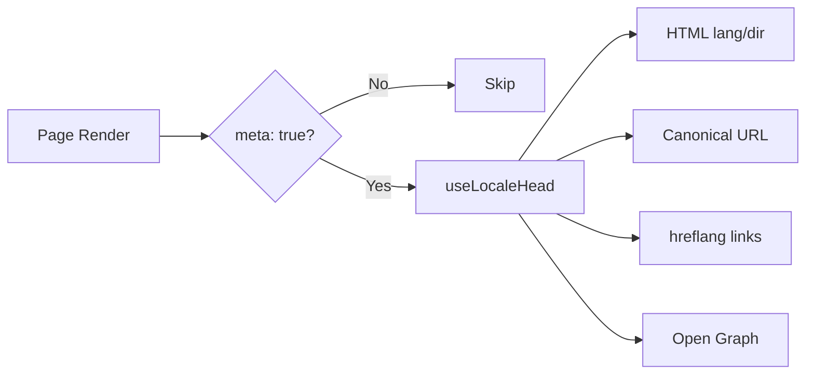

# 🌐 Nuxt I18n Micro için SEO Kılavuzu

## 📖 Giriş

Etkili SEO (Arama Motoru Optimizasyonu), çok dilli sitenizin arama motorları aracılığıyla dünya çapındaki kullanıcılara erişilebilir ve görünür olmasını sağlamak için gereklidir. `Nuxt I18n Micro`, sitenizin yapısı ve içeriği hakkında arama motorlarını bilgilendiren temel meta etiketleri ve öznitelikleri otomatik olarak oluşturarak çok dilli siteler için SEO yönetim sürecini basitleştirir.

Bu kılavuz, `Nuxt I18n Micro`'nun ek yapılandırma gerektirmeden sitenizin görünürlüğünü ve kullanıcı deneyimini artırmak için SEO'yu nasıl işlediğini açıklar.

## ⚙️ Otomatik SEO İşleme

### SEO Meta Oluşturma Akışı



**Oluşturulan etiketler:**

| Etiket           | Örnek                                                    |
| ---------------- | -------------------------------------------------------- |
| HTML nitelikleri | `<html lang="en" dir="ltr">`                             |
| Canonical        | `<link rel="canonical" href="...">`                      |
| hreflang         | `<link rel="alternate" hreflang="en" href="...">`        |
| x-default        | `<link rel="alternate" hreflang="x-default" href="...">` |
| Open Graph       | `<meta property="og:locale" content="en_US">`            |

#### Yerel ayar başına `og` (`og:locale` vs BCP 47)

`<html lang>` ve `hreflang`, `locale.iso` aracılığıyla **BCP 47** kullanır (örn. `ar-AE`).  
Open Graph, [OG protokolü](https://ogp.me/) uyarınca **alt çizgi** (`ar_AE`) ile **`language_TERRITORY`** gerektirir.

Varsayılan olarak, eşleme belirsiz olmadığında `og:locale`, `iso`'dan türetilir (`en-US` → `en_US`).  
Özel bir değere ihtiyacınız olduğunda açık bir **`og`** dizesi ayarlayın (örn. `zh-Hans` → `zh_CN`).  
Ne `og` ne de dönüştürülebilir bir `iso` mevcut değilse, `og:locale` etiketleri oluşturulmaz — geliştirmede bir konsol uyarısı alırsınız (`missingWarn`'e saygı gösterir).

```typescript
i18n: {
  meta: true,
  locales: [
    { code: 'ar', iso: 'ar-AE', og: 'ar_AE', dir: 'rtl' },
    { code: 'en', iso: 'en-US' }, // og:locale → en_US
    { code: 'zh', iso: 'zh-Hans', og: 'zh_CN' }, // script tags need explicit og
  ],
}
```

### 🔑 Ana SEO Özellikleri

`Nuxt I18n Micro`'da `meta` seçeneği etkinleştirildiğinde, modül aşağıdaki SEO yönlerini otomatik olarak yönetir:

1. **🌍 Dil ve Yön Öznitelikleri**:
   - Modül, geçerli yerel ayara ve metin yönüne göre `<html>` etiketinde `lang` ve `dir` öznitelikleri ayarlar (örn. İngilizce için `ltr` veya Arapça için `rtl`).

2. **🔗 Canonical URL'ler**:
   - Modül, her sayfa için bir canonical bağlantı (`<link rel="canonical">`) oluşturur ve arama motorlarının içeriğin birincil sürümünü tanımasını sağlar.

3. **🌐 Alternatif Dil Bağlantıları (`hreflang`)**:
   - Modül, mevcut tüm yerel ayarlar için `<link rel="alternate" hreflang="">` etiketlerini otomatik olarak oluşturur. Bu, arama motorlarının içeriğinizin hangi dil sürümlerinin mevcut olduğunu anlamasına yardımcı olur ve global kitleler için kullanıcı deneyimini iyileştirir.
   - Her yerel ayar **bir** etiket yayınlar: `hreflang = iso || code`. `iso` ayarlandığında, yönlendirme `code`'u asla `hreflang` olarak kullanılmaz (böylece `mx` gibi pazar anahtarları geçersiz dil etiketlerine dönüşmez).
   - İsteğe bağlı `hreflangBaseLanguage: true`, ayrıca `iso`'dan türetilen dil koduna dayalı bir etiket yayınlar (örn. `es-ES` → `es`), `locales` içindeki ilk bölgesel yerel ayar tarafından talep edilir.

4. **🌏 `x-default` Hreflang**:
   - Modül, varsayılan yerel ayarın URL'sini gösteren bir `<link rel="alternate" hreflang="x-default">` etiketi otomatik olarak oluşturur. Bu, arama motorlarına dili tanımlı yerel ayarların hiçbiriyle eşleşmeyen kullanıcılara hangi URL'yi göstereceklerini söyler. Ek yapılandırma gerekmez — `meta: true` ayarlandığında otomatik olarak çalışır.

5. **🔖 Open Graph Meta Verisi**:
   - Modül, her yerel ayar için Open Graph meta etiketleri (`og:locale`, `og:url` vb.) oluşturur; bu özellikle sosyal medya paylaşımı ve arama motoru indeksleme için kullanışlıdır.

### 🛠️ Yapılandırma

Bu SEO özelliklerini etkinleştirmek için, `nuxt.config.ts` dosyanızda `meta` seçeneğinin `true` olarak ayarlandığından emin olun:

```typescript
export default defineNuxtConfig({
  modules: ['nuxt-i18n-micro'],
  i18n: {
    locales: [
      { code: 'en', iso: 'en-US', dir: 'ltr' },
      { code: 'fr', iso: 'fr-FR', dir: 'ltr' },
      { code: 'ar', iso: 'ar-SA', dir: 'rtl' },
    ],
    defaultLocale: 'en',
    translationDir: 'locales',
    meta: true, // Enables automatic SEO management
  },
})
```

### 🌍 Çoklu Etki Alanı Dağıtımları için Dinamik `metaBaseUrl`

`metaBaseUrl` ayarlanmadığında, mutlak SEO URL'leri şu sırayla çözümlenir (#240):

1. [`nuxt-site-config`](https://nuxtseo.com/docs/site-config) içindeki `site.url` (o modül mevcutsa — örn. `@nuxtjs/seo` aracılığıyla)
2. Aksi takdirde geçerli istekten ana bilgisayar adı (`useRequestURL()` / `window.location.origin`)

İstek-kaynağı yedeği ters proxy başlıklarına (`X-Forwarded-Host`, `X-Forwarded-Proto`) saygı gösterir, böylece nginx, Cloudflare, AWS ALB ve benzeri proxy'lerin arkasında doğru çalışır.

Bu, site haritası / robots / schema.org için zaten `site.url` ayarlayan uygulamaların ikinci bir `metaBaseUrl` bildirimine **ihtiyacı olmadığı** anlamına gelir:

```typescript
export default defineNuxtConfig({
  site: {
    url: process.env.NUXT_SITE_URL, // also used by micro for canonical / og:url / hreflang
  },
  i18n: {
    meta: true,
    // metaBaseUrl omitted — picks up site.url, then request origin
  },
})
```

`site.url` olmadan, tek bir uygulama örneği yine de istek kaynağı aracılığıyla her biri için doğru SEO etiketleriyle **birden fazla etki alanı** sunabilir:

```typescript
export default defineNuxtConfig({
  i18n: {
    meta: true,
    // metaBaseUrl is undefined by default — resolved dynamically from the request
  },
})
```

Örneğin, `https://site-a.com/en/about`'a bir istek şunu üretir:

```html
<link rel="canonical" href="https://site-a.com/en/about" /> <meta property="og:url" content="https://site-a.com/en/about" />
```

Aynı uygulama `https://site-b.com/en/about`'u sunarken şunu üretir:

```html
<link rel="canonical" href="https://site-b.com/en/about" /> <meta property="og:url" content="https://site-b.com/en/about" />
```

Her zaman `site.url`'e galip gelen sabit bir taban URL'ye ihtiyacınız varsa, statik bir dize iletin:

```typescript
metaBaseUrl: 'https://example.com'
```

### 🔍 Canonical Sorgu Beyaz Listesi

Varsayılan olarak, yinelenen içerikten kaçınmak için sorgu parametreleri canonical ve `og:url`'den kaldırılır. Korunması gereken belirli sorgu parametrelerini beyaz listeye alabilirsiniz:

```typescript
i18n: {
  canonicalQueryWhitelist: ['page', 'sort', 'filter', 'search', 'q', 'query', 'tag']
}
```

Yalnızca `canonicalQueryWhitelist`'te listelenen parametreler canonical URL'lerde görünür. Diğer tüm sorgu parametreleri (örn. izleme, oturum kimlikleri) kaldırılır.

### 🚫 Sayfa Başına Meta Etiketlerini Devre Dışı Bırakma

`defineI18nRoute()` kullanarak belirli sayfalar için SEO meta etiketi oluşturmayı devre dışı bırakabilirsiniz:

```vue
<script setup>
// Disable all SEO meta tags for this page
defineI18nRoute({
  disableMeta: true,
})
</script>
```

Meta'yı yalnızca belirli yerel ayarlar için de devre dışı bırakabilirsiniz:

```vue
<script setup>
// Disable meta tags only for English locale on this page
defineI18nRoute({
  disableMeta: ['en'],
})
</script>
```

`disableMeta` aktif olduğunda, etkilenen sayfa/yerel ayar için `hreflang`, `canonical`, `og:locale`, `og:url` veya `x-default` etiketleri oluşturulmaz.

### 🔇 Devre Dışı Yerel Ayarlar

`disabled: true` olan yerel ayarlar tüm SEO etiketi oluşturmadan otomatik olarak hariç tutulur — onlar için `hreflang`, `og:locale:alternate` veya alternatif bağlantılar oluşturulmaz:

```typescript
i18n: {
  locales: [
    { code: 'en', iso: 'en-US' },
    { code: 'fr', iso: 'fr-FR', disabled: true }, // excluded from SEO tags
  ]
}
```

### 🙈 Devre dışı yerel ayarlar (`seo: false`)

Rotalanabilir ve çevrilebilir kalması gereken ancak yerel ayarlar arası keşif etiketlerinde görünmemesi gereken yerel ayarlar için, `seo: false` ayarlayın. Bu yerel ayarlar `hreflang` alternatiflerinden ve `og:locale:alternate`'den atlanır. Yapılandırılmış **varsayılan** yerel ayarınızda `seo: false` varsa, `x-default` bağlantısı da yayınlanmaz.

```typescript
i18n: {
  locales: [
    { code: 'en', iso: 'en-US' },
    { code: 'ru', iso: 'ru-RU', seo: false }, // internal / non-indexed locale
  ]
}
```

### 📌 Stratejiye Özgü Davranış

| Strateji                | hreflang bağlantıları | x-default                | canonical         | og:url |
| ----------------------- | --------------------- | ------------------------ | ----------------- | ------ |
| `prefix`                | ✅ Tüm yerel ayarlar  | ✅ Varsayılan yerel ayar URL | ✅ Geçerli URL | ✅     |
| `prefix_except_default` | ✅ Tüm yerel ayarlar  | ✅ Öneksiz URL              | ✅ Geçerli URL | ✅     |
| `prefix_and_default`    | ✅ Tüm yerel ayarlar  | ✅ Varsayılan yerel ayar URL | ✅ Geçerli URL | ✅     |
| `no_prefix`             | ❌ Oluşturulmaz       | ❌ Oluşturulmaz             | ✅ Geçerli URL | ✅     |

`no_prefix` stratejisi için, yalnızca `canonical`, `og:url`, `og:locale` ve `html` nitelikleri (`lang`, `dir`) oluşturulur. Yerel ayar başına farklı URL'ler olmadığı için alternatif dil bağlantıları (`hreflang`) ve `x-default` oluşturulmaz.

## Sayfa düzeyi geçersiz kılmalar (`useI18nHead`)

**Makaleler, kılavuzlar veya her yerel ayarın mevcut olmadığı veya URL'lerin bir API'den geldiği herhangi bir CMS içeriği** için, özel bir i18n head eklentisi yerine sayfada [`useI18nHead`](/api/composables/use-i18n-head) kullanın.

### Kısmi çevirili makale

```vue
<script setup lang="ts">
const article = await loadArticle()
// article.locales = { en: '...', de: '...' } — only translated locales

useI18nHead({
  meta: [{ property: 'og:title', content: article.title }],
  replace: {
    hreflang: Object.entries(article.locales).map(([locale, href]) => ({
      rel: 'alternate',
      hreflang: locale,
      href,
    })),
    ogAlternates: Object.keys(article.locales),
  },
})
</script>
```

### `$setI18nRouteParams` ile yerel ayar başına slug'lar

Slug'lar dile göre farklıysa, önce rota parametrelerini ayarlayın, ardından alternatifleri gerçek URL'lerle geçersiz kılın:

```vue
<script setup lang="ts">
const { $defineI18nRoute, $setI18nRouteParams } = useNuxtApp()
const { data: article } = await useFetch(`/api/articles/${slug}`)

$defineI18nRoute({
  localeRoutes: { en: '/blog/[slug]', de: '/de/blog/[slug]' },
})

$setI18nRouteParams({
  en: { slug: article.value.slugEn },
  de: { slug: article.value.slugDe },
})

useI18nHead({
  replace: {
    hreflang: ['en', 'de'].map((locale) => ({
      rel: 'alternate',
      hreflang: locale,
      href: article.value.urls[locale],
    })),
    ogAlternates: ['en', 'de'],
  },
})
</script>
```

### Bir proxy arkasında HTTPS kaynağı

Özel bir kaynak composable olmadan SSR'de doğru mutlak URL'ler için:

```ts
i18n: {
  meta: true,
  metaBaseUrl: undefined,
  metaTrustForwardedHost: true,
  metaTrustForwardedProto: true,
}
```

Daha fazla örnek (canonical geçersiz kılma, `x-default`, reaktif getirme, paylaşılan yardımcılar): [useI18nHead composable](/api/composables/use-i18n-head).

### ⚠️ Sonda Eğik Çizgi

Modül, `useRoute().fullPath`'ten gerçek yola göre canonical ve `hreflang` URL'leri oluşturur. Uygulamanız sonda eğik çizgi kullanıyorsa (örn. Nuxt'un `router.options` aracılığıyla), oluşturulan URL'ler bunu yansıtır. Ancak, `$switchLocalePath` yolları normalleştirebilir ve sonda eğik çizgileri kaldırabilir. Sonda eğik çizgi tutarlılığı SEO'nuz için kritikse, oluşturulan URL'lerin uygulamanızın URL yapısıyla eşleştiğini doğrulayın.

### 🎯 Faydaları

`meta` seçeneğini etkinleştirerek şunlardan yararlanırsınız:

- **📈 Gelişmiş Arama Motoru Sıralamaları**: Arama motorları, farklı dil sürümleri arasındaki ilişkileri anlayarak sitenizi daha iyi indeksleyebilir.
- **👥 Daha İyi Kullanıcı Deneyimi**: Kullanıcılara tercihlerine göre doğru dil sürümü sunulur, bu da daha kişiselleştirilmiş bir deneyime yol açar.
- **🔧 Azaltılmış Manuel Yapılandırma**: Modül SEO görevlerini otomatik olarak işler, SEO ile ilgili meta etiketleri ve nitelikleri manuel olarak eklemeniz gerekliliğinden sizi kurtarır.

## 🔗 Nuxt SEO (`@nuxtjs/seo`)

[`@nuxtjs/seo`](https://nuxtseo.com/), site haritası, robots, schema.org, OG resimleri ve ilgili modülleri paketler. [`nuxt-site-config`](https://nuxtseo.com/docs/site-config/guides/i18n) (v4+) aracılığıyla **nuxt-i18n-micro** ile entegre olur.

### Gereksinimler

- **`@nuxtjs/seo` 3+** (mevcut sürümler `nuxt-site-config` 4+ kullanır, bu da micro için `nuxt-site-config:i18n` eklentisini kaydeder)
- **`i18n.meta: true`** (önerilir — micro yerel ayar farkında olan head etiketleri sağlar; Nuxt SEO site haritası, schema.org vb. ekler)

### Modül sırası

Site yapılandırmasının yerel ayar kurulumunuzu okuyabilmesi için **nuxt-i18n-micro'yu `@nuxtjs/seo`'dan önce** listeleyin:

```typescript
export default defineNuxtConfig({
  modules: ['nuxt-i18n-micro', '@nuxtjs/seo'],
  site: {
    url: 'https://example.com',
    name: 'My Site',
  },
  i18n: {
    meta: true,
    defaultLocale: 'en',
    locales: [
      { code: 'en', iso: 'en-US' },
      { code: 'de', iso: 'de-DE' },
    ],
  },
})
```

### Çevrilen site adı ve açıklaması

Nuxt Site Config, yerel ayar dosyalarınızdan isteğe bağlı çeviri anahtarlarını okur:

```json
{
  "nuxtSiteConfig": {
    "name": "My Site",
    "description": "My site description"
  }
}
```

`locales/en.json`, `locales/de.json` vb. içindeki yerel ayar başına değerler otomatik olarak alınır.

### Sorun Giderme

`Plugin nuxt-seo:defaults depends on nuxt-site-config:i18n but they are not registered` görüyorsanız, **`@nuxtjs/seo`'yu 3+**'a yükseltin (bkz. [issue #133](https://github.com/s00d/nuxt-i18n-micro/issues/133)). Eski `nuxt-site-config` 3.x, i18n'i yalnızca `@nuxtjs/i18n` için bağladı, micro için değil.

Daha fazla: [Site haritası i18n kılavuzu](https://nuxtseo.com/docs/sitemap/guides/i18n), [Site Config i18n kılavuzu](https://nuxtseo.com/docs/site-config/guides/i18n).
