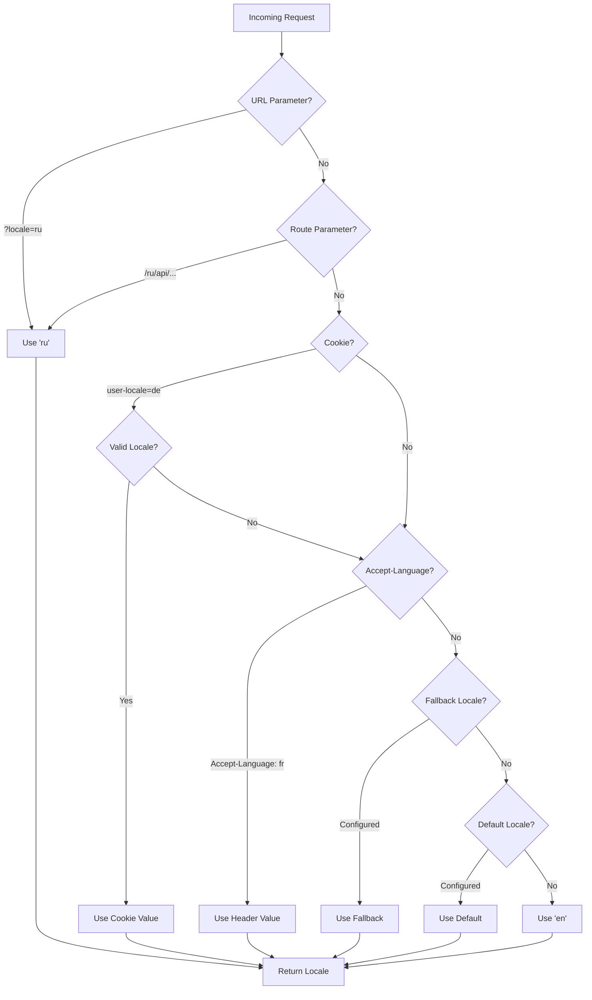

# 🌍 Nuxt I18n Micro'da Sunucu Tarafı Çeviriler ve Yerel Ayar Bilgisi

## 📖 Genel Bakış

Nuxt I18n Micro sunucu tarafı çevirileri ve yerel ayar bilgilerini destekler, içeriği çevirmenize ve sunucuda yerel ayar ayrıntılarına erişmenize olanak tanır. Bu, özellikle istemciye ulaşmadan önce yerelleştirmenin gerekli olduğu API'ler veya sunucu tarafından render edilen uygulamalar için kullanışlıdır.

Çeviriler, Nuxt I18n yapılandırmasında tanımlanan yerel ayar mesajlarını kullanır ve algılanan yerel ayara göre dinamik olarak çözümlenir.

Varsayılan olarak (`translationPayloads.mode: 'premerged'`), kök seviyesi dosyalar derleme zamanında her sayfa yüküne `\{page\}/\{locale\}/data.json` olarak pişirilir. Sunucu, istemcinin `/\{apiBaseUrl\}/...` altında getirdiği aynı önceden oluşturulmuş dosyaları yükler, böylece tüm anahtarlar (hem paylaşılan hem de sayfaya özel) sunucu işleyicilerinde mevcuttur.

`translationPayloads.mode: 'source'` ile, `loadTranslationsFromServer()` (veya `/_locales` rotası) çağrıldığında kompakt kaynak dosyalar çalışma zamanında birleştirilir — **Edge**'de Nitro `serverAssets` aracılığıyla, **Node**'da isteğe bağlı genel kopyadan. Ayrıntılar için [Performans Kılavuzu — Sunucusuz Yük Çıktısı](/guides/performance#serverless-payload-output) ve [Önbellek ve Depolama Mimarisi](/api/cache) bölümlerine bakın.

Çalışma zamanı ve sunucu API'lerinin birleştirilmiş listesi için [API Referansına](/api/overview) bakın.

## 🛠️ Sunucu Tarafı Ara Yazılımı Kurma

Sunucu tarafı çevirileri ve yerel ayar bilgilerini etkinleştirmek için sağlanan ara yazılım işlevlerini kullanın:

- `useTranslationServerMiddleware` - içeriği çevirmek için
- `useLocaleServerMiddleware` - yerel ayar bilgilerine erişmek için

Her iki ara yazılım işlevi de tüm sunucu rotalarında otomatik olarak kullanılabilir.

Yerel ayar algılama mantığı, modül genelinde tutarlılığı sağlamak için `detectCurrentLocale` yardımcı işlevi aracılığıyla her iki ara yazılım işlevi arasında paylaşılır.

## ✨ Sunucu İşleyicilerinde Çevirileri Kullanma

Çeviri ara yazılımını kullanarak herhangi bir `eventHandler`'da içeriği sorunsuz bir şekilde çevirebilirsiniz.

### Örnek: Temel Çeviri Kullanımı

```typescript
import { defineEventHandler } from 'h3'

export default defineEventHandler(async (event) => {
  const t = await useTranslationServerMiddleware(event)
  return {
    message: t('greeting'), // Returns the translated value for the key "greeting"
  }
})
```

Bu örnekte:

- Kullanıcının yerel ayarı, sorgu parametrelerinden, çerezlerden veya başlıklardan otomatik olarak algılanır.
- `t` işlevi, algılanan yerel ayar için uygun çeviriyi alır.

## 🌍 Sunucu İşleyicilerinde Yerel Ayar Bilgilerini Kullanma

### Temel Yerel Ayar Bilgisi Kullanımı

```typescript
import { defineEventHandler } from 'h3'

export default defineEventHandler((event) => {
  const localeInfo = useLocaleServerMiddleware(event)

  return {
    success: true,
    data: localeInfo,
    timestamp: new Date().toISOString(),
  }
})
```

### Özel Yerel Ayar Parametreleri Sağlama

```typescript
import { defineEventHandler } from 'h3'

export default defineEventHandler((event) => {
  // Force specific locale with custom default
  const localeInfo = useLocaleServerMiddleware(event, 'en', 'ru')

  return {
    success: true,
    data: localeInfo,
    timestamp: new Date().toISOString(),
  }
})
```

### Yanıt Yapısı

Yerel ayar ara yazılımı aşağıdaki özelliklere sahip bir `LocaleInfo` nesnesi döndürür:

```typescript
interface LocaleInfo {
  current: string // Current detected locale code
  default: string // Default locale code
  fallback: string // Fallback locale code
  available: string[] // Array of all available locale codes
  locale: Locale | null // Full locale configuration object
  isDefault: boolean // Whether current locale is the default
  isFallback: boolean // Whether current locale is the fallback
}
```

### Örnek Yanıt

```json
{
  "success": true,
  "data": {
    "current": "ru",
    "default": "en",
    "fallback": "en",
    "available": ["en", "ru", "de"],
    "locale": {
      "code": "ru",
      "iso": "ru-RU",
      "dir": "ltr",
      "displayName": "Русский"
    },
    "isDefault": false,
    "isFallback": false
  },
  "timestamp": "2024-01-15T10:30:00.000Z"
}
```

## 🌐 Özel Bir Yerel Ayar Sağlama

Bir yerel ayarı manuel olarak belirtmeniz gerekiyorsa (örn. test veya belirli istekler için), çeviri ara yazılımına iletebilirsiniz:

### Örnek: Özel Yerel Ayar

```typescript
import { defineEventHandler } from 'h3'

function detectLocale(event): string | null {
  const urlSearchParams = new URLSearchParams(event.node.req.url?.split('?')[1])
  const localeFromQuery = urlSearchParams.get('locale')
  if (localeFromQuery) return localeFromQuery

  return 'en'
}

export default defineEventHandler(async (event) => {
  const t = await useTranslationServerMiddleware(event, 'en', detectLocale(event)) // Force French local, en - default locale
  return {
    message: t('welcome'), // Returns the French translation for "welcome"
  }
})
```

## 📋 Yerel Ayar Algılama Mantığı

Her iki ara yazılım işlevi, kullanıcının yerel ayarını aşağıdaki öncelik sırasını kullanarak otomatik olarak belirler:



1. **URL Parametreleri**: `?locale=ru`
2. **Rota Parametreleri**: `/ru/api/endpoint`
3. **Çerezler**: `user-locale` çerezi
4. **HTTP Başlıkları**: `Accept-Language` başlığı
5. **Yedek Yerel Ayar**: Modül seçeneklerinde yapılandırıldığı gibi
6. **Varsayılan Yerel Ayar**: Modül seçeneklerinde yapılandırıldığı gibi
7. **Sabit Kodlu Yedek**: `'en'`

> **Not**: Yerel ayar algılama mantığı, modül genelinde tutarlılığı sağlamak için `useLocaleServerMiddleware` ve `useTranslationServerMiddleware` arasında paylaşılır.

## 📋 Gelişmiş Kullanım Örnekleri

### Yerel Ayara Dayalı Koşullu Yanıt

```typescript
import { defineEventHandler } from 'h3'

export default defineEventHandler((event) => {
  const { current, isDefault, locale } = useLocaleServerMiddleware(event)

  // Return different content based on locale
  if (current === 'ru') {
    return {
      message: 'Привет, мир!',
      locale: current,
      isDefault,
    }
  }

  if (current === 'de') {
    return {
      message: 'Hallo, Welt!',
      locale: current,
      isDefault,
    }
  }

  // Default English response
  return {
    message: 'Hello, World!',
    locale: current,
    isDefault,
  }
})
```

### Özel Yerel Ayar Algılama

```typescript
import { defineEventHandler } from 'h3'

export default defineEventHandler((event) => {
  // Force German locale with English as fallback
  const { current, isDefault, locale } = useLocaleServerMiddleware(event, 'en', 'de')

  return {
    message: 'Hallo, Welt!',
    locale: current,
    isDefault: false, // Will be false since we forced German
  }
})
```

### Doğrulama ile Yerel Ayar Farkında API

```typescript
import { defineEventHandler, createError } from 'h3'

export default defineEventHandler((event) => {
  const { current, available, locale } = useLocaleServerMiddleware(event)

  // Validate if the detected locale is supported
  if (!available.includes(current)) {
    throw createError({
      statusCode: 400,
      statusMessage: `Unsupported locale: ${current}. Available locales: ${available.join(', ')}`,
    })
  }

  // Return locale-specific configuration
  return {
    locale: current,
    direction: locale?.dir || 'ltr',
    displayName: locale?.displayName || current,
    availableLocales: available,
  }
})
```

### Çeviri Ara Yazılımıyla Entegrasyon

Kapsamlı uluslararasılaştırma için yerel ayar bilgilerini çeviri ara yazılımıyla birleştirebilirsiniz:

```typescript
import { defineEventHandler } from 'h3'

export default defineEventHandler(async (event) => {
  const localeInfo = useLocaleServerMiddleware(event)
  const t = await useTranslationServerMiddleware(event)

  return {
    locale: localeInfo.current,
    message: t('welcome_message'),
    availableLocales: localeInfo.available,
    isDefault: localeInfo.isDefault,
  }
})
```

## 📝 En İyi Uygulamalar

1. **Her zaman yerel ayarları doğrulayın**: Algılanan yerel ayarın kullanılabilir yerel ayar listenizde olup olmadığını kontrol edin
2. **Yedek mantığı kullanın**: Yerel ayar algılaması başarısız olduğunda mantıklı varsayılanlar sağlayın
3. **Yerel ayar bilgilerini önbelleğe alın**: Performans açısından kritik uygulamalar için, yerel ayar algılama sonuçlarını önbelleğe almayı düşünün
4. **Uç durumları ele alın**: Desteklenmeyen yerel ayarları hesaba katın ve uygun hata yanıtları sağlayın
5. **Çevirilerle birleştirin**: Tam i18n desteği için yerel ayar bilgilerini çeviri ara yazılımıyla birlikte kullanın

## 🚀 Performans Hususları

- Her iki ara yazılım işlevi de hafiftir ve hızlı yürütme için tasarlanmıştır
- Yerel ayar algılaması verimli yedek zincirleri kullanır
- Yerel ayar algılaması sırasında harici API çağrıları yapılmaz
- Sonuçlar optimum performans için eşzamanlı olarak hesaplanır
