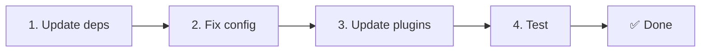

# 📦 v2.x'ten v3.x'e Yükseltme

<Tip>
[nuxt-i18n'den Geçiş](/migration/from-nuxtjs-i18n) — o kılavuz, vue-i18n ekosisteminden geçişi kapsar, nuxt-i18n-micro v2'den değil.
</Tip>

v3.0.0 temel mimari değişiklikler sunar: strateji paketleri, yeni bir önbellekleme sistemi, `useI18nLocale()` aracılığıyla merkezi yerel ayar yönetimi ve yeniden tasarlanmış bir yönlendirme hattı. Bu bölüm, tüm bozan değişiklikleri ve kodunuzu nasıl güncelleyeceğinizi kapsar.

## Geçiş Adımları



## Bozan Değişikliklerin Özeti

- **Yerel ayar durumu** — Manuel `useState` / `useCookie` → `useI18nLocale()` composable
- **Yapılandırma erişimi** — `useRuntimeConfig().public.i18nConfig` → `#build/i18n.strategy.mjs`'den `getI18nConfig()`
- **Yönlendirme bileşeni** — `fallbackRedirectComponentPath` seçeneği → Sunucu yönlendirme eklentisi + istemci rota ara yazılımı (otomatik)
- **`includeDefaultLocaleRoute`** — Desteklendi (kullanımdan kaldırıldı) → Kaldırıldı, `strategy` seçeneğini kullanın
- **`experimental.hmr`** — `experimental` altında → Kök seviyesi seçeneği
- **`previousPageFallback`** — Tamamen kaldırıldı (kümülatif birleştirme stratejisi bunu otomatik olarak işler)
- **Önbellekleme** — `useStorage('cache')` → `TranslationStorage` singleton (`globalThis`'te `Symbol.for`)
- **SSR aktarımı** — Çalışma zamanı yapılandırması → Nuxt yükü (v3 `useState` kullandı; parçalar artık `payload.data`'da yaşıyor, bkz. [Performans](/guides/performance#server-side-payload-transfer))
- **Strateji sınıfları** — Dahili → Ayrı paketler (`@i18n-micro/route-strategy`, `@i18n-micro/path-strategy`)

## Kaldırıldı: `fallbackRedirectComponentPath`

`fallbackRedirectComponentPath` seçeneği ve `locale-redirect.vue` yedek bileşeni kaldırıldı. Yönlendirme mantığı artık şunlarla ele alınır:

1. **Sunucu ara yazılımı** (`i18n.global.ts`) — `event.context.i18n.locale`'yi ayarlar
2. **Sunucu yönlendirme eklentisi** (`06.redirect.ts`, yalnızca sunucu) — render öncesi 302 yönlendirmeleri
3. **İstemci rota ara yazılımı** (`i18n-redirect.global.ts`) — hidrasyon sonrası SPA yönlendirmeleri

```diff
 i18n: {
   strategy: 'prefix_except_default',
-  fallbackRedirectComponentPath: '~/components/MyRedirect.vue',
 }
```

Yedek bileşende özel yönlendirme mantığınız varsa, bunun yerine bir sunucu eklentisinde uygulayın:

```ts
// plugins/i18n-loader.server.ts
export default defineNuxtPlugin({
  name: 'i18n-custom-redirect',
  enforce: 'pre',
  order: -10,
  setup() {
    const { setLocale } = useI18nLocale()
    // Your custom detection logic
    setLocale(detectedLocale)
  },
})
```

## Kaldırıldı: `includeDefaultLocaleRoute`

Bunun yerine `strategy` seçeneğini kullanın:

- `includeDefaultLocaleRoute: true` → `strategy: 'prefix'`
- `includeDefaultLocaleRoute: false` → `strategy: 'prefix_except_default'` (varsayılan)

```diff
 i18n: {
-  includeDefaultLocaleRoute: true,
+  strategy: 'prefix',
 }
```

## Yapılandırma Erişimi: `getI18nConfig()`, `useRuntimeConfig`'in yerini alır

```diff
- const config = useRuntimeConfig()
- const cookieName = config.public.i18nConfig?.localeCookie || 'user-locale'
+ import { getI18nConfig } from '#build/i18n.strategy.mjs'
+ const { localeCookie: configCookie } = getI18nConfig()
+ const cookieName = configCookie ?? 'user-locale'
```

## Yerel Ayar Yönetimi: `useI18nLocale()`, manuel durumun yerini alır

v2'de doğrudan `useState('i18n-locale')` veya `useCookie('user-locale')` kullanmış olabilirsiniz. v3'te, merkezi `useI18nLocale()` composable'ını kullanın:

```diff
- const locale = useState('i18n-locale')
- const cookie = useCookie('user-locale')
- locale.value = 'fr'
- cookie.value = 'fr'
+ const { setLocale } = useI18nLocale()
+ setLocale('fr') // Updates both state and cookie atomically
```

Ayrıntılı örnekler için [Özel Dil Algılama](/guides/custom-language-detection) bölümüne bakın.

## Deneysel Seçenekler Taşındı / Kaldırıldı

`hmr`, `experimental`'den kök seviyesine taşındı. `previousPageFallback` tamamen kaldırıldı — modül artık, sayfalar çakışan iç içe anahtarları paylaşsa bile geçiş animasyonları sırasında önceki sayfadan çevirileri otomatik olarak koruyan kümülatif bir derin birleştirme stratejisi (2 seviye derinlik) kullanır. Geçiş animasyonu tamamlandıktan sonra, `page:transition:finish` kancası eski sayfa anahtarlarını bellekten temizler.

```diff
 i18n: {
-  experimental: {
-    hmr: true,
-    previousPageFallback: true
-  }
+  hmr: true,
+  // previousPageFallback removed — handled automatically
 }
```

## Yönlendirme Mimarisi (v3)

Yönlendirmeler artık iki bileşen tarafından otomatik olarak ele alınır:

1. **Sunucu tarafı** (`06.redirect.ts`, yalnızca sunucu): SSR sırasında çalışır, herhangi bir sayfa render işleminden önce 302 yönlendirmeleri yayınlar — "hata flaşı" yok
2. **İstemci tarafı** (`i18n-redirect.global.ts`): SPA gezinmesinde global rota ara yazılımı; sorgu dizesini ve hash'i korur

Yönlendirmeler için yerel ayar önceliği:

1. `useState('i18n-locale')` — `useI18nLocale().setLocale()` aracılığıyla ayarlanır
2. Çerez — `localeCookie` yapılandırılırsa
3. `Accept-Language` başlığı — `autoDetectLanguage: true` ise
4. `defaultLocale` — yedek

Standart kurulumlar için kod değişikliği gerekmez.

<Warning>
`prefix` ve `prefix_except_default` stratejileri için `redirects: true` ile, sayfa yeniden yüklemeleri arasında yerel ayar sürekliliğini etkinleştirmek için `localeCookie: 'user-locale'` ayarlayın. Onsuz, yönlendirmeler yalnızca `Accept-Language` veya `defaultLocale` kullanır.
</Warning>

## TypeScript: Dahili Modül Türleri (isteğe bağlı)

`#i18n-internal/plural`, `#i18n-internal/strategy` veya `#i18n-internal/config` gibi dahili içe aktarmalarla ilgili tür hataları alırsanız, projenizin `package.json`'una `imports` bölümünü ekleyin:

```json
{
  "imports": {
    "#i18n-internal/plural": "nuxt-i18n-micro/internals",
    "#i18n-internal/strategy": "nuxt-i18n-micro/internals",
    "#i18n-internal/config": "nuxt-i18n-micro/internals"
  }
}
```

<Tip>

</Tip>
