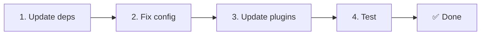

# 📦 v2.x'ten v3.x'e yükseltme

<Tip>
[nuxt-i18n'den geçiş](/migration/from-nuxtjs-i18n) sayfasına bak. O kılavuz nuxt-i18n-micro v2'den değil, vue-i18n ekosisteminden geçişi anlatır.
</Tip>

v3.0.0, temel mimari değişiklikler getirir: strateji paketleri, yeni önbellek sistemi, `useI18nLocale()` üzerinden merkezi yerel ayar yönetimi ve yeniden tasarlanmış yönlendirme boru hattı. Bu bölüm tüm kırıcı değişiklikleri ve kodunu nasıl güncelleyeceğini kapsar.

## Geçiş adımları



## Kırıcı değişiklikler özeti

- **Yerel ayar durumu**: manuel `useState` / `useCookie` → `useI18nLocale()` composable'ı
- **Yapılandırma erişimi**: `useRuntimeConfig().public.i18nConfig` → `#build/i18n.strategy.mjs` içindeki `getI18nConfig()`
- **Yönlendirme bileşeni**: `fallbackRedirectComponentPath` seçeneği → Sunucu yönlendirme eklentisi + istemci rota ara yazılımı (otomatik)
- **`includeDefaultLocaleRoute`**: Desteklendi (kullanımdan kaldırıldı) → Kaldırıldı, `strategy` seçeneğini kullan
- **`experimental.hmr`**: `experimental` altında → Kök düzeyi seçenek
- **`previousPageFallback`**: Tamamen kaldırıldı (kümülatif birleştirme stratejisi bunu otomatik olarak yönetir)
- **Önbellekleme**: `useStorage('cache')` → `TranslationStorage` tekil (`globalThis` üzerinde `Symbol.for`)
- **SSR aktarımı**: Çalışma zamanı yapılandırması → Nuxt payload (v3 `useState` kullandı; parçalar artık `payload.data`'da, [Performans](/guides/performance#server-side-payload-transfer) sayfasına bak)
- **Strateji sınıfları**: Dahili → Ayrı paketler (`@i18n-micro/route-strategy`, `@i18n-micro/path-strategy`)

## Kaldırıldı: `fallbackRedirectComponentPath`

`fallbackRedirectComponentPath` seçeneği ve `locale-redirect.vue` yedek bileşeni kaldırıldı. Yönlendirme mantığı artık şunlarla yönetilir:

1. **Sunucu ara yazılımı** (`i18n.global.ts`): `event.context.i18n.locale`'yi ayarlar
2. **Sunucu yönlendirme eklentisi** (`06.redirect.ts`, yalnızca sunucu): oluşturmadan önce 302 yönlendirmesi
3. **İstemci rota ara yazılımı** (`i18n-redirect.global.ts`): hidrasyondan sonra SPA yönlendirmeleri

```diff
 i18n: {
   strategy: 'prefix_except_default',
-  fallbackRedirectComponentPath: '~/components/MyRedirect.vue',
 }
```

Yedek bileşende özel yönlendirme mantığın varsa, bunu bir sunucu eklentisinde uygula:

```ts
// plugins/i18n-loader.server.ts
export default defineNuxtPlugin({
  name: 'i18n-custom-redirect',
  enforce: 'pre',
  order: -10,
  setup() {
    const { setLocale } = useI18nLocale()
    // Your custom detection logic
    setLocale(detectedLocale)
  },
})
```

## Kaldırıldı: `includeDefaultLocaleRoute`

Onun yerine `strategy` seçeneğini kullan:

- `includeDefaultLocaleRoute: true` → `strategy: 'prefix'`
- `includeDefaultLocaleRoute: false` → `strategy: 'prefix_except_default'` (varsayılan)

```diff
 i18n: {
-  includeDefaultLocaleRoute: true,
+  strategy: 'prefix',
 }
```

## Yapılandırma erişimi: `getI18nConfig()`, `useRuntimeConfig`'in yerini alır

```diff
- const config = useRuntimeConfig()
- const cookieName = config.public.i18nConfig?.localeCookie || 'user-locale'
+ import { getI18nConfig } from '#build/i18n.strategy.mjs'
+ const { localeCookie: configCookie } = getI18nConfig()
+ const cookieName = configCookie ?? 'user-locale'
```

## Yerel ayar yönetimi: `useI18nLocale()`, manuel state'in yerini alır

v2'de doğrudan `useState('i18n-locale')` veya `useCookie('user-locale')` kullanmış olabilirsin. v3'te merkezi `useI18nLocale()` composable'ını kullan:

```diff
- const locale = useState('i18n-locale')
- const cookie = useCookie('user-locale')
- locale.value = 'fr'
- cookie.value = 'fr'
+ const { setLocale } = useI18nLocale()
+ setLocale('fr') // Updates both state and cookie atomically
```

Ayrıntılı örnekler için [Özel dil algılama](/guides/custom-language-detection) sayfasına bak.

## Deneysel seçenekler taşındı / kaldırıldı

`hmr`, `experimental`'dan kök düzeyine taşındı. `previousPageFallback` tamamen kaldırıldı. Modül artık; sayfalar örtüşen iç içe anahtarları paylaşsa bile geçiş animasyonları sırasında önceki sayfadan çevirileri otomatik olarak koruyan kümülatif bir derin birleştirme stratejisi (2 seviye derinlik) kullanır. Geçiş animasyonu tamamlandıktan sonra `page:transition:finish` kancası eski sayfa anahtarlarını bellekten temizler.

```diff
 i18n: {
-  experimental: {
-    hmr: true,
-    previousPageFallback: true
-  }
+  hmr: true,
+  // previousPageFallback removed — handled automatically
 }
```

## Yönlendirme mimarisi (v3)

Yönlendirmeler artık iki bileşen tarafından otomatik olarak yönetilir:

1. **Sunucu tarafı** (`06.redirect.ts`, yalnızca sunucu): SSR sırasında çalışır, herhangi bir sayfa oluşturmadan önce 302 yönlendirmeleri yayar. "Hata parlaması" yoktur.
2. **İstemci tarafı** (`i18n-redirect.global.ts`): SPA gezinmesinde global rota ara yazılımı; sorgu dizesini ve hash'i korur

Yönlendirmeler için yerel ayar önceliği:

1. `useState('i18n-locale')`: `useI18nLocale().setLocale()` ile ayarlanır
2. Çerez: `localeCookie` yapılandırılmışsa
3. `Accept-Language` başlığı: `autoDetectLanguage: true` ise
4. `defaultLocale`: geri dönüş

Standart kurulumlar için kod değişikliği gerekmez.

<Warning>
`redirects: true` ile `prefix` ve `prefix_except_default` stratejileri için, sayfa yenilemeleri arasında yerel ayarın kalıcı kalmasını sağlamak için `localeCookie: 'user-locale'` olarak ayarla. Bu olmadan yönlendirmeler yalnızca `Accept-Language` veya `defaultLocale` kullanır.
</Warning>

## TypeScript: Dahili modül türleri (opsiyonel)

`#i18n-internal/plural`, `#i18n-internal/strategy` veya `#i18n-internal/config` gibi dahili içe aktarımlarla ilgili tür hataları alırsan, projenin `package.json` dosyasına `imports` bölümünü ekle:

```json
{
  "imports": {
    "#i18n-internal/plural": "nuxt-i18n-micro/internals",
    "#i18n-internal/strategy": "nuxt-i18n-micro/internals",
    "#i18n-internal/config": "nuxt-i18n-micro/internals"
  }
}
```
