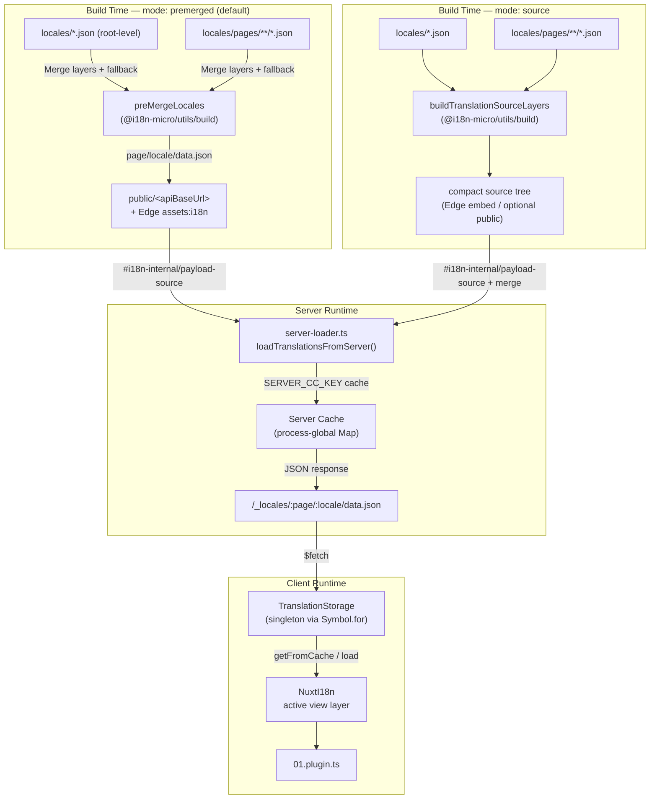

# 🗄️ Архітектура кешу та сховища перекладів

## 📖 Огляд

Nuxt I18n Micro v3 використовує багатошарову архітектуру кешування для перекладів. Завантаження payload залежить від `translationPayloads.mode`:

- **`premerged`** (за замовчуванням) — файли кореневого рівня, сторінки, fallback та шарів обʼєднуються на етапі збірки через `@i18n-micro/utils/build` у `\{page\}/\{locale\}/data.json`
- **`source`** — компактні source-файли зберігаються для runtime-злиття через `@i18n-micro/utils/source-loader` та `@i18n-micro/utils/merge-source` (Edge вбудовує їх у Nitro `serverAssets`; Node читає їх з `public/`, коли їх скопійовано)

Ця сторінка описує, як працює вбудований кеш і як розширити його для кастомних сценаріїв (адмін-інструменти, зовнішні API, інвалідація кешу).

## 📊 Огляд архітектури

### Потік даних



## 🧱 Основні компоненти

### 1. `TranslationStorage` (клієнт + сервер)

**Файл**: `src/runtime/utils/storage.ts`

Клас-сінглтон, що забезпечує уніфіковане сховище перекладів для клієнта та сервера. Використовує `Symbol.for('__NUXT_I18N_STORAGE_CACHE__')` на `globalThis`, щоб гарантувати, що існує лише один екземпляр, навіть коли завантажено кілька бандлів.

**Ключові методи:**

| Метод                               | Опис                                                                    |
| ----------------------------------- | ---------------------------------------------------------------------- |
| `getFromCache(locale, routeName?)`  | Синхронна перевірка: повертає закешовані дані в памʼяті або `null`     |
| `load(locale, routeName?, options)` | Асинхронне завантаження з кешуванням: спершу перевіряє кеш, потім використовує `$fetch` |
| `clear()`                           | Очищає весь кеш                                                        |

**Формат ключа кешу**: `\{locale\}:\{routeName\}` (наприклад, `en:index`, `fr:about`)

```typescript
import { translationStorage } from '../utils/storage'

// Synchronous cache check
const cached = translationStorage.getFromCache('en', 'index')

// Async load (with automatic caching)
const result = await translationStorage.load('en', 'index', {
  apiBaseUrl: '_locales',
  baseURL: '/',
  dateBuild: '2024-01-01',
})
// result.data — merged translations
// result.cacheKey — cache key used
```

### ⚙️ Детермінований cache-busting (`i18n.dateBuild`)

За замовчуванням цей модуль генерує `dateBuild` під час збірки за допомогою `Date.now()`. Потім його вбудовано у згенерований `#build/i18n.strategy.mjs` та використано як query-параметр (`?v=...`) для інвалідації кешу fetch-запитів перекладів після повторних збірок.

Якщо вам потрібні відтворювані збірки (наприклад, щоб покращити hit-rate кешу чанків у rolling-деплойментах), встановіть стабільне значення у `nuxt.config`:

```ts
export default defineNuxtConfig({
  i18n: {
    // Any stable string/number (git SHA, CI build number, release tag, etc.)
    dateBuild: process.env.GIT_SHA ?? 'local-dev',
  },
})
```

### 2. `loadTranslationsFromServer()` (лише сервер)

**Файл**: `src/runtime/server/utils/server-loader.ts`

Завантажує переклади для локалі/сторінки та кешує обʼєднаний результат у процес-глобальну мапу `CacheControl`, ключовану за `@i18n-micro/hmr/cache-keys` (`SERVER_CC_KEY`).

Поведінка: SSR завантажує з `#i18n-internal/payload-source` — **Node** `readFile` під `public/<apiBaseUrl>` (`\{page\}/\{locale\}/data.json` у режимі premerged), **Edge** `assets:i18n`. `premerged` читає один файл; `source` обʼєднує root/page/fallback через `@i18n-micro/utils/source-loader`.

```typescript
import { loadTranslationsFromServer } from '../server/utils/server-loader'

// Returns { data: Translations, json: string }
const { data, json } = await loadTranslationsFromServer('en', 'index')
```

### 3. Клієнтське завантаження (без HTML-вбудовування)

Словники **не** записуються у `nuxtApp.payload`. Сервер тримає їх у памʼяті для SSR-рендерингу; клієнтський плагін виконує `await switchContext`, який завантажує `/\{apiBaseUrl\}/:page/:locale/data.json`
(та ж сама позиція за замовчуванням, що й у `@nuxtjs/i18n` з `experimental.preload: false`).

`NuxtI18n` тримає активний словник шару відображення, що використовується `$t()` та `$has()`. `NuxtTranslationLoader` перемикає контекст локалі/маршруту та обʼєднує чанки в цей шар.

### 4. Серверний API-маршрут

**Маршрут**: `/_locales/\{page\}/\{locale\}/data.json`

**Файл**: `src/runtime/server/routes/i18n.ts`

Цей Nitro-маршрут повертає обʼєднані переклади для активного режиму payload. Він викликає `loadTranslationsFromServer()` і повертає результат у форматі JSON.

У продакшн він також встановлює:

```http
Cache-Control: public, max-age={httpCacheDuration}, immutable
```

Значення `httpCacheDuration` за замовчуванням — `31536000` (1 рік). Це безпечно, оскільки клієнти запитують payload з cache-busting `?v=\{dateBuild\}`. Встановіть `httpCacheDuration: 0`, щоб не додавати заголовок. Заголовок не застосовується у режимі розробки.

## 📥 Розширення: кастомне завантаження перекладів

### Читання з кешу (серверний маршрут)

```ts
// server/api/i18n/load-cache.[post].ts
import { defineEventHandler, readBody } from 'h3'
import { loadTranslationsFromServer } from '#imports'

export default defineEventHandler(async (event) => {
  const { page, locale } = await readBody<{ page: string; locale: string }>(event)
  const { data } = await loadTranslationsFromServer(locale, page)
  return { locale, page, data }
})
```

### Оновлення перекладів (файл + інвалідація кешу)

```ts
// server/api/i18n/update.[post].ts
import { defineEventHandler, readBody, createError } from 'h3'
import { join } from 'node:path'
import { readFile, writeFile } from 'node:fs/promises'
import { deepMergeTranslations } from '@i18n-micro/utils/deep-merge'

export default defineEventHandler(async (event) => {
  const { path, updates } = await readBody<{ path: string; updates: Record<string, unknown> }>(event)

  if (!path || !updates) {
    throw createError({ statusCode: 400, statusMessage: 'Missing path or updates' })
  }

  const fullPath = join('locales', path)
  let existing: Record<string, unknown> = {}

  try {
    const content = await readFile(fullPath, 'utf-8')
    existing = JSON.parse(content) as Record<string, unknown>
  } catch {
    // File does not exist — create new
  }

  const merged = deepMergeTranslations(existing, updates)
  await writeFile(fullPath, JSON.stringify(merged, null, 2), 'utf-8')

  return { success: true, path, updated: merged }
})
```

<Tip>

</Tip>

## 🧹 Очищення кешу

### Програмне очищення кешу (клієнт)

Використовуйте вбудований метод `$clearCache`:

```vue
<script setup>
const { $clearCache } = useNuxtApp()

// Clears both TranslationStorage and plugin-level cache
$clearCache()
</script>
```

### Поведінка серверного кешу

Серверний кеш (`loadTranslationsFromServer`) є процес-глобальним і зберігається до:

- Перезапуску серверного процесу
- Виявлення нового деплойменту (інше значення `dateBuild`)

Для serverless-середовищ кожен «холодний старт» має свіжий кеш.

## ⚙️ Конфігурація для serverless

Для serverless-середовищ (Cloudflare Workers, AWS Lambda) вбудований кеш використовує обʼєкти `Map` у памʼяті. Жодних зовнішніх налаштувань сховища для самого кешу перекладів не потрібно.

Однак Nitro-сховищу для source-файлів перекладів може знадобитися конфігурація:

```ts
export default defineNuxtConfig({
  nitro: {
    storage: {
      // Only needed if default file-system storage is unavailable
      'assets:server': {
        driver: 'cloudflare-kv-binding',
        binding: 'MY_KV_NAMESPACE',
      },
    },
  },
})
```

## 💡 Ключові відмінності від v2

| Аспект            | v2                            | v3                                                                       |
| ----------------- | ----------------------------- | ------------------------------------------------------------------------ |
| Клієнтський кеш   | `useStorage('cache')`         | Сінглтон `TranslationStorage` (Symbol.for на globalThis)                 |
| SSR-передача      | Runtime config                | Повні чанки через `payload.data` (v3.0 використовував `useState`)        |
| Серверний кеш     | Nitro cache storage           | Процес-глобальний `Map` через `Symbol.for`                               |
| Логіка злиття     | На стороні клієнта            | На етапі збірки (`premerged`) або runtime (`source`) через `@i18n-micro/utils/*` |
| Формат ключа кешу | `i18n:merged:\{page\}:\{locale\}` | `\{locale\}:\{routeName\}`                                                |

## 📚 Повʼязане

- [Гайд з продуктивності](/guides/performance) — як кешування впливає на продуктивність
- [Серверні переклади](/guides/server-side-translations) — використання перекладів у серверних маршрутах
- [Деплой на Firebase](/guides/firebase) — особливості кешування, повʼязані з деплойментом
