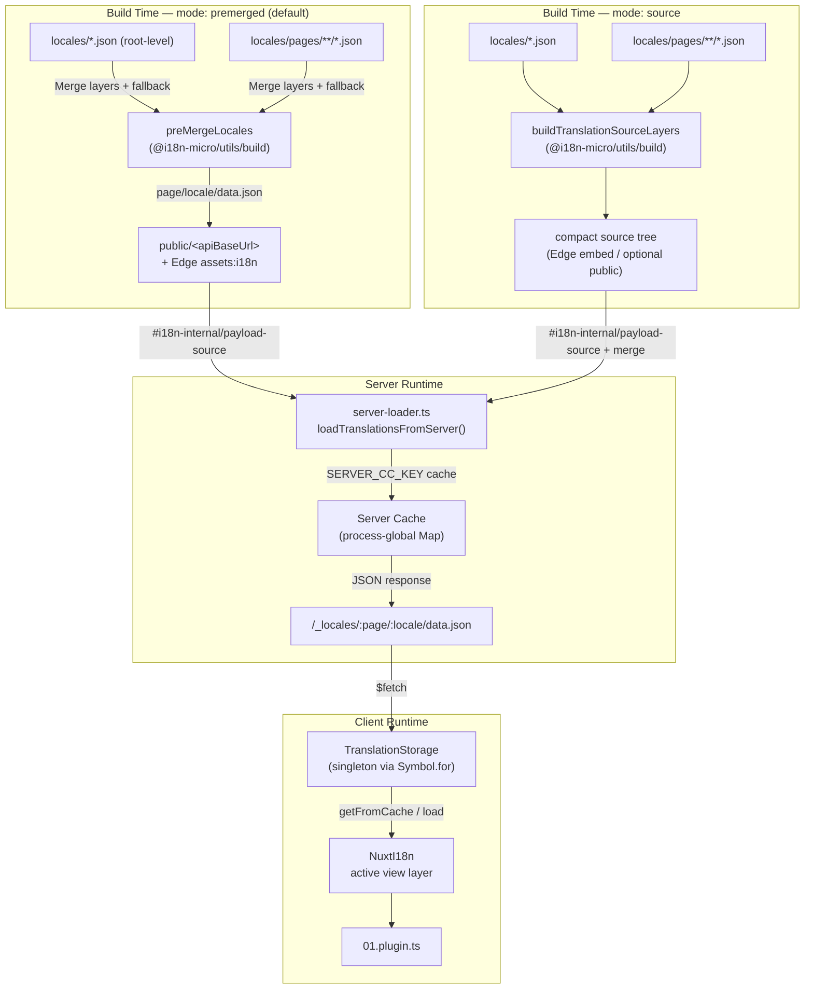

# 🗄️ Архітектура кешу перекладів та сховища

## 📖 Огляд

Nuxt I18n Micro v3 використовує багатошарову архітектуру кешування перекладів. Завантаження пейлоаду залежить від `translationPayloads.mode`:

- **`premerged`** (за замовчуванням) — root-, page-, fallback- та layer-файли зливаються на етапі збірки через `@i18n-micro/utils/build` у `\{page\}/\{locale\}/data.json`
- **`source`** — компактні вихідні файли зберігаються для рантайм-злиття через `@i18n-micro/utils/source-loader` та `@i18n-micro/utils/merge-source` (Edge вбудовує їх у Nitro `serverAssets`; Node читає їх з `public/`, коли скопійовано)

Ця сторінка описує, як працює вбудований кеш і як його розширити для кастомних сценаріїв (адмін-інструменти, зовнішні API, інвалідація кешу).

## 📊 Огляд архітектури

### Потік даних



## 🧱 Основні компоненти

### 1. `TranslationStorage` (клієнт + сервер)

**Файл**: `src/runtime/utils/storage.ts`

Singleton-клас, що забезпечує єдине сховище перекладів як для клієнта, так і для сервера. Використовує `Symbol.for('__NUXT_I18N_STORAGE_CACHE__')` на `globalThis`, щоб гарантувати єдиний екземпляр, навіть коли завантажено кілька бандлів.

**Ключові методи:**

| Метод                                | Опис                                                                    |
| ------------------------------------ | ----------------------------------------------------------------------- |
| `getFromCache(locale, routeName?)`   | Синхронна перевірка: повертає кешовані in-memory дані або `null`        |
| `load(locale, routeName?, options)`  | Асинхронне завантаження з кешуванням: спочатку кеш, потім `$fetch`      |
| `clear()`                            | Повністю очищає кеш                                                     |

**Формат ключа кешу**: `\{locale\}:\{routeName\}` (наприклад, `en:index`, `fr:about`)

```typescript
import { translationStorage } from '../utils/storage'

// Synchronous cache check
const cached = translationStorage.getFromCache('en', 'index')

// Async load (with automatic caching)
const result = await translationStorage.load('en', 'index', {
  apiBaseUrl: '_locales',
  baseURL: '/',
  dateBuild: '2024-01-01',
})
// result.data — merged translations
// result.cacheKey — cache key used
```

### ⚙️ Детермінована інвалідація кешу (`i18n.dateBuild`)

За замовчуванням модуль генерує `dateBuild` під час збірки через `Date.now()`. Далі він вбудовується у згенерований `#build/i18n.strategy.mjs` та використовується як query-параметр (`?v=...`) для інвалідації кешу fetch-запитів перекладу після ребілдів.

Якщо вам потрібні відтворювані збірки (наприклад, щоб покращити hit-rate кешу чанків у rolling-розгортаннях), задайте стабільне значення у `nuxt.config`:

```ts
export default defineNuxtConfig({
  i18n: {
    // Any stable string/number (git SHA, CI build number, release tag, etc.)
    dateBuild: process.env.GIT_SHA ?? 'local-dev',
  },
})
```

### 2. `loadTranslationsFromServer()` (лише сервер)

**Файл**: `src/runtime/server/utils/server-loader.ts`

Завантажує переклади для локалі/сторінки та кешує злитий результат у process-global `CacheControl`-мапі, ключі якої задає `@i18n-micro/hmr/cache-keys` (`SERVER_CC_KEY`).

Поведінка: SSR завантажує з `#i18n-internal/payload-source` — **Node** через `readFile` під `public/<apiBaseUrl>` (`\{page\}/\{locale\}/data.json` у режимі premerged), **Edge** через `assets:i18n`. `premerged` читає один файл; `source` зливає root/page/fallback через `@i18n-micro/utils/source-loader`.

```typescript
import { loadTranslationsFromServer } from '../server/utils/server-loader'

// Returns { data: Translations, json: string }
const { data, json } = await loadTranslationsFromServer('en', 'index')
```

### 3. Клієнтське завантаження (без вбудовування в HTML)

Словники **не** записуються в `nuxtApp.payload`. Сервер тримає їх у памʼяті для SSR-рендерингу; клієнтський плагін `await`ає `switchContext`, який завантажує `/\{apiBaseUrl\}/:page/:locale/data.json` (та сама позиція за замовчуванням, що у `@nuxtjs/i18n` з `experimental.preload: false`).

`NuxtI18n` тримає активний словник view-шару, що використовується `$t()` та `$has()`. `NuxtTranslationLoader` перемикає контекст локалі/маршруту і зливає чанки у цей шар.

### 4. Серверний API-маршрут

**Маршрут**: `/_locales/\{page\}/\{locale\}/data.json`

**Файл**: `src/runtime/server/routes/i18n.ts`

Цей Nitro-маршрут обслуговує злиті переклади для активного режиму пейлоаду. Він викликає `loadTranslationsFromServer()` та повертає результат у JSON.

У продакшені він також встановлює:

```http
Cache-Control: public, max-age={httpCacheDuration}, immutable
```

За замовчуванням `httpCacheDuration` дорівнює `31536000` (1 рік). Це безпечно, бо клієнти запитують пейлоади з `?v=\{dateBuild\}` для інвалідації кешу. Встановіть `httpCacheDuration: 0`, щоб не додавати заголовок. У розробці заголовок не застосовується.

## 📥 Розширення: кастомне завантаження перекладів

### Читання з кешу (серверний маршрут)

```ts
// server/api/i18n/load-cache.[post].ts
import { defineEventHandler, readBody } from 'h3'
import { loadTranslationsFromServer } from '#imports'

export default defineEventHandler(async (event) => {
  const { page, locale } = await readBody<{ page: string; locale: string }>(event)
  const { data } = await loadTranslationsFromServer(locale, page)
  return { locale, page, data }
})
```

### Оновлення перекладів (файл + інвалідація кешу)

```ts
// server/api/i18n/update.[post].ts
import { defineEventHandler, readBody, createError } from 'h3'
import { join } from 'node:path'
import { readFile, writeFile } from 'node:fs/promises'
import { deepMergeTranslations } from '@i18n-micro/utils/deep-merge'

export default defineEventHandler(async (event) => {
  const { path, updates } = await readBody<{ path: string; updates: Record<string, unknown> }>(event)

  if (!path || !updates) {
    throw createError({ statusCode: 400, statusMessage: 'Missing path or updates' })
  }

  const fullPath = join('locales', path)
  let existing: Record<string, unknown> = {}

  try {
    const content = await readFile(fullPath, 'utf-8')
    existing = JSON.parse(content) as Record<string, unknown>
  } catch {
    // File does not exist — create new
  }

  const merged = deepMergeTranslations(existing, updates)
  await writeFile(fullPath, JSON.stringify(merged, null, 2), 'utf-8')

  return { success: true, path, updated: merged }
})
```


## 🧹 Очищення кешу

### Програмне очищення кешу (клієнт)

Використайте вбудований метод `$clearCache`:

```vue
<script setup>
const { $clearCache } = useNuxtApp()

// Clears both TranslationStorage and plugin-level cache
$clearCache()
</script>
```

### Поведінка серверного кешу

Кеш на боці сервера (`loadTranslationsFromServer`) є process-global і зберігається до тих пір, поки:

- Не перезапуститься серверний процес
- Не буде виявлено новий деплой (інше значення `dateBuild`)

Для serverless-середовищ кожен cold start має свіжий кеш.

## ⚙️ Serverless-конфігурація

Для serverless-середовищ (Cloudflare Workers, AWS Lambda) вбудований кеш використовує in-memory `Map`-обʼєкти. Жодних зовнішніх налаштувань сховища для самого кешу перекладів не потрібно.

Проте Nitro-сховище для файлів source-перекладів може потребувати налаштування:

```ts
export default defineNuxtConfig({
  nitro: {
    storage: {
      // Only needed if default file-system storage is unavailable
      'assets:server': {
        driver: 'cloudflare-kv-binding',
        binding: 'MY_KV_NAMESPACE',
      },
    },
  },
})
```

## 💡 Ключові відмінності від v2

| Аспект              | v2                                | v3                                                                       |
| ------------------- | --------------------------------- | ------------------------------------------------------------------------ |
| Клієнтський кеш     | `useStorage('cache')`             | Singleton `TranslationStorage` (Symbol.for на globalThis)               |
| SSR-трансфер        | Runtime-конфіг                    | Повні чанки через `payload.data` (v3.0 використовував `useState`)       |
| Серверний кеш       | Nitro cache storage               | Process-global `Map` через `Symbol.for`                                  |
| Логіка злиття       | На клієнті                        | На етапі збірки (`premerged`) або у рантаймі (`source`) через `@i18n-micro/utils/*` |
| Формат ключа кешу   | `i18n:merged:\{page\}:\{locale\}` | `\{locale\}:\{routeName\}`                                               |

## 📚 Повʼязане

- [Посібник з продуктивності](/guides/performance) — як кешування впливає на продуктивність
- [Серверні переклади](/guides/server-side-translations) — використання перекладів у серверних маршрутах
- [Розгортання у Firebase](/guides/firebase) — розгортання-специфічні аспекти кешу
