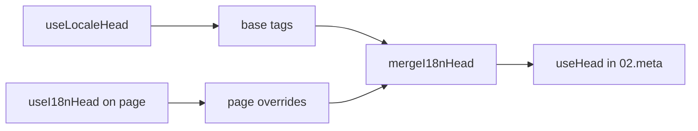

# Композабл `useI18nHead`

`useI18nHead` дозволяє налаштовувати SEO-теги i18n **на кожній сторінці** без кастомного мета-плагіна. Коли `meta: true`, модуль зливає ваш вхід поверх виводу [`useLocaleHead`](/api/composables/use-locale-head).

Типові випадки:

- **CMS / статті блогу** — переклад є лише в деяких локалях; альтернативні URL різняться за мовою (інші slug або шляхи).
- **Динамічний canonical** — канонічний URL має збігатися з URL статті з API, а не з `$switchLocalePath`.
- **Додаткові Open Graph** — `og:title`, `og:description`, `og:image` поруч з автогенерованими `og:locale` / `og:url`.
- **Часткове керування** — зберегти згенеровані модулем canonical та `og:url`, але замінити лише `hreflang` та `og:locale:alternate`.

---

## Сигнатура

{/* generated:symbol:useI18nHead — do not edit; run `pnpm run docs:generate` */}

```ts
useI18nHead(input?: MaybeRefOrGetter<I18nHeadInput | null>): { pageHead: any; resetPageHead: () => void }
```

Реєструє посторінкові перевизначення для SEO head-тегів i18n.
Зливається поверх виводу `useLocaleHead` плагіном `02.meta`.

| Параметр | Тип | Опис |
| --- | --- | --- |
| `input` *(опційно)* | `MaybeRefOrGetter<I18nHeadInput \| null>` |  |

{/* /generated:symbol:useI18nHead */}

## Як це вписується у конвеєр



Ви викликаєте `useI18nHead` у компоненті сторінки. Плагін `02.meta` застосовує перевизначення після кожного `updateMeta()` (зміна маршруту, `$setI18nRouteParams`, `page:finish` на клієнті).

---

## Приклад 1 — Стаття з перекладами лише у деяких локалях

Поширений шаблон: API повертає, які локалі існують, та їхні абсолютні або відносні URL.

```ts
interface Article {
  title: string
  slug: string
  /** Locale code → page URL (absolute or site-relative) */
  locales: Record<string, string>
}
```

```vue
<script setup lang="ts">
const route = useRoute()
const { data: article } = await useFetch<Article>(`/api/articles/${route.params.slug}`)

const localeCodes = computed(() => Object.keys(article.value?.locales ?? {}))

useI18nHead(() => {
  if (!article.value) return null

  return {
    meta: [
      { property: 'og:title', content: article.value.title },
      { property: 'og:type', content: 'article' },
    ],
    replace: {
      hreflang: localeCodes.value.map((locale) => ({
        rel: 'alternate',
        hreflang: locale,
        href: article.value!.locales[locale]!,
      })),
      ogAlternates: localeCodes.value,
    },
  }
})
</script>
```

`ogAlternates` приймає **коди локалей** з вашої конфігурації `i18n.locales`. Значення для `og:locale:alternate` розвʼязуються через `locale.og` або `iso` (формат Open Graph `en_US`).

---

## Приклад 2 — Стаття з посторінковими slug (`$defineI18nRoute` + `$setI18nRouteParams`)

Коли URL будуються з локалізованих шаблонів маршрутів та динамічних параметрів:

```vue
<script setup lang="ts">
const { $defineI18nRoute, $setI18nRouteParams } = useNuxtApp()
const route = useRoute()

const { data: article } = await useFetch(`/api/articles/${route.params.slug}`)

$defineI18nRoute({
  localeRoutes: {
    en: '/blog/[slug]',
    de: '/de/blog/[slug]',
    fr: '/fr/blog/[slug]',
  },
})

if (article.value) {
  $setI18nRouteParams({
    en: { slug: article.value.slugEn },
    de: { slug: article.value.slugDe },
    fr: { slug: article.value.slugFr },
  })

  const availableLocales = article.value.availableLocales as string[]

  useI18nHead({
    meta: [{ property: 'og:title', content: article.value.title }],
    replace: {
      hreflang: availableLocales.map((locale) => ({
        rel: 'alternate',
        hreflang: locale,
        href: article.value!.urls[locale],
      })),
      ogAlternates: availableLocales,
    },
  })
}
</script>
```

Згенеровані модулем альтернативи перерахували б **усі** налаштовані локалі. `replace.hreflang` обмежує теги локалями, які справді мають переклад.

---

## Приклад 3 — Кастомний `x-default` для URL статті у локалі за замовчуванням

За замовчуванням `x-default` вказує на URL локалі за замовчуванням з `$switchLocalePath`. Для статей вкажіть його на URL перекладу за замовчуванням:

```vue
<script setup lang="ts">
const { $defaultLocale } = useNuxtApp()
const article = await loadArticle()

const defaultLocale = $defaultLocale() ?? 'en'
const defaultHref = article.locales[defaultLocale]

useI18nHead({
  replace: {
    hreflang: Object.entries(article.locales).map(([locale, href]) => ({
      rel: 'alternate',
      hreflang: locale,
      href,
    })),
    xDefault: defaultHref ? { rel: 'alternate', hreflang: 'x-default', href: defaultHref } : false,
    ogAlternates: Object.keys(article.locales),
  },
})
</script>
```

---

## Приклад 4 — Замінити canonical та `og:url` даними з API

Коли canonical має збігатися з наданим CMS URL (мультидоменний, кастомний шлях або наперед побудований абсолютний URL):

```vue
<script setup lang="ts">
const article = await loadArticle()
const canonical = article.canonicalUrl // e.g. https://www.example.com/en/blog/my-post

useI18nHead({
  replace: {
    canonical,
    ogUrl: canonical,
    hreflang: buildAlternateLinks(article),
    ogAlternates: Object.keys(article.locales),
  },
  meta: [
    { property: 'og:title', content: article.title },
    { name: 'description', content: article.excerpt },
  ],
})
</script>
```

---

## Приклад 5 — Зберегти автогенеровані canonical / `og:url`, замінити лише альтернативи

Якщо `$switchLocalePath` + `$setI18nRouteParams` вже продукують коректні canonical та `og:url`, замініть лише discovery-теги:

```vue
<script setup lang="ts">
const article = await loadArticle()

useI18nHead({
  replace: {
    hreflang: buildAlternateLinks(article),
    ogAlternates: Object.keys(article.locales),
  },
})
</script>
```

---

## Приклад 6 — Повний head для сторінки з деталями контенту (meta + links)

Схема, подібна до розбиття «page meta» та «alternate links» в окремі помічники, обʼєднана в один виклик:

```vue
<script setup lang="ts">
const article = await loadArticle()
const alternates = Object.entries(article.locales).map(([locale, href]) => ({
  rel: 'alternate' as const,
  hreflang: locale,
  href: normalizeSeoUrl(href), // strip ?query and #hash if needed
}))

useI18nHead({
  meta: [
    { property: 'og:title', content: article.title },
    { property: 'og:description', content: article.description },
    { property: 'og:image', content: article.imageUrl },
    { name: 'twitter:card', content: 'summary_large_image' },
    { name: 'twitter:title', content: article.title },
  ],
  replace: {
    canonical: article.canonicalUrl,
    ogUrl: article.canonicalUrl,
    hreflang: alternates,
    ogAlternates: Object.keys(article.locales),
  },
})
</script>
```

```ts
/** Remove query and hash — useful when CMS URLs must be clean for SEO */
function normalizeSeoUrl(href: string): string {
  try {
    const url = new URL(href, 'https://placeholder.local')
    url.search = ''
    url.hash = ''
    return href.startsWith('http') ? url.href : `${url.pathname}`
  } catch {
    return href.split(/[?#]/)[0] ?? href
  }
}
```

---

## Приклад 7 — Два типи контенту, той самий шаблон (новини та посібники)

Однакова форма API, різні імена маршрутів — використайте невеликий помічник:

```ts
// composables/useArticleHead.ts
import type { I18nHeadInput } from '@i18n-micro/types'

interface LocalizedContent {
  title: string
  locales: Record<string, string>
  canonicalUrl?: string
}

export function buildArticleHead(content: LocalizedContent): I18nHeadInput {
  const localeCodes = Object.keys(content.locales)
  const canonical = content.canonicalUrl ?? content.locales.en

  return {
    meta: [{ property: 'og:title', content: content.title }],
    replace: {
      canonical,
      ogUrl: canonical,
      hreflang: localeCodes.map((locale) => ({
        rel: 'alternate',
        hreflang: locale,
        href: content.locales[locale]!,
      })),
      ogAlternates: localeCodes,
    },
  }
}
```

```vue
<!-- pages/blog/[slug].vue -->
<script setup lang="ts">
const article = await loadArticle()
useI18nHead(buildArticleHead(article))
</script>
```

```vue
<!-- pages/guides/[slug].vue -->
<script setup lang="ts">
const guide = await loadGuide()
useI18nHead(buildArticleHead(guide))
</script>
```

---

## Приклад 8 — Вимкнути вбудовані альтернативи, надати свій список

Еквівалент вимкненню генератора hreflang модуля та передачі кастомного списку (без дублювання наборів alternate):

```vue
<script setup lang="ts">
const article = await loadArticle()

useI18nHead({
  disable: ['hreflang', 'x-default', 'og-alternates'],
  link: Object.entries(article.locales).map(([locale, href]) => ({
    rel: 'alternate',
    hreflang: locale,
    href,
  })),
  replace: {
    ogAlternates: Object.keys(article.locales),
  },
})
</script>
```

Або надайте перевагу `replace.hreflang` без `disable` — він замінює всі посилання `rel="alternate"` за один крок.

---

## Приклад 9 — Landing-сторінка: лише додаткові OG, зберегти всі i18n-теги

```vue
<script setup lang="ts">
const { t } = useI18n()

useI18nHead({
  meta: [
    { property: 'og:title', content: t('landing.ogTitle') },
    { property: 'og:description', content: t('landing.ogDescription') },
  ],
})
</script>
```

---

## Приклад 10 — Сторінка товару: вимкнути hreflang для експерименту з однією локаллю

```vue
<script setup lang="ts">
useI18nHead({
  disable: ['hreflang', 'x-default'],
  // canonical, og:locale, og:url still generated
})
</script>
```

---

## Приклад 11 — Реактивні оновлення після клієнтського fetch

```vue
<script setup lang="ts">
const article = ref<Article | null>(null)

onMounted(async () => {
  article.value = await $fetch('/api/articles/latest')
})

useI18nHead(() => {
  if (!article.value) return null
  return {
    meta: [{ property: 'og:title', content: article.value.title }],
    replace: {
      hreflang: Object.entries(article.value.locales).map(([locale, href]) => ({
        rel: 'alternate',
        hreflang: locale,
        href,
      })),
    },
  }
})
</script>
```

Head оновлюється на `page:finish` та коли змінюється стан `pageHead`.

---

## Приклад 12 — HTTPS-origin за reverse proxy

Якщо ви раніше розвʼязували композабл «публічного origin» для canonical / alternate абсолютних URL, використовуйте натомість конфігурацію модуля:

```ts
// nuxt.config.ts
export default defineNuxtConfig({
  i18n: {
    meta: true,
    // undefined = origin from current request (multi-domain friendly)
    metaBaseUrl: undefined,
    metaTrustForwardedHost: true,
    metaTrustForwardedProto: true,
  },
})
```

Потім передавайте **шляхи або повні URL** у `replace.hreflang` / `replace.canonical`. Модуль використовує `useRequestURL` з `X-Forwarded-Host` / `X-Forwarded-Proto` на SSR.

---

## Довідник API

### `meta`

Додаткові теги `<meta>`. Дедуплікуються за `id`, `property` або `name`.

### `link`

Додаткові теги `<link>`. Дедуплікуються за `id` або `rel` + `hreflang`.

### `htmlAttrs`

Зливаються з атрибутами `<html>` з `useLocaleHead` (`lang`, `dir`).

### `replace`

| Ключ           | Тип                       | Ефект                                          |
| -------------- | ------------------------- | ---------------------------------------------- |
| `canonical`    | `string \| false`         | Замінити або видалити canonical-посилання      |
| `hreflang`     | `I18nHeadLink[] \| false` | Замінити або видалити всі `rel="alternate"` посилання |
| `xDefault`     | `I18nHeadLink \| false`   | Замінити або видалити `hreflang="x-default"`   |
| `ogLocale`     | `string \| false`         | Замінити або видалити `og:locale`              |
| `ogUrl`        | `string \| false`         | Замінити або видалити `og:url`                 |
| `ogAlternates` | `string[] \| false`       | Перебудувати `og:locale:alternate` для кодів локалей |

### `disable`

| Значення        | Видаляє                                  |
| --------------- | ---------------------------------------- |
| `hreflang`      | Альтернативні посилання локалей (без `x-default`) |
| `x-default`     | Посилання `hreflang="x-default"`         |
| `canonical`     | Canonical-посилання                      |
| `og`            | `og:locale` та `og:url`                  |
| `og-alternates` | Теги `og:locale:alternate`               |
| `html`          | `lang` / `dir` на `<html>`               |

---

## `useLocaleHead` проти `useI18nHead`

| Композабл       | Область             | Коли використовувати                       |
| --------------- | ------------------- | ------------------------------------------ |
| `useLocaleHead` | Глобальний / ручний head | `meta: false`, повне кастомне налаштування `useHead` |
| `useI18nHead`   | Посторінкові перевизначення | `meta: true`, налаштування конкретних сторінок |

Коли `meta: true`, вам **не** потрібен `useLocaleHead` на сторінках, які використовують лише `useI18nHead`.

---

## Міграція з кастомного i18n head плагіна

Багато проєктів підтримують кастомний плагін, який:

- зливає посторінкові alternate-посилання зі спільного стану;
- фільтрує дубльовані регіональні записи `hreflang`;
- нормалізує значення `og:locale`;
- прибирає query-рядки з SEO URL.

Ви можете замінити це на `useI18nHead` на кожній сторінці контенту та стандартні налаштування модуля.

| Попередній підхід                                     | З `useI18nHead`                                      |
| ----------------------------------------------------- | ---------------------------------------------------- |
| Спільний стан + «які локалі існують для цієї статті»  | `replace: \{ ogAlternates: localeCodes \}`             |
| Окремий помічник, що будує посилання `rel="alternate"` | `replace: \{ hreflang: links \}`                       |
| Кастомний плагін, що зливає стан сторінки в head      | Вбудоване злиття у `02.meta`                        |
| Кастомний «public origin» для абсолютних URL          | `metaBaseUrl` + forwarded headers (див. Приклад 12) |
| Короткий `og:locale` (`en` замість `en_US`)           | Встановіть `locale.og` або використайте `iso` → `en_US` (протокол OG) |

**`hreflang` з `iso`:** кожна локаль видає одну альтернативу з `hreflang = iso || code`. Код маршрутизації `code` ніколи не використовується, коли задано `iso` (уникає невалідних тегів на кшталт `hreflang="mx"`). Вмикайте fallback до чистої мови (`es-ES` → також `es`) через `hreflangBaseLanguage: true` — виводиться з `iso`, а не з `code`. Для повністю кастомних списків використовуйте `replace.hreflang`.

**JSON-LD:** `useI18nHead` не генерує структуровані дані. Тримайте `useHead(\{ script: [...] \})` або окремий помічник JSON-LD поруч.

---

## Дивіться також

- [SEO-посібник](/guides/seo) — автоматична генерація мета та посторінкові перевизначення
- [`useLocaleHead`](/api/composables/use-locale-head) — низькорівневий head API
