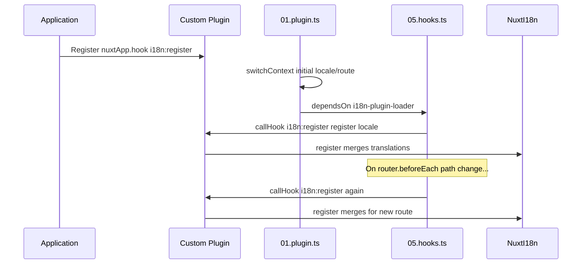

# 📢 Події

## 🔄 `i18n:register`

Подія `i18n:register` у `Nuxt I18n Micro` вмикає динамічне додавання перекладів до i18n-контексту вашого застосунку, роблячи процес інтернаціоналізації безшовним і гнучким. Ця подія дозволяє інтегрувати нові переклади за потреби, розширюючи можливості локалізації вашого застосунку.

### 📝 Деталі події

- **Призначення**:
  - Дозволяє динамічно інтегрувати додаткові переклади до наявного набору для конкретної локалі.

- **Payload**:
  - **`register`**:
    - Функція, яку надає подія, приймає два аргументи:
      - **`translations`** (`Translations`):
        - Обʼєкт із парами «ключ-значення», що представляють переклади, організовані згідно з інтерфейсом `Translations`.
      - **`locale`** (`string`, опціонально):
        - Код локалі (наприклад, `'en'`, `'ru'`), для якої реєструються переклади. За замовчуванням — локаль, надана подією, якщо не вказано інше.

- **Поведінка**:
  - При спрацюванні функція `register` обʼєднує нові переклади з поточним контекстом для вказаної локалі, оновлюючи доступні переклади в усьому застосунку.

### ⏱️ Коли спрацьовує

Плагін хуків модуля (`05.hooks.ts`, `dependsOn: ['i18n-plugin-loader']`) викликає `nuxtApp.callHook('i18n:register', …)`:

1. **Один раз при старті** — після того, як основний i18n-плагін (`01.plugin.ts`) завантажив переклади для початкового маршруту
2. **Під час навігації** — у `router.beforeEach`, коли змінюється шлях, або при кожній навігації, коли `strategy: 'no_prefix'`

Зареєструйте свій слухач у звичайному плагіні Nuxt за допомогою `nuxtApp.hook('i18n:register', …)`. Плагін хуків виконується після готовності loader, тож ваш callback викликається, коли потрібно розширити переклади.

Встановіть `hooks: false` у `nuxt.config`, щоб вимкнути автоматичні виклики `i18n:register` (див. [Конфігурація — `hooks`](/guides/configuration#hooks)).

### 💡 Приклад використання

Наступний приклад демонструє, як використовувати подію `i18n:register` для динамічного додавання перекладів:

```typescript
nuxt.hook('i18n:register', async (register: (translations: unknown, locale?: string) => void, locale: string) => {
  register(
    {
      greeting: 'Hello',
      farewell: 'Goodbye',
    },
    locale,
  )
})
```

### 🛠️ Пояснення



- **Спрацювання події**:
  - Плагін хуків (`05.hooks.ts`) викликає `i18n:register` після готовності основного loader та під час відповідних навігацій.

- **Додавання перекладів**:
  - Приклад реєструє англійські переклади для `"greeting"` та `"farewell"`.
  - Функція `register` обʼєднує ці переклади з наявним набором для наданої локалі.

### 🔗 Ключові переваги

- **Динамічні оновлення**:
  - Легко оновлюйте або додавайте переклади без необхідності повного перерозгортання застосунку.

- **Гнучкість локалізації**:
  - Підтримує коригування локалізації в реальному часі відповідно до потреб користувача чи застосунку.

Використовуючи подію `i18n:register`, ви можете забезпечити, що стратегія локалізації вашого застосунку залишається гнучкою та адаптивною, покращуючи загальний користувацький досвід.

---

## 🛠️ Модифікація перекладів за допомогою плагінів

Для динамічної модифікації перекладів у вашому Nuxt-застосунку рекомендується використовувати плагіни. Плагіни надають структурований спосіб обробки оновлень локалізації, особливо при роботі з модулями чи зовнішніми файлами перекладів.

### **Реєстрація плагіна**

Якщо ви використовуєте модуль, зареєструйте плагін, у якому відбуватимуться модифікації перекладів, додавши його до конфігурації вашого модуля:

```javascript
addPlugin({
  src: resolve('./plugins/extend_locales'),
})
```

Це реєструє плагін, розташований у `./plugins/extend_locales`, який обробляє динамічне завантаження та реєстрацію перекладів.

### **Реалізація плагіна**

У плагіні ви можете керувати модифікаціями локалей. Ось приклад реалізації у плагіні Nuxt:

```typescript
import { defineNuxtPlugin } from '#app'

export default defineNuxtPlugin(async (nuxtApp) => {
  // Function to load translations from JSON files and register them
  const loadTranslations = async (lang: string) => {
    try {
      const translations = await import(`../locales/${lang}.json`)
      return translations.default
    } catch (error) {
      console.error(`Error loading translations for language: ${lang}`, error)
      return null
    }
  }

  // Hook into the 'i18n:register' event to dynamically add translations
  // eslint-disable-next-line @typescript-eslint/ban-ts-comment
  // @ts-expect-error
  nuxtApp.hook('i18n:register', async (register: (translations: unknown, locale?: string) => void, locale: string) => {
    const translations = await loadTranslations(locale)
    if (translations) {
      register(translations, locale)
    }
  })
})
```

### 📝 Детальне пояснення

1. **Завантаження перекладів**:

- Функція `loadTranslations` динамічно імпортує файли перекладів на основі локалі. Файли очікуються у теці `locales` і мають імена відповідно до кодів локалей (наприклад, `en.json`, `de.json`).
- У разі успішного завантаження переклади повертаються; інакше — логується помилка.

2. **Реєстрація перекладів**:

- Плагін підписується на подію `i18n:register` через `nuxtApp.hook`.
- Коли подія спрацьовує, функція `register` викликається із завантаженими перекладами та відповідною локаллю.
- Це обʼєднує нові переклади з i18n-контекстом для вказаної локалі, оновлюючи доступні переклади в усьому застосунку.

### 🔗 Переваги використання плагінів для модифікації перекладів

- **Розділення відповідальностей**:
  - Інкапсулюйте логіку локалізації окремо від основного коду застосунку, що спрощує керування та підтримку.

- **Динамічність та масштабованість**:
  - Динамічно завантажуючи та реєструючи переклади, ви можете оновлювати контент без необхідності повного перерозгортання застосунку, що особливо корисно для застосунків із контентом, який часто оновлюється, або багатомовним контентом.

- **Розширена гнучкість локалізації**:
  - Плагіни дозволяють модифікувати або розширювати переклади за потреби, забезпечуючи більш адаптивну та чутливу стратегію локалізації, яка відповідає перевагам користувачів або бізнес-вимогам.

Прийнявши цей підхід, ви можете ефективно розширювати та модифікувати локалізацію свого застосунку через структурований і підтримуваний процес за допомогою плагінів, забезпечуючи адаптивність інтернаціоналізації до змінних потреб та покращуючи загальний користувацький досвід.
