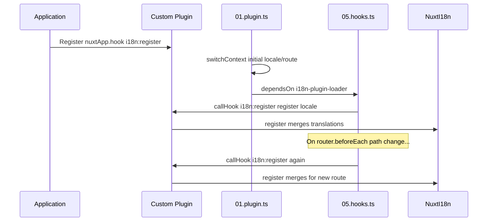

# 📢 Події

## 🔄 `i18n:register`

Подія `i18n:register` у `Nuxt I18n Micro` дозволяє динамічно додавати переклади до i18n-контексту вашого застосунку, роблячи процес інтернаціоналізації безшовним і гнучким. Ця подія дає змогу інтегрувати нові переклади за потреби, покращуючи можливості локалізації вашого застосунку.

### 📝 Деталі події

- **Призначення**:
  - Дозволяє динамічно вливати додаткові переклади до наявного набору для конкретної локалі.

- **Пейлоад**:
  - **`register`**:
    - Функція, яку надає подія та яка приймає два аргументи:
      - **`translations`** (`Translations`):
        - Обʼєкт з парами ключ-значення перекладів, організованими відповідно до інтерфейсу `Translations`.
      - **`locale`** (`string`, опційно):
        - Код локалі (наприклад, `'en'`, `'ru'`), для якої реєструються переклади. За замовчуванням береться локаль з події, якщо не вказано.

- **Поведінка**:
  - При спрацьовуванні функція `register` зливає нові переклади у поточний контекст для вказаної локалі, оновлюючи доступні переклади в застосунку.

### ⏱️ Коли спрацьовує

Плагін хуків модуля (`05.hooks.ts`, `dependsOn: ['i18n-plugin-loader']`) викликає `nuxtApp.callHook('i18n:register', …)`:

1. **Одноразово при запуску** — після того, як головний плагін i18n (`01.plugin.ts`) завантажив переклади для початкового маршруту
2. **При навігації** — у `router.beforeEach`, коли змінюється шлях, або при кожній навігації, коли `strategy: 'no_prefix'`

Реєструйте свій слухач у звичайному Nuxt-плагіні через `nuxtApp.hook('i18n:register', …)`. Плагін хуків запускається після того, як завантажувач готовий, тож ваш колбек викликається, коли переклади потрібно розширити.

Встановіть `hooks: false` у `nuxt.config`, щоб вимкнути автоматичні виклики `i18n:register` (див. [Конфігурація — `hooks`](/guides/configuration#hooks)).

### 💡 Приклад використання

Наступний приклад показує, як використати подію `i18n:register`, щоб динамічно додати переклади:

```typescript
nuxt.hook('i18n:register', async (register: (translations: unknown, locale?: string) => void, locale: string) => {
  register(
    {
      greeting: 'Hello',
      farewell: 'Goodbye',
    },
    locale,
  )
})
```

### 🛠️ Пояснення



- **Тригер події**:
  - Плагін хуків (`05.hooks.ts`) вистрілює `i18n:register` після того, як головний завантажувач готовий, а також на релевантних навігаціях.

- **Додавання перекладів**:
  - Приклад реєструє англійські переклади для `"greeting"` та `"farewell"`.
  - Функція `register` зливає ці переклади у наявний набір для наданої локалі.

### 🔗 Ключові переваги

- **Динамічні оновлення**:
  - Легко оновлюйте або додавайте переклади без потреби перерозгортати весь застосунок.

- **Гнучкість локалізації**:
  - Підтримує реалтайм-корекції локалізації відповідно до потреб користувача чи застосунку.

Використовуючи подію `i18n:register`, ви можете гарантувати, що стратегія локалізації вашого застосунку залишатиметься гнучкою й адаптивною, покращуючи загальний користувацький досвід.

---

## 🛠️ Модифікація перекладів через плагіни

Щоб динамічно змінювати переклади у вашому Nuxt-застосунку, рекомендується використовувати плагіни. Плагіни надають структурований спосіб обробляти оновлення локалізації, особливо коли ви працюєте з модулями чи зовнішніми файлами перекладів.

### **Реєстрація плагіна**

Якщо ви використовуєте модуль, зареєструйте плагін, у якому відбуватимуться модифікації перекладів, додавши його до конфігурації свого модуля:

```javascript
addPlugin({
  src: resolve('./plugins/extend_locales'),
})
```

Це реєструє плагін, розміщений у `./plugins/extend_locales`, який опрацьовуватиме динамічне завантаження й реєстрацію перекладів.

### **Реалізація плагіна**

У плагіні ви можете керувати модифікаціями локалі. Ось приклад реалізації у Nuxt-плагіні:

```typescript
import { defineNuxtPlugin } from '#app'

export default defineNuxtPlugin(async (nuxtApp) => {
  // Function to load translations from JSON files and register them
  const loadTranslations = async (lang: string) => {
    try {
      const translations = await import(`../locales/${lang}.json`)
      return translations.default
    } catch (error) {
      console.error(`Error loading translations for language: ${lang}`, error)
      return null
    }
  }

  // Hook into the 'i18n:register' event to dynamically add translations
  // eslint-disable-next-line @typescript-eslint/ban-ts-comment
  // @ts-expect-error
  nuxtApp.hook('i18n:register', async (register: (translations: unknown, locale?: string) => void, locale: string) => {
    const translations = await loadTranslations(locale)
    if (translations) {
      register(translations, locale)
    }
  })
})
```

### 📝 Детальне пояснення

1. **Завантаження перекладів**:

- Функція `loadTranslations` динамічно імпортує файли перекладів на основі локалі. Файли очікуються у каталозі `locales` та іменуються за кодами локалей (наприклад, `en.json`, `de.json`).
- При успішному завантаженні переклади повертаються; інакше — логується помилка.

2. **Реєстрація перекладів**:

- Плагін підключається до події `i18n:register` через `nuxtApp.hook`.
- Коли подія спрацьовує, функція `register` викликається із завантаженими перекладами та відповідною локаллю.
- Це зливає нові переклади у контекст i18n для вказаної локалі, оновлюючи доступні переклади по всьому застосунку.

### 🔗 Переваги використання плагінів для модифікації перекладів

- **Розділення відповідальностей**:
  - Інкапсулюйте логіку локалізації окремо від основного коду застосунку, спрощуючи керування й підтримку.

- **Динамічність і масштабованість**:
  - Динамічно завантажуючи й реєструючи переклади, ви можете оновлювати вміст без повного перерозгортання застосунку, що особливо корисно для застосунків з контентом, який часто оновлюється, або багатомовним.

- **Розширена гнучкість локалізації**:
  - Плагіни дозволяють модифікувати або розширювати переклади за потреби, надаючи більш адаптивну й чутливу стратегію локалізації, що відповідає уподобанням користувачів чи бізнес-вимогам.

Обравши цей підхід, ви зможете ефективно розширювати й змінювати локалізацію вашого застосунку через структурований і легкий у супроводі процес із використанням плагінів, зберігаючи інтернаціоналізацію адаптивною до потреб, що змінюються, та покращуючи загальний користувацький досвід.
