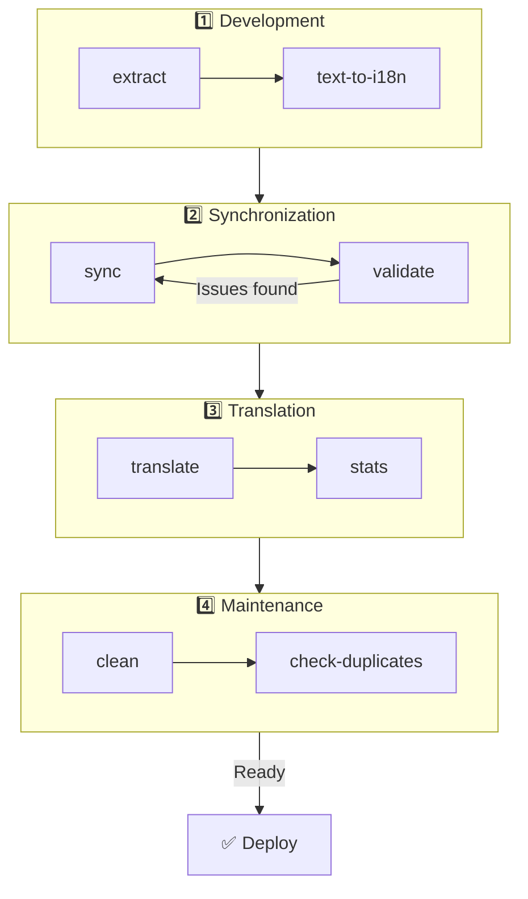

# 🌐 Посібник nuxt-i18n-micro-cli

## 📖 Вступ

`nuxt-i18n-micro-cli` — це інструмент командного рядка, розроблений, щоб спростити процес локалізації та інтернаціоналізації у Nuxt.js-проєктах за допомогою модуля `nuxt-i18n-micro` (Nuxt I18n Micro). Він надає утиліти для витягання ключів перекладу з кодової бази, керування файлами перекладу, синхронізації перекладів між локалями та автоматизації процесу перекладу з використанням зовнішніх сервісів перекладу.

Цей посібник проведе вас через встановлення, налаштування та використання `nuxt-i18n-micro-cli` для ефективного керування перекладами у вашому проєкті. Пакет на [npmjs.com](https://www.npmjs.com/package/nuxt-i18n-micro-cli).

## 🔧 Встановлення та налаштування

### 📦 Встановлення nuxt-i18n-micro-cli

Встановлюйте глобально або як dev-залежність у вашому Nuxt-проєкті (рекомендовано для CI):

```bash
# global
npm install -g nuxt-i18n-micro-cli

# or per project
pnpm add -D nuxt-i18n-micro-cli
pnpm exec i18n-micro text-to-i18n --dryRun
```

Використовуйте **`nuxt-i18n-micro-cli` ≥ 2.1.1**, якщо ваш проєкт використовує каталог `app/` з Nuxt 4 (`app/pages`, `app/components` тощо). Старіші версії CLI сканували лише `pages/` у корені проєкту.

### 🛠 Ініціалізація у вашому проєкті

Після встановлення ви можете виконувати команди `i18n-micro` у теці свого Nuxt.js-проєкту.

Переконайтеся, що ваш проєкт налаштовано з `nuxt-i18n-micro` і має необхідну конфігурацію у `nuxt.config.ts` (або `nuxt.config.js`).

### 📄 Загальні аргументи

- `--cwd`: задає поточну робочу теку (за замовчуванням `.`).
- `--logLevel`: встановлює рівень логування (`silent`, `info`, `verbose`).
- `--translationDir`: тека з JSON-файлами перекладів (за замовчуванням: `locales`).

## 📊 Огляд робочого процесу CLI



### Кроки робочого процесу

| Фаза              | Команди                     | Призначення                              |
| ----------------- | --------------------------- | ---------------------------------------- |
| **Розробка**      | `extract`, `text-to-i18n`   | Знайти та витягнути ключі перекладу      |
| **Синхронізація** | `sync`, `validate`          | Гарантувати, що всі локалі мають однакові ключі |
| **Переклад**      | `translate`, `stats`        | Авто-переклад відсутніх ключів           |
| **Обслуговування**| `clean`, `check-duplicates` | Тримати переклади охайними               |

## 📋 Команди

### 🔄 Команда `text-to-i18n`

CLI-пакет: [`nuxt-i18n-micro-cli`](https://www.npmjs.com/package/nuxt-i18n-micro-cli)

**Опис**: сканує Vue/TS/JS-файли на hardcoded-рядки, орієнтовані на користувача, замінює їх на `$t('...')` та зливає нові ключі у ваш JSON-файл перекладів. Запускайте з **кореня Nuxt-проєкту** (де живе `nuxt.config`).

**Використання**:

```bash
i18n-micro text-to-i18n [options]
```

**Опції**:

| Опція                   | За замовчуванням  | Опис                                                                  |
| ----------------------- | ----------------- | --------------------------------------------------------------------- |
| `--translationFile`     | `locales/en.json` | JSON-файл для нових ключів (відносно кореня проєкту).                 |
| `--path`                | —                 | Обробити лише один файл або теку (наприклад, `app/pages/about.vue`).  |
| `--context`             | —                 | Префікс ключа (наприклад, `auth` → `auth.*`).                         |
| `--dryRun`              | `false`           | Перегляд без запису файлів.                                           |
| `--verbose`             | `false`           | Додаткове логування.                                                  |
| `--interactive`         | `false`           | Підтверджувати чи редагувати кожен ключ перед застосуванням.          |
| `--extractOnlyDirs`     | `plugins`         | Теки, де ключі витягуються, але вихідні файли **не** переписуються.   |
| `--extractOnlyPatterns` | —                 | Glob-подібні шаблони «лише витягання» (наприклад, `**/*.plugin.ts`).  |

**Приклад**:

```bash
i18n-micro text-to-i18n --translationFile locales/en.json --context auth --dryRun
```

#### Які теки скануються?

<Info>
Починаючи з CLI **v2.1.1**, `text-to-i18n` сканує як класичні кореневі теки, так і еквіваленти в `app/*`. Запускайте команду з **кореня проєкту** — не робіть `cd app`.
</Info>

Збирає `*.vue`, `*.js` та `*.ts` під:

| Nuxt 3 (корінь проєкту) | Nuxt 4 (каталог `app/`)   |
| ----------------------- | ------------------------- |
| `pages/`                | `app/pages/`              |
| `components/`           | `app/components/`         |
| `plugins/`              | `app/plugins/`            |
| `layouts/`              | `app/layouts/`            |

Інші теки (`server/`, `composables/`, `middleware/` тощо) пропускаються, якщо ви не використаєте `--path`. Для Nuxt 4 запускайте з кореня проєкту (не треба `cd app`). Узгодьте `i18n.translationDir` у `--translationFile`, якщо він не `locales/`.

```bash
i18n-micro text-to-i18n --path app/pages
```

#### Як це працює

1. Зібрати файли з тек вище (або з `--path`).
2. Замінити літерали / текст шаблонів на `$t('generated.key')` (`plugins/` за замовчуванням лише витягається).
3. Злити нові ключі у `--translationFile`, не видаляючи наявних записів.

**Приклади трансформації**:

До:

```vue
<template>
  <div>
    <h1>Welcome to our site</h1>
    <p>Please sign in to continue</p>
  </div>
</template>
```

Після:

```vue
<template>
  <div>
    <h1>{{ $t('pages.home.welcome_to_our_site') }}</h1>
    <p>{{ $t('pages.home.please_sign_in') }}</p>
  </div>
</template>
```

**Кращі практики**: спершу dry run; закомітьте перед повним запуском; узгодьте `--translationFile` з `i18n.translationDir` у `nuxt.config`; тримайте `--extractOnlyDirs plugins` для bootstrap-коду.

**Обмеження**: окремий npm-пакет (не поставляється з модулем); автоматично не читає `nuxt.config`; видає `$t(...)`; складні динамічні рядки можуть потребувати `extract` / `search`.

### 📊 Команда `stats`

**Опис**: команда `stats` використовується для відображення статистики перекладу для кожної локалі у вашому Nuxt.js-проєкті. Вона допомагає зрозуміти прогрес перекладу, показуючи, скільки ключів перекладено порівняно із загальною кількістю доступних ключів.

**Використання**:

```bash
i18n-micro stats [options]
```

**Опції**:

- `--full`: показати лише обʼєднану статистику перекладів (за замовчуванням: `false`).

**Приклад**:

```bash
i18n-micro stats --full
```

### 🌍 Команда `translate`

**Опис**: команда `translate` автоматично перекладає відсутні ключі за допомогою зовнішніх сервісів перекладу. Ця команда спрощує процес перекладу, використовуючи API таких сервісів, як Google Translate, DeepL та інші, для заповнення відсутніх перекладів.

**Використання**:

```bash
i18n-micro translate [options]
```

**Опції**:

- `--service`: сервіс перекладу для використання (наприклад, `google`, `deepl`, `yandex`). Якщо не вказано, команда запропонує обрати.
- `--token`: API-ключ, що відповідає обраному сервісу перекладу. Якщо не надано, вам запропонують ввести його.
- `--options`: додаткові опції для сервісу перекладу у форматі key:value через кому (наприклад, `model:gpt-3.5-turbo,max_tokens:1000`).
- `--replace`: перекладати всі ключі, замінюючи наявні переклади (за замовчуванням: `false`).

**Приклад**:

```bash
i18n-micro translate --service deepl --token YOUR_DEEPL_API_KEY
```

#### 🌐 Підтримувані сервіси перекладу

Команда `translate` підтримує кілька сервісів перекладу. Деякі з них:

- **Google Translate** (`google`)
- **DeepL** (`deepl`)
- **Yandex Translate** (`yandex`)
- **OpenAI** (`openai`)
- **Azure Translator** (`azure`)
- **IBM Watson** (`ibm`)
- **Baidu Translate** (`baidu`)
- **LibreTranslate** (`libretranslate`)
- **MyMemory** (`mymemory`)
- **Lingva Translate** (`lingvatranslate`)
- **Papago** (`papago`)
- **Tencent Translate** (`tencent`)
- **Systran Translate** (`systran`)
- **Yandex Cloud Translate** (`yandexcloud`)
- **ModernMT** (`modernmt`)
- **Lilt** (`lilt`)
- **Unbabel** (`unbabel`)
- **Reverso Translate** (`reverso`)

#### ⚙️ Конфігурація сервісу

Деякі сервіси потребують специфічних конфігурацій чи API-ключів. При використанні команди `translate` ви можете вказати сервіс і надати необхідний `--token` (API-ключ) та додаткові `--options` за потреби.

Наприклад:

```bash
i18n-micro translate --service openai --token YOUR_OPENAI_API_KEY --options openaiModel:gpt-3.5-turbo,max_tokens:1000
```

### 🛠️ Команда `extract`

**Опис**: витягує ключі перекладу з вашої кодової бази і організовує їх за областями.

**Використання**:

```bash
i18n-micro extract [options]
```

**Опції**:

- `--prod, -p`: запуск у продакшн-режимі.

**Приклад**:

```bash
i18n-micro extract
```

### 🔄 Команда `sync`

**Опис**: синхронізує файли перекладу між локалями, гарантуючи, що всі локалі мають однакові ключі.

**Використання**:

```bash
i18n-micro sync [options]
```

**Приклад**:

```bash
i18n-micro sync
```

### ✅ Команда `validate`

**Опис**: валідує файли перекладу на відсутні чи зайві ключі порівняно з референсною локаллю.

**Використання**:

```bash
i18n-micro validate [options]
```

**Приклад**:

```bash
i18n-micro validate
```

### 🧹 Команда `clean`

**Опис**: видаляє невикористовувані ключі перекладу з файлів перекладу.

**Використання**:

```bash
i18n-micro clean [options]
```

**Приклад**:

```bash
i18n-micro clean
```

### 📤 Команда `import`

**Опис**: конвертує PO-файли назад у формат JSON і зберігає їх у каталозі перекладів.

**Використання**:

```bash
i18n-micro import [options]
```

**Опції**:

- `--potsDir`: тека з PO-файлами (за замовчуванням: `pots`).

**Приклад**:

```bash
i18n-micro import --potsDir pots
```

### 📥 Команда `export`

**Опис**: експортує переклади у PO-файли для зовнішнього керування перекладами.

**Використання**:

```bash
i18n-micro export [options]
```

**Опції**:

- `--potsDir`: тека для збереження PO-файлів (за замовчуванням: `pots`).

**Приклад**:

```bash
i18n-micro export --potsDir pots
```

### 🗂️ Команда `export-csv`

**Опис**: команда `export-csv` експортує ключі та значення перекладів з JSON-файлів разом зі шляхами до файлів у формат CSV. Ця команда корисна для команд, яким зручніше працювати з даними перекладу у табличному ПЗ.

**Використання**:

```bash
i18n-micro export-csv [options]
```

**Опції**:

- `--csvDir`: тека, куди зберігати експортовані CSV-файли.
- `--delimiter`: задати роздільник для CSV-файла (за замовчуванням: `,`).

**Приклад**:

```bash
i18n-micro export-csv --csvDir csv_files
```

### 📑 Команда `import-csv`

**Опис**: команда `import-csv` імпортує дані перекладу з CSV-файлів, оновлюючи відповідні JSON-файли. Корисно для застосування масових оновлень перекладу з таблиць.

**Використання**:

```bash
i18n-micro import-csv [options]
```

**Опції**:

- `--csvDir`: тека з CSV-файлами для імпорту.
- `--delimiter`: задати роздільник, що використовується у CSV-файлі (за замовчуванням: `,`).

**Приклад**:

```bash
i18n-micro import-csv --csvDir csv_files
```

### 🧾 Команда `diff`

**Опис**: порівнює файли перекладу між локаллю за замовчуванням та іншими локалями у тому ж каталозі (включно з підтеками). Команда виявляє відсутні ключі та їхні значення у локалі за замовчуванням порівняно з іншими локалями, полегшуючи відстеження прогресу чи розбіжностей перекладу.

**Використання**:

```bash
i18n-micro diff [options]
```

**Приклад**:

```bash
i18n-micro diff
```

### 🔍 Команда `check-duplicates`

**Опис**: команда `check-duplicates` перевіряє наявність дубльованих значень перекладу у кожній локалі у всіх файлах перекладу, включно з root- і посайтовими перекладами. Це гарантує, що різні ключі всередині однієї мови не мають ідентичних значень перекладу, допомагаючи підтримувати ясність та узгодженість перекладів.

**Використання**:

```bash
i18n-micro check-duplicates [options]
```

**Приклад**:

```bash
i18n-micro check-duplicates
```

**Як це працює**:

- Команда перевіряє як root-, так і посайтові файли перекладу для кожної локалі.
- Якщо значення перекладу зʼявляється у кількох місцях (у root-перекладах або на різних сторінках), вона звітує про дубльовані значення разом з файлом і ключем, де їх знайдено.
- Якщо дублікатів немає, команда підтверджує, що локаль вільна від дубльованих значень перекладу.

Ця команда допомагає гарантувати, що ключі перекладу зберігають унікальні значення, запобігаючи випадковому повторенню в межах однієї локалі.

### 🔄 Команда `replace-values`

**Опис**: команда `replace-values` дозволяє виконувати масові заміни значень перекладу у всіх локалях. Вона підтримує як прості текстові заміни, так і розширені заміни через регулярні вирази (regex). Ви також можете використовувати групи захоплення у regex-шаблонах і посилатися на них у рядку заміни, що робить її ідеальною для складніших сценаріїв заміни.

**Використання**:

```bash
i18n-micro replace-values [options]
```

**Опції**:

- `--search`: текст або regex-шаблон для пошуку в перекладах. Обовʼязкова опція.
- `--replace`: текст заміни для знайдених перекладів. Обовʼязкова опція.
- `--useRegex`: увімкнути пошук через регулярний вираз (за замовчуванням: `false`).

**Приклад 1**: проста заміна

Замінити рядок «Hello» на «Hi» у всіх локалях:

```bash
i18n-micro replace-values --search "Hello" --replace "Hi"
```

**Приклад 2**: regex-заміна

Увімкнути regex-пошук і замінити будь-який рядок, що починається на «Hello» з наступними цифрами (наприклад, «Hello123»), на «Hi» у всіх локалях:

```bash
i18n-micro replace-values --search "Hello\\d+" --replace "Hi" --useRegex
```

**Приклад 3**: використання regex-груп захоплення

Використайте групи захоплення, щоб динамічно вставити частину знайденого рядка у заміну. Наприклад, замініть «Hello [name]» на «Hi [name]», зберігши імʼя:

```bash
i18n-micro replace-values --search "Hello (\\w+)" --replace "Hi $1" --useRegex
```

У цьому випадку `$1` посилається на першу групу захоплення, яка збігається з частиною `[name]` після «Hello». Заміна збереже імʼя з оригінального рядка.

**Як це працює**:

- Команда проходить усі файли перекладу (як глобальні, так і посайтові).
- Коли знайдено збіг за рядком пошуку чи regex-шаблоном, вона замінює знайдений текст наданою заміною.
- При використанні regex групи захоплення можна використовувати у рядку заміни, посилаючись на них через `$1`, `$2` тощо.
- Усі зміни логуються з показом шляху до файла, ключа перекладу та стану значення перекладу до/після.

**Логування**:
Для кожної заміни команда логує деталі, включно з:

- Локаллю та шляхом до файла
- Ключем перекладу, що модифікується
- Старим і новим значенням після заміни
- При використанні regex з групами захоплення логи покажуть збіги груп та як вони були замінені.

Це дозволяє точно відстежувати, де і що було змінено під час операції заміни, надаючи чітку історію модифікацій у ваших файлах перекладу.

## 🛠 Приклади

- **Витягнення перекладів**:

  ```bash
  i18n-micro extract
  ```

- **Переклад відсутніх ключів через Google Translate**:

  ```bash
  i18n-micro translate --service google --token YOUR_GOOGLE_API_KEY
  ```

- **Переклад усіх ключів із заміною наявних**:

  ```bash
  i18n-micro translate --service deepl --token YOUR_DEEPL_API_KEY --replace
  ```

- **Валідація файлів перекладу**:

  ```bash
  i18n-micro validate
  ```

- **Очищення невикористовуваних ключів перекладу**:

  ```bash
  i18n-micro clean
  ```

- **Синхронізація файлів перекладу**:

  ```bash
  i18n-micro sync
  ```

## ⚙️ Посібник з конфігурації

`nuxt-i18n-micro-cli` покладається на конфігурацію i18n у вашому `nuxt.config.ts` (або `nuxt.config.js`). Переконайтеся, що у вас встановлено та налаштовано модуль `nuxt-i18n-micro`.

### 🔑 Приклад nuxt.config.js

```ts
export default defineNuxtConfig({
  modules: ['nuxt-i18n-micro'],
  i18n: {
    locales: [
      { code: 'en', iso: 'en-US' },
      { code: 'fr', iso: 'fr-FR' },
    ],
    defaultLocale: 'en',
    fallbackLocale: 'en',
    translationDir: 'locales', // or 'app/locales' for Nuxt 4 colocation
  },
})
```

Переконайтеся, що `translationDir` збігається з каталогом, який використовує `nuxt-i18n-micro-cli` (за замовчуванням `locales`).

## 📝 Кращі практики

### 🔑 Узгоджене іменування ключів

Забезпечте узгодженість та описовість ключів перекладу, щоб уникнути плутанини й дублювання.

### 🧹 Регулярне обслуговування

Регулярно використовуйте команду `clean`, щоб видалити невикористовувані ключі перекладу і тримати файли перекладу чистими.

### 🛠 Автоматизуйте процес перекладу

Інтегруйте команди `nuxt-i18n-micro-cli` у ваш робочий процес розробки чи CI/CD-конвеєр, щоб автоматизувати витягання, переклад, валідацію та синхронізацію файлів перекладу.

### 🛡️ Захищайте API-ключі

При використанні сервісів перекладу, що потребують API-ключів, тримайте ключі захищеними й не комітьте у системи контролю версій. Розгляньте використання змінних оточення чи безпечних рішень з керування ключами.

## 📞 Підтримка та внески

Якщо ви зіштовхнетеся з проблемами чи маєте пропозиції з покращення, долучайтеся до проєкту або відкривайте issue у репозиторії проєкту.

---

Дотримуючись цього посібника, ви зможете ефективно керувати перекладами у вашому Nuxt.js-проєкті за допомогою `nuxt-i18n-micro-cli`, спрощуючи ваші зусилля з інтернаціоналізації та забезпечуючи гладкий досвід для користувачів у різних локалях.
