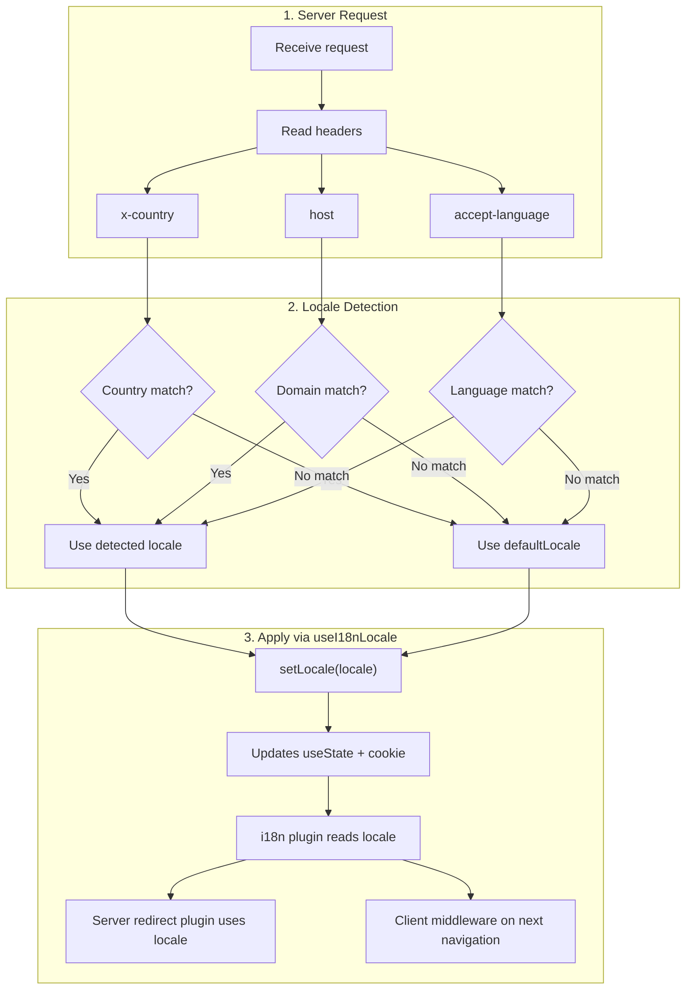

# 🔧 Кастомне визначення мови у Nuxt I18n Micro

## 📖 Огляд

Nuxt I18n Micro v3 надає централізований композабл — `useI18nLocale()` — для всього керування локалями. Він замінює ручні шаблони `useState`/`useCookie` з v2. Використовуючи `useI18nLocale().setLocale()` у серверному плагіні, ви можете реалізувати будь-яку кастомну логіку визначення, зберігаючи повну сумісність з системами редиректів та cookie модуля.

## 🏗️ Архітектура

```mermaid
flowchart TB
    subgraph Plugins["Plugin Execution Order"]
        A["Your plugin<br/>order: -10"] -->|setLocale()| B["01.plugin.ts<br/>order: -5"]
        B --> C["06.redirect.ts server<br/>order: 10"]
    end

    subgraph Client["Client SPA Navigation"]
        D["i18n-redirect.global.ts<br/>route middleware"]
    end

    subgraph State["Locale State"]
        E["useState('i18n-locale')"]
        F["localeCookie"]
    end

    A -->|"setLocale() updates both"| E
    A -->|"setLocale() updates both"| F
    B -->|reads| E
    C -->|reads| E
    C -->|reads| F
    D -->|reads target route +| E
```

**Ключовий принцип**: викликайте `useI18nLocale().setLocale()` у серверному плагіні з `order: -10`. Це атомарно оновлює як `useState('i18n-locale')`, так і cookie локалі, тож плагін i18n (`order: -5`) та серверний плагін редиректу (`order: 10`) бачать правильну локаль на першому SSR-запиті. Клієнтські авто-редиректи виконуються у глобальному route middleware при наступних навігаціях.

## 🛠️ Вимкнення вбудованого автовизначення

Якщо вам потрібен повний контроль над визначенням локалі, вимкніть вбудований механізм:

```ts
export default defineNuxtConfig({
  i18n: {
    autoDetectLanguage: false,
  },
})
```

## ✨ Приклад: визначення на боці сервера через `useI18nLocale`

Це **рекомендований підхід** для всіх стратегій.

### Крок 1: Налаштуйте `nuxt.config.ts`

```ts
export default defineNuxtConfig({
  modules: ['nuxt-i18n-micro'],
  i18n: {
    strategy: 'no_prefix', // Works with ANY strategy
    defaultLocale: 'en',
    localeCookie: 'user-locale',
    autoDetectLanguage: false,
    locales: [
      { code: 'en', iso: 'en-US' },
      { code: 'de', iso: 'de-DE' },
      { code: 'ja', iso: 'ja-JP' },
    ],
  },
})
```

### Крок 2: Створіть `plugins/i18n-loader.server.ts`

```ts
import { defineNuxtPlugin, useRequestHeaders } from '#imports'

export default defineNuxtPlugin({
  name: 'i18n-custom-loader',
  enforce: 'pre',
  order: -10, // Execute BEFORE the i18n plugin (which has order -5)

  setup() {
    const { setLocale } = useI18nLocale()
    const headers = useRequestHeaders(['host', 'x-country', 'accept-language'])
    let detectedLocale = 'en'

    // --- YOUR DETECTION LOGIC ---

    // Example 1: By domain
    const host = headers['host']
    if (host?.includes('example.de')) {
      detectedLocale = 'de'
    }
    // Example 2: By custom header
    else if (headers['x-country'] === 'JP') {
      detectedLocale = 'ja'
    }
    // Example 3: By Accept-Language header
    else if (headers['accept-language']?.includes('de')) {
      detectedLocale = 'de'
    }

    // --- APPLY THE LOCALE ---
    setLocale(detectedLocale)
  },
})
```

### Як це працює



1. **Плагін запускається першим** (`order: -10`) — визначає локаль з заголовків, домену чи інших джерел
2. **`setLocale()` атомарно оновлює** як `useState('i18n-locale')`, так і cookie — забезпечує негайну видимість для всіх наступних плагінів
3. **Плагін i18n** (`order: -5`) читає локаль і завантажує правильні переклади
4. **Серверний плагін редиректу** (`order: 10`) використовує локаль для рішень про редиректи на SSR
5. **Клієнтське route middleware** (`i18n-redirect`) застосовує редиректи при SPA-навігації, коли локаль URL не збігається з уподобанням

## 🌐 Поведінка залежно від стратегії

`useI18nLocale().setLocale()` працює з **усіма стратегіями**. Поведінка редиректу залежить від стратегії:

<Tip>
| Стратегія               | Ефект `setLocale('de')`                                                |
|-------------------------|------------------------------------------------------------------------|
| `no_prefix`             | Рендер німецькою, без зміни URL                                        |
| `prefix`                | 302 → `/de/` (серверний редирект)                                      |
| `prefix_except_default` | 302 → `/de/`, якщо `de` ≠ default; без редиректу, якщо `de` = default   |
| `prefix_and_default`    | Без редиректу (і `/`, і `/de/` валідні)                                |
</Tip>

**Важливі нотатки:**

- Визначення локалі через cookie вимкнено за замовчуванням (`localeCookie: null`)
- Встановіть `localeCookie: 'user-locale'`, щоб увімкнути збереження через cookie
- Якщо значення cookie/стану немає у списку `locales`, воно повертається до `defaultLocale`

## 🏢 Розширено: визначення за доменом

Для мультидоменних налаштувань, де кожен домен обслуговує іншу локаль:

```ts
import { defineNuxtPlugin, useRequestHeaders } from '#imports'

export default defineNuxtPlugin({
  name: 'i18n-domain-loader',
  enforce: 'pre',
  order: -10,

  setup() {
    const { setLocale } = useI18nLocale()
    const headers = useRequestHeaders(['host'])
    const host = headers['host'] || ''

    let detectedLocale = 'en'

    if (host.endsWith('.de') || host.includes('german.')) {
      detectedLocale = 'de'
    } else if (host.endsWith('.fr') || host.includes('french.')) {
      detectedLocale = 'fr'
    } else if (host.endsWith('.jp') || host.includes('japanese.')) {
      detectedLocale = 'ja'
    }

    setLocale(detectedLocale)
  },
})
```

## 🔄 Розширено: врахування вподобань користувача

Якщо користувачі можуть вручну перемикати мову, поважайте їхній вибір над авто-визначенням:

```ts
import { defineNuxtPlugin, useRequestHeaders } from '#imports'

export default defineNuxtPlugin({
  name: 'i18n-smart-loader',
  enforce: 'pre',
  order: -10,

  setup() {
    const { getLocale, setLocale } = useI18nLocale()

    // If user already has a preference (from cookie), respect it
    if (getLocale()) {
      return
    }

    // Otherwise, detect locale from headers
    const headers = useRequestHeaders(['accept-language'])
    let detectedLocale = 'en'

    const acceptLanguage = headers['accept-language'] || ''
    if (acceptLanguage.includes('de')) {
      detectedLocale = 'de'
    } else if (acceptLanguage.includes('ja')) {
      detectedLocale = 'ja'
    }

    setLocale(detectedLocale)
  },
})
```

## ⚙️ Server-only чи client-only плагіни

Використовуйте [конвенції імен файлів Nuxt](https://nuxt.com/docs/getting-started/directory-structure#plugins), щоб контролювати, де запускається ваш плагін:

- **Лише сервер**: `i18n-loader.server.ts` — запускається лише під час SSR (рекомендовано для визначення на основі заголовків)
- **Лише клієнт**: `i18n-loader.client.ts` — запускається лише у браузері (для визначення на основі `localStorage` чи DOM)


## ✅ Підсумок

| Можливість                             | Опис                                                              |
| -------------------------------------- | ----------------------------------------------------------------- |
| `useI18nLocale().setLocale()`          | Атомарно оновлює `useState` + cookie; працює з усіма стратегіями |
| `useI18nLocale().getLocale()`          | Повертає поточну локаль зі стану чи cookie                        |
| `useI18nLocale().getPreferredLocale()` | Повертає бажану локаль (перевірену проти списку `locales`)        |
| Плагін `order: -10`                    | Гарантує, що ваш плагін запускається до ініціалізації i18n        |
| `enforce: 'pre'`                       | Запускається у групі плагінів «pre»                               |

**НЕ робіть:**

- Не використовуйте `useCookie('user-locale')` напряму — `useI18nLocale()` керує cookie внутрішньо
- Не використовуйте `useState('i18n-locale')` напряму — використовуйте натомість `useI18nLocale().setLocale()`
- Не встановлюйте `order` >= -5 — ваш плагін має запускатися до плагіна i18n
