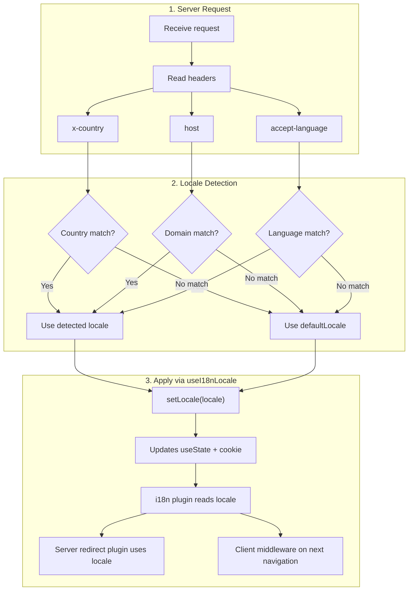

# 🔧 Кастомне визначення мови у Nuxt I18n Micro

## 📖 Огляд

Nuxt I18n Micro v3 надає централізований composable — `useI18nLocale()` — для всього керування локаллю. Він замінює ручні патерни `useState`/`useCookie` з v2. Використовуючи `useI18nLocale().setLocale()` у серверному плагіні, ви можете реалізувати будь-яку кастомну логіку визначення, зберігаючи повну сумісність із системами перенаправлень та cookie модуля.

## 🏗️ Архітектура

```mermaid
flowchart TB
    subgraph Plugins["Plugin Execution Order"]
        A["Your plugin<br/>order: -10"] -->|setLocale()| B["01.plugin.ts<br/>order: -5"]
        B --> C["06.redirect.ts server<br/>order: 10"]
    end

    subgraph Client["Client SPA Navigation"]
        D["i18n-redirect.global.ts<br/>route middleware"]
    end

    subgraph State["Locale State"]
        E["useState('i18n-locale')"]
        F["localeCookie"]
    end

    A -->|"setLocale() updates both"| E
    A -->|"setLocale() updates both"| F
    B -->|reads| E
    C -->|reads| E
    C -->|reads| F
    D -->|reads target route +| E
```

**Ключовий принцип**: викликайте `useI18nLocale().setLocale()` у серверному плагіні з `order: -10`. Це атомарно оновлює як `useState('i18n-locale')`, так і cookie локалі, тож i18n-плагін (`order: -5`) та серверний redirect-плагін (`order: 10`) бачать коректну локаль при першому SSR-запиті. Клієнтські автоперенаправлення виконуються у глобальному route middleware при наступних навігаціях.

## 🛠️ Вимкнення вбудованого автовизначення

Якщо ви хочете повний контроль над визначенням локалі, вимкніть вбудований механізм:

```ts
export default defineNuxtConfig({
  i18n: {
    autoDetectLanguage: false,
  },
})
```

## ✨ Приклад: серверне визначення з `useI18nLocale`

Це **рекомендований підхід** для всіх стратегій.

### Крок 1: Налаштуйте `nuxt.config.ts`

```ts
export default defineNuxtConfig({
  modules: ['nuxt-i18n-micro'],
  i18n: {
    strategy: 'no_prefix', // Works with ANY strategy
    defaultLocale: 'en',
    localeCookie: 'user-locale',
    autoDetectLanguage: false,
    locales: [
      { code: 'en', iso: 'en-US' },
      { code: 'de', iso: 'de-DE' },
      { code: 'ja', iso: 'ja-JP' },
    ],
  },
})
```

### Крок 2: Створіть `plugins/i18n-loader.server.ts`

```ts
import { defineNuxtPlugin, useRequestHeaders } from '#imports'

export default defineNuxtPlugin({
  name: 'i18n-custom-loader',
  enforce: 'pre',
  order: -10, // Execute BEFORE the i18n plugin (which has order -5)

  setup() {
    const { setLocale } = useI18nLocale()
    const headers = useRequestHeaders(['host', 'x-country', 'accept-language'])
    let detectedLocale = 'en'

    // --- YOUR DETECTION LOGIC ---

    // Example 1: By domain
    const host = headers['host']
    if (host?.includes('example.de')) {
      detectedLocale = 'de'
    }
    // Example 2: By custom header
    else if (headers['x-country'] === 'JP') {
      detectedLocale = 'ja'
    }
    // Example 3: By Accept-Language header
    else if (headers['accept-language']?.includes('de')) {
      detectedLocale = 'de'
    }

    // --- APPLY THE LOCALE ---
    setLocale(detectedLocale)
  },
})
```

### Як це працює



1. **Плагін виконується першим** (`order: -10`) — визначає локаль із заголовків, домену або інших джерел
2. **`setLocale()` оновлює обидва** — `useState('i18n-locale')` та cookie — забезпечує негайну видимість для всіх наступних плагінів
3. **i18n-плагін** (`order: -5`) читає локаль та завантажує коректні переклади
4. **Серверний redirect-плагін** (`order: 10`) використовує локаль для рішень щодо перенаправлень на SSR
5. **Клієнтське route middleware** (`i18n-redirect`) застосовує перенаправлення при SPA-навігації, коли локаль URL не збігається з уподобанням

## 🌐 Поведінка, специфічна для стратегії

`useI18nLocale().setLocale()` працює з **усіма стратегіями**. Поведінка перенаправлень залежить від стратегії:

<Tip>
| Стратегія | Ефект `setLocale('de')` |
|----------|---------------------------|
| `no_prefix` | Рендерить німецькою, URL не змінюється |
| `prefix` | 302 → `/de/` (перенаправлення на стороні сервера) |
| `prefix_except_default` | 302 → `/de/`, якщо `de` ≠ за замовчуванням; без перенаправлення, якщо `de` = за замовчуванням |
| `prefix_and_default` | Без перенаправлення (як `/`, так і `/de/` валідні) |
</Tip>

**Важливі примітки:**

- Визначення локалі на основі cookie за замовчуванням вимкнено (`localeCookie: null`)
- Встановіть `localeCookie: 'user-locale'`, щоб увімкнути збереження cookie
- Якщо значення cookie/стану не входить до списку `locales`, воно повертається до `defaultLocale`

## 🏢 Розширене: визначення на основі домену

Для мультидоменних налаштувань, де кожен домен обслуговує іншу локаль:

```ts
import { defineNuxtPlugin, useRequestHeaders } from '#imports'

export default defineNuxtPlugin({
  name: 'i18n-domain-loader',
  enforce: 'pre',
  order: -10,

  setup() {
    const { setLocale } = useI18nLocale()
    const headers = useRequestHeaders(['host'])
    const host = headers['host'] || ''

    let detectedLocale = 'en'

    if (host.endsWith('.de') || host.includes('german.')) {
      detectedLocale = 'de'
    } else if (host.endsWith('.fr') || host.includes('french.')) {
      detectedLocale = 'fr'
    } else if (host.endsWith('.jp') || host.includes('japanese.')) {
      detectedLocale = 'ja'
    }

    setLocale(detectedLocale)
  },
})
```

## 🔄 Розширене: врахування уподобань користувача

Якщо користувачі можуть вручну перемикати мову, поважайте їхній вибір над автовизначенням:

```ts
import { defineNuxtPlugin, useRequestHeaders } from '#imports'

export default defineNuxtPlugin({
  name: 'i18n-smart-loader',
  enforce: 'pre',
  order: -10,

  setup() {
    const { getLocale, setLocale } = useI18nLocale()

    // If user already has a preference (from cookie), respect it
    if (getLocale()) {
      return
    }

    // Otherwise, detect locale from headers
    const headers = useRequestHeaders(['accept-language'])
    let detectedLocale = 'en'

    const acceptLanguage = headers['accept-language'] || ''
    if (acceptLanguage.includes('de')) {
      detectedLocale = 'de'
    } else if (acceptLanguage.includes('ja')) {
      detectedLocale = 'ja'
    }

    setLocale(detectedLocale)
  },
})
```

## ⚙️ Плагіни лише для сервера або лише для клієнта

Використовуйте [конвенції імен файлів Nuxt](https://nuxt.com/docs/getting-started/directory-structure#plugins), щоб керувати місцем запуску вашого плагіна:

- **Лише сервер**: `i18n-loader.server.ts` — виконується лише під час SSR (рекомендовано для визначення на основі заголовків)
- **Лише клієнт**: `i18n-loader.client.ts` — виконується лише у браузері (для визначення на основі `localStorage` або DOM)

<Tip>

</Tip>

## ✅ Резюме

| Можливість                             | Опис                                                              |
| -------------------------------------- | ----------------------------------------------------------------- |
| `useI18nLocale().setLocale()`          | Атомарно оновлює `useState` + cookie; працює з усіма стратегіями |
| `useI18nLocale().getLocale()`          | Повертає поточну локаль зі стану або cookie                       |
| `useI18nLocale().getPreferredLocale()` | Повертає бажану локаль (валідовану відносно списку `locales`)     |
| Плагін `order: -10`                    | Забезпечує, що ваш плагін виконується до ініціалізації i18n       |
| `enforce: 'pre'`                       | Виконується у групі плагінів «pre»                                |

**НЕ:**

- Використовуйте `useCookie('user-locale')` безпосередньо — `useI18nLocale()` керує cookies внутрішньо
- Використовуйте `useState('i18n-locale')` безпосередньо — використовуйте `useI18nLocale().setLocale()`
- Встановлюйте `order` >= -5 — ваш плагін має виконуватися до i18n-плагіна
