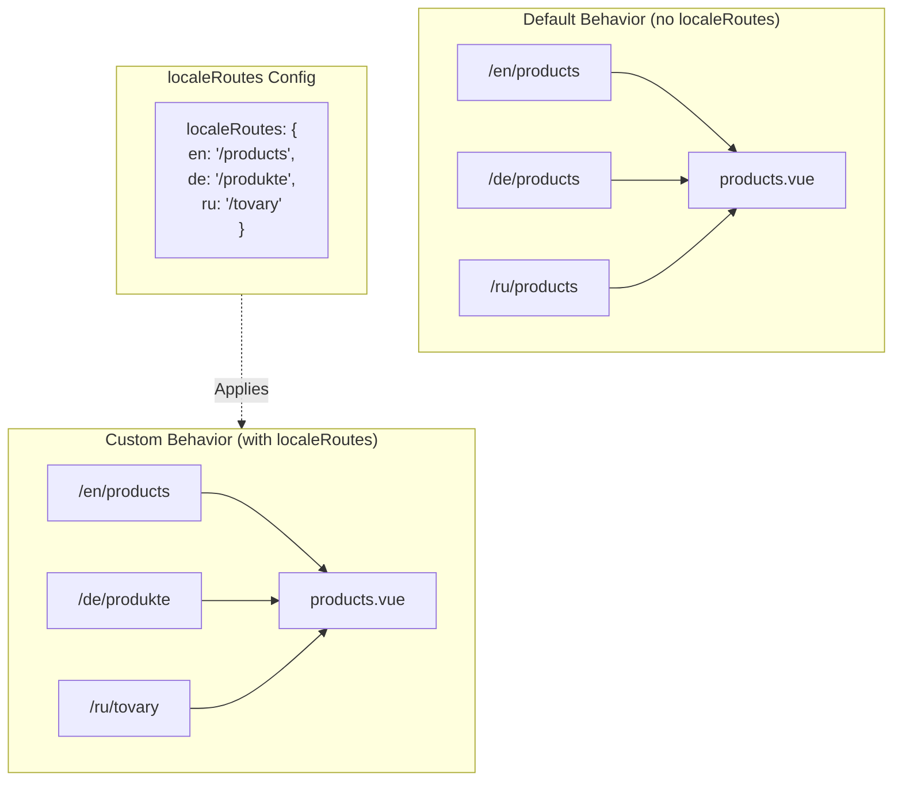

# 🔗 Кастомні локалізовані маршрути з `localeRoutes` у `Nuxt I18n Micro`

## 📖 Вступ до `localeRoutes`

Можливість `localeRoutes` у `Nuxt I18n Micro` дозволяє визначати кастомні маршрути для конкретних локалей, надаючи гнучкість та контроль над структурою маршрутизації вашого застосунку. Ця можливість особливо корисна, коли певні локалі потребують інших структур URL, підлаштованих шляхів чи мають дотримуватися конкретних регіональних або мовних конвенцій.

## 🚀 Головний сценарій використання `localeRoutes`

Головний сценарій використання `localeRoutes` — надати окремі маршрути для різних локалей, покращуючи користувацький досвід шляхом забезпечення, що URL інтуїтивні та релевантні цільовій аудиторії. Наприклад, у вас можуть бути різні шляхи для англійської та російської версій сторінки, де російська локаль слідує локалізованому формату URL.

### 📄 Приклад: визначення `localeRoutes` у `$defineI18nRoute`

Ось приклад, як можна визначити кастомні маршрути для конкретних локалей через `localeRoutes` у функції `$defineI18nRoute`:

```typescript
import { useNuxtApp } from '#imports'

const { $defineI18nRoute } = useNuxtApp()

$defineI18nRoute({
  localeRoutes: {
    ru: '/localesubpage', // Custom route path for the Russian locale
    de: '/lokaleseite', // Custom route path for the German locale
  },
})
```

> [!IMPORTANT]
> `$defineI18nRoute` не є глобальною функцією. У `script setup` спочатку отримайте її з `useNuxtApp()`, потім викликайте.

### 🔄 Як працює `localeRoutes`



- **Поведінка за замовчуванням**: без `localeRoutes` усі локалі використовують спільну структуру маршрутів, визначену основним шляхом.
- **Кастомна поведінка**: з `localeRoutes` конкретні локалі можуть мати власні маршрути, перевизначаючи стандартний шлях locale-specific маршрутами, визначеними у конфігурації.

## 🌱 Сценарії використання `localeRoutes`

### 📄 Приклад: використання `localeRoutes` на сторінці

Ось простий Vue-компонент, що демонструє використання `$defineI18nRoute` з `localeRoutes`:

```vue
<template>
  <div>
    <!-- Display greeting message based on the current locale -->
    <p>{{ $t('greeting') }}</p>

    <!-- Navigation links -->
    <div>
      <NuxtLink :to="$localeRoute({ name: 'index' })"> Go to Index </NuxtLink>
      |
      <NuxtLink :to="$localeRoute({ name: 'about' })"> Go to About Page </NuxtLink>
    </div>
  </div>
</template>

<script setup>
import { useNuxtApp } from '#imports'

const { $getLocale, $switchLocale, $getLocales, $localeRoute, $t, $defineI18nRoute } = useNuxtApp()

// Define translations and custom routes for specific locales
$defineI18nRoute({
  localeRoutes: {
    ru: '/localesubpage', // Custom route path for Russian locale
  },
})
</script>
```

### 🛠️ Використання `localeRoutes` у різних контекстах

- **Лендінги**: використовуйте кастомні маршрути для локалізації URL лендінгів, гарантуючи їх узгодженість з маркетинговими кампаніями.
- **Сайти документації**: надайте окремі маршрути для кожної локалі, щоб краще відповідати структурі локалізованого контенту.
- **E-commerce сайти**: підлаштовуйте URL товарів чи категорій під кожну локаль для покращення SEO та користувацького досвіду.

## Використання навігації з `localeRoutes`

Оскільки локалізовані маршрути не безпосередньо збігаються з іменами файлів у теці pages, вам потрібно посилатися на навігацію через обʼєкт, а не за іменем.

```vue
<template>
  /**
   * Exemple page: /pages/about-us.vue
   * EN /about-us
   * ES /sobre-nosotros
   * FR /a-propos
   */

  // Using NuxtLink
  <NuxtLink :to="$localeRoute({ name: 'about-us' })">
    Go to About Page
  </NuxtLink>

  // Using I18nLink
  <I18nLink :to="{ name: 'about-us' }">
    Go to About Page
  </NuxtLink>

  // The string literal navigation wouldn't work for any locale but english
  <I18nLink to="/about-us">
    Go to About Page
  </NuxtLink>
</template>
```

### Іменування вкладених сторінок

За замовчуванням ваші сторінки іменуються на основі імені файлу та шляху. Ось що це означає:

- `/pages/about-us.vue` доступна через `$localeRoute(\{ name: 'about-us' \})`
- `/pages/about-us/physical-stores.vue` доступна через `$localeRoute(\{ name: 'about-us-physical-stores' \})`

Щоб перевизначити цю поведінку, явно назвіть свою сторінку через `definePageMeta`.

```vue
// /pages/about-us/physical-stores.vue
<script setup>
definePageMeta({
  name: 'our-stores'
})
```

На цю сторінку тепер можна посилатися через `$localeRoute` або `I18nLink` за іменем `:to='\{ name: "our-stores" \}'`.

## 🎯 Динамічні маршрути зі slug та `$setI18nRouteParams`

При роботі з динамічними маршрутами, що містять slug чи параметри, ви можете використовувати `localeRoutes` з динамічними сегментами та `$setI18nRouteParams`, щоб надати locale-specific slug для кожної локалі.

### Параметри динамічних маршрутів у `localeRoutes`

Ви можете визначати динамічні маршрути через синтаксис параметрів маршрутів Nuxt (`[...slug]` для catch-all-маршрутів, `[param]` для одиничних параметрів або `:param()` для іменованих параметрів):

```vue
<script setup lang="ts">
import { useNuxtApp, useRoute, useFetch, createError } from '#imports'

const { $defineI18nRoute, $setI18nRouteParams } = useNuxtApp()

// Define custom routes with dynamic segments
$defineI18nRoute({
  localeRoutes: {
    en: '/our-products/[...slug]',
    es: '/nuestros-productos/[...slug]',
  },
})
</script>
```

### Задання locale-specific параметрів маршруту

Функція `$setI18nRouteParams` дозволяє задавати різні значення параметрів (наприклад, slug) для кожної локалі. Це особливо корисно, коли ваш контент має locale-specific URL.

**Важливо**: `$setI18nRouteParams` слід викликати після отримання даних, що містять locale-specific slug, зазвичай усередині `useFetch` або `useAsyncData`.

```vue
<script setup lang="ts">
import { useNuxtApp, useRoute, useFetch, createError } from '#imports'

interface Product {
  title: string
  price: string
  urlEn: string // English slug
  urlEs: string // Spanish slug
}

const { $defineI18nRoute, $setI18nRouteParams } = useNuxtApp()

const route = useRoute()
const slug = Array.isArray(route.params.slug) ? route.params.slug[0] : route.params.slug

// Fetch product data that includes locale-specific slugs
const { data: product, error } = await useFetch<Product>(`/api/product/${slug}`)
if (error.value)
  throw createError({
    statusCode: error.value?.statusCode,
    statusMessage: error.value?.statusMessage,
    fatal: true,
  })

// Define custom routes with dynamic segments
$defineI18nRoute({
  localeRoutes: {
    en: '/our-products/[...slug]',
    es: '/nuestros-productos/[...slug]',
  },
})

// Set different slugs for different locales
if (product.value) {
  $setI18nRouteParams({
    en: { slug: product.value.urlEn },
    es: { slug: product.value.urlEs },
  })
}
</script>
```

### Повний приклад: сторінки товарів з locale-specific slug

Ось повний приклад, що показує використання `localeRoutes` та `$setI18nRouteParams` разом для сторінки деталей товару:

```vue
<template>
  <div v-if="product">
    <h1>{{ product.title }}</h1>
    <p>{{ $t('price') }}: {{ product.price }}</p>
    <div class="locale-switcher">
      <a :href="$switchLocalePath('en')">English</a>
      <a :href="$switchLocalePath('es')">Español</a>
    </div>
  </div>
</template>

<script setup lang="ts">
import { useNuxtApp, useRoute, useFetch, createError } from '#imports'

interface Product {
  title: string
  price: string
  urlEn: string
  urlEs: string
}

const { $t, $defineI18nRoute, $setI18nRouteParams, $switchLocalePath } = useNuxtApp()

// Set page name for easier navigation
definePageMeta({ name: 'product-slug' })

const route = useRoute()
const slug = Array.isArray(route.params.slug) ? route.params.slug[0] : route.params.slug

// Fetch product data
const { data: product, error } = await useFetch<Product>(`/api/product/${slug}`)
if (error.value)
  throw createError({
    statusCode: error.value?.statusCode,
    statusMessage: error.value?.statusMessage,
    fatal: true,
  })

// Define locale-specific routes with dynamic segments
$defineI18nRoute({
  localeRoutes: {
    en: '/our-products/[...slug]',
    es: '/nuestros-productos/[...slug]',
  },
})

// Set locale-specific slugs so $switchLocalePath works correctly
if (product.value) {
  $setI18nRouteParams({
    en: { slug: product.value.urlEn },
    es: { slug: product.value.urlEs },
  })
}
</script>
```

### Приклад: сторінка списку товарів

При посиланні на динамічні маршрути зі сторінки-списку, використовуйте імʼя маршруту з параметрами:

```vue
<template>
  <div>
    <h1>{{ $t('title') }}</h1>
    <ul>
      <li v-for="product in products?.[$getLocale()] || []" :key="product.id">
        <I18nLink :to="{ name: 'product-slug', params: { slug: product.url } }"> {{ product.title }} – {{ product.price }} </I18nLink>
      </li>
    </ul>
  </div>
</template>

<script setup lang="ts">
import { useNuxtApp, useFetch, createError } from '#imports'

interface Product {
  id: string
  title: string
  price: string
  url: string
}

type ProductsByLocale = Record<string, Product[]>

const { $t, $defineI18nRoute, $getLocale } = useNuxtApp()

const { data: products, error } = await useFetch<ProductsByLocale>('/api/product')
if (error.value)
  throw createError({
    statusCode: error.value?.statusCode,
    statusMessage: error.value?.statusMessage,
    fatal: true,
  })

$defineI18nRoute({
  locales: {
    en: {
      title: 'Our Product Range',
      description: 'Discover our collection of high-quality products.',
    },
    es: {
      title: 'Nuestra Gama de Productos',
      description: 'Descubra nuestra colección de productos de alta calidad.',
    },
  },
  localeRoutes: {
    en: '/our-products',
    es: '/nuestros-productos',
  },
})
</script>
```

### Як це працює

1. **Визначення маршруту**: `localeRoutes` визначає базову структуру шляху для кожної локалі, включно з динамічними сегментами на кшталт `[...slug]` чи `[id]`.

2. **Задання параметрів**: `$setI18nRouteParams` задає фактичні значення параметрів для кожної локалі. Коли користувач перемикає локалі через `$switchLocalePath`, модуль використовує ці параметри для побудови правильного URL.

3. **Формат параметрів**: обʼєкт параметрів має відповідати структурі:

   ```typescript
   {
     [localeCode]: {
       [paramName]: paramValue
     }
   }
   ```

4. **Навігація**: використовуйте `I18nLink` або `$localeRoute` з іменем маршруту та параметрами, щоб навігувати між локалізованими версіями динамічних маршрутів.

### Важливі нотатки

- **Час виклику**: `$setI18nRouteParams` слід викликати після отримання даних, що містять locale-specific slug, зазвичай усередині `useFetch` або `useAsyncData`.

- **Імена параметрів**: імена параметрів у `$setI18nRouteParams` мають збігатися з іменами параметрів маршруту (наприклад, `slug` для `[...slug]` або `id` для `[id]`).

- **Імена маршрутів**: коли ви використовуєте `definePageMeta(\{ name: 'route-name' \})`, використовуйте це імʼя при посиланні на маршрут через `I18nLink` або `$localeRoute`.

- **Catch-all маршрути**: для catch-all-маршрутів (`[...slug]`) параметр slug має бути масивом або рядком, який буде перетворено на масив.

## 🧩 Програмні маршрути (`pages:extend`) — #244

Маршрути, створені у `pages:extend`, не мають місця для `defineI18nRoute()`, і кілька маршрутів часто діляться одним SFC-обгорткою. Файло-орієнтоване сканування тоді згортає їх в один запис.

**Не** розміщуйте локалізовані шляхи у `route.meta` (вони потрапили б у клієнтську таблицю маршрутів). Тримайте один реєстр і проєктуйте його двічі:

1. у `pages:extend` (створює маршрути Nuxt)
2. у `i18n.globalLocaleRoutes`, згруповані за **іменем** маршруту (не шляхом файлу)

Використовуйте `splitLocaleRoutes` з `@i18n-micro/utils/split-locale-routes`:

```typescript
import { splitLocaleRoutes } from '@i18n-micro/utils/split-locale-routes'

const dynamic = splitLocaleRoutes([
  {
    name: 'products_tag',
    path: '/products/:tag',
    file: '~/pages/_dynamic.vue',
    paths: { fr: '/produits/:tag', de: '/produkte/:tag' },
  },
  {
    name: 'products_category',
    path: '/products/category/:category',
    file: '~/pages/_dynamic.vue',
    paths: { fr: '/produits/categorie/:category' },
  },
  // Disable localization for a programmatic route:
  // { name: 'internal', path: '/internal', file: '~/pages/_dynamic.vue', paths: false },
])

export default defineNuxtConfig({
  hooks: {
    'pages:extend'(pages) {
      pages.push(...dynamic.pages)
    },
  },
  i18n: {
    globalLocaleRoutes: dynamic.globalLocaleRoutes,
  },
})
```

Обидві половини залишаються синхронізованими; спільні обгортки більше не перезаписують одна одну. Самого `globalLocaleRoutes` недостатньо — він лише кастомізує шляхи для маршрутів, які вже існують у таблиці сторінок Nuxt.

## 📝 Кращі практики використання `localeRoutes`

- **🚀 Використовуйте для релевантних локалей**: застосовуйте `localeRoutes` в першу чергу там, де структура URL суттєво впливає на користувацький досвід чи SEO. Уникайте надмірного використання для незначних відмінностей.
- **🔧 Підтримуйте узгодженість**: тримайте узгоджений шаблон маршрутизації між локалями, якщо немає вагомої причини відхилятися. Такий підхід допомагає підтримувати ясність та зменшувати складність.
- **📚 Документуйте кастомні маршрути**: чітко документуйте будь-які кастомні маршрути, які ви визначаєте через `localeRoutes`, особливо у модульних застосунках, щоб члени команди розуміли логіку маршрутизації.
