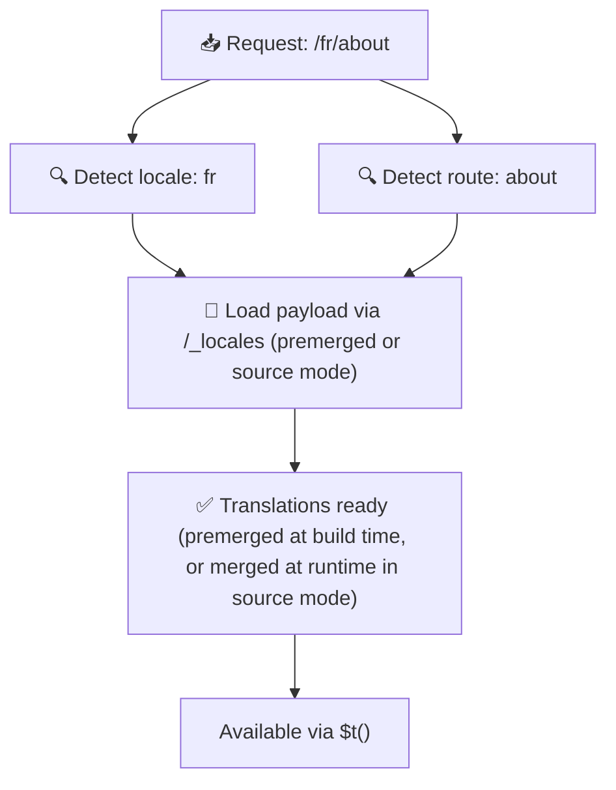

# 📂 Гайд зі структури тек

## 📖 Вступ

Ефективна організація файлів перекладів є важливою для підтримки масштабованої та ефективної системи інтернаціоналізації (i18n). `Nuxt I18n Micro` спрощує цей процес, пропонуючи чіткий підхід до керування кореневими та посторінковими перекладами. Цей гайд проведе вас через рекомендовану структуру тек та пояснить, як `Nuxt I18n Micro` обробляє ці переклади.

## 🗂️ Рекомендована структура тек

`Nuxt I18n Micro` організовує переклади у файли кореневого рівня та посторінкові файли всередині теки `pages`. З `translationPayloads.mode: 'premerged'` (за замовчуванням) кореневі переклади автоматично зливаються з кожним файлом сторінки на етапі збірки, тож кожна сторінка має повний набір перекладів без накладних витрат на злиття під час виконання.

З `mode: 'source'` source-файли залишаються окремими у Nitro assets і зливаються під час виконання через маршрут `/_locales`. Див. [Serverless Payload Output](/guides/performance#serverless-payload-output).

### 🔧 Базова структура

Ось базовий приклад структури тек, якої слід дотримуватися:

```text
locales/
├── pages/
│   ├── index/
│   │   ├── en.json
│   │   ├── fr.json
│   │   └── ar.json
│   ├── about/
│   │   ├── en.json
│   │   ├── fr.json
│   │   └── ar.json
├── en.json
├── fr.json
└── ar.json

```

### 📄 Пояснення структури

#### 1. 🌍 Файли перекладу кореневого рівня

- **Шлях:** `/locales/\{locale\}.json` (наприклад, `/locales/en.json`)
- **Призначення:** ці файли містять переклади, спільні для всього застосунку (навігаційні меню, заголовки, футери тощо). З `mode: 'premerged'` (за замовчуванням) вони автоматично зливаються з кожним посторінковим файлом на етапі збірки, тож сервер повертає єдиний попередньо побудований файл для кожної сторінки.

  **Приклад вмісту (`/locales/en.json`):**

  ```json
  {
    "menu": {
      "home": "Home",
      "about": "About Us",
      "contact": "Contact"
    },
    "footer": {
      "copyright": "© 2024 Your Company"
    }
  }
  ```

#### 2. 📄 Посторінкові файли перекладу

- **Шлях:** `/locales/pages/\{routeName\}/\{locale\}.json` (наприклад, `/locales/pages/index/en.json`)
- **Призначення:** ці файли містять переклади, специфічні для окремих сторінок. З `mode: 'premerged'` (за замовчуванням) кореневі переклади зливаються як база на етапі збірки, тож кожен файл сторінки стає самодостатнім.

  **Приклад вмісту (`/locales/pages/index/en.json`):**

  ```json
  {
    "title": "Welcome to Our Website",
    "description": "We offer a wide range of products and services to meet your needs."
  }
  ```

  **Приклад вмісту (`/locales/pages/about/en.json`):**

  ```json
  {
    "title": "About Us",
    "description": "Learn more about our mission, vision, and values."
  }
  ```

### 📂 Обробка динамічних маршрутів та вкладених шляхів

`Nuxt I18n Micro` автоматично перетворює динамічні сегменти та вкладені шляхи маршрутів на пласку структуру тек, використовуючи конкретну конвенцію перейменування. Це забезпечує, що всі переклади зберігаються у узгодженому та легко доступному вигляді.

#### Структура тек перекладу для динамічних маршрутів

При роботі з динамічними маршрутами, як-от `/products/[id]`, модуль перетворює динамічний сегмент `[id]` у статичний формат у структурі файлів.

**Приклад структури тек для динамічних маршрутів:**

Для маршруту `/products/[id]` файли перекладу зберігатимуться у теці `products-id`:

```text
locales/pages/
├── products-id/
│   ├── en.json
│   ├── fr.json
│   └── ar.json

```

**Приклад структури тек для вкладених динамічних маршрутів:**

Для вкладеного маршруту `/products/key/[id]` файли перекладу зберігатимуться у теці `products-key-id`:

```text
locales/pages/
├── products-key-id/
│   ├── en.json
│   ├── fr.json
│   └── ar.json

```

**Приклад структури тек для багаторівневих вкладених маршрутів:**

Для складнішого вкладеного маршруту, як-от `/products/category/[id]/details`, файли перекладу зберігатимуться у теці `products-category-id-details`:

```text
locales/pages/
├── products-category-id-details/
│   ├── en.json
│   ├── fr.json
│   └── ar.json

```

### 🛠 Кастомізація структури теки

Якщо ви волієте зберігати переклади в іншій теці, `Nuxt I18n Micro` дозволяє кастомізувати теку, у якій зберігаються файли перекладу. Ви можете налаштувати це у файлі `nuxt.config.ts`.

**Приклад: кастомізація теки перекладів**

```typescript
export default defineNuxtConfig({
  i18n: {
    translationDir: 'i18n', // Custom directory path
  },
})
```

Це вкаже `Nuxt I18n Micro` шукати файли перекладу у теці `/i18n` замість типової `/locales`.

## ⚙️ Як завантажуються переклади

### 🌍 Динамічні маршрути локалей

`Nuxt I18n Micro` використовує динамічні маршрути локалей для ефективного завантаження перекладів. Коли користувач відвідує сторінку, модуль визначає відповідну локаль та завантажує відповідні файли перекладу на основі поточного маршруту та локалі.



Наприклад:

- Відвідування `/en/index` завантажить переклади з `/locales/pages/index/en.json`.
- Відвідування `/fr/about` завантажить переклади з `/locales/pages/about/fr.json`.

Цей метод забезпечує, що завантажуються лише необхідні переклади, оптимізуючи як навантаження на сервер, так і продуктивність на стороні клієнта.

### 💾 Кешування та pre-rendering

Для подальшого підвищення продуктивності `Nuxt I18n Micro` підтримує кешування та pre-rendering файлів перекладу:

- **Кешування**: коли файл перекладу завантажено, він кешується для наступних запитів, зменшуючи потребу повторно отримувати ті самі дані.
- **Pre-rendering**: під час процесу збірки ви можете попередньо рендерити файли перекладу для всіх налаштованих локалей та маршрутів, дозволяючи обслуговувати їх безпосередньо з сервера без затримок під час виконання.

## 📝 Найкращі практики

### 📂 Використовуйте посторінкові файли розумно

Використовуйте посторінкові файли, щоб тримати переклади організованими. Це робить переклади для кожної сторінки легкими та швидкими для завантаження, що особливо важливо для сторінок зі складним або великим контентом.

### 🔑 Тримайте ключі перекладу узгодженими

Використовуйте узгоджені конвенції найменування ключів перекладу у файлах. Це допомагає підтримувати ясність та запобігає проблемам при керуванні перекладами, особливо коли ваш застосунок росте.

### 🗂️ Організовуйте переклади за контекстом

Групуйте повʼязані переклади разом у ваших файлах. Наприклад, групуйте всі підписи кнопок під ключем `buttons`, а всі тексти, повʼязані з формами, — під ключем `forms`. Це не тільки покращує читабельність, а й полегшує керування перекладами у різних локалях.

### ⚠️ Обмеження глибини вкладеності (рекомендовано 2 рівні)

Під час клієнтської навігації `Nuxt I18n Micro` використовує оптимізоване глибоке злиття 2 рівнів, щоб обʼєднати переклади зі сторінки, яка залишається, і сторінки, до якої відбувається перехід. Це забезпечує, що перекриваючі вкладені ключі (наприклад, обидві сторінки мають ключі під `common.*`) зберігаються під час анімацій переходу.

**Це коректно працює для стандартної структури `Section → Key → Value` (2 рівні):**

```json
// Page A translations
{ "common": { "fromA": "Text A" } }

// Page B translations
{ "common": { "fromB": "Text B" } }

// During transition, both are available:
// { "common": { "fromA": "Text A", "fromB": "Text B" } }
```

**Однак, якщо ви використовуєте 3+ рівні вкладеності, глибші ключі можуть бути перезаписані під час переходів:**

```json
// Page A translations
{ "auth": { "form": { "login": "Login" } } }

// Page B translations
{ "auth": { "form": { "register": "Register" } } }

// During transition: "login" key is lost
// { "auth": { "form": { "register": "Register" } } }
```

<Tip>

</Tip>

### 🧹 Регулярно очищуйте невикористані переклади

З часом ваш застосунок може накопичувати невикористані ключі перекладу, особливо якщо функції видаляються або реструктуруються. Періодично переглядайте та очищуйте свої файли перекладу, щоб тримати їх легкими та підтримуваними.
