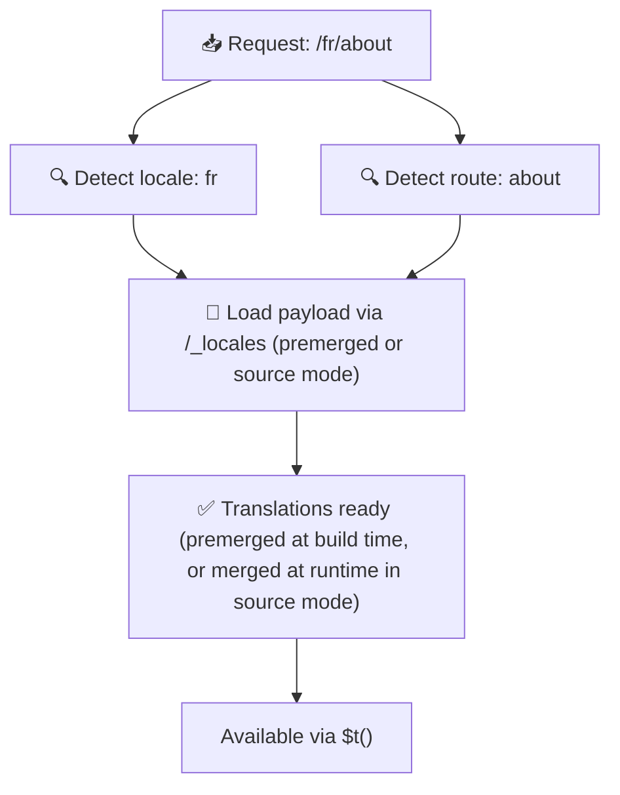

# 📂 Посібник зі структури тек

## 📖 Вступ

Ефективна організація файлів перекладів є ключовою для підтримки масштабованої та ефективної системи інтернаціоналізації (i18n). `Nuxt I18n Micro` спрощує цей процес, пропонуючи чіткий підхід до керування root-файлами та посторінковими перекладами. Цей посібник проведе вас через рекомендовану структуру тек і пояснить, як `Nuxt I18n Micro` обробляє ці переклади.

## 🗂️ Рекомендована структура тек

`Nuxt I18n Micro` організовує переклади у файли кореневого рівня та посторінкові файли всередині теки `pages`. З `translationPayloads.mode: 'premerged'` (за замовчуванням) root-переклади автоматично зливаються у кожен файл сторінки на етапі збірки, тож кожна сторінка має повний набір перекладів без накладних витрат на злиття у рантаймі.

З `mode: 'source'` вихідні файли залишаються окремими в Nitro-ресурсах і зливаються у рантаймі через маршрут `/_locales`. Див. [Serverless-вивід пейлоаду](/guides/performance#serverless-payload-output).

### 🔧 Базова структура

Ось базовий приклад структури тек, якої слід дотримуватися:

```text
locales/
├── pages/
│   ├── index/
│   │   ├── en.json
│   │   ├── fr.json
│   │   └── ar.json
│   ├── about/
│   │   ├── en.json
│   │   ├── fr.json
│   │   └── ar.json
├── en.json
├── fr.json
└── ar.json

```

### 📄 Пояснення структури

#### 1. 🌍 Root-файли перекладів

- **Шлях:** `/locales/\{locale\}.json` (наприклад, `/locales/en.json`)
- **Призначення:** ці файли містять переклади, спільні для всього застосунку (навігаційні меню, заголовки, футери тощо). З `mode: 'premerged'` (за замовчуванням) вони автоматично зливаються у кожен посторінковий файл на етапі збірки, тож сервер повертає один наперед побудований файл на сторінку.

  **Приклад вмісту (`/locales/en.json`):**

  ```json
  {
    "menu": {
      "home": "Home",
      "about": "About Us",
      "contact": "Contact"
    },
    "footer": {
      "copyright": "© 2024 Your Company"
    }
  }
  ```

#### 2. 📄 Посторінкові файли перекладів

- **Шлях:** `/locales/pages/\{routeName\}/\{locale\}.json` (наприклад, `/locales/pages/index/en.json`)
- **Призначення:** ці файли містять переклади, специфічні для окремих сторінок. З `mode: 'premerged'` (за замовчуванням) root-переклади зливаються як база на етапі збірки, тож кожен посторінковий файл стає самодостатнім.

  **Приклад вмісту (`/locales/pages/index/en.json`):**

  ```json
  {
    "title": "Welcome to Our Website",
    "description": "We offer a wide range of products and services to meet your needs."
  }
  ```

  **Приклад вмісту (`/locales/pages/about/en.json`):**

  ```json
  {
    "title": "About Us",
    "description": "Learn more about our mission, vision, and values."
  }
  ```

### 📂 Обробка динамічних маршрутів та вкладених шляхів

`Nuxt I18n Micro` автоматично перетворює динамічні сегменти та вкладені шляхи маршрутів на пласку структуру тек, використовуючи певну конвенцію перейменування. Це гарантує, що всі переклади зберігаються узгодженим і легкодоступним способом.

#### Структура тек для перекладів динамічних маршрутів

При роботі з динамічними маршрутами, як-от `/products/[id]`, модуль перетворює динамічний сегмент `[id]` у статичний формат у структурі файлів.

**Приклад структури тек для динамічних маршрутів:**

Для маршруту `/products/[id]` файли перекладів зберігатимуться у теці з назвою `products-id`:

```text
locales/pages/
├── products-id/
│   ├── en.json
│   ├── fr.json
│   └── ar.json

```

**Приклад структури тек для вкладених динамічних маршрутів:**

Для вкладеного маршруту `/products/key/[id]` файли перекладів зберігатимуться у теці `products-key-id`:

```text
locales/pages/
├── products-key-id/
│   ├── en.json
│   ├── fr.json
│   └── ar.json

```

**Приклад структури тек для багаторівневих вкладених маршрутів:**

Для складнішого вкладеного маршруту `/products/category/[id]/details` файли перекладів зберігатимуться у теці `products-category-id-details`:

```text
locales/pages/
├── products-category-id-details/
│   ├── en.json
│   ├── fr.json
│   └── ar.json

```

### 🛠 Кастомізація структури тек

Якщо ви віддаєте перевагу зберігати переклади в іншій теці, `Nuxt I18n Micro` дозволяє налаштувати каталог, де зберігаються файли перекладів. Ви можете сконфігурувати це у файлі `nuxt.config.ts`.

**Приклад: кастомізація каталогу перекладів**

```typescript
export default defineNuxtConfig({
  i18n: {
    translationDir: 'i18n', // Custom directory path
  },
})
```

Це вкаже `Nuxt I18n Micro` шукати файли перекладів у теці `/i18n` замість `/locales` за замовчуванням.

## ⚙️ Як завантажуються переклади

### 🌍 Динамічні маршрути локалей

`Nuxt I18n Micro` використовує динамічні маршрути локалей, щоб ефективно завантажувати переклади. Коли користувач відвідує сторінку, модуль визначає відповідну локаль і завантажує відповідні файли перекладу на основі поточного маршруту та локалі.



Наприклад:

- Відвідування `/en/index` завантажить переклади з `/locales/pages/index/en.json`.
- Відвідування `/fr/about` завантажить переклади з `/locales/pages/about/fr.json`.

Цей метод гарантує, що завантажуються лише необхідні переклади, оптимізуючи як навантаження на сервер, так і продуктивність на клієнті.

### 💾 Кешування та пре-рендеринг

Щоб додатково підвищити продуктивність, `Nuxt I18n Micro` підтримує кешування та пре-рендеринг файлів перекладів:

- **Кешування**: коли файл перекладу завантажено, його кешують для наступних запитів, зменшуючи потребу повторно отримувати ті самі дані.
- **Пре-рендеринг**: під час процесу збірки ви можете пре-рендерити файли перекладу для всіх налаштованих локалей та маршрутів, дозволяючи обслуговувати їх безпосередньо з сервера без затримок у рантаймі.

## 📝 Кращі практики

### 📂 Використовуйте посторінкові файли з розумом

Використовуйте посторінкові файли, щоб тримати переклади організованими. Це підтримує переклади кожної сторінки маленькими та швидкими для завантаження, що особливо важливо для сторінок зі складним чи великим контентом.

### 🔑 Тримайте ключі перекладу узгодженими

Використовуйте узгоджені конвенції іменування для ключів перекладу у всіх файлах. Це допомагає підтримувати ясність і запобігає проблемам при керуванні перекладами, особливо у міру зростання застосунку.

### 🗂️ Організовуйте переклади за контекстом

Групуйте повʼязані переклади разом у файлах. Наприклад, згрупуйте всі підписи кнопок під ключем `buttons`, а всі тексти форм — під ключем `forms`. Це не лише покращує читабельність, але й полегшує керування перекладами між різними локалями.

### ⚠️ Ліміт глибини вкладеності (рекомендовано 2 рівні)

Під час клієнтської навігації `Nuxt I18n Micro` використовує оптимізоване глибоке злиття у 2 рівні, щоб обʼєднати переклади зі сторінки, що виходить, та тієї, що заходить. Це гарантує, що ключі, що перетинаються (наприклад, обидві сторінки мають ключі під `common.*`), зберігаються під час анімацій переходу.

**Це коректно працює для стандартної структури `Section → Key → Value` (2 рівні):**

```json
// Page A translations
{ "common": { "fromA": "Text A" } }

// Page B translations
{ "common": { "fromB": "Text B" } }

// During transition, both are available:
// { "common": { "fromA": "Text A", "fromB": "Text B" } }
```

**Однак, якщо ви використовуєте 3+ рівні вкладеності, глибші ключі можуть бути перезаписані під час переходів:**

```json
// Page A translations
{ "auth": { "form": { "login": "Login" } } }

// Page B translations
{ "auth": { "form": { "register": "Register" } } }

// During transition: "login" key is lost
// { "auth": { "form": { "register": "Register" } } }
```


### 🧹 Регулярно прибирайте невикористовувані переклади

З часом ваш застосунок може накопичувати невикористовувані ключі перекладу, особливо якщо функції видаляють або перебудовують. Періодично переглядайте й прибирайте файли перекладів, щоб тримати їх лаконічними та зручними у супроводі.
