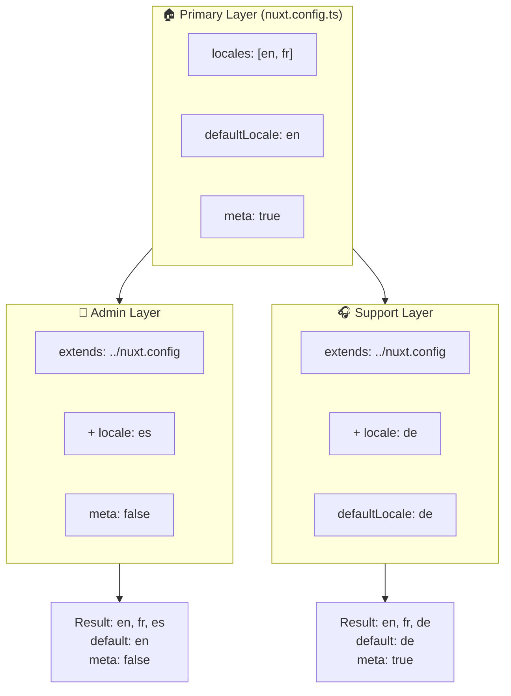

# 🗂️ Шари у `Nuxt I18n Micro`

## 📖 Вступ до шарів

Шари у `Nuxt I18n Micro` дозволяють гнучко керувати та кастомізувати налаштування локалізації для різних частин вашого застосунку. Визначаючи різні шари, ви можете коригувати конфігурацію для різних контекстів, як-от перевизначення налаштувань для конкретних розділів вашого сайту або створення багаторазових базових конфігурацій, які можна розширювати іншими частинами вашого застосунку.

### Потік успадкування шарів



## 🛠️ Основний шар конфігурації

**Основний шар конфігурації** — це місце, де ви налаштовуєте типові параметри локалізації для всього застосунку. Цей шар є важливим, оскільки він визначає глобальну конфігурацію, включно з підтримуваними локалями, мовою за замовчуванням та іншими критичними налаштуваннями i18n.

### 📄 Приклад: визначення основного шару конфігурації

Ось приклад того, як можна визначити основний шар конфігурації у вашому файлі `nuxt.config.ts`:

```typescript
export default defineNuxtConfig({
  i18n: {
    locales: [
      { code: 'en', iso: 'en-EN', dir: 'ltr' },
      { code: 'fr', iso: 'fr-FR', dir: 'ltr' },
      { code: 'ar', iso: 'ar-SA', dir: 'rtl' },
    ],
    defaultLocale: 'en', // The default locale for the entire app
    translationDir: 'locales', // Directory where translations are stored
    meta: true, // Automatically generate SEO-related meta tags like `alternate`
    autoDetectLanguage: true, // Automatically detect and use the user's preferred language
  },
})
```

## 🌱 Дочірні шари

Дочірні шари використовуються для розширення або перевизначення основної конфігурації для конкретних частин вашого застосунку. Наприклад, ви можете додати додаткові локалі або змінити локаль за замовчуванням для конкретного розділу вашого сайту. Дочірні шари особливо корисні у модульних застосунках, де різні частини застосунку можуть мати різні вимоги до локалізації.

### 📄 Приклад: розширення основного шару у дочірньому шарі

Припустимо, у вас є розділ сайту, який має підтримувати додаткові локалі, або ви хочете вимкнути певну локаль у певному контексті. Ось як цього можна досягти, розширивши основний шар конфігурації:

```typescript
// basic/nuxt.config.ts (Primary Layer)
export default defineNuxtConfig({
  i18n: {
    locales: [
      { code: 'en', iso: 'en-EN', dir: 'ltr' },
      { code: 'fr', iso: 'fr-FR', dir: 'ltr' },
    ],
    defaultLocale: 'en',
    meta: true,
    translationDir: 'locales',
  },
})
```

```typescript
// extended/nuxt.config.ts (Child Layer)
export default defineNuxtConfig({
  extends: '../basic', // Inherit the base configuration from the 'basic' layer
  i18n: {
    locales: [
      { code: 'en', iso: 'en-EN', dir: 'ltr' }, // Inherited from the base layer
      { code: 'fr', iso: 'fr-FR', dir: 'ltr' }, // Inherited from the base layer
      { code: 'de', iso: 'de-DE', dir: 'ltr' }, // Added in the child layer
    ],
    defaultLocale: 'fr', // Override the default locale to French for this section
    autoDetectLanguage: false, // Disable automatic language detection in this section
  },
})
```

### 🌐 Використання шарів у модульному застосунку

У більшому, модульному Nuxt-застосунку у вас можуть бути кілька розділів, кожен з яких потребує власних налаштувань i18n. Використовуючи шари, ви можете підтримувати чисту та масштабовану структуру конфігурації.

### 📄 Приклад: шарова конфігурація у модульному застосунку

Уявіть, що у вас є сайт електронної комерції з розділами, як-от основний вебсайт, адмін-панель та портал підтримки клієнтів. Кожен розділ може потребувати різного набору локалей або інших налаштувань i18n.

#### **Основний шар (глобальна конфігурація):**

```typescript
// nuxt.config.ts
export default defineNuxtConfig({
  i18n: {
    locales: [
      { code: 'en', iso: 'en-EN', dir: 'ltr' },
      { code: 'fr', iso: 'fr-FR', dir: 'ltr' },
    ],
    defaultLocale: 'en',
    meta: true,
    translationDir: 'locales',
    autoDetectLanguage: true,
  },
})
```

#### **Дочірній шар для адмін-панелі:**

```typescript
// admin/nuxt.config.ts
export default defineNuxtConfig({
  extends: '../nuxt.config', // Inherit the global settings
  i18n: {
    locales: [
      { code: 'en', iso: 'en-EN', dir: 'ltr' }, // Inherited
      { code: 'fr', iso: 'fr-FR', dir: 'ltr' }, // Inherited
      { code: 'es', iso: 'es-ES', dir: 'ltr' }, // Specific to the admin panel
    ],
    defaultLocale: 'en',
    meta: false, // Disable automatic meta generation in the admin panel
  },
})
```

#### **Дочірній шар для порталу підтримки клієнтів:**

```typescript
// support/nuxt.config.ts
export default defineNuxtConfig({
  extends: '../nuxt.config', // Inherit the global settings
  i18n: {
    locales: [
      { code: 'en', iso: 'en-EN', dir: 'ltr' }, // Inherited
      { code: 'fr', iso: 'fr-FR', dir: 'ltr' }, // Inherited
      { code: 'de', iso: 'de-DE', dir: 'ltr' }, // Specific to the support portal
    ],
    defaultLocale: 'de', // Default to German in the support portal
    autoDetectLanguage: false, // Disable automatic language detection
  },
})
```

У цьому модульному прикладі:

- Кожен розділ (admin, support) має власні налаштування i18n, але всі вони успадковують базову конфігурацію.
- Адмін-панель додає іспанську (`es`) як локаль та вимикає генерацію мета-тегів.
- Портал підтримки додає німецьку (`de`) як локаль та встановлює німецьку за замовчуванням для інтерфейсу користувача.

## 📝 Найкращі практики використання шарів

- **🔧 Тримайте основний шар простим:** основний шар має містити найбільш часто використовувані налаштування, які застосовуються глобально у вашому застосунку. Тримайте його прямолінійним, щоб забезпечити узгодженість.
- **⚙️ Використовуйте дочірні шари для конкретних кастомізацій:** перевизначайте або розширюйте налаштування у дочірніх шарах лише за потреби. Цей підхід уникає непотрібної складності у вашій конфігурації.
- **📚 Документуйте свої шари:** чітко документуйте призначення та специфіку кожного шару у вашому проєкті. Це допоможе підтримувати ясність та полегшить розуміння конфігурації для інших (або майбутнього вас).
