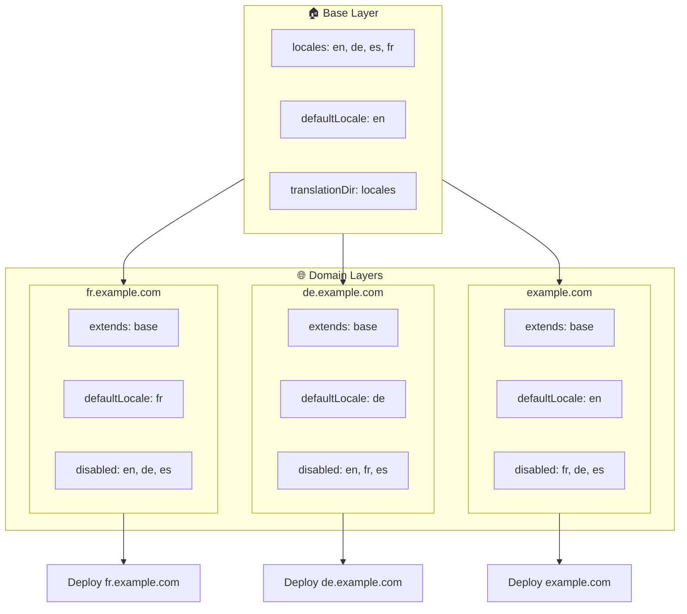

# 🌍 Налаштування мультидоменних локалей з `Nuxt I18n Micro` за допомогою шарів

## 📝 Вступ

Використовуючи шари у `Nuxt I18n Micro`, ви можете створити гнучке та зручне у супроводі мультидоменне налаштування локалізації. Такий підхід не лише спрощує керування доменами, усуваючи потребу у складному функціоналі, але й дозволяє ефективно розподіляти навантаження та зменшує складність проєкту. Запускаючи окремі проєкти для різних локалей, ваш застосунок може легко масштабуватися та адаптуватися до різних вимог до локалей на кількох доменах, пропонуючи надійне та масштабоване рішення для глобальних застосунків.

## 🎯 Мета

Створити налаштування, у якому різні домени обслуговують конкретні локалі, налаштовуючи конфігурації у дочірніх шарах. Цей метод використовує систему шарів Nuxt, дозволяючи підтримувати базову конфігурацію, розширюючи чи модифікуючи її для кожного домену.

### Мультидоменна архітектура



## 🛠 Кроки для реалізації мультидоменних локалей

### 1. **Створіть базовий шар**

Почніть зі створення базового шару конфігурації, який містить усі спільні налаштування локалей вашого застосунку. Ця конфігурація буде фундаментом для інших домен-специфічних конфігурацій.

#### **Конфігурація базового шару**

Створіть базовий файл конфігурації `base/nuxt.config.ts`:

```typescript
// base/nuxt.config.ts

export default defineNuxtConfig({
  i18n: {
    locales: [
      { code: 'en', iso: 'en-US', dir: 'ltr' },
      { code: 'de', iso: 'de-DE', dir: 'ltr' },
      { code: 'es', iso: 'es-ES', dir: 'ltr' },
    ],
    defaultLocale: 'en',
    translationDir: 'locales',
    meta: true,
    autoDetectLanguage: true,
  },
})
```

### 2. **Створіть домен-специфічні дочірні шари**

Для кожного домену створіть дочірній шар, який модифікує базову конфігурацію під конкретні вимоги цього домену. Ви можете вимкнути локалі, які не потрібні для конкретного домену.

#### **Приклад: конфігурація для французького домену**

Створіть конфігурацію дочірнього шару для французького домену у `fr/nuxt.config.ts`:

```typescript
// fr/nuxt.config.ts

export default defineNuxtConfig({
  extends: '../base', // Inherit from the base configuration

  i18n: {
    locales: [
      { code: 'en', iso: 'en-US', dir: 'ltr', disabled: true }, // Disable English
      { code: 'fr', iso: 'fr-FR', dir: 'ltr' }, // Add and enable the French locale
      { code: 'de', iso: 'de-DE', dir: 'ltr', disabled: true }, // Disable German
      { code: 'es', iso: 'es-ES', dir: 'ltr', disabled: true }, // Disable Spanish
    ],
    defaultLocale: 'fr', // Set French as the default locale
    autoDetectLanguage: false, // Disable automatic language detection
  },
})
```

#### **Приклад: конфігурація для німецького домену**

Аналогічно створіть конфігурацію дочірнього шару для німецького домену у `de/nuxt.config.ts`:

```typescript
// de/nuxt.config.ts

export default defineNuxtConfig({
  extends: '../base', // Inherit from the base configuration

  i18n: {
    locales: [
      { code: 'en', iso: 'en-US', dir: 'ltr', disabled: true }, // Disable English
      { code: 'fr', iso: 'fr-FR', dir: 'ltr', disabled: true }, // Disable French
      { code: 'de', iso: 'de-DE', dir: 'ltr' }, // Use the German locale
      { code: 'es', iso: 'es-ES', dir: 'ltr', disabled: true }, // Disable Spanish
    ],
    defaultLocale: 'de', // Set German as the default locale
    autoDetectLanguage: false, // Disable automatic language detection
  },
})
```

### 3. **Розгорніть застосунок для кожного домену**

Розгорніть застосунок з відповідною конфігурацією для кожного домену. Наприклад:

- Розгорніть конфігурацію шару `fr` на `fr.example.com`.
- Розгорніть конфігурацію шару `de` на `de.example.com`.

### 4. **Налаштуйте кілька проєктів для різних локалей**

Для кожної локалі та домену вам потрібно запустити окремий інстанс застосунку. Це гарантує, що кожен домен обслуговує правильну конфігурацію локалі, оптимізує розподіл навантаження та спрощує структуру проєкту. Запускаючи кілька проєктів, підлаштованих під кожну локаль, ви можете зберегти чіткий поділ між конфігураціями та зменшити складність усього налаштування.

### 5. **Налаштуйте маршрутизацію на основі домену**

Забезпечте, щоб маршрутизація була налаштована так, щоб спрямовувати користувачів до правильного проєкту на основі домену, до якого вони звертаються. Це гарантує, що кожен домен обслуговує відповідну локаль, покращуючи користувацький досвід та підтримуючи узгодженість між різними регіонами.

### 6. **Розгорніть та перевірте**

Після налаштування шарів та їхнього розгортання на відповідні домени переконайтеся, що кожен домен обслуговує правильну локаль. Ретельно протестуйте застосунок, щоб підтвердити, що правильна локаль завантажується залежно від домену.

## 📝 Кращі практики

- **Тримайте базову конфігурацію загальною**: базова конфігурація має покривати загальні налаштування, застосовні до всіх доменів.
- **Ізолюйте домен-специфічну логіку**: тримайте домен-специфічні конфігурації у відповідних шарах, щоб зберегти ясність та розподіл відповідальностей.

## 🎉 Висновок

Використовуючи шари у `Nuxt I18n Micro`, ви можете створити гнучке та зручне у супроводі мультидоменне налаштування локалізації. Такий підхід не лише усуває потребу у складному функціоналі керування доменами, але й дозволяє ефективно розподілити навантаження та зменшити складність проєкту. Запуск окремих проєктів для різних локалей гарантує, що ваш застосунок легко масштабується та адаптується до різних вимог до локалей на різних доменах, надаючи надійне та масштабоване рішення для глобальних застосунків.
