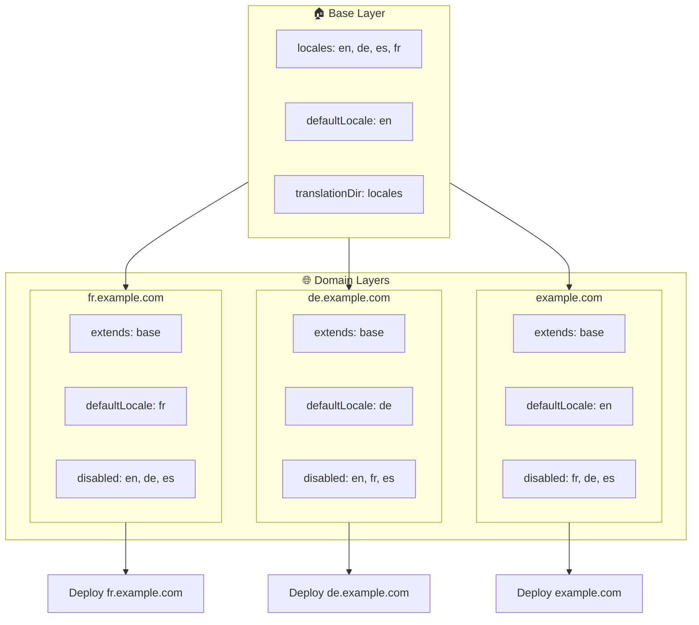

# 🌍 Налаштування мультидоменних локалей з `Nuxt I18n Micro` через шари

## 📝 Вступ

Використовуючи шари в `Nuxt I18n Micro`, ви можете створити гнучке та підтримуване мультидоменне налаштування локалізації. Цей підхід не тільки спрощує керування доменами, усуваючи потребу в складному функціоналі, але й дозволяє ефективно розподіляти навантаження та зменшувати складність проєкту. Запускаючи окремі проєкти для різних локалей, ваш застосунок може легко масштабуватися та адаптуватися до різних вимог локалей у кількох доменах, пропонуючи надійне та масштабоване рішення для глобальних застосунків.

## 🎯 Мета

Створити налаштування, де різні домени обслуговують специфічні локалі шляхом кастомізації конфігурацій у дочірніх шарах. Цей метод використовує систему шарів Nuxt, дозволяючи підтримувати базову конфігурацію, розширюючи або модифікуючи її для кожного домену.

### Мультидоменна архітектура



## 🛠 Кроки для реалізації мультидоменних локалей

### 1. **Створіть базовий шар**

Почніть зі створення базового шару конфігурації, який включає всі спільні налаштування локалі для вашого застосунку. Ця конфігурація слугуватиме основою для інших специфічних для домену конфігурацій.

#### **Конфігурація базового шару**

Створіть файл базової конфігурації `base/nuxt.config.ts`:

```typescript
// base/nuxt.config.ts

export default defineNuxtConfig({
  i18n: {
    locales: [
      { code: 'en', iso: 'en-US', dir: 'ltr' },
      { code: 'de', iso: 'de-DE', dir: 'ltr' },
      { code: 'es', iso: 'es-ES', dir: 'ltr' },
    ],
    defaultLocale: 'en',
    translationDir: 'locales',
    meta: true,
    autoDetectLanguage: true,
  },
})
```

### 2. **Створіть дочірні шари для конкретних доменів**

Для кожного домену створіть дочірній шар, який модифікує базову конфігурацію відповідно до конкретних вимог цього домену. Ви можете вимкнути локалі, які не потрібні для конкретного домену.

#### **Приклад: конфігурація для французького домену**

Створіть конфігурацію дочірнього шару для французького домену у `fr/nuxt.config.ts`:

```typescript
// fr/nuxt.config.ts

export default defineNuxtConfig({
  extends: '../base', // Inherit from the base configuration

  i18n: {
    locales: [
      { code: 'en', iso: 'en-US', dir: 'ltr', disabled: true }, // Disable English
      { code: 'fr', iso: 'fr-FR', dir: 'ltr' }, // Add and enable the French locale
      { code: 'de', iso: 'de-DE', dir: 'ltr', disabled: true }, // Disable German
      { code: 'es', iso: 'es-ES', dir: 'ltr', disabled: true }, // Disable Spanish
    ],
    defaultLocale: 'fr', // Set French as the default locale
    autoDetectLanguage: false, // Disable automatic language detection
  },
})
```

#### **Приклад: конфігурація для німецького домену**

Аналогічно створіть конфігурацію дочірнього шару для німецького домену у `de/nuxt.config.ts`:

```typescript
// de/nuxt.config.ts

export default defineNuxtConfig({
  extends: '../base', // Inherit from the base configuration

  i18n: {
    locales: [
      { code: 'en', iso: 'en-US', dir: 'ltr', disabled: true }, // Disable English
      { code: 'fr', iso: 'fr-FR', dir: 'ltr', disabled: true }, // Disable French
      { code: 'de', iso: 'de-DE', dir: 'ltr' }, // Use the German locale
      { code: 'es', iso: 'es-ES', dir: 'ltr', disabled: true }, // Disable Spanish
    ],
    defaultLocale: 'de', // Set German as the default locale
    autoDetectLanguage: false, // Disable automatic language detection
  },
})
```

### 3. **Розгорніть застосунок для кожного домену**

Розгорніть застосунок з відповідною конфігурацією для кожного домену. Наприклад:

- Розгорніть конфігурацію шару `fr` на `fr.example.com`.
- Розгорніть конфігурацію шару `de` на `de.example.com`.

### 4. **Налаштуйте кілька проєктів для різних локалей**

Для кожної локалі та домену потрібно запустити окремий інстанс застосунку. Це забезпечує, що кожен домен обслуговує коректну конфігурацію локалі, оптимізуючи розподіл навантаження та спрощуючи структуру проєкту. Запускаючи кілька проєктів, налаштованих під кожну локаль, ви можете підтримувати чітке розділення конфігурацій і зменшити складність загального налаштування.

### 5. **Налаштуйте маршрутизацію на основі домену**

Переконайтеся, що ваша маршрутизація налаштована так, щоб направляти користувачів до правильного проєкту на основі домену, до якого вони звертаються. Це забезпечить, що кожен домен обслуговує відповідну локаль, покращуючи користувацький досвід та підтримуючи узгодженість у різних регіонах.

### 6. **Розгорніть та перевірте**

Після налаштування шарів та розгортання їх на відповідних доменах переконайтеся, що кожен домен обслуговує коректну локаль. Ретельно протестуйте застосунок, щоб підтвердити, що завантажується правильна локаль залежно від домену.

## 📝 Найкращі практики

- **Тримайте базову конфігурацію загальною**: базова конфігурація має охоплювати загальні налаштування, застосовні до всіх доменів.
- **Ізолюйте специфічну для домену логіку**: тримайте специфічні для домену конфігурації у відповідних шарах, щоб зберегти зрозумілість та розділення відповідальностей.

## 🎉 Висновок

Використовуючи шари в `Nuxt I18n Micro`, ви можете створити гнучке та підтримуване мультидоменне налаштування локалізації. Цей підхід не тільки усуває потребу в складному функціоналі керування доменами, але й дозволяє ефективно розподіляти навантаження та зменшувати складність проєкту. Запуск окремих проєктів для різних локалей гарантує, що ваш застосунок може легко масштабуватися та адаптуватися до різних вимог локалей у різних доменах, забезпечуючи надійне та масштабоване рішення для глобальних застосунків.
