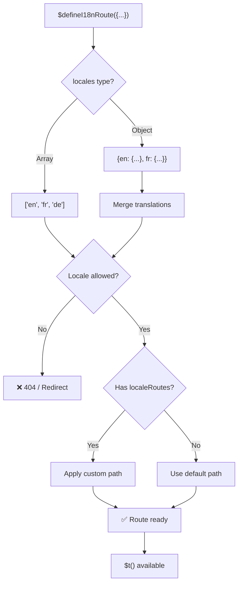
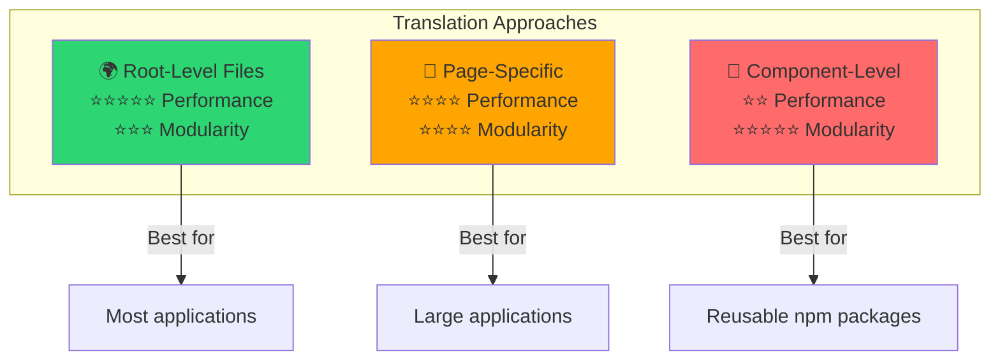

# 📖 Переклади для окремих компонентів

Дізнайтеся, як визначати переклади безпосередньо у Vue-компонентах через `$defineI18nRoute` для модульної та зручної у супроводі локалізації.

## 📖 Огляд

Переклади для окремих компонентів у `Nuxt I18n Micro` дозволяють визначати переклади безпосередньо у конкретних компонентах чи сторінках через функцію `$defineI18nRoute`. Такий підхід ідеальний для керування локалізованим контентом, унікальним для окремих компонентів, надаючи більш модульний та зручний у супроводі метод роботи з перекладами.

## 🚀 Швидкий старт

### Базове використання

```vue
<template>
  <div>
    <h1>{{ $t('greeting') }}</h1>
    <p>{{ $t('farewell') }}</p>
  </div>
</template>

<script setup lang="ts">
import { useNuxtApp } from '#imports'

const { $defineI18nRoute, $t } = useNuxtApp()

$defineI18nRoute({
  locales: {
    en: { greeting: 'Hello', farewell: 'Goodbye' },
    fr: { greeting: 'Bonjour', farewell: 'Au revoir' },
    de: { greeting: 'Hallo', farewell: 'Auf Wiedersehen' },
  },
})
</script>
```

### Обовʼязкове налаштування (`script setup`)

`$defineI18nRoute` — це впорскування Nuxt-застосунку, а не глобальний макрос.  
Завжди отримуйте його з `useNuxtApp()` перед викликом.

```ts
import { useNuxtApp } from '#imports'

const { $defineI18nRoute } = useNuxtApp()
```

## 🏗️ Мета маршруту на етапі збірки

На етапі збірки Vite-unplugin сканує сторінки `.vue` на виклики `defineI18nRoute(...)` / `$defineI18nRoute(...)` та витягує обмеження локалей, `localeRoutes` і `disableMeta` у метадані маршруту, які використовує `@i18n-micro/route-strategy`.

- **Збірка**: unplugin (`src/unplugin-define-i18n-route.ts`) запускається під час трансформації Vite і записує `i18n-route-meta.json` у теку збірки Nuxt
- **Рантайм**: define-плагін (`03.define.ts`) все ще експонує `$defineI18nRoute` у `script setup` для dev та інлайн-конфігурації

Зазвичай ви викликаєте `$defineI18nRoute` лише на сторінках — модуль автоматично опрацьовує витягання на етапі збірки.

## 🔧 Функція `$defineI18nRoute`

Функція `$defineI18nRoute` налаштовує поведінку маршруту на основі поточної локалі, пропонуючи гнучке рішення для:

- Контролю доступу до конкретних маршрутів на основі доступних локалей
- Надання перекладів для конкретних локалей
- Задання кастомних маршрутів для різних локалей
- Контролю генерації мета-тегів

### Як це працює



### Сигнатура методу

```typescript
const { $defineI18nRoute } = useNuxtApp();
$defineI18nRoute(routeDefinition: DefineI18nRouteConfig);
```

### Параметри

| Параметр       | Тип                                        | Опис                               |
| -------------- | ------------------------------------------ | ---------------------------------- |
| `locales`      | `string[] \| Record<string, Translations>` | Доступні локалі для маршруту       |
| `localeRoutes` | `Record<string, string>`                   | Кастомні маршрути для конкретних локалей |
| `disableMeta`  | `boolean \| string[]`                      | Контроль генерації i18n мета-тегів |

### Детальні описи параметрів

#### `locales`

Визначає, які локалі доступні для маршруту:

<CodeGroup>
```typescript Array Format
$defineI18nRoute({
  locales: ['en', 'fr', 'de'], // Simple array of locale codes
})
```

```typescript Object Format
$defineI18nRoute({
  locales: {
    en: { greeting: 'Hello', farewell: 'Goodbye' },
    fr: { greeting: 'Bonjour', farewell: 'Au revoir' },
    de: { greeting: 'Hallo', farewell: 'Auf Wiedersehen' },
    ru: {}, // Russian locale allowed but no translations provided
  },
})
```
</CodeGroup>

#### `localeRoutes`

Дозволяє задавати кастомні маршрути для конкретних локалей:

```typescript
$defineI18nRoute({
  localeRoutes: {
    en: '/welcome',
    fr: '/bienvenue',
    de: '/willkommen',
    ru: '/privet', // Custom route path for Russian locale
  },
})
```

#### `disableMeta`

Контролює генерацію i18n мета-тегів:

<CodeGroup>
```typescript Disable All Meta
$defineI18nRoute({
  locales: ['en', 'fr', 'de'],
  disableMeta: true, // Disables all i18n meta tags
})
```

```typescript Disable Specific Locales
$defineI18nRoute({
  locales: ['en', 'fr', 'de'],
  disableMeta: ['en', 'fr'], // Only English and French won't have meta tags
})
```
</CodeGroup>

## 💡 Сценарії використання

### 1. Контроль доступу за локалями

Визначте, які локалі дозволені для конкретних маршрутів:

```typescript
$defineI18nRoute({
  locales: ['en', 'fr', 'de'], // Only these locales are allowed for this route
})
```

### 2. Специфічні для компонента переклади

Використайте обʼєкт `locales`, щоб надати конкретні переклади для кожного маршруту:

```typescript
$defineI18nRoute({
  locales: {
    en: {
      greeting: 'Hello',
      farewell: 'Goodbye',
      description: 'Welcome to our application',
    },
    fr: {
      greeting: 'Bonjour',
      farewell: 'Au revoir',
      description: 'Bienvenue dans notre application',
    },
    de: {
      greeting: 'Hallo',
      farewell: 'Auf Wiedersehen',
      description: 'Willkommen in unserer Anwendung',
    },
  },
})
```

### 3. Кастомна маршрутизація для локалей

Визначте кастомні шляхи для конкретних локалей:

```typescript
$defineI18nRoute({
  locales: ['en', 'fr', 'de'],
  localeRoutes: {
    en: '/welcome',
    fr: '/bienvenue',
    de: '/willkommen',
  },
})
```

### 4. Вимкнення мета-тегів

Контролюйте генерацію SEO мета-тегів для конкретних маршрутів чи локалей:

```typescript
// Disable meta tags for all locales
$defineI18nRoute({
  locales: ['en', 'fr', 'de'],
  disableMeta: true,
})

// Disable meta tags only for specific locales
$defineI18nRoute({
  locales: ['en', 'fr', 'de'],
  disableMeta: ['en', 'fr'],
})
```

## ✅ Підтримувані формати конфігурації

Парсер `$defineI18nRoute` підтримує різні JavaScript-конфігурації:

### Статичні конфігурації

<CodeGroup>
```typescript Static Arrays
$defineI18nRoute({
  locales: ['en', 'de', 'fr'],
})
```

```typescript Static Objects
$defineI18nRoute({
  locales: {
    en: { greeting: 'Hello' },
    de: { greeting: 'Hallo' },
  },
  localeRoutes: {
    en: '/welcome',
    de: '/willkommen',
  },
})
```
</CodeGroup>

### Динамічні конфігурації

<CodeGroup>
```typescript Variables and Functions
const locales = ['en', 'de', 'fr']
const routes = { en: '/welcome', de: '/willkommen' }

$defineI18nRoute({
  locales: locales,
  localeRoutes: routes,
})
```

```typescript Template Literals
const prefix = 'api'

$defineI18nRoute({
  locales: [`${prefix}-en`, `${prefix}-de`],
  localeRoutes: {
    [`${prefix}-en`]: `/api/welcome`,
    [`${prefix}-de`]: `/api/willkommen`,
  },
})
```
</CodeGroup>

### Розширені конфігурації

<CodeGroup>
```typescript Spread Operator
const baseLocales = ['en', 'de']
const additionalLocales = ['fr', 'es']

$defineI18nRoute({
  locales: [...baseLocales, ...additionalLocales],
})
```

```typescript Array of Objects
$defineI18nRoute({
  locales: [
    { code: 'en', name: 'English' },
    { code: 'de', name: 'German' },
  ],
})
```
</CodeGroup>

### Умовна логіка

```typescript
$defineI18nRoute({
  locales: process.env.NODE_ENV === 'production' ? ['en', 'de'] : ['en', 'de', 'fr', 'es'],
})
```

### Складні вкладені обʼєкти

```typescript
$defineI18nRoute({
  locales: {
    'en-us': {
      region: 'US',
      currency: 'USD',
      format: {
        date: 'MM/DD/YYYY',
        time: '12h',
      },
    },
    'de-de': {
      region: 'DE',
      currency: 'EUR',
      format: {
        date: 'DD.MM.YYYY',
        time: '24h',
      },
    },
  },
})
```

### Коментарі та форматування

```typescript
$defineI18nRoute({
  // Supported locales for this component
  locales: [
    'en', // English
    'de', // German
    'fr', // French
  ],
  // Custom routes for each locale
  localeRoutes: {
    en: '/welcome',
    de: '/willkommen',
    fr: '/bienvenue',
  },
})
```

## ❌ Не підтримується

Парсер має обмеження і не може опрацьовувати:

- **Зовнішні імпорти** (інструкції `import`)
- **Async/await-функції**
- **Методи класів**
- **Складний потік керування** (цикли, try-catch, switch)
- **Стрілкові функції** у конфігурації
- **Функції-генератори**

## 📝 Повний приклад

Ось комплексний приклад, що показує всі можливості:

```vue
<template>
  <div class="welcome-page">
    <header>
      <h1>{{ $t('title') }}</h1>
      <p>{{ $t('subtitle') }}</p>
    </header>

    <main>
      <section>
        <h2>{{ $t('features.title') }}</h2>
        <ul>
          <li v-for="feature in $t('features.list')" :key="feature">
            {{ feature }}
          </li>
        </ul>
      </section>

      <section>
        <h2>{{ $t('contact.title') }}</h2>
        <p>{{ $t('contact.description') }}</p>
        <a :href="$t('contact.email')">{{ $t('contact.email') }}</a>
      </section>
    </main>

    <footer>
      <p>{{ $t('footer.copyright') }}</p>
    </footer>
  </div>
</template>

<script setup lang="ts">
import { useNuxtApp } from '#imports'

const { $defineI18nRoute, $t } = useNuxtApp()

// Define comprehensive i18n route configuration
$defineI18nRoute({
  locales: {
    en: {
      title: 'Welcome to Our Platform',
      subtitle: 'The best solution for your needs',
      features: {
        title: 'Key Features',
        list: ['High Performance', 'Easy to Use', 'Scalable Architecture'],
      },
      contact: {
        title: 'Get in Touch',
        description: "We'd love to hear from you",
        email: 'mailto:contact@example.com',
      },
      footer: {
        copyright: '© 2024 Example Company. All rights reserved.',
      },
    },
    fr: {
      title: 'Bienvenue sur Notre Plateforme',
      subtitle: 'La meilleure solution pour vos besoins',
      features: {
        title: 'Fonctionnalités Clés',
        list: ['Haute Performance', 'Facile à Utiliser', 'Architecture Évolutive'],
      },
      contact: {
        title: 'Contactez-Nous',
        description: 'Nous aimerions avoir de vos nouvelles',
        email: 'mailto:contact@example.com',
      },
      footer: {
        copyright: '© 2024 Example Company. Tous droits réservés.',
      },
    },
    de: {
      title: 'Willkommen auf Unserer Plattform',
      subtitle: 'Die beste Lösung für Ihre Bedürfnisse',
      features: {
        title: 'Hauptfunktionen',
        list: ['Hohe Leistung', 'Einfach zu Verwenden', 'Skalierbare Architektur'],
      },
      contact: {
        title: 'Kontaktieren Sie Uns',
        description: 'Wir würden gerne von Ihnen hören',
        email: 'mailto:contact@example.com',
      },
      footer: {
        copyright: '© 2024 Example Company. Alle Rechte vorbehalten.',
      },
    },
  },
  localeRoutes: {
    en: '/welcome',
    fr: '/bienvenue',
    de: '/willkommen',
  },
  disableMeta: false, // Enable SEO meta tags
})
</script>

<style scoped>
.welcome-page {
  max-width: 800px;
  margin: 0 auto;
  padding: 2rem;
}

header {
  text-align: center;
  margin-bottom: 3rem;
}

section {
  margin-bottom: 2rem;
}

footer {
  text-align: center;
  margin-top: 3rem;
  padding-top: 2rem;
  border-top: 1px solid #eee;
}
</style>
```

## ⚡ Міркування щодо продуктивності

Вбудовування перекладів у Single File Components (SFC) може впливати на продуктивність:

### Потенційні проблеми

- **Збільшений розмір файла**: усі локалі живуть у SFC, на відміну від окремих файлів перекладу, які уможливлюють locale-aware завантаження
- **Повільніший рендеринг**: переклади всередині файла обробляються у рантаймі
- **Використання памʼяті**: усі переклади завантажуються незалежно від поточної локалі

### Кращі практики

- **Використовуйте посайтові переклади** для оптимальної продуктивності
- **Приберігайте переклади рівня компонента** для конкретних випадків, як-от:
  - Багаторазові компоненти, опубліковані у npm
  - Переклади, які не підходять для root-файлів
  - Компоненти, що мають бути самодостатніми

### Продуктивність проти модульності

Балансуйте потреби вашого проєкту, обираючи підхід:



| Підхід               | Продуктивність | Модульність | Сценарій використання |
| -------------------- | -------------- | ----------- | --------------------- |
| **Root-файли**       | ⭐⭐⭐⭐⭐     | ⭐⭐⭐      | Більшість застосунків |
| **Посайтові**        | ⭐⭐⭐⭐       | ⭐⭐⭐⭐    | Великі застосунки     |
| **На рівні компонента** | ⭐⭐         | ⭐⭐⭐⭐⭐  | Багаторазові компоненти |

## 🎯 Кращі практики

### 1. Тримайте переклади близько до компонентів

Визначайте переклади безпосередньо у відповідному компоненті, щоб тримати локалізований контент організованим і зручним у супроводі.

### 2. Використовуйте обʼєкти локалей для гнучкості

Використовуйте формат обʼєкта для властивості `locales`, коли потрібні конкретні переклади чи контроль доступу за локалями.

### 3. Документуйте кастомні маршрути

Чітко документуйте будь-які кастомні маршрути, задані для різних локалей, щоб зберегти ясність і спростити розробку й супровід.

### 4. Враховуйте вплив на продуктивність

Оцініть, чи справді потрібні переклади рівня компонента для вашого сценарію, зважаючи на наслідки для продуктивності.

### 5. Використовуйте TypeScript

Використовуйте TypeScript для кращої типобезпеки та підтримки IntelliSense:

```typescript
interface ComponentTranslations {
  title: string
  subtitle: string
  features: {
    title: string
    list: string[]
  }
}

$defineI18nRoute({
  locales: {
    en: {
      title: 'Welcome',
      subtitle: 'Subtitle',
      features: {
        title: 'Features',
        list: ['Feature 1', 'Feature 2'],
      },
    } as ComponentTranslations,
  },
})
```

## 📚 Повʼязані теми

- **[Швидкий старт](/quickstart)** — базове налаштування й конфігурація
- **[Довідник API](/api/methods)** — повна документація методів
- **[Приклади](/examples)** — реальні приклади використання

## Підсумок

Можливість «Переклади для окремих компонентів», що працює через функцію `$defineI18nRoute`, пропонує потужний і гнучкий спосіб керування локалізацією у вашому Nuxt-застосунку. Дозволяючи визначати локалізований контент і маршрутизацію на рівні компонента, вона допомагає створити високоперсоналізований і зручний для користувача досвід, підлаштований під мовні та регіональні вподобання вашої аудиторії.

Обирайте підхід, який найкраще підходить потребам вашого проєкту, зважаючи як на вимоги до продуктивності, так і на аспекти супроводу.
