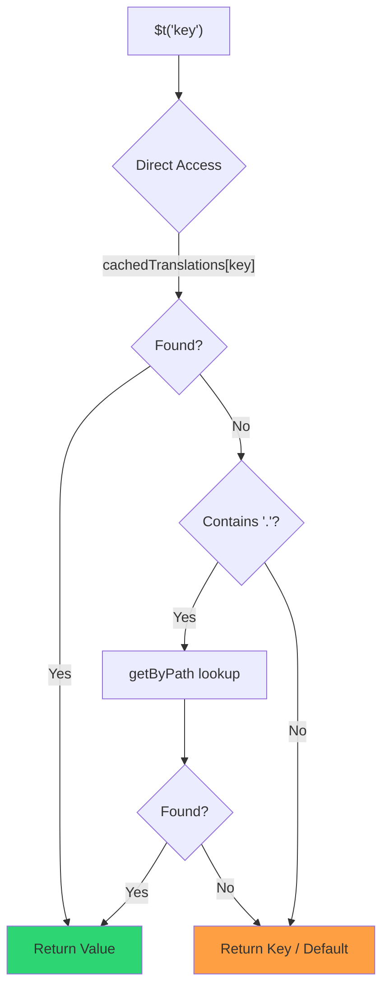

# 🚀 Посібник з продуктивності

## 📖 Вступ

`Nuxt I18n Micro` розроблений з думкою про продуктивність і пропонує суттєве покращення порівняно з традиційними модулями інтернаціоналізації (i18n) на кшталт `nuxt-i18n`. Цей посібник надає детальний огляд переваг продуктивності `Nuxt I18n Micro` і як він порівнюється з іншими рішеннями.

## 🤔 Навіщо фокусуватися на продуктивності?

У великих проєктах та середовищах з високим трафіком вузькі місця продуктивності можуть призводити до повільної збірки, збільшеного споживання памʼяті та поганого часу відповіді сервера. Ці проблеми стають ще помітнішими при складних i18n-налаштуваннях з великими файлами перекладу. `Nuxt I18n Micro` створено, щоб напряму подолати ці виклики, оптимізуючись за швидкістю, ефективністю памʼяті та мінімальним впливом на розмір бандла вашого застосунку.

## 📊 Порівняння продуктивності

Ми провели серію тестів на ідентичних фікстурах через `pnpm test:performance` (`pnpm -C scripts cli performance`) проти **`@nuxtjs/i18n@10.6.0`**. Повна методологія та графіки: [Результати тестів продуктивності](/guides/performance-results).

Профіль CLI за замовчуванням: **4 локалі** × **2 сторінки** (`index`, `page`) × ~10k листкових ключів index. Підвищуйте `--locales` / `--keys` для важчого regression-radar-навантаження. Звіт розділяє **код**, **переклади** (включно з `@nuxtjs/i18n` `chunks/raw/*`) та **сумарний** розгортуваний вивід.

```bash
pnpm test:performance
pnpm -C scripts cli performance --only micro --skip-stress
pnpm -C scripts cli performance --locales 12 --keys 100000 --runs 3
```

### ⏱️ Час збірки та споживання ресурсів

<Accordion title="**@nuxtjs/i18n v10.6**">
- **Бандл коду**: 2.16 MB
- **Переклади**: 7.21 MB (message chunks + пейлоади локалей)
- **Разом до розгортання**: 9.37 MB
- **Макс. споживання памʼяті**: 1,821 MB
- **Час, що минув**: 8.34s (середнє з 3)
</Accordion>

<Tip>
- **Бандл коду**: 1.74 MB — **~19% менше коду ніж `@nuxtjs/i18n` v10.6**
- **Переклади**: 6.8 MB (лінько завантажуваний JSON)
- **Разом до розгортання**: 8.54 MB
- **Макс. споживання памʼяті**: 1,065 MB — **~41% менше памʼяті ніж `@nuxtjs/i18n` v10.6**
- **Час, що минув**: 5.34s — **~36% швидше ніж `@nuxtjs/i18n` v10.6** (≈ базова лінія plain-nuxt)
</Tip>

> Старіші документи, що показували `@nuxtjs/i18n` «код ≈ 15 MB / переклади 0 B», зараховували файли повідомлень `chunks/raw` до коду застосунку. Поточний класифікатор їх розділяє; розрив у **коді** менший, і micro все ще випереджає за часом збірки, піковим RSS та навантажувальними тестами.

Див. [повний звіт з бенчмарків](/guides/performance-results) для графіків, результатів Autocannon та деталей фікстур.

### 🌐 Продуктивність сервера під навантаженням

Artillery (6s@6 + 60s@60) та Autocannon (10c / 10s), середнє з 3 послідовних запусків на фікстуру.

<Accordion title="**@nuxtjs/i18n v10.6**">
- **Запитів на секунду (Artillery)**: 143 [#/sec]
- **Середній час відповіді**: 956 ms
- **Autocannon RPS / середня затримка**: 72 / 139 ms
</Accordion>

<Tip>
- **Запитів на секунду (Artillery)**: 275 [#/sec] — **~93% більше ніж `@nuxtjs/i18n` v10.6**
- **Середній час відповіді**: 483 ms — **~49% швидше ніж `@nuxtjs/i18n` v10.6**
- **Autocannon RPS / середня затримка**: 162 / 62 ms
</Tip>

### 📈 Візуальне порівняння

<Note>
Інтерактивний графік випущено у документації Mintlify. Див. таблиці бенчмарків на цій сторінці або [VitePress-документацію](https://s00d.github.io/nuxt-i18n-micro/guide/performance-results) для графіка: `chart`.
</Note>

<Note>
Інтерактивний графік випущено у документації Mintlify. Див. таблиці бенчмарків на цій сторінці або [VitePress-документацію](https://s00d.github.io/nuxt-i18n-micro/guide/performance-results) для графіка: `chart`.
</Note>

| Метрика         | @nuxtjs/i18n v10.6 | i18n-micro | Покращення          |
| --------------- | ------------------ | ---------- | ------------------- |
| Час збірки      | 8.34s              | 5.34s      | **~36% швидше**     |
| Памʼять (збірка)| 1,821 MB           | 1,065 MB   | **~41% менше**      |
| Бандл коду      | 2.16 MB            | 1.74 MB    | **~19% менше**      |
| Час відповіді   | 956 ms             | 483 ms     | **~49% швидше**     |
| RPS (Artillery) | 143                | 275        | **~93% більше**     |

### 🔍 Інтерпретація результатів

Проти поточного `@nuxtjs/i18n` **v10.6** (профіль CLI за замовчуванням, середнє з 3):

- 🗜️ **Менший граф коду**: ~1.74 MB проти ~2.16 MB, коли message chunks не помилково зараховують до «коду».
- 🧠 **Нижче RSS збірки**: ~1.1 GB пік проти ~1.8 GB.
- 🕒 **Швидші збірки**: ~5.3s проти ~8.3s (micro збігається з базовою лінією plain-Nuxt на цьому профілі).
- ⚡ **Значно краще під навантаженням**: ~275 проти ~143 RPS Artillery, ~162 проти ~72 RPS Autocannon, нижча середня затримка.

Абсолютні числа відрізняються від старіших опублікованих таблиць (менші словники, старіший Nuxt та несправедливий розподіл «0 B переклади» для `@nuxtjs/i18n`). За напрямом те саме: micro випереджає за вартістю збірки та пропускною здатністю запитів.

## ⚙️ Ключові оптимізації

### 🛠️ Мінімалістичний дизайн

`Nuxt I18n Micro` побудований навколо мінімалістичної архітектури з невеликим ядром та окремими пакетами стратегій. Це зменшує накладні витрати та спрощує внутрішню логіку, що веде до покращеної продуктивності.

### 🚦 Ефективна маршрутизація

У v3 генерація маршрутів та рантайм-логіка шляхів розділені на окремі пакети для оптимального tree-shaking:

- **`@i18n-micro/route-strategy`** — генерація маршрутів на етапі збірки: розширює сторінки Nuxt локалізованими маршрутами. Включається лише обрана стратегія (`no_prefix`, `prefix`, `prefix_except_default`, `prefix_and_default`).
- **`@i18n-micro/path-strategy`** — рантайм-розвʼязання шляхів, редиректи та генерація посилань. Використовує чисті функції та наперед обчислені прапорці контексту, щоб мінімізувати виділення памʼяті на гарячих шляхах. Subpath-експорти (`/prefix`, `/no-prefix` тощо) гарантують, що в бандл потрапляє лише обрана реалізація.

Такий підхід тримає конфігурацію маршрутизації легкою та забезпечує швидке розвʼязання маршрутів незалежно від кількості локалей.

### 📂 Оптимізоване завантаження перекладів

Модуль підтримує лише JSON-файли для перекладів з чітким поділом між глобальними та посторінковими файлами. Це гарантує, що у будь-який момент завантажуються лише необхідні дані перекладу, ще більше покращуючи продуктивність.

### 🔒 Singleton-кеш через GlobalThis

Починаючи з v3.0.0, модуль використовує шаблон singleton через `globalThis` з `Symbol.for`, щоб гарантувати єдиний інстанс кешу на весь процес Node.js. Це запобігає:

- Дублюванню кешу, коли той самий модуль бандлиться кілька разів
- Перестворенню обʼєктів на кожен запит, що спричиняє тиск на GC
- Витокам памʼяті через осиротілі інстанси кешу

```mermaid
flowchart LR
    subgraph Process["Node.js Process"]
        G["globalThis[Symbol.for('CACHE')]"]

        subgraph R1["SSR Request 1"]
            P1[Plugin Instance] --> G
        end

        subgraph R2["SSR Request 2"]
            P2[Plugin Instance] --> G
        end

        subgraph R3["SSR Request 3"]
            P3[Plugin Instance] --> G
        end
    end

    G --> Cache["Single Map Instance"]
    Cache --> D1["en:index → translations"]
    Cache --> D2["en:about → translations"
```

```typescript
// Internal implementation pattern
const CACHE_KEY = Symbol.for('__NUXT_I18N_STORAGE_CACHE__')
if (!globalThis[CACHE_KEY]) {
  globalThis[CACHE_KEY] = new Map()
}
```

### ⚡ Оптимізована функція перекладу (tFast)

Функція `$t()` використовує стратегію прямого пошуку, оптимізовану за швидкістю:

1. **Наперед обчислений контекст**: локаль та імʼя маршруту обчислюються один раз під час навігації, а не на кожен виклик `$t()`
2. **Пошук з одного джерела**: усі переклади (root + посторінкові + fallback) наперед злиті на етапі збірки в один файл на сторінку — без потреби у пошарному пошуку
3. **Кумулятивне глибоке злиття при навігації**: при навігації в межах однієї локалі переклади нової сторінки глибоко зливаються (2 рівні глибини) в активний словник, тож ключі попередньої сторінки залишаються видимими під час анімацій переходу — навіть коли сторінки поділяють вкладені префікси (наприклад, обидві сторінки мають ключі під `common.*`)
4. **Збір сміття через `page:transition:finish`**: після повного завершення анімації переходу злитий словник замінюється чистими перекладами лише нової сторінки, звільняючи памʼять від ключів старої сторінки
5. **Прямий доступ до властивостей**: використовує `obj[key]` замість пошуку в Map для гарячих шляхів



```typescript
// Simplified lookup logic — single active dictionary
let val = cachedTranslations[key]
if (val === undefined && key.includes('.')) {
  val = getByPath(cachedTranslations, key)
}
```

### 💉 Серверне завантаження (без вбудовування в HTML)

Переклади, завантажені під час SSR, залишаються у **памʼяті сервера** для `$t` під час рендерингу. Вони **не** копіюються в `nuxtApp.payload` / HTML-документ (та сама ідея, що у `@nuxtjs/i18n` з `experimental.preload: false`).

На клієнті `01.plugin.ts` `await`ає `switchContext`, який завантажує `/\{apiBaseUrl\}/:page/:locale/data.json` до продовження застосунку — один запит, а не 8 MB inline-блоб.

`NuxtI18n` все ще тримає активний злитий словник (`cachedTranslations`) для `$t()` / `$has()`. Навігації в межах однієї локалі глибоко зливають чанки сторінок, поки `page:transition:finish` не очистить застарілі ключі.

#### Де ми зараз

Числа нижче читаються з файла budget, який вимірює та стежить `pnpm run budget:payload`.

{/* generated:payload-budget — do not edit; run `pnpm run docs:generate` */}

Виміряно на `playground` для `/`, `/de`:

| Вимір | Розмір |
| --- | --- |
| Джерела перекладу на диску | 15.2 MB |
| Обслуговано як окремі файли пейлоаду | 76.3 MB |
| Найбільший inline `__NUXT_DATA__` | 6.9 MB |
| Клієнтські ресурси | 449.5 KB |

Playground несе навмисно завеликий словник, тож це не числа, яких варто очікувати від реального застосунку — це фіксована точка, з якою можна порівнювати. Budget падає, коли вони несподівано зростають, — так помітно випадкові зміни у тому, що несе пейлоад.

{/* /generated:payload-budget */}

### 💾 Кешування та пре-рендеринг

Переклади проходять через кілька кешів, і знати, який саме відповів на запит, — це різниця між пʼятихвилинним та пʼятигодинним налагодженням. Їх чотири, у порядку, в якому запит із ними зустрічається:

| Шар | Де | Тривалість | Очищається |
| --- | --- | --- | --- |
| Браузер / CDN | `Cache-Control` на `/\{apiBaseUrl\}/**` | `httpCacheDuration`, `immutable` | новим `?v=` — тобто деплоєм, що змінив переклади |
| Кеш маршруту Nitro | `routeRules['/\{apiBaseUrl\}/**'].cache` | 60 s, stale-while-revalidate | перезапуском сервера |
| Серверний loader | in-process `CacheControl`, ключ `locale:routeName` | життя процесу або `cacheTtl` | перезапуском сервера, HMR у dev |
| Клієнтське сховище | `translationStorage` + активний чанк у `NuxtI18n` | життя сторінки | перезавантаженням |

Два правила не дають їм суперечити одне одному:

- **Кеш маршруту Nitro існує лише коли існує `?v=`.** З інвалідатором кешу кожен URL унікальний до свого вмісту, тож серверне кешування безпечне від застарілості. Встановіть `dateBuild: 0`, і цей шар вимикається, бо URL тоді стабільний і відповідь каже `must-revalidate` — серверний кеш відповідав би зі застарілого запису до хвилини і мовчки перемагав би це.
- **`immutable` також потребує `?v=`.** Без інвалідатора заголовок буде `public, max-age=0, must-revalidate`, що б не казав `httpCacheDuration`: довгий `max-age` на URL, що не змінюється, закріпить першу відповідь, яку будь-коли бачив браузер.

<Warning>
З `translationPayloads.publicAssets` (за замовчуванням у режимі premerged) пейлоади копіюються у `public/<apiBaseUrl>/\{page\}/\{locale\}/data.json`. Платформа, яка обслуговує цю теку самостійно (Cloudflare Pages, Firebase Hosting, `npx serve`), застосовує власні заголовки — заголовок `routeRules` Nitro досягає лише відповідей, що йдуть через сервер. Задавайте політику кешу для цих статичних файлів у конфігурації самої платформи.
</Warning>

🏁 **Пре-рендеринг**: у режимі premerged `publicAssets` вже записує клієнтське дерево URL у `public/`. Погоджуйтеся на `prerenderRoutes`, лише якщо потрібно, щоб Nitro матеріалізував маршрути хендлерів, коли ця копія вимкнена.

### 🗜️ Стиснуті публічні пейлоади

Коли увімкнено `nitro.compressPublicAssets`, пейлоади перекладу, скопійовані у публічну теку, також отримують `.gz` та `.br` побратимів:

```ts
export default defineNuxtConfig({
  nitro: { compressPublicAssets: true },
})
```

Nitro стискає публічні ресурси до хука, що копіює пейлоади, тож без цього вони були б єдиною нестиснутою частиною статичної збірки. Модуль не вмикає стиснення сам по собі — він лише застосовує обране вами налаштування. Вибір за кодуванням (`\{ gzip: true, brotli: false \}`) враховується.

Індекс-пейлоад playground: 6 651 984 B сирі, 1 012 831 B gzip, 821 617 B brotli.

### ☁️ Serverless-вивід пейлоаду

На **Node** SSR читає JSON перекладу з `public/<apiBaseUrl>` (`readFile`, без Nitro `serverAssets` / Rollup `raw:`). На **Edge** Nitro `serverAssets` вбудовує те саме дерево (надавайте перевагу `mode: 'source'` для великих каталогів).

```typescript
export default defineNuxtConfig({
  i18n: {
    translationPayloads: {
      serverAssets: true, // default — Node → public copy; Edge → serverAssets embed
      publicAssets: true, // default in premerged mode
    },
  },
})
```

Використовуйте `translationPayloads.mode: 'source'` для компактних Edge-вбудовувань (та опційних компактних публічних копій):

```typescript
export default defineNuxtConfig({
  i18n: {
    translationPayloads: {
      mode: 'source',
    },
  },
})
```

`mode: 'source'` тримає layer-merged вихідні файли компактними і зливає root/page/fallback у рантаймі через вбудований маршрут `/_locales` (або Edge `assets:i18n`). За замовчуванням він вимикає копії публічних ресурсів та маршрути пре-рендерованого пейлоаду.

<Warning>
`prerenderRoutes` за замовчуванням дорівнює `false`. З `mode: 'source'` `publicAssets` також за замовчуванням дорівнює `false`. Чистий статичний хостинг без рантайму Nitro/edge тому не може завантажити переклади на клієнті, доки ви не увімкнете один з цих виводів, не залишите `serverHandler` доступним у рантаймі або не розмістите пейлоади зовні.

Стандартний premerged + `publicAssets` уже розміщує `/\{apiBaseUrl\}/\{page\}/\{locale\}/data.json` під `public/`, тож статичні хости можуть обслуговувати клієнтські fetch-запити без Nitro.
</Warning>

<Warning>
Встановлення `apiBaseServerHost` або `apiBaseClientHost` переміщує обслуговування пейлоадів на цей origin, що має власні вимоги — див. [Конфігурація → Зовнішні CDN-хости](/guides/configuration#external-cdn-hosts).
</Warning>

Або вимкніть окремі HTTP/публічні виводи та розмістіть пейлоади зовні:

```typescript
export default defineNuxtConfig({
  i18n: {
    apiBaseClientHost: 'https://cdn.example.com',
    apiBaseServerHost: 'https://cdn.example.com',
    translationPayloads: {
      serverHandler: false,
      publicAssets: false,
      prerenderRoutes: false,
    },
  },
})
```

Тримайте `serverHandler` увімкненим, коли покладаєтесь на вбудований локальний маршрут `/\{apiBaseUrl\}/:page/:locale/data.json`. Вимикайте його, коли пейлоади розміщені зовні, і `apiBaseServerHost` вказує на цей зовнішній origin. Вмикайте `prerenderRoutes`, лише коли вам потрібно, щоб Nitro матеріалізував статичні маршрути пейлоаду, а `publicAssets` цього не зробив.

Під час збірки модуль попереджає, коли вивід згенерованих пейлоадів перевищує `translationPayloads.warnFileCount` (за замовчуванням 500) або `translationPayloads.warnSizeBytes` (за замовчуванням 10 MB). Він також попереджає, коли всі локальні виводи вимкнено без налаштованих зовнішніх пейлоад-хостів.

## 📝 Поради з максимізації продуктивності

Ось кілька порад, щоб отримати найкращу продуктивність від `Nuxt I18n Micro`:

- 📉 **Обмежуйте дані локалей**: включайте у проєкт лише ті локалі, які вам потрібні, щоб тримати розмір бандла малим.
- 🗂️ **Використовуйте посторінкові переклади**: організовуйте файли перекладу за сторінками, щоб уникнути завантаження зайвих даних.
- 💾 **Вмикайте кешування**: використовуйте функції кешування, щоб знизити навантаження на сервер та покращити час відповіді.
- 🏁 **Використовуйте пре-рендеринг**: пре-рендерте свої переклади, щоб прискорити завантаження сторінок та зменшити рантайм-накладні витрати.

Детальні результати тестів продуктивності див. у [Результатах тестів продуктивності](/guides/performance-results).
