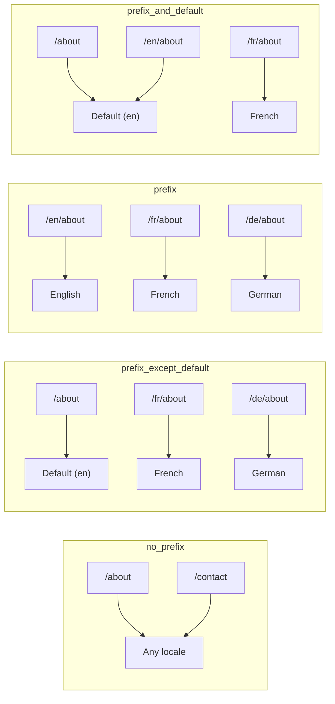
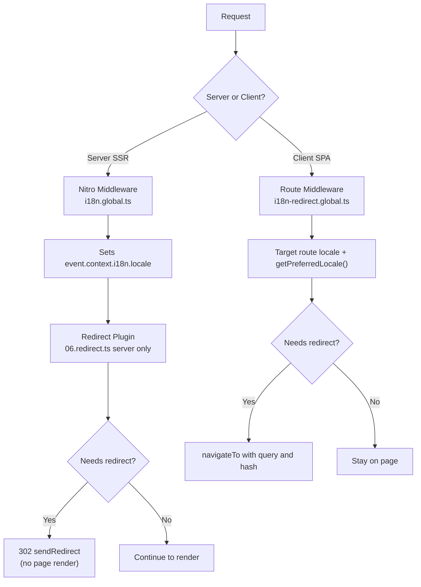

# 🗂️ Стратегії маршрутизації у Nuxt I18n Micro

## 📖 Огляд

Nuxt I18n Micro керує тим, як префікси локалей зʼявляються в URL, через опцію `strategy`. Під капотом це реалізують два пакети:

- **`@i18n-micro/route-strategy`** — генерація маршрутів на етапі збірки (розширює сторінки Nuxt локалізованими маршрутами)
- **`@i18n-micro/path-strategy`** — розвʼязання шляхів під час виконання, перенаправлення, SEO-атрибути та генерація посилань

Модуль Nuxt обирає правильний клас стратегії на етапі збірки та надає йому аліас через `#i18n-strategy`, тож у бандл потрапляє лише обрана реалізація.

## 🚦 Доступні стратегії

{/* generated:option:strategy — do not edit; run `pnpm run docs:generate` */}

**Тип** `Strategies` · **За замовчуванням** `'prefix_except_default'`

Стратегія URL-маршрутизації для префіксів локалей.

- `'no_prefix'` — без локалі в URL; локаль зберігається в cookie.
- `'prefix_except_default'` — префікс для всіх локалей, крім за замовчуванням.
- `'prefix'` — завжди префікс, включно з локаллю за замовчуванням.
- `'prefix_and_default'` — як `prefix`, але локаль за замовчуванням також доступна без префікса.

{/* /generated:option:strategy */}

### Порівняння стратегій



### 🛑 `no_prefix`

URL не мають сегмента локалі. Локаль визначається за cookies, станом `useI18nLocale()` або визначенням у браузері.

- **Маршрути**: `/about`, `/contact` — той самий шаблон URL для всіх локалей (без префіксів `/en/`, `/fr/`)
- **Збереження локалі**: через `localeCookie` (автоматично встановлюється на `'user-locale'`, якщо не вказано)
- **Кастомні шляхи**: підтримуються через [`globalLocaleRoutes`](/guides/configuration#globallocaleroutes) та [`defineI18nRoute`](/guides/custom-locale-routes) — локалізовані slug-и генеруються без додавання префікса локалі до URL (наприклад, `/about` проти `/ueber-uns`). Вкладені маршрути, аліаси та обмеження для кожної локалі простіші, ніж у `prefix_except_default`.

<Tip>
При використанні `no_prefix` `localeCookie` автоматично встановлюється на `'user-locale'`, якщо не вказано інше. Це необхідно, оскільки URL не містить інформації про локаль.
</Tip>

```typescript
i18n: {
  strategy: 'no_prefix'
  // localeCookie is automatically set to 'user-locale'
}
```

### 🚧 `prefix_except_default`

Усі маршрути мають префікс локалі, **окрім** локалі за замовчуванням.

- **Локаль за замовчуванням**: `/about`, `/contact`
- **Інші локалі**: `/fr/about`, `/de/contact`
- **Локаль за замовчуванням із префіксом повертає 404**: `/en/about` → 404 (коли `en` за замовчуванням)

```typescript
i18n: {
  strategy: 'prefix_except_default' // This is the default
}
```

### 🌍 `prefix`

Кожен маршрут має префікс локалі, включно з локаллю за замовчуванням.

- **Усі локалі**: `/en/about`, `/fr/about`, `/de/about`
- **Корінь `/`**: перенаправляє на `/\{locale\}/` на основі уподобань користувача

```typescript
i18n: {
  strategy: 'prefix'
}
```

### 🔄 `prefix_and_default`

Локаль за замовчуванням доступна як з префіксом, так і без. Локалі, що не за замовчуванням, завжди мають префікс.

- **Локаль за замовчуванням**: як `/about`, так і `/en/about` є валідними
- **Інші локалі**: `/fr/about`, `/de/about`
- **Без перенаправлення з `/`**: як `/`, так і `/en/` обслуговують локаль за замовчуванням

```typescript
i18n: {
  strategy: 'prefix_and_default'
}
```

## 🔀 Архітектура перенаправлень (v3)

У v3 логіка перенаправлень розділена на два шари для оптимальної продуктивності:

### Як це працює



### На стороні сервера (без «спалаху»)

1. **Nitro middleware** (`i18n.global.ts`) виконується першим — визначає локаль з URL, cookie або заголовка `Accept-Language` та встановлює `event.context.i18n.locale`
2. **Redirect-плагін** (`06.redirect.ts`, лише сервер) перевіряє, чи потребує поточний шлях перенаправлення, за допомогою `i18nStrategy.getClientRedirect()` та виконує 302 **до** будь-якого рендерингу сторінки
3. Це запобігає «спалаху помилки», коли користувачі коротко бачать неправильну сторінку до перенаправлення

### На стороні клієнта (SPA-навігація)

1. Глобальне route middleware (`i18n-redirect.global.ts`) виконується при кожній клієнтській навігації, коли `redirects` увімкнено
2. Виводить бажану локаль спочатку з **цільового маршруту**, потім повертається до `useI18nLocale().getPreferredLocale()`
3. Використовує `i18nStrategy.getClientRedirect()`, щоб вирішити, чи потрібне перенаправлення
4. Зберігає `query` та `hash` при перенаправленні

### Порядок пріоритетів локалей

На сервері redirect-плагін визначає бажану локаль у такому порядку:

1. **`useState('i18n-locale')`** — найвищий пріоритет (встановлюється програмно через `useI18nLocale().setLocale()`)
2. **Cookie** — якщо `localeCookie` налаштовано
3. **Заголовок `Accept-Language`** — якщо `autoDetectLanguage: true`
4. **`defaultLocale`** — останній fallback

На клієнті route middleware надає перевагу локалі з цільового маршруту, потім використовує той самий ланцюжок fallback стан/cookie.

### Поведінка перенаправлень для кожної стратегії

| Стратегія               | Поведінка `GET /`                              | Cookie обовʼязкова? |
| ----------------------- | ---------------------------------------------- | ----------------- |
| `no_prefix`             | Без перенаправлення (локаль з cookie/стану)     | Авто-встановлена  |
| `prefix`                | 302 → `/\{locale\}/`                             | Рекомендовано     |
| `prefix_except_default` | 302 → `/\{locale\}/`, якщо локаль ≠ за замовчуванням | Рекомендовано |
| `prefix_and_default`    | Без перенаправлення (валідні як `/`, так і `/\{locale\}/`) | Опціонально |

### Вимкнення перенаправлень

```typescript
i18n: {
  redirects: false // Disables automatic locale redirects
}
```

Коли `redirects: false`, автоматичні перенаправлення локалей вимкнено:

- **Сервер**: redirect-плагін (`06.redirect.ts`, лише сервер) залишається зареєстрованим, але пропускає логіку перенаправлень. Він все ще виконує **перевірки 404** для невалідних префіксів локалей (наприклад, `/xx/about`, де `xx` не є валідною локаллю) та **синхронізацію cookie** з URL-префікса (наприклад, відвідування `/fr/about` синхронізує cookie на `fr`)
- **Клієнт**: глобальне route middleware `i18n-redirect` **не реєструється** — жодних SPA-автоперенаправлень

## 🍪 Збереження локалі на основі cookie

<Warning>
При використанні `prefix` або `prefix_except_default` з `redirects: true` (за замовчуванням) ви **маєте** встановити `localeCookie`, щоб перенаправлення працювали коректно. Без cookie redirect-плагін не може запамʼятати уподобання локалі користувача між перезавантаженнями сторінки.

```typescript
i18n: {
  strategy: 'prefix_except_default',
  localeCookie: 'user-locale' // Required for redirects to work properly
}
```
</Warning>

**Як `localeCookie` працює у v3:**

- Керується внутрішньо через `useI18nLocale()` — **не встановлюйте його вручну** через `useCookie()`
- Коли користувач відвідує URL із префіксом (наприклад, `/fr/about`), cookie автоматично синхронізується на `fr`
- При наступному відвідуванні `/` значення cookie використовується для перенаправлення на `/\{locale\}/`
- Якщо cookie містить невалідну локаль (не зі списку `locales`), відбувається fallback на `defaultLocale`

| Стратегія               | `localeCookie` за замовчуванням | Примітки                             |
| ----------------------- | ------------------------------- | ------------------------------------ |
| `no_prefix`             | Авто: `'user-locale'`           | Обовʼязково; встановлюється автоматично |
| `prefix`                | `null` (вимкнено)               | Встановіть `'user-locale'` для перенаправлень |
| `prefix_except_default` | `null` (вимкнено)               | Встановіть `'user-locale'` для перенаправлень |
| `prefix_and_default`    | `null` (вимкнено)               | Опціонально                          |

## 🔍 `autoDetectLanguage` та `autoDetectPath`

### `autoDetectLanguage`

{/* generated:option:autoDetectLanguage — do not edit; run `pnpm run docs:generate` */}

**Тип** `boolean` · **За замовчуванням** `true`

Автоматично визначає бажану мову користувача з HTTP-заголовка `Accept-Language`.
Використовується разом з `autoDetectPath` для визначення, коли відбувається виявлення.

{/* /generated:option:autoDetectLanguage */}

Перевірка виконується у server middleware і є fallback: cookie або наявний стан перемагає.

```typescript
i18n: {
  autoDetectLanguage: true
}
```

### `autoDetectPath`

{/* generated:option:autoDetectPath — do not edit; run `pnpm run docs:generate` */}

**Тип** `string` · **За замовчуванням** `'/'`

Де можуть спрацьовувати перенаправлення за уподобаннями cookie / Accept-Language (коли `redirects` увімкнено).

- `'/'` — лише `/` (глибокі посилання у локалі за замовчуванням залишаються досяжними; за замовчуванням)
- `'no_prefix'` — лише шляхи без префікса локалі
- `'*'` — кожен шлях, включно з перезаписом явного префікса локалі
  (наприклад, `/fr/about` → `/de/about`, коли cookie надає перевагу `de`)

- будь-який інший рядок — точне співставлення шляху (наприклад, `'/welcome'`)

Прибирання префіксованої стратегії (наприклад, `/en` → `/` за `prefix_except_default`) не обмежується.

{/* /generated:option:autoDetectPath */}

```typescript
i18n: {
  autoDetectPath: '/' // Default: only root
  // autoDetectPath: '*' // All paths — redirects even /fr/about to /de/about
}
```

<Warning>
З `autoDetectPath: '*'` навіть URL з явним префіксом локалі (наприклад, `/fr/about`) будуть перенаправлені, якщо бажана локаль користувача відрізняється. Це може бути корисно для налаштувань на основі домену, але може заплутати користувачів, які діляться URL.
</Warning>

За замовчуванням `autoDetectPath: '/'` та з cookie локалі:

| запит | cookie | результат |
| --- | --- | --- |
| `/` | `de` | 302 → `/de` |
| `/about` | `de` | 200, локаль за замовчуванням (без перезапису) |

```typescript
i18n: {
  localeCookie: 'user-locale',
  strategy: 'prefix_except_default',
  // Default — remember language on entry, keep deep links stable
  autoDetectPath: '/',
  // Or redirect on every unprefixed path (but not /de/… → /fr/…):
  // autoDetectPath: 'no_prefix',
}
```

## ⚠️ Відомі проблеми та найкращі практики

### 1. Розбіжність гідратації у стратегії `no_prefix`

При використанні `no_prefix` локаль визначається динамічно. Якщо сервер та клієнт не погоджуються щодо локалі, ви побачите розбіжність гідратації.

**Рішення**: використовуйте `useI18nLocale().setLocale()` у серверному плагіні (з `order: -10`), щоб встановити локаль до ініціалізації i18n:

```ts
// plugins/i18n-loader.server.ts
export default defineNuxtPlugin({
  name: 'i18n-custom-loader',
  enforce: 'pre',
  order: -10,
  setup() {
    const { setLocale } = useI18nLocale()
    setLocale('ja') // Your detection logic here
  },
})
```

Див. [Кастомне визначення мови](/guides/custom-language-detection) для детальних прикладів.

### 2. Використовуйте іменовані маршрути з `localeRoute`

Маршрутизація на основі шляхів може викликати проблеми з розвʼязанням маршрутів:

```typescript
// May cause issues
$localeRoute('/page')

// Preferred approach
$localeRoute({ name: 'page' })
```

### 3. Використання `pages: false` з i18n

При використанні Nuxt з `pages: false`:

```typescript
export default defineNuxtConfig({
  pages: false,
  i18n: {
    strategy: 'no_prefix', // Recommended
    disablePageLocales: true, // Required
    localeCookie: 'user-locale', // Required for persistence
  },
})
```

**Обмеження при `pages: false`:**

- Немає автоматичних перенаправлень
- Немає визначення локалі на основі URL
- Перемикання локалі на стороні клієнта вимагає перезавантаження сторінки або ручного завантаження перекладів

### 4. Обробка невалідних cookie

Якщо cookie містить невалідну локаль (не зі списку `locales`), модуль плавно повертається до `defaultLocale`. Помилки не викидаються.

## 📝 Стисло про найкращі практики

| Рекомендація              | Деталі                                                                             |
| ------------------------- | ----------------------------------------------------------------------------------- |
| **Встановлюйте `localeCookie`** | Завжди встановлюйте для стратегій з префіксом з `redirects: true`             |
| **Використовуйте `useI18nLocale()`** | Централізований спосіб керування станом локалі (замінює ручний `useState`/`useCookie`) |
| **Використовуйте іменовані маршрути** | `$localeRoute(\{ name: 'page' \})` замість `$localeRoute('/page')`                |
| **Програмна локаль**      | Використовуйте `useI18nLocale().setLocale()` у серверному плагіні з `order: -10`   |
| **Уникайте ручних cookie** | Не використовуйте `useCookie('user-locale')` безпосередньо — `useI18nLocale()` керує цим |
