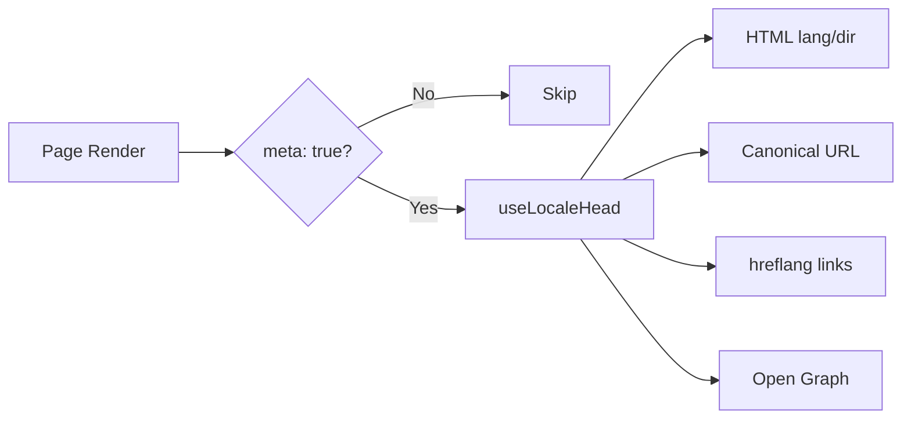

# 🌐 Гайд з SEO для Nuxt I18n Micro

## 📖 Вступ

Ефективне SEO (пошукова оптимізація) є важливим для того, щоб ваш багатомовний сайт був доступним та видимим для користувачів у всьому світі через пошукові системи. `Nuxt I18n Micro` спрощує процес керування SEO для багатомовних сайтів, автоматично генеруючи важливі мета-теги та атрибути, що інформують пошукові системи про структуру та контент вашого сайту.

Цей гайд пояснює, як `Nuxt I18n Micro` обробляє SEO для покращення видимості вашого сайту та користувацького досвіду без додаткового налаштування.

## ⚙️ Автоматична обробка SEO

### Потік генерації SEO-мета



**Згенеровані теги:**

| Тег             | Приклад                                                  |
| --------------- | -------------------------------------------------------- |
| HTML-атрибути   | `<html lang="en" dir="ltr">`                             |
| Canonical       | `<link rel="canonical" href="...">`                      |
| hreflang        | `<link rel="alternate" hreflang="en" href="...">`        |
| x-default       | `<link rel="alternate" hreflang="x-default" href="...">` |
| Open Graph      | `<meta property="og:locale" content="en_US">`            |

#### `og` для кожної локалі (`og:locale` проти BCP 47)

`<html lang>` та `hreflang` використовують **BCP 47** через `locale.iso` (наприклад, `ar-AE`).  
Open Graph вимагає **`language_TERRITORY`** з **підкресленням** (`ar_AE`), згідно з [OG protocol](https://ogp.me/).

За замовчуванням `og:locale` виводиться з `iso`, коли мапінг є однозначним (`en-US` → `en_US`).  
Встановіть явний рядок **`og`**, коли потрібне кастомне значення (наприклад, `zh-Hans` → `zh_CN`).  
Якщо ні `og`, ні конвертований `iso` недоступні, теги `og:locale` не генеруються — у розробці виводиться попередження в консолі (враховує `missingWarn`).

```typescript
i18n: {
  meta: true,
  locales: [
    { code: 'ar', iso: 'ar-AE', og: 'ar_AE', dir: 'rtl' },
    { code: 'en', iso: 'en-US' }, // og:locale → en_US
    { code: 'zh', iso: 'zh-Hans', og: 'zh_CN' }, // script tags need explicit og
  ],
}
```

### 🔑 Ключові можливості SEO

Коли увімкнено опцію `meta` у `Nuxt I18n Micro`, модуль автоматично керує наступними SEO-аспектами:

1. **🌍 Атрибути мови та напрямку**:
   - Модуль встановлює атрибути `lang` та `dir` на тегу `<html>` відповідно до поточної локалі та напрямку тексту (наприклад, `ltr` для англійської або `rtl` для арабської).

2. **🔗 Canonical URL**:
   - Модуль генерує canonical-посилання (`<link rel="canonical">`) для кожної сторінки, забезпечуючи, що пошукові системи розпізнають основну версію контенту.

3. **🌐 Альтернативні мовні посилання (`hreflang`)**:
   - Модуль автоматично генерує теги `<link rel="alternate" hreflang="">` для всіх доступних локалей. Це допомагає пошуковим системам розуміти, які мовні версії вашого контенту доступні, покращуючи досвід користувачів для глобальної аудиторії.
   - Кожна локаль виводить **один** тег: `hreflang = iso || code`. Коли встановлено `iso`, маршрутний `code` ніколи не використовується як `hreflang` (тож ринкові ключі, як-от `mx`, не стають невалідними мовними тегами).
   - Опціональний `hreflangBaseLanguage: true` також виводить тег базової мови, похідний від `iso` (наприклад, `es-ES` → `es`), який отримує перша регіональна локаль у `locales`.

4. **🌏 `x-default` Hreflang**:
   - Модуль автоматично генерує тег `<link rel="alternate" hreflang="x-default">`, що вказує на URL локалі за замовчуванням. Це повідомляє пошуковим системам, який URL показувати користувачам, чия мова не збігається з жодною з визначених локалей. Додаткова конфігурація не потрібна — це працює автоматично, коли встановлено `meta: true`.

5. **🔖 Метадані Open Graph**:
   - Модуль генерує мета-теги Open Graph (`og:locale`, `og:url` тощо) для кожної локалі, що особливо корисно для поширення в соціальних мережах та індексації пошуковими системами.

### 🛠️ Налаштування

Щоб увімкнути ці SEO-функції, переконайтеся, що опція `meta` встановлена в `true` у файлі `nuxt.config.ts`:

```typescript
export default defineNuxtConfig({
  modules: ['nuxt-i18n-micro'],
  i18n: {
    locales: [
      { code: 'en', iso: 'en-US', dir: 'ltr' },
      { code: 'fr', iso: 'fr-FR', dir: 'ltr' },
      { code: 'ar', iso: 'ar-SA', dir: 'rtl' },
    ],
    defaultLocale: 'en',
    translationDir: 'locales',
    meta: true, // Enables automatic SEO management
  },
})
```

### 🌍 Динамічний `metaBaseUrl` для мультидоменних деплойментів

Коли `metaBaseUrl` не встановлено, абсолютні SEO URL розвʼязуються у такому порядку (#240):

1. `site.url` з [`nuxt-site-config`](https://nuxtseo.com/docs/site-config) (якщо цей модуль присутній — наприклад, через `@nuxtjs/seo`)
2. Інакше — імʼя хосту з поточного запиту (`useRequestURL()` / `window.location.origin`)

Fallback на request-origin поважає заголовки reverse-proxy (`X-Forwarded-Host`, `X-Forwarded-Proto`), тож він коректно працює за nginx, Cloudflare, AWS ALB та подібними проксі.

Це означає, що застосункам, які вже встановлюють `site.url` для sitemap / robots / schema.org, **не** потрібне друге оголошення `metaBaseUrl`:

```typescript
export default defineNuxtConfig({
  site: {
    url: process.env.NUXT_SITE_URL, // also used by micro for canonical / og:url / hreflang
  },
  i18n: {
    meta: true,
    // metaBaseUrl omitted — picks up site.url, then request origin
  },
})
```

Без `site.url` один інстанс застосунку все одно може обслуговувати **кілька доменів** з коректними SEO-тегами для кожного через request-origin:

```typescript
export default defineNuxtConfig({
  i18n: {
    meta: true,
    // metaBaseUrl is undefined by default — resolved dynamically from the request
  },
})
```

Наприклад, запит до `https://site-a.com/en/about` створить:

```html
<link rel="canonical" href="https://site-a.com/en/about" /> <meta property="og:url" content="https://site-a.com/en/about" />
```

Тоді як той самий застосунок, що обслуговує `https://site-b.com/en/about`, створить:

```html
<link rel="canonical" href="https://site-b.com/en/about" /> <meta property="og:url" content="https://site-b.com/en/about" />
```

Якщо вам потрібен фіксований базовий URL, який завжди перемагає над `site.url`, передайте статичний рядок:

```typescript
metaBaseUrl: 'https://example.com'
```

### 🔍 Whitelist canonical-query

За замовчуванням query-параметри видаляються з canonical та `og:url`, щоб уникнути дубльованого контенту. Ви можете додати до whitelist конкретні query-параметри, які мають зберегтися:

```typescript
i18n: {
  canonicalQueryWhitelist: ['page', 'sort', 'filter', 'search', 'q', 'query', 'tag']
}
```

Лише параметри, перелічені у `canonicalQueryWhitelist`, зʼявлятимуться у canonical URL. Усі інші query-параметри (наприклад, tracking, session ID) видаляються.

### 🚫 Вимкнення мета-тегів для окремих сторінок

Ви можете вимкнути генерацію SEO-мета-тегів для конкретних сторінок за допомогою `defineI18nRoute()`:

```vue
<script setup>
// Disable all SEO meta tags for this page
defineI18nRoute({
  disableMeta: true,
})
</script>
```

Ви також можете вимкнути мета лише для конкретних локалей:

```vue
<script setup>
// Disable meta tags only for English locale on this page
defineI18nRoute({
  disableMeta: ['en'],
})
</script>
```

Коли `disableMeta` активний, не генеруються теги `hreflang`, `canonical`, `og:locale`, `og:url` або `x-default` для відповідної сторінки/локалі.

### 🔇 Вимкнені локалі

Локалі з `disabled: true` автоматично виключаються з усієї генерації SEO-тегів — жодні `hreflang`, `og:locale:alternate` або альтернативні посилання для них не створюються:

```typescript
i18n: {
  locales: [
    { code: 'en', iso: 'en-US' },
    { code: 'fr', iso: 'fr-FR', disabled: true }, // excluded from SEO tags
  ]
}
```

### 🙈 Локалі-виключення (`seo: false`)

Для локалей, які мають залишатися маршрутизованими та перекладеними, але не мають зʼявлятися у міжлокальних discovery-тегах, встановіть `seo: false`. Ці локалі виключаються з альтернатив `hreflang` та `og:locale:alternate`. Якщо ваша налаштована **локаль за замовчуванням** має `seo: false`, посилання `x-default` також не виводиться.

```typescript
i18n: {
  locales: [
    { code: 'en', iso: 'en-US' },
    { code: 'ru', iso: 'ru-RU', seo: false }, // internal / non-indexed locale
  ]
}
```

### 📌 Поведінка, специфічна для стратегії

| Стратегія               | hreflang-посилання | x-default             | canonical      | og:url |
| ----------------------- | ------------------ | --------------------- | -------------- | ------ |
| `prefix`                | ✅ Усі локалі      | ✅ URL локалі за замовчуванням | ✅ Поточний URL | ✅   |
| `prefix_except_default` | ✅ Усі локалі      | ✅ URL без префікса   | ✅ Поточний URL | ✅   |
| `prefix_and_default`    | ✅ Усі локалі      | ✅ URL локалі за замовчуванням | ✅ Поточний URL | ✅   |
| `no_prefix`             | ❌ Не генерується  | ❌ Не генерується     | ✅ Поточний URL | ✅   |

Для стратегії `no_prefix` генеруються лише `canonical`, `og:url`, `og:locale` та HTML-атрибути (`lang`, `dir`). Альтернативні мовні посилання (`hreflang`) та `x-default` не генеруються, оскільки немає окремих URL для кожної локалі.

## Посторінкові перевизначення (`useI18nHead`)

Для **статей, гайдів або будь-якого CMS-контенту**, де не кожна локаль існує або URL приходять з API, використовуйте [`useI18nHead`](/api/composables/use-i18n-head) на сторінці замість кастомного i18n head-плагіна.

### Стаття з частковими перекладами

```vue
<script setup lang="ts">
const article = await loadArticle()
// article.locales = { en: '...', de: '...' } — only translated locales

useI18nHead({
  meta: [{ property: 'og:title', content: article.title }],
  replace: {
    hreflang: Object.entries(article.locales).map(([locale, href]) => ({
      rel: 'alternate',
      hreflang: locale,
      href,
    })),
    ogAlternates: Object.keys(article.locales),
  },
})
</script>
```

### Slug-и для кожної локалі з `$setI18nRouteParams`

Коли slug-и відрізняються для кожної мови, спочатку встановіть параметри маршруту, потім перевизначте альтернативи реальними URL:

```vue
<script setup lang="ts">
const { $defineI18nRoute, $setI18nRouteParams } = useNuxtApp()
const { data: article } = await useFetch(`/api/articles/${slug}`)

$defineI18nRoute({
  localeRoutes: { en: '/blog/[slug]', de: '/de/blog/[slug]' },
})

$setI18nRouteParams({
  en: { slug: article.value.slugEn },
  de: { slug: article.value.slugDe },
})

useI18nHead({
  replace: {
    hreflang: ['en', 'de'].map((locale) => ({
      rel: 'alternate',
      hreflang: locale,
      href: article.value.urls[locale],
    })),
    ogAlternates: ['en', 'de'],
  },
})
</script>
```

### HTTPS origin за проксі

Для коректних абсолютних URL на SSR без кастомного composable origin:

```ts
i18n: {
  meta: true,
  metaBaseUrl: undefined,
  metaTrustForwardedHost: true,
  metaTrustForwardedProto: true,
}
```

Більше прикладів (перевизначення canonical, `x-default`, реактивний fetch, спільні помічники): [composable useI18nHead](/api/composables/use-i18n-head).

### ⚠️ Trailing Slash

Модуль генерує canonical та `hreflang` URL на основі фактичного шляху з `useRoute().fullPath`. Якщо ваш застосунок використовує trailing slashes (наприклад, через `router.options` у Nuxt), згенеровані URL це відображатимуть. Однак `$switchLocalePath` може нормалізувати шляхи та видаляти trailing slashes. Якщо узгодженість trailing slash критично важлива для вашого SEO, перевірте, чи згенеровані URL відповідають структурі URL вашого застосунку.

### 🎯 Переваги

Увімкнення опції `meta` дає вам:

- **📈 Покращені ранги у пошукових системах**: пошукові системи можуть краще індексувати ваш сайт, розуміючи звʼязки між різними мовними версіями.
- **👥 Кращий користувацький досвід**: користувачам подається правильна мовна версія відповідно до їхніх уподобань, що веде до персоналізованішого досвіду.
- **🔧 Зменшене ручне налаштування**: модуль автоматично обробляє SEO-завдання, звільняючи вас від потреби вручну додавати SEO-мета-теги та атрибути.

## 🔗 Nuxt SEO (`@nuxtjs/seo`)

[`@nuxtjs/seo`](https://nuxtseo.com/) обʼєднує sitemap, robots, schema.org, OG-зображення та повʼязані модулі. Він інтегрується з **nuxt-i18n-micro** через [`nuxt-site-config`](https://nuxtseo.com/docs/site-config/guides/i18n) (v4+).

### Вимоги

- **`@nuxtjs/seo` 3+** (поточні релізи використовують `nuxt-site-config` 4+, який реєструє плагін `nuxt-site-config:i18n` для micro)
- **`i18n.meta: true`** (рекомендовано — micro надає head-теги з урахуванням локалі; Nuxt SEO додає sitemap, schema.org тощо)

### Порядок модулів

Перелічуйте **nuxt-i18n-micro перед `@nuxtjs/seo`**, щоб site config міг прочитати ваше налаштування локалей:

```typescript
export default defineNuxtConfig({
  modules: ['nuxt-i18n-micro', '@nuxtjs/seo'],
  site: {
    url: 'https://example.com',
    name: 'My Site',
  },
  i18n: {
    meta: true,
    defaultLocale: 'en',
    locales: [
      { code: 'en', iso: 'en-US' },
      { code: 'de', iso: 'de-DE' },
    ],
  },
})
```

### Перекладене імʼя та опис сайту

Nuxt Site Config читає опціональні ключі перекладу з ваших файлів локалей:

```json
{
  "nuxtSiteConfig": {
    "name": "My Site",
    "description": "My site description"
  }
}
```

Значення для кожної локалі в `locales/en.json`, `locales/de.json` тощо підхоплюються автоматично.

### Усунення несправностей

Якщо ви бачите `Plugin nuxt-seo:defaults depends on nuxt-site-config:i18n but they are not registered`, оновіть **`@nuxtjs/seo` до 3+** (див. [issue #133](https://github.com/s00d/nuxt-i18n-micro/issues/133)). Старіший `nuxt-site-config` 3.x підключав i18n лише для `@nuxtjs/i18n`, а не micro.

Детальніше: [Sitemap i18n guide](https://nuxtseo.com/docs/sitemap/guides/i18n), [Site Config i18n guide](https://nuxtseo.com/docs/site-config/guides/i18n).
