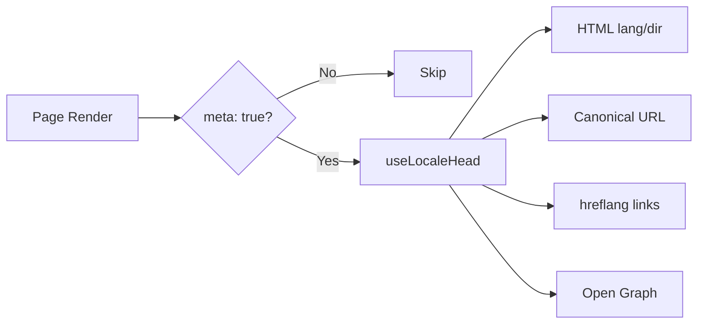

# 🌐 SEO-посібник для Nuxt I18n Micro

## 📖 Вступ

Ефективне SEO (Search Engine Optimization) критично важливе, щоб забезпечити доступність та видимість вашого багатомовного сайту користувачам по всьому світу через пошукові системи. `Nuxt I18n Micro` спрощує керування SEO для багатомовних сайтів, автоматично генеруючи ключові мета-теги та атрибути, що інформують пошукові системи про структуру та вміст вашого сайту.

Цей посібник пояснює, як `Nuxt I18n Micro` обробляє SEO, щоб покращити видимість вашого сайту та користувацький досвід без потреби у додатковому налаштуванні.

## ⚙️ Автоматична обробка SEO

### Потік генерації SEO-мета



**Згенеровані теги:**

| Тег              | Приклад                                                  |
| ---------------- | -------------------------------------------------------- |
| HTML-атрибути    | `<html lang="en" dir="ltr">`                             |
| Canonical        | `<link rel="canonical" href="...">`                      |
| hreflang         | `<link rel="alternate" hreflang="en" href="...">`        |
| x-default        | `<link rel="alternate" hreflang="x-default" href="...">` |
| Open Graph       | `<meta property="og:locale" content="en_US">`            |

#### `og` на локаль (`og:locale` проти BCP 47)

`<html lang>` та `hreflang` використовують **BCP 47** через `locale.iso` (наприклад, `ar-AE`).  
Open Graph вимагає **`language_TERRITORY`** з **підкресленням** (`ar_AE`), відповідно до [протоколу OG](https://ogp.me/).

За замовчуванням `og:locale` виводиться з `iso`, коли мапінг однозначний (`en-US` → `en_US`).  
Задавайте явний рядок **`og`**, коли потрібне кастомне значення (наприклад, `zh-Hans` → `zh_CN`).  
Якщо ні `og`, ні конвертований `iso` недоступні, теги `og:locale` не генеруються — у розробці ви отримаєте попередження в консолі (враховує `missingWarn`).

```typescript
i18n: {
  meta: true,
  locales: [
    { code: 'ar', iso: 'ar-AE', og: 'ar_AE', dir: 'rtl' },
    { code: 'en', iso: 'en-US' }, // og:locale → en_US
    { code: 'zh', iso: 'zh-Hans', og: 'zh_CN' }, // script tags need explicit og
  ],
}
```

### 🔑 Ключові SEO-можливості

Коли увімкнено опцію `meta` у `Nuxt I18n Micro`, модуль автоматично керує такими аспектами SEO:

1. **🌍 Атрибути мови та напрямку**:
   - Модуль встановлює атрибути `lang` та `dir` на тегу `<html>` згідно з поточною локаллю та напрямком тексту (наприклад, `ltr` для англійської або `rtl` для арабської).

2. **🔗 Канонічні URL**:
   - Модуль генерує канонічне посилання (`<link rel="canonical">`) для кожної сторінки, гарантуючи, що пошукові системи розпізнають основну версію контенту.

3. **🌐 Альтернативні мовні посилання (`hreflang`)**:
   - Модуль автоматично генерує теги `<link rel="alternate" hreflang="">` для всіх доступних локалей. Це допомагає пошуковим системам зрозуміти, які мовні версії вашого контенту доступні, покращуючи досвід для глобальної аудиторії.
   - Кожна локаль видає **один** тег: `hreflang = iso || code`. Коли задано `iso`, код маршрутизації `code` ніколи не використовується як `hreflang` (тож ринкові ключі на кшталт `mx` не стають невалідними мовними тегами).
   - Опційний `hreflangBaseLanguage: true` також видає чисто-мовний тег, виведений з `iso` (наприклад, `es-ES` → `es`), заявлений першою регіональною локаллю у `locales`.

4. **🌏 `x-default` Hreflang**:
   - Модуль автоматично генерує тег `<link rel="alternate" hreflang="x-default">`, що вказує на URL локалі за замовчуванням. Це повідомляє пошуковим системам, який URL показати користувачам, чия мова не збігається з жодною з визначених локалей. Додаткова конфігурація не потрібна — це працює автоматично, коли встановлено `meta: true`.

5. **🔖 Метадані Open Graph**:
   - Модуль генерує мета-теги Open Graph (`og:locale`, `og:url` тощо) для кожної локалі, що особливо корисно для поширення у соцмережах та індексації пошуковими системами.

### 🛠️ Конфігурація

Щоб увімкнути ці SEO-можливості, переконайтеся, що опція `meta` встановлена у `true` у файлі `nuxt.config.ts`:

```typescript
export default defineNuxtConfig({
  modules: ['nuxt-i18n-micro'],
  i18n: {
    locales: [
      { code: 'en', iso: 'en-US', dir: 'ltr' },
      { code: 'fr', iso: 'fr-FR', dir: 'ltr' },
      { code: 'ar', iso: 'ar-SA', dir: 'rtl' },
    ],
    defaultLocale: 'en',
    translationDir: 'locales',
    meta: true, // Enables automatic SEO management
  },
})
```

### 🌍 Динамічний `metaBaseUrl` для мультидоменних розгортань

Коли `metaBaseUrl` не задано, абсолютні SEO URL розвʼязуються у такому порядку (#240):

1. `site.url` з [`nuxt-site-config`](https://nuxtseo.com/docs/site-config) (якщо цей модуль присутній — наприклад, через `@nuxtjs/seo`)
2. Інакше — хост з поточного запиту (`useRequestURL()` / `window.location.origin`)

Fallback на origin запиту враховує заголовки reverse-proxy (`X-Forwarded-Host`, `X-Forwarded-Proto`), тож він коректно працює за nginx, Cloudflare, AWS ALB та подібними проксі.

Це означає, що застосунки, які вже встановлюють `site.url` для sitemap / robots / schema.org, **не** потребують другого оголошення `metaBaseUrl`:

```typescript
export default defineNuxtConfig({
  site: {
    url: process.env.NUXT_SITE_URL, // also used by micro for canonical / og:url / hreflang
  },
  i18n: {
    meta: true,
    // metaBaseUrl omitted — picks up site.url, then request origin
  },
})
```

Без `site.url` один інстанс застосунку все ще може обслуговувати **кілька доменів** з коректними SEO-тегами для кожного через origin запиту:

```typescript
export default defineNuxtConfig({
  i18n: {
    meta: true,
    // metaBaseUrl is undefined by default — resolved dynamically from the request
  },
})
```

Наприклад, запит на `https://site-a.com/en/about` дасть:

```html
<link rel="canonical" href="https://site-a.com/en/about" /> <meta property="og:url" content="https://site-a.com/en/about" />
```

А той самий застосунок, обслуговуючи `https://site-b.com/en/about`, дасть:

```html
<link rel="canonical" href="https://site-b.com/en/about" /> <meta property="og:url" content="https://site-b.com/en/about" />
```

Якщо вам потрібен фіксований базовий URL, який завжди виграє над `site.url`, передайте статичний рядок:

```typescript
metaBaseUrl: 'https://example.com'
```

### 🔍 Whitelist канонічних query-параметрів

За замовчуванням query-параметри видаляються з canonical та `og:url`, щоб уникнути дубльованого контенту. Ви можете додати до whitelist конкретні query-параметри, які треба зберегти:

```typescript
i18n: {
  canonicalQueryWhitelist: ['page', 'sort', 'filter', 'search', 'q', 'query', 'tag']
}
```

У канонічних URL зʼявлятимуться лише параметри, перелічені у `canonicalQueryWhitelist`. Усі інші (наприклад, tracking, session ID) видаляються.

### 🚫 Вимкнення мета-тегів на сторінці

Ви можете вимкнути генерацію SEO-мета тегів для конкретних сторінок через `defineI18nRoute()`:

```vue
<script setup>
// Disable all SEO meta tags for this page
defineI18nRoute({
  disableMeta: true,
})
</script>
```

Також можна вимкнути мета лише для конкретних локалей:

```vue
<script setup>
// Disable meta tags only for English locale on this page
defineI18nRoute({
  disableMeta: ['en'],
})
</script>
```

Коли `disableMeta` активний, жодних `hreflang`, `canonical`, `og:locale`, `og:url` чи `x-default` тегів для відповідної сторінки/локалі не генерується.

### 🔇 Вимкнені локалі

Локалі з `disabled: true` автоматично виключаються з усієї генерації SEO-тегів — для них не створюються `hreflang`, `og:locale:alternate` чи альтернативні посилання:

```typescript
i18n: {
  locales: [
    { code: 'en', iso: 'en-US' },
    { code: 'fr', iso: 'fr-FR', disabled: true }, // excluded from SEO tags
  ]
}
```

### 🙈 Opt-out локалі (`seo: false`)

Для локалей, які мають залишатися маршрутизованими й перекладеними, але не мають зʼявлятися у cross-locale discovery-тегах, встановіть `seo: false`. Такі локалі виключаються з `hreflang`-альтернатив та `og:locale:alternate`. Якщо ваша налаштована **локаль за замовчуванням** має `seo: false`, посилання `x-default` також не видається.

```typescript
i18n: {
  locales: [
    { code: 'en', iso: 'en-US' },
    { code: 'ru', iso: 'ru-RU', seo: false }, // internal / non-indexed locale
  ]
}
```

### 📌 Поведінка залежно від стратегії

| Стратегія               | hreflang-посилання | x-default             | canonical      | og:url |
| ----------------------- | ------------------ | --------------------- | -------------- | ------ |
| `prefix`                | ✅ Усі локалі      | ✅ URL локалі за замовч.| ✅ Поточний URL | ✅     |
| `prefix_except_default` | ✅ Усі локалі      | ✅ URL без префікса   | ✅ Поточний URL | ✅     |
| `prefix_and_default`    | ✅ Усі локалі      | ✅ URL локалі за замовч.| ✅ Поточний URL | ✅     |
| `no_prefix`             | ❌ Не генерується  | ❌ Не генерується     | ✅ Поточний URL | ✅     |

Для стратегії `no_prefix` генеруються лише `canonical`, `og:url`, `og:locale` та HTML-атрибути (`lang`, `dir`). Альтернативні мовні посилання (`hreflang`) та `x-default` не генеруються, бо немає окремих URL для кожної локалі.

## Посторінкові перевизначення (`useI18nHead`)

Для **статей, посібників чи будь-якого CMS-контенту**, де не кожна локаль існує або URL надходять з API, використовуйте [`useI18nHead`](/api/composables/use-i18n-head) на сторінці замість кастомного i18n head-плагіна.

### Стаття з частковими перекладами

```vue
<script setup lang="ts">
const article = await loadArticle()
// article.locales = { en: '...', de: '...' } — only translated locales

useI18nHead({
  meta: [{ property: 'og:title', content: article.title }],
  replace: {
    hreflang: Object.entries(article.locales).map(([locale, href]) => ({
      rel: 'alternate',
      hreflang: locale,
      href,
    })),
    ogAlternates: Object.keys(article.locales),
  },
})
</script>
```

### Посторінкові slug з `$setI18nRouteParams`

Коли slug відрізняються за мовою, спочатку задайте параметри маршруту, потім перевизначте альтернативи реальними URL:

```vue
<script setup lang="ts">
const { $defineI18nRoute, $setI18nRouteParams } = useNuxtApp()
const { data: article } = await useFetch(`/api/articles/${slug}`)

$defineI18nRoute({
  localeRoutes: { en: '/blog/[slug]', de: '/de/blog/[slug]' },
})

$setI18nRouteParams({
  en: { slug: article.value.slugEn },
  de: { slug: article.value.slugDe },
})

useI18nHead({
  replace: {
    hreflang: ['en', 'de'].map((locale) => ({
      rel: 'alternate',
      hreflang: locale,
      href: article.value.urls[locale],
    })),
    ogAlternates: ['en', 'de'],
  },
})
</script>
```

### HTTPS origin за проксі

Для коректних абсолютних URL на SSR без кастомного composable-а origin:

```ts
i18n: {
  meta: true,
  metaBaseUrl: undefined,
  metaTrustForwardedHost: true,
  metaTrustForwardedProto: true,
}
```

Більше прикладів (перевизначення canonical, `x-default`, реактивний fetch, спільні помічники): [Композабл useI18nHead](/api/composables/use-i18n-head).

### ⚠️ Слеш у кінці

Модуль генерує canonical та `hreflang` URL на основі фактичного шляху з `useRoute().fullPath`. Якщо ваш застосунок використовує слеш у кінці (наприклад, через `router.options` Nuxt), згенеровані URL це відображатимуть. Однак `$switchLocalePath` може нормалізувати шляхи та прибрати слеш у кінці. Якщо узгодженість слешу у кінці критична для вашого SEO, перевірте, що згенеровані URL збігаються зі структурою URL вашого застосунку.

### 🎯 Переваги

Увімкнувши опцію `meta`, ви отримуєте:

- **📈 Кращі позиції у пошукових системах**: пошукові системи можуть краще індексувати ваш сайт, розуміючи звʼязки між різними мовними версіями.
- **👥 Кращий користувацький досвід**: користувачам подається правильна мовна версія відповідно до їхніх уподобань, що веде до більш персоналізованого досвіду.
- **🔧 Менше ручної конфігурації**: модуль опрацьовує SEO-завдання автоматично, звільняючи вас від необхідності вручну додавати SEO-мета теги та атрибути.

## 🔗 Nuxt SEO (`@nuxtjs/seo`)

[`@nuxtjs/seo`](https://nuxtseo.com/) обʼєднує sitemap, robots, schema.org, OG-зображення та повʼязані модулі. Він інтегрується з **nuxt-i18n-micro** через [`nuxt-site-config`](https://nuxtseo.com/docs/site-config/guides/i18n) (v4+).

### Вимоги

- **`@nuxtjs/seo` 3+** (поточні релізи використовують `nuxt-site-config` 4+, який реєструє плагін `nuxt-site-config:i18n` для micro)
- **`i18n.meta: true`** (рекомендовано — micro постачає locale-aware head-теги; Nuxt SEO додає sitemap, schema.org тощо)

### Порядок модулів

Ставте **nuxt-i18n-micro перед `@nuxtjs/seo`**, щоб site config міг прочитати ваше налаштування локалей:

```typescript
export default defineNuxtConfig({
  modules: ['nuxt-i18n-micro', '@nuxtjs/seo'],
  site: {
    url: 'https://example.com',
    name: 'My Site',
  },
  i18n: {
    meta: true,
    defaultLocale: 'en',
    locales: [
      { code: 'en', iso: 'en-US' },
      { code: 'de', iso: 'de-DE' },
    ],
  },
})
```

### Перекладена назва та опис сайту

Nuxt Site Config читає опційні ключі перекладу з ваших файлів локалей:

```json
{
  "nuxtSiteConfig": {
    "name": "My Site",
    "description": "My site description"
  }
}
```

Посайтові значення у `locales/en.json`, `locales/de.json` тощо підхоплюються автоматично.

### Пошук проблем

Якщо ви бачите `Plugin nuxt-seo:defaults depends on nuxt-site-config:i18n but they are not registered`, оновіть **`@nuxtjs/seo` до 3+** (див. [issue #133](https://github.com/s00d/nuxt-i18n-micro/issues/133)). Старіші `nuxt-site-config` 3.x підключали i18n лише для `@nuxtjs/i18n`, а не для micro.

Більше: [Sitemap i18n guide](https://nuxtseo.com/docs/sitemap/guides/i18n), [Site Config i18n guide](https://nuxtseo.com/docs/site-config/guides/i18n).
